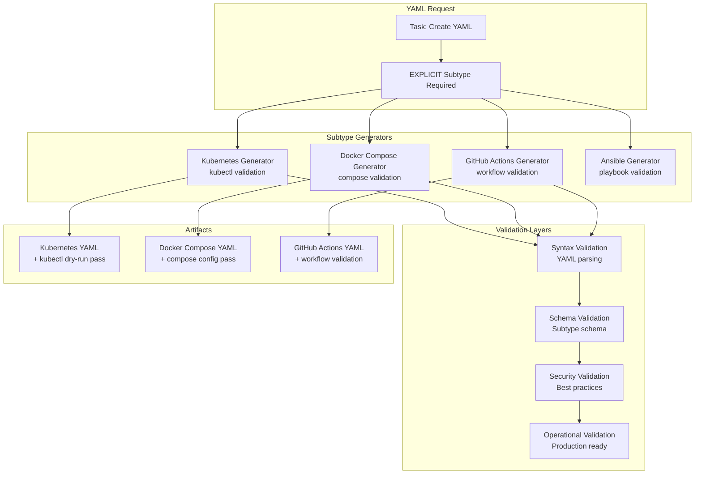

# The YAML Problem and Systematic Solution

## The YAML Disaster: Why "Create a YAML File" Is Meaningless

### The Fundamental Problem

**"YAML" means absolutely nothing without context.** When someone says "create a YAML file," they've provided zero useful information:

- **What schema?** Kubernetes? Docker Compose? GitHub Actions? Ansible? 
- **What validation rules?** Each has completely different requirements
- **What security constraints?** CI/CD YAML vs config YAML have different security models
- **What's the definition of done?** A Kubernetes deployment isn't done until it passes kubectl validation

### Real-World YAML Chaos Examples

#### Example 1: "Create a Kubernetes YAML"
```yaml
# This is technically "YAML" but completely useless:
apiVersion: v1
kind: Pod
metadata:
  name: my-pod
spec:
  containers:
  - name: my-container
    image: nginx
```

**Problems:**
- ❌ No resource limits (will consume unlimited CPU/memory)
- ❌ Runs as root (security vulnerability)
- ❌ No health checks (can't detect failures)
- ❌ No labels (can't be selected by services)
- ❌ Hardcoded image tag (not maintainable)

#### Example 2: "Create a Docker Compose YAML"
```yaml
# This is technically "YAML" but production-dangerous:
version: '3'
services:
  web:
    image: nginx
    ports:
      - "80:80"
```

**Problems:**
- ❌ No health checks (can't detect service failures)
- ❌ No restart policy (won't recover from crashes)
- ❌ No resource limits (can consume all system resources)
- ❌ No secrets management (would hardcode passwords)
- ❌ No networking configuration (insecure defaults)

### Why This Happens: Lack of Systematic Constraints

The problem is that **YAML is just syntax, not semantics**. Without systematic constraints:

1. **No Schema Enforcement**: Any valid YAML syntax is accepted
2. **No Context Validation**: No understanding of what the YAML is supposed to do
3. **No Security Checks**: No validation of security best practices
4. **No Operational Requirements**: No checks for production readiness
5. **No Definition of Done**: No clear criteria for completion

## Systematic Solution: Explicit Subtype Validation

### Architecture: Subtype-Specific Generators



### Explicit Subtype Requirements

#### ❌ **FORBIDDEN: Generic YAML**
```python
# This will FAIL systematically:
spec = ArtifactSpec(
    artifact_type=ArtifactType.YAML_CONFIG,
    # NO SUBTYPE SPECIFIED - REJECTED!
)
```

#### ✅ **REQUIRED: Explicit Subtype**
```python
# This is systematic and validated:
spec = ArtifactSpec(
    artifact_type=ArtifactType.YAML_CONFIG,
    metadata={
        'yaml_subtype': YAMLSubtype.KUBERNETES_DEPLOYMENT
    }
)
```

### Subtype-Specific Definition of Done

#### Kubernetes Deployment YAML
```yaml
definition_of_done:
  - "Valid YAML syntax with no parsing errors"
  - "Conforms to Kubernetes Deployment API schema"
  - "Passes kubectl dry-run validation"
  - "Includes proper resource limits (CPU/memory)"
  - "Has security context with non-root user"
  - "Uses proper labels and selectors"
  - "No hardcoded secrets or sensitive data"
  - "Follows Kubernetes security best practices"
  - "Has readiness and liveness probes"
  - "Includes proper annotations for monitoring"

validation_checks:
  - yaml_syntax_valid: AST parsing succeeds
  - k8s_schema_valid: Conforms to Deployment schema
  - kubectl_dry_run_pass: kubectl apply --dry-run succeeds
  - security_compliant: Non-root user, read-only filesystem
  - resource_limits_set: CPU and memory limits defined
  - labels_proper: Required labels present and valid
  - no_hardcoded_secrets: No secrets in plain text
```

#### Docker Compose YAML
```yaml
definition_of_done:
  - "Valid YAML syntax with no parsing errors"
  - "Conforms to Docker Compose schema version 3.8+"
  - "Passes docker-compose config validation"
  - "All services have health checks defined"
  - "No hardcoded secrets in environment variables"
  - "Uses proper networking configuration"
  - "Includes restart policies for all services"
  - "Volume mounts are properly configured"
  - "Port mappings are non-conflicting"
  - "Environment variables use .env file references"

validation_checks:
  - yaml_syntax_valid: YAML parsing succeeds
  - compose_schema_valid: Conforms to Compose schema
  - compose_config_pass: docker-compose config succeeds
  - health_checks_present: All services have healthcheck
  - no_hardcoded_secrets: Secrets use external references
  - networking_proper: Networks properly configured
```

#### GitHub Actions Workflow YAML
```yaml
definition_of_done:
  - "Valid YAML syntax with no parsing errors"
  - "Conforms to GitHub Actions workflow schema"
  - "Has appropriate trigger events defined"
  - "All jobs have explicit runner specifications"
  - "Secrets are properly referenced (not hardcoded)"
  - "Uses pinned action versions (not @main)"
  - "Includes proper error handling and cleanup"
  - "Has timeout configurations for all jobs"
  - "Uses appropriate permissions (principle of least privilege)"
  - "Includes status checks and notifications"

validation_checks:
  - yaml_syntax_valid: YAML parsing succeeds
  - workflow_schema_valid: Conforms to Actions schema
  - triggers_appropriate: Proper on: events defined
  - runners_explicit: All jobs specify runs-on
  - secrets_referenced: Uses ${{ secrets.NAME }} format
  - actions_pinned: Uses @v1.2.3 not @main
  - permissions_minimal: Least privilege permissions
```

## Implementation: Systematic YAML Generation

### 1. Explicit Subtype Enforcement
```python
class SystematicYAMLGenerator:
    def generate_artifact(self, spec: ArtifactSpec) -> ArtifactResult:
        # CRITICAL: Require explicit YAML subtype
        yaml_subtype = spec.metadata.get('yaml_subtype')
        if not yaml_subtype:
            raise ValueError(
                "YAML subtype MUST be specified! "
                "Generic 'YAML' is not allowed. "
                "Specify: kubernetes_deployment, docker_compose, github_actions_workflow, etc."
            )
```

### 2. Subtype-Specific Validation
```python
class KubernetesYAMLGenerator:
    def generate_kubernetes_deployment(self, spec: ArtifactSpec) -> ArtifactResult:
        # Generate deployment YAML
        deployment_yaml = self._create_deployment_yaml(spec)
        
        # Kubernetes-specific validation
        validation_results = {
            'yaml_syntax_valid': self._validate_yaml_syntax(yaml_path),
            'k8s_schema_valid': self._validate_k8s_schema(yaml_path, 'Deployment'),
            'kubectl_dry_run_pass': self._validate_kubectl_dry_run(yaml_path),
            'security_compliant': self._validate_k8s_security(yaml_path),
            'resource_limits_set': self._validate_resource_limits(yaml_path),
            'labels_proper': self._validate_k8s_labels(yaml_path),
            'no_hardcoded_secrets': self._validate_no_secrets(yaml_path)
        }
        
        # Kubernetes YAML is NOT done until ALL validations pass
        success = all(validation_results.values())
```

### 3. Tool-Specific Validation
```python
def _validate_kubectl_dry_run(self, yaml_path: str) -> bool:
    """Validate YAML using kubectl dry-run"""
    result = subprocess.run(
        ['kubectl', 'apply', '--dry-run=client', '-f', yaml_path],
        capture_output=True,
        text=True
    )
    return result.returncode == 0

def _validate_compose_config(self, yaml_path: str) -> bool:
    """Validate YAML using docker-compose config"""
    result = subprocess.run(
        ['docker-compose', '-f', yaml_path, 'config'],
        capture_output=True,
        text=True
    )
    return result.returncode == 0
```

## Benefits of Systematic YAML Generation

### 1. **Eliminates Ambiguity**
- No more "create a YAML file" - must specify exact subtype
- Each subtype has explicit schema and validation rules
- Clear definition of done for each YAML type

### 2. **Enforces Best Practices**
- Security checks built into each subtype generator
- Operational requirements validated automatically
- Production readiness verified before completion

### 3. **Prevents Common Disasters**
- Kubernetes YAML without resource limits → REJECTED
- Docker Compose without health checks → REJECTED  
- GitHub Actions with hardcoded secrets → REJECTED
- Any YAML without explicit subtype → REJECTED

### 4. **Systematic Quality**
- Each YAML type has measurable quality metrics
- Validation results are tracked and auditable
- Registry integration maintains YAML artifact lifecycle

## Task Specification Examples

### ✅ **Correct: Explicit Kubernetes Deployment**
```markdown
- [ ] 1.1 Create Kubernetes Deployment YAML [k8s-deploy-a1b2]
  - **Artifact Type**: YAML_CONFIG
  - **Subtype**: kubernetes_deployment
  - **Target**: k8s/deployment.yaml
  - **Requirements**: Production-ready web service deployment
  - **Validation**: kubectl dry-run must pass
  - **Security**: Non-root user, resource limits, no secrets
```

### ✅ **Correct: Explicit Docker Compose**
```markdown
- [ ] 1.2 Create Docker Compose Configuration [compose-c3d4]
  - **Artifact Type**: YAML_CONFIG
  - **Subtype**: docker_compose
  - **Target**: docker-compose.yml
  - **Requirements**: Multi-service development environment
  - **Validation**: docker-compose config must pass
  - **Security**: No hardcoded secrets, proper networking
```

### ❌ **FORBIDDEN: Generic YAML**
```markdown
- [ ] 1.3 Create YAML file [yaml-bad]
  - **Artifact Type**: YAML_CONFIG
  - **Target**: config.yaml
  - **Requirements**: Configuration file
  
  # THIS WILL BE REJECTED - NO SUBTYPE SPECIFIED!
```

## Registry Integration for YAML Artifacts

### YAML-Specific Registry Fields
```python
yaml_registry_entry = {
    'artifact_id': str,
    'artifact_type': 'YAML_CONFIG',
    'yaml_subtype': str,              # kubernetes_deployment, docker_compose, etc.
    'schema_version': str,            # API version or schema version
    'validation_tool': str,           # kubectl, docker-compose, etc.
    'security_score': float,          # Security compliance score
    'operational_readiness': bool,    # Production ready
    'tool_validation_passed': bool,   # External tool validation
    'schema_compliance': bool,        # Schema validation passed
    'best_practices_score': float     # Best practices compliance
}
```

This systematic approach **eliminates the YAML disaster** by requiring explicit context, enforcing subtype-specific validation, and ensuring that every YAML artifact has clear acceptance criteria and definition of done.