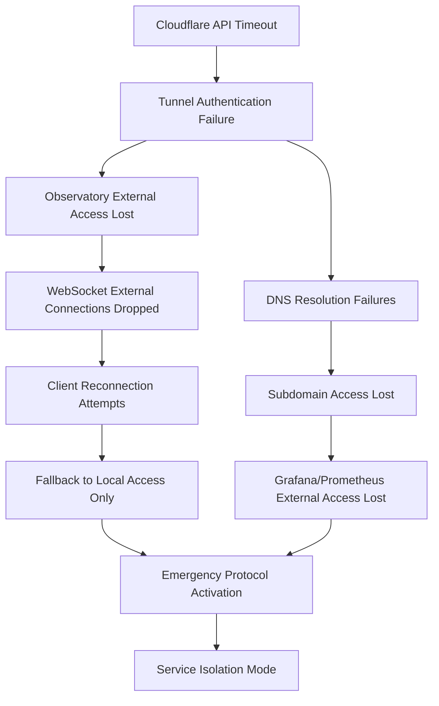
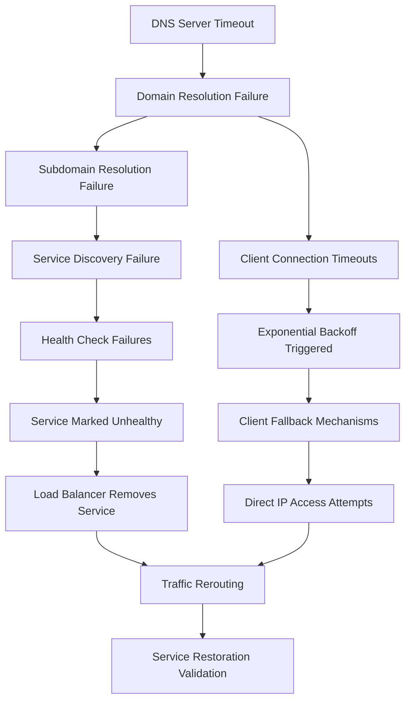
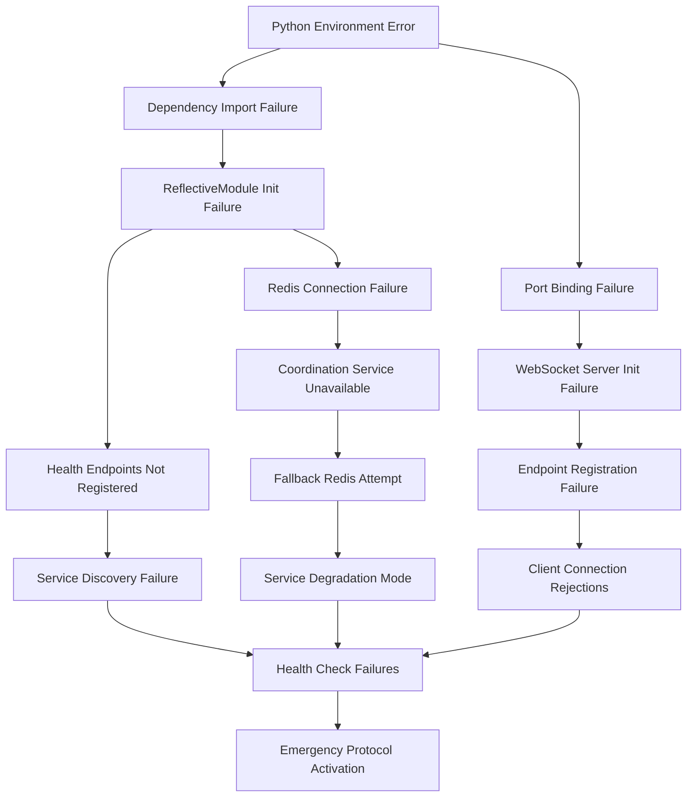
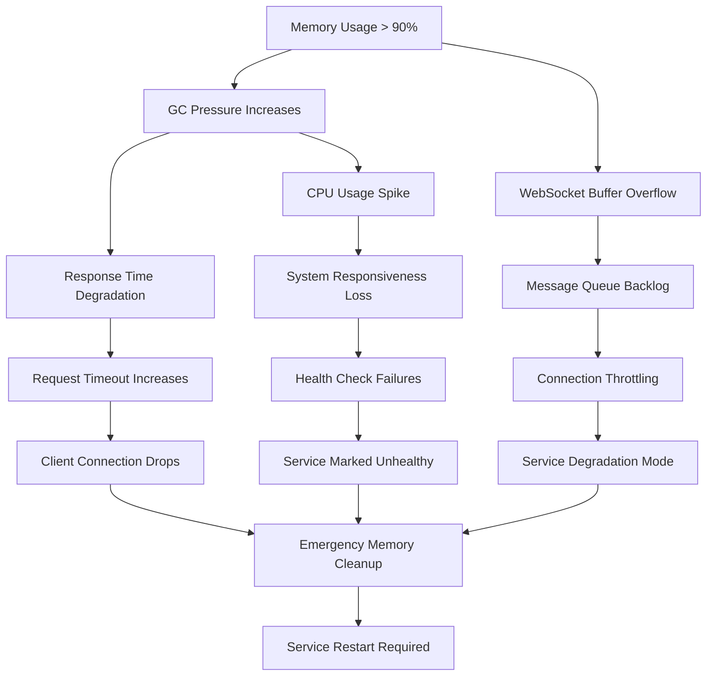
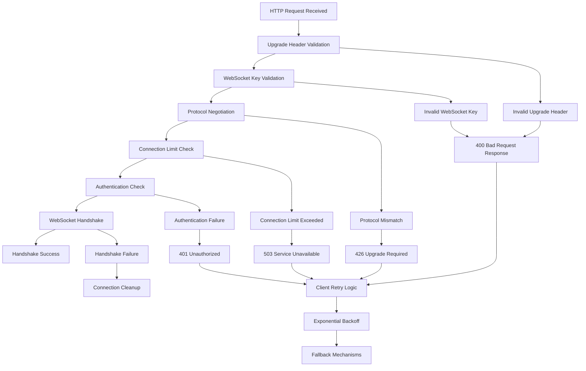
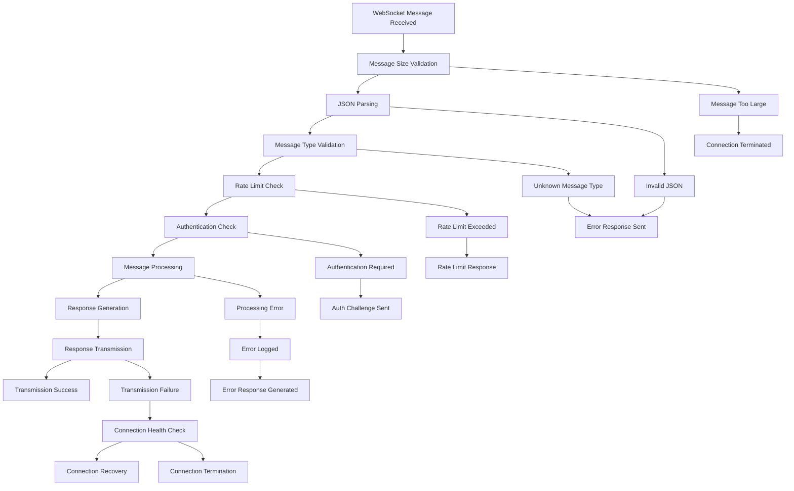
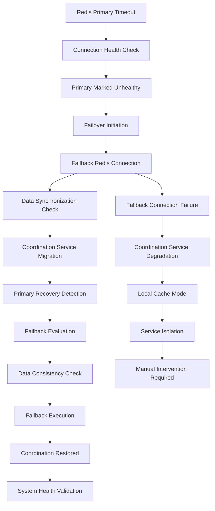

# Error Propagation Path Documentation

## Overview

This document provides comprehensive documentation of error propagation paths throughout the Beast Mode framework, including specific error codes, systematic error handling patterns, correlation ID tracking, and recovery procedures for each identified error scenario.

## Error Classification System

### Error Categories

```python
from enum import Enum
from dataclasses import dataclass
from datetime import datetime
from typing import Dict, List, Any, Optional

class ErrorCategory(Enum):
    """Error categories for systematic classification."""
    INFRASTRUCTURE = "infrastructure"    # Network, DNS, tunnel, Redis failures
    APPLICATION = "application"         # Service crashes, logic errors, timeouts
    WEBSOCKET = "websocket"             # WebSocket connection, upgrade, message failures
    COORDINATION = "coordination"        # Redis coordination, failover, synchronization
    AUTHENTICATION = "authentication"   # Auth failures, token validation, permissions
    CONFIGURATION = "configuration"     # Config loading, validation, CMS failures
    PERFORMANCE = "performance"         # Resource exhaustion, latency, throughput
    INTEGRATION = "integration"         # ACE Reporter, AI Memory Palace, DAG Registry

class ErrorSeverity(Enum):
    """Error severity levels with escalation procedures."""
    LOW = "low"                # Minor issues, degraded performance
    MEDIUM = "medium"          # Service disruption, functionality impacted
    HIGH = "high"              # Critical service failure, immediate attention
    CRITICAL = "critical"      # System-wide failure, emergency response

@dataclass
class ErrorEvent:
    """Comprehensive error event with propagation context."""
    error_id: str
    error_code: str
    category: ErrorCategory
    severity: ErrorSeverity
    message: str
    component: str
    timestamp: datetime
    correlation_id: str
    stack_trace: Optional[str] = None
    context: Dict[str, Any] = None
    propagation_path: List[str] = None
    recovery_actions: List[str] = None
    related_errors: List[str] = None
```

### Error Code System

**Error Code Format**: `{CATEGORY}_{COMPONENT}_{ERROR_TYPE}_{SEQUENCE}`

**Examples**:
- `INFRA_TUNNEL_CONNECTION_001`: Tunnel connection failure
- `APP_OBSERVATORY_STARTUP_002`: Observatory startup failure
- `WS_HANDLER_UPGRADE_003`: WebSocket upgrade failure
- `COORD_REDIS_FAILOVER_004`: Redis failover failure

## Infrastructure Error Propagation Paths

### 1. Cloudflare Tunnel Failures

**Error Code**: `INFRA_TUNNEL_CONNECTION_001`

**Propagation Path**:


**Error Details**:
```python
class TunnelConnectionError(Exception):
    """Tunnel connection failure with systematic error handling."""
    
    def __init__(self, tunnel_id: str, error_details: Dict[str, Any]):
        self.error_code = "INFRA_TUNNEL_CONNECTION_001"
        self.tunnel_id = tunnel_id
        self.error_details = error_details
        self.correlation_id = str(uuid.uuid4())
        
        super().__init__(f"Tunnel connection failed: {tunnel_id}")
    
    def get_propagation_path(self) -> List[str]:
        """Get error propagation path."""
        return [
            "cloudflare_api_timeout",
            "tunnel_authentication_failure", 
            "external_access_lost",
            "websocket_connections_dropped",
            "client_reconnection_storm",
            "fallback_local_access_only"
        ]
    
    def get_recovery_actions(self) -> List[str]:
        """Get systematic recovery actions."""
        return [
            "verify_tunnel_credentials",
            "check_cloudflare_api_status",
            "restart_tunnel_daemon",
            "validate_dns_propagation",
            "test_service_connectivity",
            "notify_clients_of_service_restoration"
        ]
```

**Recovery Procedure**:
```bash
# Step 1: Diagnose tunnel failure
curl -s "https://api.cloudflare.com/client/v4/accounts/{account_id}/cfd_tunnel/{tunnel_id}" \
  -H "Authorization: Bearer {api_token}"

# Step 2: Check local tunnel process
ps aux | grep cloudflared
systemctl status cloudflared

# Step 3: Restart tunnel with logging
make tunnel-stop
make tunnel-start VERBOSE=true

# Step 4: Validate recovery
make tunnel-status
curl -s https://observatory.nkllon.com/health
```

### 2. DNS Resolution Failures

**Error Code**: `INFRA_DNS_RESOLUTION_002`

**Propagation Path**:


**Error Handling**:
```python
class DNSResolutionError(Exception):
    """DNS resolution failure with fallback mechanisms."""
    
    def __init__(self, domain: str, dns_servers: List[str]):
        self.error_code = "INFRA_DNS_RESOLUTION_002"
        self.domain = domain
        self.dns_servers = dns_servers
        self.correlation_id = str(uuid.uuid4())
        
    async def attempt_resolution_fallback(self) -> Optional[str]:
        """Attempt DNS resolution with fallback servers."""
        fallback_servers = ["8.8.8.8", "1.1.1.1", "208.67.222.222"]
        
        for server in fallback_servers:
            try:
                result = await self._resolve_with_server(self.domain, server)
                if result:
                    self._logger.info(f"DNS resolution successful with fallback server: {server}")
                    return result
            except Exception as e:
                self._logger.warning(f"DNS fallback failed for server {server}: {e}")
        
        return None
```

## Application Error Propagation Paths

### 1. Observatory Server Startup Failures

**Error Code**: `APP_OBSERVATORY_STARTUP_002`

**Propagation Path**:


**Error Handling Implementation**:
```python
class ObservatoryStartupError(Exception):
    """Observatory startup failure with systematic recovery."""
    
    def __init__(self, failure_stage: str, error_details: Dict[str, Any]):
        self.error_code = "APP_OBSERVATORY_STARTUP_002"
        self.failure_stage = failure_stage
        self.error_details = error_details
        self.correlation_id = str(uuid.uuid4())
        
    def get_recovery_sequence(self) -> List[Dict[str, Any]]:
        """Get systematic recovery sequence based on failure stage."""
        recovery_sequences = {
            "python_environment": [
                {"action": "validate_python_version", "timeout": 10},
                {"action": "check_virtual_environment", "timeout": 5},
                {"action": "verify_dependencies", "timeout": 30},
                {"action": "reinstall_requirements", "timeout": 120}
            ],
            "port_binding": [
                {"action": "check_port_availability", "timeout": 5},
                {"action": "kill_conflicting_processes", "timeout": 10},
                {"action": "validate_firewall_rules", "timeout": 15},
                {"action": "retry_port_binding", "timeout": 10}
            ],
            "redis_connection": [
                {"action": "test_primary_redis", "timeout": 5},
                {"action": "attempt_fallback_redis", "timeout": 5},
                {"action": "validate_redis_configuration", "timeout": 10},
                {"action": "restart_redis_services", "timeout": 30}
            ]
        }
        
        return recovery_sequences.get(self.failure_stage, [])
```

### 2. Memory Exhaustion Failures

**Error Code**: `APP_MEMORY_EXHAUSTION_003`

**Propagation Path**:


**Memory Management Error Handler**:
```python
class MemoryExhaustionHandler(ReflectiveModule):
    """Handles memory exhaustion with systematic recovery."""
    
    def __init__(self):
        super().__init__()
        self.module_id = "MemoryExhaustionHandler"
        self._memory_threshold = 0.85  # 85% threshold
        self._emergency_threshold = 0.95  # 95% emergency threshold
        
    async def handle_memory_pressure(self, current_usage: float):
        """Handle memory pressure with escalating responses."""
        correlation_id = str(uuid.uuid4())
        
        if current_usage > self._emergency_threshold:
            # Emergency response
            await self._emergency_memory_cleanup(correlation_id)
        elif current_usage > self._memory_threshold:
            # Preventive response
            await self._preventive_memory_cleanup(correlation_id)
    
    async def _emergency_memory_cleanup(self, correlation_id: str):
        """Emergency memory cleanup procedures."""
        self._logger.critical(
            "Emergency memory cleanup initiated",
            extra={"correlation_id": correlation_id}
        )
        
        # 1. Clear WebSocket message queues
        await self._clear_websocket_queues()
        
        # 2. Reduce connection limits
        await self._reduce_connection_limits()
        
        # 3. Force garbage collection
        import gc
        gc.collect()
        
        # 4. Clear caches
        await self._clear_application_caches()
        
        # 5. Enable emergency mode
        await self._enable_emergency_mode()
```

## WebSocket Error Propagation Paths

### 1. WebSocket Upgrade Failures

**Error Code**: `WS_HANDLER_UPGRADE_003`

**Propagation Path**:


**WebSocket Upgrade Error Handler**:
```python
class WebSocketUpgradeError(Exception):
    """WebSocket upgrade failure with detailed diagnostics."""
    
    def __init__(self, failure_reason: str, request_headers: Dict[str, str]):
        self.error_code = "WS_HANDLER_UPGRADE_003"
        self.failure_reason = failure_reason
        self.request_headers = request_headers
        self.correlation_id = str(uuid.uuid4())
        
    def diagnose_failure(self) -> Dict[str, Any]:
        """Diagnose WebSocket upgrade failure."""
        diagnostics = {
            "upgrade_header": self.request_headers.get("Upgrade", "").lower(),
            "connection_header": self.request_headers.get("Connection", "").lower(),
            "websocket_key": self.request_headers.get("Sec-WebSocket-Key"),
            "websocket_version": self.request_headers.get("Sec-WebSocket-Version"),
            "origin": self.request_headers.get("Origin"),
            "protocols": self.request_headers.get("Sec-WebSocket-Protocol")
        }
        
        issues = []
        
        if diagnostics["upgrade_header"] != "websocket":
            issues.append("Invalid or missing Upgrade header")
        
        if "upgrade" not in diagnostics["connection_header"]:
            issues.append("Invalid Connection header")
        
        if not diagnostics["websocket_key"]:
            issues.append("Missing Sec-WebSocket-Key header")
        
        if diagnostics["websocket_version"] != "13":
            issues.append("Unsupported WebSocket version")
        
        return {
            "diagnostics": diagnostics,
            "issues": issues,
            "recommended_actions": self._get_recommended_actions(issues)
        }
    
    def _get_recommended_actions(self, issues: List[str]) -> List[str]:
        """Get recommended actions based on identified issues."""
        actions = []
        
        for issue in issues:
            if "Upgrade header" in issue:
                actions.append("Ensure client sends 'Upgrade: websocket' header")
            elif "Connection header" in issue:
                actions.append("Ensure client sends 'Connection: Upgrade' header")
            elif "WebSocket-Key" in issue:
                actions.append("Client must generate and send Sec-WebSocket-Key")
            elif "WebSocket version" in issue:
                actions.append("Client must use WebSocket version 13")
        
        return actions
```

### 2. WebSocket Message Handling Failures

**Error Code**: `WS_MESSAGE_HANDLING_004`

**Propagation Path**:


## Coordination Error Propagation Paths

### 1. Redis Coordination Failures

**Error Code**: `COORD_REDIS_FAILOVER_004`

**Propagation Path**:


**Redis Failover Handler**:
```python
class RedisFailoverHandler(ReflectiveModule):
    """Handles Redis coordination failover with systematic recovery."""
    
    def __init__(self):
        super().__init__()
        self.module_id = "RedisFailoverHandler"
        self._primary_endpoint = "192.168.1.119:6379"
        self._fallback_endpoint = "localhost:6380"
        self._failover_in_progress = False
        
    async def handle_redis_failure(self, failure_type: str, error_details: Dict[str, Any]):
        """Handle Redis failure with automatic failover."""
        correlation_id = str(uuid.uuid4())
        
        self._logger.error(
            f"Redis failure detected: {failure_type}",
            extra={"correlation_id": correlation_id, "error_details": error_details}
        )
        
        if not self._failover_in_progress:
            self._failover_in_progress = True
            
            try:
                # 1. Attempt failover to backup Redis
                fallback_success = await self._attempt_failover(correlation_id)
                
                if fallback_success:
                    # 2. Monitor primary for recovery
                    asyncio.create_task(self._monitor_primary_recovery(correlation_id))
                else:
                    # 3. Enable degraded mode
                    await self._enable_degraded_coordination_mode(correlation_id)
                    
            finally:
                self._failover_in_progress = False
    
    async def _attempt_failover(self, correlation_id: str) -> bool:
        """Attempt failover to fallback Redis instance."""
        try:
            # Test fallback Redis connectivity
            fallback_redis = redis.Redis.from_url(f"redis://{self._fallback_endpoint}")
            await fallback_redis.ping()
            
            # Switch coordination to fallback
            self._current_redis = fallback_redis
            
            self._logger.info(
                f"Failover successful to {self._fallback_endpoint}",
                extra={"correlation_id": correlation_id}
            )
            
            return True
            
        except Exception as e:
            self._logger.error(
                f"Failover failed: {e}",
                extra={"correlation_id": correlation_id}
            )
            return False
```

## Error Recovery Procedures

### Systematic Error Recovery Framework

```python
class SystematicErrorRecovery(ReflectiveModule):
    """Systematic error recovery with correlation ID tracking."""
    
    def __init__(self):
        super().__init__()
        self.module_id = "SystematicErrorRecovery"
        self._recovery_procedures = {}
        self._active_recoveries = {}
        
    async def execute_recovery_procedure(self, error_event: ErrorEvent) -> Dict[str, Any]:
        """Execute systematic recovery procedure for error."""
        recovery_id = f"recovery_{error_event.error_id}"
        
        self._logger.info(
            f"Starting recovery procedure for error {error_event.error_code}",
            extra={"correlation_id": error_event.correlation_id}
        )
        
        recovery_steps = self._get_recovery_steps(error_event)
        recovery_status = {
            'recovery_id': recovery_id,
            'error_id': error_event.error_id,
            'correlation_id': error_event.correlation_id,
            'total_steps': len(recovery_steps),
            'completed_steps': 0,
            'failed_steps': 0,
            'start_time': datetime.now(),
            'status': 'in_progress'
        }
        
        self._active_recoveries[recovery_id] = recovery_status
        
        try:
            for step_index, step in enumerate(recovery_steps):
                step_result = await self._execute_recovery_step(step, error_event)
                
                if step_result['success']:
                    recovery_status['completed_steps'] += 1
                    self._logger.info(
                        f"Recovery step completed: {step['name']}",
                        extra={"correlation_id": error_event.correlation_id}
                    )
                else:
                    recovery_status['failed_steps'] += 1
                    self._logger.error(
                        f"Recovery step failed: {step['name']} - {step_result['error']}",
                        extra={"correlation_id": error_event.correlation_id}
                    )
                    
                    if step.get('critical', False):
                        recovery_status['status'] = 'failed'
                        break
            
            if recovery_status['status'] != 'failed':
                recovery_status['status'] = 'completed' if recovery_status['failed_steps'] == 0 else 'completed_with_warnings'
            
            recovery_status['end_time'] = datetime.now()
            recovery_status['duration_seconds'] = (recovery_status['end_time'] - recovery_status['start_time']).total_seconds()
            
            return recovery_status
            
        except Exception as e:
            recovery_status['status'] = 'failed'
            recovery_status['failure_reason'] = str(e)
            recovery_status['end_time'] = datetime.now()
            
            self._logger.error(
                f"Recovery procedure failed: {recovery_id} - {e}",
                extra={"correlation_id": error_event.correlation_id}
            )
            
            return recovery_status
        
        finally:
            del self._active_recoveries[recovery_id]
```

## Monitoring and Alerting

### Error Propagation Metrics

```python
def get_error_propagation_metrics(self) -> Dict[str, float]:
    """Get Prometheus metrics for error propagation tracking."""
    return {
        "error_events_total": self._total_error_events,
        "error_events_by_category": self._get_error_events_by_category(),
        "error_recovery_success_rate": self._error_recovery_success_rate,
        "error_propagation_depth_avg": self._avg_error_propagation_depth,
        "correlation_id_tracking_success_rate": self._correlation_tracking_success_rate,
        "error_resolution_time_seconds": self._avg_error_resolution_time
    }
```

### Error Correlation Dashboard

```python
def get_error_correlation_data(self, time_range: str = "1h") -> Dict[str, Any]:
    """Get error correlation data for dashboard visualization."""
    return {
        "error_timeline": self._get_error_timeline(time_range),
        "propagation_paths": self._get_common_propagation_paths(),
        "recovery_effectiveness": self._get_recovery_effectiveness_stats(),
        "correlation_clusters": self._identify_correlation_clusters(),
        "system_health_impact": self._assess_system_health_impact()
    }
```

This comprehensive error propagation path documentation provides systematic tracking, correlation, and recovery procedures for all error scenarios within the Beast Mode framework, ensuring rapid identification and resolution of system issues.