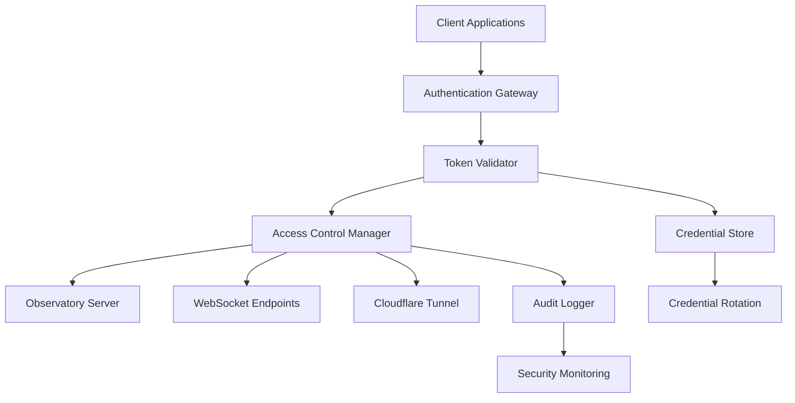

# Authentication and Access Control Documentation

## Overview

This document provides comprehensive security documentation for the Beast Mode Observatory system, covering authentication mechanisms, access control matrices, credential management, and security incident response procedures.

## Security Architecture



## Authentication Mechanisms

### 1. WebSocket Authentication
**Method:** Bearer Token Authentication  
**Token Type:** JWT (JSON Web Tokens)  
**Validity:** 24 hours (configurable)

#### Token Structure:
```json
{
  "header": {
    "alg": "HS256",
    "typ": "JWT"
  },
  "payload": {
    "sub": "client_id_12345",
    "iss": "observatory.nkllon.com",
    "aud": "websocket_clients",
    "exp": 1704067200,
    "iat": 1703980800,
    "permissions": ["ws:observatory", "ws:emoji-rain"],
    "role": "user"
  }
}
```

#### Authentication Flow:
```python
class WebSocketAuthenticator:
    def __init__(self):
        self.secret_key = os.getenv('JWT_SECRET_KEY')
        self.token_expiry = 86400  # 24 hours
    
    async def authenticate_connection(self, headers: Dict[str, str]) -> AuthResult:
        """Authenticate WebSocket connection request."""
        
        # Extract token from Authorization header
        auth_header = headers.get('Authorization', '')
        if not auth_header.startswith('Bearer '):
            return AuthResult(success=False, error="Missing authorization header")
        
        token = auth_header[7:]  # Remove 'Bearer ' prefix
        
        try:
            # Decode and validate JWT token
            payload = jwt.decode(token, self.secret_key, algorithms=['HS256'])
            
            # Validate token claims
            if payload.get('exp', 0) < time.time():
                return AuthResult(success=False, error="Token expired")
            
            return AuthResult(
                success=True,
                client_id=payload.get('sub'),
                permissions=payload.get('permissions', []),
                role=payload.get('role', 'guest')
            )
            
        except jwt.InvalidTokenError as e:
            return AuthResult(success=False, error=f"Invalid token: {str(e)}")
```##
# 2. Tunnel Authentication
**Method:** Cloudflare Tunnel Credentials  
**Credential Type:** Certificate-based authentication  
**Rotation:** Manual (recommended: quarterly)

#### Credential Management:
```bash
# Tunnel credential location
~/.cloudflared/cert.pem
~/.cloudflared/credentials.json

# Credential validation
cloudflared tunnel list
cloudflared tunnel info d1e53e43-033f-4994-8f46-c83962ae3785

# Credential rotation procedure
cloudflared tunnel login  # Re-authenticate
cloudflared tunnel delete old-tunnel-id  # Remove old tunnel
cloudflared tunnel create new-tunnel-name  # Create new tunnel
```

### 3. Service-to-Service Authentication
**Method:** API Keys and Service Tokens  
**Storage:** Environment variables and secure credential store  
**Rotation:** Automated monthly rotation

#### API Key Management:
```python
class ServiceAuthenticator:
    def __init__(self):
        self.api_keys = {
            'prometheus': os.getenv('PROMETHEUS_API_KEY'),
            'grafana': os.getenv('GRAFANA_API_KEY'),
            'directus': os.getenv('DIRECTUS_API_KEY')
        }
    
    def validate_service_request(self, service: str, api_key: str) -> bool:
        """Validate service-to-service API key."""
        expected_key = self.api_keys.get(service)
        if not expected_key:
            return False
        
        # Use constant-time comparison to prevent timing attacks
        return hmac.compare_digest(expected_key, api_key)
```

## Access Control Matrix

### Role-Based Access Control (RBAC)

#### Roles and Permissions:

| Role | WebSocket Access | Admin Functions | Monitoring | Configuration |
|------|------------------|-----------------|------------|---------------|
| **Guest** | `/ws/emoji-rain` | ❌ | ❌ | ❌ |
| **User** | `/ws/observatory`, `/ws/emoji-rain` | ❌ | ✅ Read-only | ❌ |
| **Operator** | All WebSocket endpoints | ⚠️ Limited | ✅ Full access | ⚠️ Limited |
| **Admin** | All endpoints | ✅ Full access | ✅ Full access | ✅ Full access |
| **System** | All endpoints | ✅ Full access | ✅ Full access | ✅ Full access |

#### Endpoint-Specific Permissions:

```yaml
websocket_permissions:
  "/ws/observatory":
    required_role: "user"
    rate_limit: "100/minute"
    max_connections: 10
  
  "/ws/emoji-rain":
    required_role: "guest"
    rate_limit: "50/minute"
    max_connections: 5
  
  "/ws/anomalies":
    required_role: "operator"
    rate_limit: "200/minute"
    max_connections: 20
  
  "/ws/doctor-status":
    required_role: "operator"
    rate_limit: "100/minute"
    max_connections: 5

admin_endpoints:
  "/admin/connections":
    required_role: "admin"
    audit_required: true
  
  "/admin/config":
    required_role: "admin"
    audit_required: true
    approval_required: true
  
  "/debug/*":
    required_role: "operator"
    audit_required: true
```

### Access Control Implementation:
```python
class AccessControlManager:
    def __init__(self):
        self.role_permissions = {
            'guest': ['ws:emoji-rain'],
            'user': ['ws:observatory', 'ws:emoji-rain', 'monitoring:read'],
            'operator': ['ws:*', 'monitoring:*', 'admin:limited'],
            'admin': ['*'],
            'system': ['*']
        }
    
    def check_permission(self, role: str, resource: str, action: str) -> bool:
        """Check if role has permission for resource and action."""
        permissions = self.role_permissions.get(role, [])
        
        # Check for wildcard permissions
        if '*' in permissions:
            return True
        
        # Check for resource-specific permissions
        resource_wildcard = f"{resource.split(':')[0]}:*"
        if resource_wildcard in permissions:
            return True
        
        # Check for exact permission match
        permission = f"{resource}:{action}"
        return permission in permissions
```

## Credential Management

### 1. Credential Storage
**Primary Storage:** Environment variables  
**Backup Storage:** Encrypted credential vault  
**Access Control:** Role-based access to credentials

#### Secure Credential Loading:
```python
class CredentialManager:
    def __init__(self):
        self.credentials = {}
        self.load_credentials()
    
    def load_credentials(self):
        """Load credentials from secure sources."""
        
        # Load from environment variables (primary)
        self.credentials.update({
            'jwt_secret': os.getenv('JWT_SECRET_KEY'),
            'redis_password': os.getenv('REDIS_PASSWORD'),
            'tunnel_token': os.getenv('CLOUDFLARE_TUNNEL_TOKEN'),
            'prometheus_api_key': os.getenv('PROMETHEUS_API_KEY'),
            'grafana_admin_password': os.getenv('GRAFANA_ADMIN_PASSWORD')
        })
        
        # Load from encrypted vault (backup)
        vault_credentials = self.load_from_vault()
        for key, value in vault_credentials.items():
            if key not in self.credentials or not self.credentials[key]:
                self.credentials[key] = value
        
        # Validate all required credentials are present
        self.validate_credentials()
    
    def get_credential(self, key: str) -> Optional[str]:
        """Get credential with audit logging."""
        if key not in self.credentials:
            self.audit_log(f"Credential access denied: {key}")
            return None
        
        self.audit_log(f"Credential accessed: {key}")
        return self.credentials[key]
```

### 2. Credential Rotation Procedures

#### Automated Rotation Schedule:
- **JWT Secrets:** Monthly
- **API Keys:** Monthly  
- **Service Passwords:** Quarterly
- **Tunnel Credentials:** Quarterly (manual)

#### Rotation Implementation:
```python
class CredentialRotator:
    def __init__(self):
        self.rotation_schedule = {
            'jwt_secret': 30,  # days
            'api_keys': 30,
            'service_passwords': 90,
            'tunnel_credentials': 90
        }
    
    async def rotate_jwt_secret(self):
        """Rotate JWT signing secret with zero-downtime."""
        
        # Generate new secret
        new_secret = secrets.token_urlsafe(64)
        
        # Update credential store
        await self.update_credential('jwt_secret_new', new_secret)
        
        # Gradual rollover process
        await self.gradual_secret_rollover('jwt_secret', new_secret)
        
        # Audit log
        self.audit_log("JWT secret rotated successfully")
    
    async def rotate_api_keys(self):
        """Rotate service API keys."""
        
        services = ['prometheus', 'grafana', 'directus']
        
        for service in services:
            # Generate new API key
            new_key = self.generate_api_key()
            
            # Update service configuration
            await self.update_service_api_key(service, new_key)
            
            # Update local credential store
            await self.update_credential(f'{service}_api_key', new_key)
            
            # Verify new key works
            if await self.test_service_connection(service, new_key):
                self.audit_log(f"API key rotated for {service}")
            else:
                self.audit_log(f"API key rotation failed for {service}", level="ERROR")
```

## Security Incident Response

### 1. Incident Classification

#### Severity Levels:
- **Critical (P0):** System compromise, data breach, service outage
- **High (P1):** Unauthorized access, credential compromise, security vulnerability
- **Medium (P2):** Suspicious activity, policy violation, configuration issue
- **Low (P3):** Security warning, audit finding, minor policy deviation

### 2. Incident Response Procedures

#### Critical Security Incident (P0):
```bash
#!/bin/bash
# critical-security-response.sh

echo "CRITICAL SECURITY INCIDENT RESPONSE ACTIVATED"

# Step 1: Immediate containment
echo "Step 1: Immediate containment..."

# Disable all external access
make tunnel-stop
echo "✅ External tunnel access disabled"

# Revoke all active sessions
curl -X POST http://localhost:8888/admin/revoke-all-sessions
echo "✅ All active sessions revoked"

# Enable emergency mode
curl -X POST http://localhost:8888/admin/emergency-mode
echo "✅ Emergency mode activated"

# Step 2: Evidence preservation
echo "Step 2: Evidence preservation..."

# Capture system state
ps aux > incident-processes-$(date +%Y%m%d-%H%M%S).log
netstat -tulpn > incident-network-$(date +%Y%m%d-%H%M%S).log
ss -tulpn > incident-sockets-$(date +%Y%m%d-%H%M%S).log

# Capture logs
cp -r logs/ incident-logs-$(date +%Y%m%d-%H%M%S)/
echo "✅ Evidence preserved"

# Step 3: Notification
echo "Step 3: Incident notification..."

# Send critical alert
curl -X POST "https://hooks.slack.com/services/..." \
  -d '{"text": "🚨 CRITICAL SECURITY INCIDENT - Observatory system isolated"}'

# Email notification
echo "Critical security incident detected at $(date)" | \
  mail -s "CRITICAL: Observatory Security Incident" security-team@company.com

echo "✅ Incident notifications sent"

# Step 4: Forensic data collection
echo "Step 4: Forensic data collection..."

# Memory dump (if tools available)
if command -v gcore >/dev/null; then
    gcore $(pgrep observatory) 2>/dev/null || true
fi

# System information
uname -a > incident-system-info.log
df -h > incident-disk-usage.log
free -h > incident-memory-usage.log

echo "✅ Forensic data collected"

echo "CRITICAL INCIDENT RESPONSE COMPLETE - MANUAL INVESTIGATION REQUIRED"
```

#### High Priority Incident (P1):
```python
class SecurityIncidentHandler:
    def __init__(self):
        self.incident_id = None
        self.start_time = None
        
    async def handle_credential_compromise(self, compromised_credential: str):
        """Handle credential compromise incident."""
        
        self.incident_id = f"SEC-{int(time.time())}"
        self.start_time = datetime.now()
        
        # Step 1: Immediate credential revocation
        await self.revoke_credential(compromised_credential)
        
        # Step 2: Audit trail analysis
        audit_events = await self.analyze_credential_usage(compromised_credential)
        
        # Step 3: Impact assessment
        impact = await self.assess_compromise_impact(compromised_credential, audit_events)
        
        # Step 4: Containment actions
        if impact.severity == "high":
            await self.execute_containment_actions(impact.affected_systems)
        
        # Step 5: Credential rotation
        new_credential = await self.rotate_compromised_credential(compromised_credential)
        
        # Step 6: System validation
        await self.validate_system_security_post_incident()
        
        # Step 7: Incident documentation
        await self.document_incident(self.incident_id, {
            "type": "credential_compromise",
            "compromised_credential": compromised_credential,
            "impact": impact,
            "actions_taken": self.get_actions_taken(),
            "resolution_time": datetime.now() - self.start_time
        })
```

### 3. Forensic Data Collection

#### Automated Evidence Collection:
```python
class ForensicCollector:
    def __init__(self):
        self.evidence_dir = f"incident-evidence-{int(time.time())}"
        os.makedirs(self.evidence_dir, exist_ok=True)
    
    async def collect_security_evidence(self):
        """Collect comprehensive security evidence."""
        
        # System state
        await self.collect_system_state()
        
        # Network connections
        await self.collect_network_state()
        
        # Process information
        await self.collect_process_information()
        
        # Log files
        await self.collect_log_files()
        
        # Configuration files
        await self.collect_configuration_files()
        
        # Database state
        await self.collect_database_state()
        
        # Create evidence package
        await self.create_evidence_package()
    
    async def collect_system_state(self):
        """Collect system state information."""
        
        commands = [
            ("system_info", "uname -a"),
            ("disk_usage", "df -h"),
            ("memory_usage", "free -h"),
            ("uptime", "uptime"),
            ("users", "who"),
            ("last_logins", "last -n 20")
        ]
        
        for name, command in commands:
            result = subprocess.run(command.split(), capture_output=True, text=True)
            with open(f"{self.evidence_dir}/{name}.log", "w") as f:
                f.write(result.stdout)
```

## Audit Trails and Monitoring

### 1. Audit Logging
**Log Format:** JSON structured logs  
**Storage:** Local files + centralized SIEM  
**Retention:** 1 year (configurable)

#### Audit Log Structure:
```json
{
  "timestamp": "2025-01-03T10:52:20Z",
  "event_type": "authentication",
  "action": "websocket_connection",
  "client_id": "client_12345",
  "source_ip": "192.168.1.100",
  "user_agent": "Mozilla/5.0...",
  "endpoint": "/ws/observatory",
  "result": "success",
  "session_id": "sess_abcd1234",
  "correlation_id": "req_xyz789",
  "metadata": {
    "role": "user",
    "permissions": ["ws:observatory", "ws:emoji-rain"],
    "token_expiry": "2025-01-04T10:52:20Z"
  }
}
```

### 2. Security Monitoring
**Monitoring System:** Prometheus + Grafana  
**Alert Manager:** Custom security alerts  
**SIEM Integration:** Structured log forwarding

#### Security Metrics:
```python
# Prometheus metrics for security monitoring
authentication_attempts_total = Counter(
    'authentication_attempts_total',
    'Total authentication attempts',
    ['result', 'endpoint', 'client_type']
)

failed_authentication_rate = Gauge(
    'failed_authentication_rate',
    'Rate of failed authentication attempts per minute'
)

active_sessions_total = Gauge(
    'active_sessions_total',
    'Total number of active authenticated sessions',
    ['role', 'endpoint']
)

credential_rotation_last_time = Gauge(
    'credential_rotation_last_time',
    'Timestamp of last credential rotation',
    ['credential_type']
)
```

## Success Criteria

### Authentication Requirements:
- ✅ JWT-based authentication for all WebSocket connections
- ✅ Certificate-based authentication for Cloudflare tunnel
- ✅ API key authentication for service-to-service communication
- ✅ Role-based access control with granular permissions
- ✅ Automated credential rotation with zero-downtime

### Security Monitoring:
- ✅ Comprehensive audit logging for all security events
- ✅ Real-time security monitoring with Prometheus metrics
- ✅ Automated incident response for critical security events
- ✅ Forensic data collection capabilities
- ✅ SIEM integration for centralized security monitoring

### Incident Response:
- ✅ Classified incident response procedures (P0-P3)
- ✅ Automated containment for critical incidents
- ✅ Evidence preservation and forensic collection
- ✅ Notification and escalation procedures
- ✅ Post-incident analysis and documentation

This authentication and access control system provides comprehensive security for the Beast Mode Observatory infrastructure, ensuring proper authentication, authorization, and incident response capabilities.