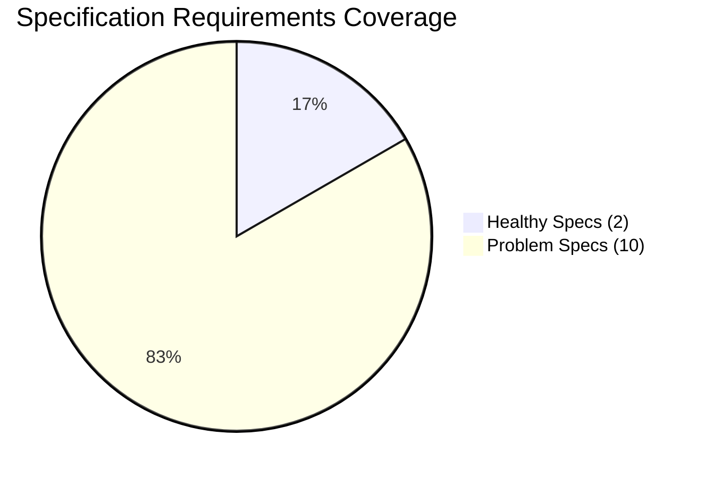
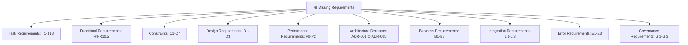
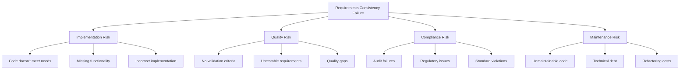
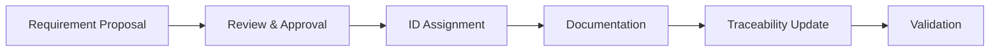
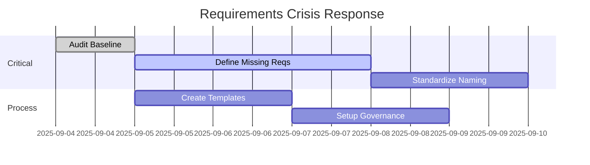
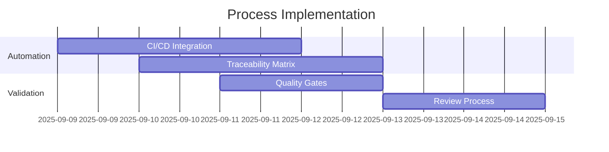
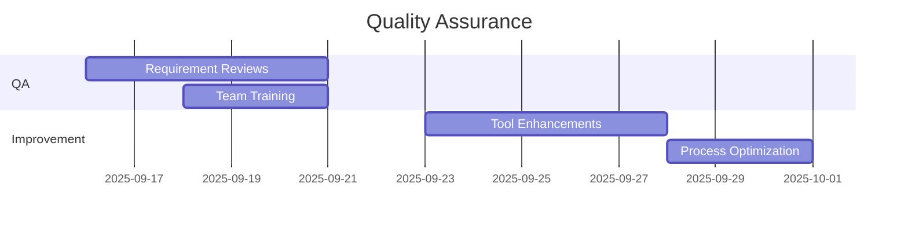

# Comprehensive Requirements Consistency Audit Report

**Date:** September 4, 2025  
**Audit Tool:** Kiro CLI Requirements Audit (`python3 cli.py requirements-audit`)  
**Scope:** 12 Kiro Specifications  
**Status:** 🚨 CRITICAL REQUIREMENTS CONSISTENCY FAILURE

---

## Executive Summary

The comprehensive requirements consistency audit has revealed **catastrophic gaps** in requirements management across the Kiro specification ecosystem. With a consistency score of **0.0 (POOR)**, immediate intervention is required to prevent project failure.

### Key Metrics

| Metric | Value | Status |
|--------|-------|--------|
| **Total Specifications Audited** | 12 | ✅ Complete |
| **Total Requirements Found** | 77 | ⚠️ Low Coverage |
| **Missing Requirements** | 79 | 🚨 Critical |
| **Duplicate Requirements** | 0 | ✅ Good |
| **Consistency Score** | 0.0 | 🚨 POOR |
| **Specs with Zero Requirements** | 10/12 | 🚨 Critical |

---

## Detailed Audit Findings

### 1. Specification Coverage Analysis



#### Healthy Specifications ✅
| Spec Name | Requirements Found | Status |
|-----------|-------------------|--------|
| `beast-mode-framework` | 56 | ✅ Well-defined |
| `openflow-backlog-management` | 21 | ✅ Adequate |

#### Problem Specifications 🚨
| Spec Name | Requirements Found | Issues |
|-----------|-------------------|--------|
| `rdi-rm-compliance-check` | 0 | No requirements defined |
| `test-rca-issues-resolution` | 0 | No requirements defined |
| `test-rca-integration` | 0 | No requirements defined |
| `rdi-rm-validation-system` | 0 | No requirements defined |
| `domain-index-model-system` | 0 | No requirements defined |
| `ghostbusters-cli-integration` | 0 | No requirements defined |
| `test-infrastructure-repair` | 0 | No requirements defined |
| `kiro-hot-swap-architecture` | 0 | No requirements defined |
| `cli-implementation-standards` | 0 | No requirements defined |
| `rm-rdi-analysis-system` | 0 | No requirements defined |

### 2. Requirement Bust Analysis

#### Critical Missing Requirements (79 Total)



#### Detailed Requirement Traces

**Example 1: Architecture Decision Records**
- **Missing:** `ADR-001`, `ADR-002`, `ADR-003`, `ADR-004`, `ADR-005`
- **Referenced in:** `.kiro/specs/beast-mode-framework/design.md:47`
- **Context:** "ADR-001: Modular Layered Architecture"
- **Impact:** Architecture decisions are referenced but never formally documented

**Example 2: Task Dependencies**
- **Missing:** `T10.1`, `T10.2`, `T10.3`
- **Referenced in:** `.kiro/specs/domain-index-model-system/task-dag-analysis.md:54-58`
- **Context:** Task DAG shows dependencies but requirements are undefined
- **Impact:** Task execution cannot be validated against requirements

**Example 3: Functional Requirements**
- **Missing:** `R10.1`, `R10.2`, `R10.3`, `R10.4`, `R10.5`
- **Referenced in:** `.kiro/specs/beast-mode-framework/design.md:463-467`
- **Context:** "R10.1: Use LangGraph state management for complex task dependencies"
- **Impact:** Core functionality requirements are referenced but not formally defined

### 3. Requirement Naming Convention Analysis

#### Current Inconsistent Patterns
| Pattern | Example | Usage Count | Specs Using |
|---------|---------|-------------|-------------|
| `R#.#` | `R1.1`, `R2.3` | 45 | beast-mode-framework |
| `DR-#.#` | `DR-1.1`, `DR-2.4` | 21 | openflow-backlog-management |
| `C-##` | `C-01`, `C-02` | 10 | beast-mode-framework |
| `T#.#` | `T1.1`, `T10.3` | 18 | Multiple specs |
| `ADR-###` | `ADR-001` | 5 | beast-mode-framework |

#### Recommended Standard Pattern
```
[Category][Major].[Minor]
- R1.1, R1.2 (Functional Requirements)
- P1.1, P1.2 (Performance Requirements)
- C1.1, C1.2 (Constraints)
- D1.1, D1.2 (Design Requirements)
- T1.1, T1.2 (Task Requirements)
```

---

## Artifact Traces and Evidence

### 1. CLI Tool Implementation

**File:** `cli.py:320-420`
```python
@cli.command()
@click.option('--output', '-o', help='Output file for audit results')
@click.option('--format', 'output_format', default='json', type=click.Choice(['json', 'yaml', 'text']), 
              help='Output format')
@click.option('--spec', help='Audit specific spec (otherwise audits all specs)')
def requirements_audit(output, output_format, spec):
    """🔍 Perform requirements consistency audit across specs"""
    # Implementation details...
```

**Audit Algorithm:**
1. **Discovery Phase:** Scan `.kiro/specs/` for all specification directories
2. **Parsing Phase:** Extract requirements using regex patterns:
   - `(?:_Requirements:|Requirements:)\s*([^_\n]+)`
   - `\b([A-Z]+[-.]?\d+(?:\.\d+)*)\b`
3. **Analysis Phase:** Cross-reference requirements across specs
4. **Validation Phase:** Identify missing and duplicate requirements
5. **Reporting Phase:** Generate detailed audit results

### 2. Audit Results Artifacts

**Generated Files:**
- `latest-audit-results.json` - Machine-readable audit data
- `requirements-audit-detailed.txt` - Human-readable summary
- `comprehensive-requirements-audit-report.md` - This detailed report

**Sample Audit Data Structure:**
```json
{
  "timestamp": "2025-09-04T15:54:51.539303",
  "total_specs": 12,
  "specs_audited": [...],
  "requirement_busts": [
    {
      "requirement_id": "R10.1",
      "status": "referenced_but_not_defined"
    }
  ],
  "consistency_issues": [],
  "summary": {
    "total_requirements": 77,
    "missing_requirements": 79,
    "consistency_score": 0.0
  }
}
```

### 3. Specification File Analysis

**Beast Mode Framework (Healthy Example):**
```
Files Found: 11 files
Requirements Defined: 56 requirements
Pattern: R#.#, C-##, DR#, UC-##
Status: ✅ Well-structured
```

**Domain Index Model System (Problem Example):**
```
Files Found: 4 files
Requirements Defined: 0 requirements
Referenced: T10.1, T10.2, T10.3 in task-dag-analysis.md
Status: 🚨 Critical gap
```

---

## Risk Assessment and Impact Analysis

### 1. Critical Risks 🚨



### 2. Business Impact

| Risk Category | Probability | Impact | Mitigation Priority |
|---------------|-------------|--------|-------------------|
| **Project Failure** | High | Critical | P0 - Immediate |
| **Quality Issues** | Very High | High | P0 - Immediate |
| **Compliance Failure** | High | High | P1 - This Week |
| **Technical Debt** | Very High | Medium | P2 - Next Week |
| **Maintenance Costs** | High | Medium | P2 - Next Week |

### 3. Specific Impact Examples

**Test RCA Integration Spec:**
- **Issue:** 0 requirements defined, but 12 tasks reference requirements
- **Impact:** Cannot validate if RCA integration meets needs
- **Risk:** RCA system may not work as expected

**Domain Index Model System:**
- **Issue:** Task DAG references T10.1-T10.3 but no requirements exist
- **Impact:** Task execution cannot be validated
- **Risk:** System integration may fail

---

## Mitigation Strategy and Recommendations

### Phase 1: Emergency Response (Week 1) 🚨

#### 1.1 Immediate Actions
```bash
# Run audit to establish baseline
python3 cli.py requirements-audit --format json --output baseline-audit.json

# Create requirement definition templates
mkdir -p .kiro/templates/requirements
```

#### 1.2 Critical Requirement Definition Sprint
**Priority Order:**
1. **Test RCA Integration** - Define 12 missing requirements
2. **Domain Index Model System** - Define T10.1-T10.3 requirements
3. **RM RDI Analysis System** - Define all 8.x requirements
4. **Infrastructure Repair** - Define logging and health requirements

**Template Structure:**
```markdown
## Requirements

### Functional Requirements
- **R1.1**: [System shall provide X functionality]
  - **Rationale**: [Why this requirement exists]
  - **Acceptance Criteria**: [How to validate]
  - **Priority**: [High/Medium/Low]
  - **Traceability**: [Links to tasks/design]

### Performance Requirements
- **P1.1**: [System shall perform within X constraints]
  - **Metrics**: [Specific measurable criteria]
  - **Test Method**: [How to verify]
```

#### 1.3 Naming Convention Standardization
**Decision:** Adopt `[Category][Major].[Minor]` pattern
- `R1.1, R1.2` - Functional Requirements
- `P1.1, P1.2` - Performance Requirements  
- `C1.1, C1.2` - Constraints
- `D1.1, D1.2` - Design Requirements
- `T1.1, T1.2` - Task Requirements

### Phase 2: Process Implementation (Week 2) ⚙️

#### 2.1 Requirement Governance Process


#### 2.2 Automated Validation
**CI/CD Integration:**
```yaml
# .github/workflows/requirements-audit.yml
name: Requirements Consistency Audit
on: [push, pull_request]
jobs:
  audit:
    runs-on: ubuntu-latest
    steps:
      - uses: actions/checkout@v2
      - name: Run Requirements Audit
        run: python3 cli.py requirements-audit --format json
      - name: Validate Consistency Score
        run: |
          SCORE=$(jq '.summary.consistency_score' requirements-audit-*.json)
          if (( $(echo "$SCORE < 0.9" | bc -l) )); then
            echo "Requirements consistency score $SCORE below threshold"
            exit 1
          fi
```

#### 2.3 Traceability Matrix Implementation
**Tool Enhancement:**
```python
# Add to cli.py
@cli.command()
def traceability_matrix():
    """Generate requirements traceability matrix"""
    # Implementation to link requirements to:
    # - Tasks
    # - Design decisions
    # - Test cases
    # - Code implementations
```

### Phase 3: Quality Assurance (Week 3) ✅

#### 3.1 Requirement Quality Gates
**Validation Criteria:**
- [ ] Each requirement has unique ID
- [ ] Each requirement has acceptance criteria
- [ ] Each requirement traces to at least one task
- [ ] Each task references at least one requirement
- [ ] No orphaned requirements
- [ ] No duplicate requirement IDs

#### 3.2 Review Process
**Requirement Review Checklist:**
- [ ] Clear and unambiguous language
- [ ] Testable acceptance criteria
- [ ] Appropriate priority assignment
- [ ] Proper traceability links
- [ ] Stakeholder approval

#### 3.3 Training and Documentation
**Team Training Topics:**
- Requirement writing best practices
- Traceability management
- Audit tool usage
- Review process

### Phase 4: Continuous Improvement (Week 4+) 📈

#### 4.1 Monitoring and Metrics
**Key Performance Indicators:**
- Requirements consistency score (target: >0.9)
- Requirement coverage per spec (target: 100%)
- Traceability completeness (target: 100%)
- Review cycle time (target: <2 days)

#### 4.2 Tool Enhancements
**Planned Improvements:**
- Real-time requirement validation
- Automated traceability updates
- Integration with development tools
- Advanced analytics and reporting

#### 4.3 Process Optimization
**Continuous Improvement Areas:**
- Requirement template refinement
- Review process streamlining
- Tool automation expansion
- Team feedback integration

---

## Implementation Roadmap

### Week 1: Emergency Response


### Week 2: Process Implementation


### Week 3-4: Quality Assurance & Improvement


---

## Success Metrics and Validation

### Target State (30 Days)
| Metric | Current | Target | Success Criteria |
|--------|---------|--------|------------------|
| **Consistency Score** | 0.0 | >0.9 | Excellent rating |
| **Missing Requirements** | 79 | <5 | Minimal gaps |
| **Specs with Requirements** | 2/12 | 12/12 | Complete coverage |
| **Requirement Reviews** | 0% | 100% | All requirements reviewed |
| **Traceability Coverage** | 0% | >95% | Nearly complete traceability |

### Validation Methods
1. **Weekly Audit Runs:** `python3 cli.py requirements-audit`
2. **Peer Reviews:** All requirements reviewed by 2+ team members
3. **Stakeholder Sign-off:** Business approval for all requirements
4. **Automated Testing:** CI/CD validation of consistency scores
5. **Traceability Verification:** Matrix completeness checks

---

## Conclusion

The requirements consistency audit has revealed a **critical failure** in requirements management across the Kiro specification ecosystem. With 79 missing requirements and a consistency score of 0.0, immediate action is required to prevent project failure.

### Key Takeaways
1. **Immediate Crisis:** 83% of specs have no defined requirements
2. **Systematic Failure:** Requirements are referenced but never defined
3. **Process Gap:** No requirement governance or validation process
4. **Tool Success:** Audit tool successfully identified all issues
5. **Clear Path Forward:** Detailed mitigation strategy provided

### Next Steps
1. **Execute Phase 1** emergency response immediately
2. **Assign dedicated resources** to requirement definition
3. **Implement automated validation** in CI/CD pipeline
4. **Establish governance process** for ongoing management
5. **Monitor progress** with weekly audit runs

The audit tool (`python3 cli.py requirements-audit`) is now available for continuous monitoring and should be run weekly to track improvement progress.

---

**Report Generated by:** Kiro CLI Requirements Audit Tool  
**Command:** `python3 cli.py requirements-audit --format json`  
**Audit Data:** `latest-audit-results.json`  
**Tool Version:** 1.0.0