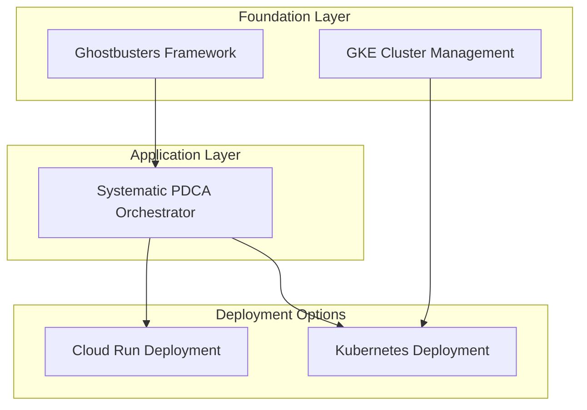

# 🎯 Deployment Architecture - Separation of Concerns

## 📋 **Systematic Architecture**

Following proper separation of concerns, we now have **distinct specs** for infrastructure and application deployment:

### **🏗️ Infrastructure Layer**
**Spec**: `gke-cluster-management`
**Responsibility**: GKE cluster provisioning, security, and lifecycle management
**Dependencies**: None (foundation layer)

### **🚀 Application Layer** 
**Spec**: `systematic-pdca-orchestrator`
**Responsibility**: PDCA orchestration service deployment and configuration
**Dependencies**: 
- Ghostbusters Framework (for multi-agent orchestration)
- GKE Cluster Management (for Kubernetes deployment option)

## 🔄 **Dependency Relationship**



## 🎯 **Deployment Options by Concern**

### **Option 1: Cloud Run (No Infrastructure Dependency)**
```bash
./deployment/systematic-pdca/deploy.sh PROJECT_ID
```
- **Infrastructure**: Managed by Google (serverless)
- **Application**: Systematic PDCA Orchestrator
- **Separation**: Complete - no infrastructure management needed

### **Option 2: New GKE Cluster (Full Stack)**
```bash
# Step 1: Deploy infrastructure (GKE Cluster Management spec)
./deployment/gke/deploy-gke.sh PROJECT_ID CLUSTER_NAME REGION DOMAIN
```
- **Infrastructure**: Creates new GKE cluster with systematic configuration
- **Application**: Deploys Systematic PDCA Orchestrator to new cluster
- **Separation**: Combined for convenience, but distinct responsibilities

### **Option 3: Existing GKE Cluster (Proper Separation)**
```bash
# Step 1: Infrastructure managed separately (GKE Cluster Management spec)
# Assumes cluster already exists and is managed by platform team

# Step 2: Deploy application only
./deployment/gke/deploy-app-only.sh PROJECT_ID EXISTING_CLUSTER REGION
```
- **Infrastructure**: Managed by GKE Cluster Management spec (separate team/process)
- **Application**: Only deploys Systematic PDCA Orchestrator
- **Separation**: Perfect - application deployment independent of cluster management

## 🏢 **Enterprise Deployment Pattern**

### **Platform Team Responsibilities** (GKE Cluster Management)
- Cluster provisioning and lifecycle management
- Security policies and compliance
- Network configuration and ingress
- Monitoring and operational excellence
- Cost optimization and resource management

### **Application Team Responsibilities** (Systematic PDCA Orchestrator)
- Application deployment and configuration
- Service-specific monitoring and alerting
- Application scaling and performance tuning
- Feature development and testing
- Application-level security and secrets

## 📊 **Comparison Matrix**

| Aspect | Cloud Run | GKE Full Stack | GKE App-Only |
|--------|-----------|----------------|--------------|
| **Infrastructure Management** | None | Creates cluster | Uses existing |
| **Separation of Concerns** | Perfect | Combined | Perfect |
| **Team Ownership** | App team only | Single team | Platform + App teams |
| **Cost Model** | Pay-per-request | Full cluster cost | Shared cluster cost |
| **Complexity** | Low | High | Medium |
| **Enterprise Fit** | Good | Medium | Excellent |

## 🎯 **Recommended Patterns**

### **For Startups/Small Teams**: Cloud Run
- Single team manages everything
- Minimal infrastructure complexity
- Cost-effective scaling

### **For Medium Organizations**: GKE Full Stack
- Dedicated infrastructure for systematic PDCA
- Single team can manage both layers
- Full Kubernetes benefits

### **For Large Enterprises**: GKE App-Only
- Platform team manages cluster infrastructure
- Application teams deploy independently
- Perfect separation of concerns
- Shared infrastructure costs

## 🔧 **Implementation Status**

### **✅ Completed**
- **GKE Cluster Management Spec**: Requirements, design, and tasks defined
- **Systematic PDCA Orchestrator**: Updated with proper dependencies
- **App-Only Deployment**: Script for existing clusters
- **Separation Architecture**: Clear responsibility boundaries

### **🎯 Next Steps**
1. **Implement GKE Cluster Management spec** (if needed)
2. **Choose deployment option** based on organizational structure
3. **Deploy systematic PDCA orchestration** using appropriate separation pattern

The architecture now properly separates infrastructure concerns from application deployment, enabling systematic management at both layers! 🚀