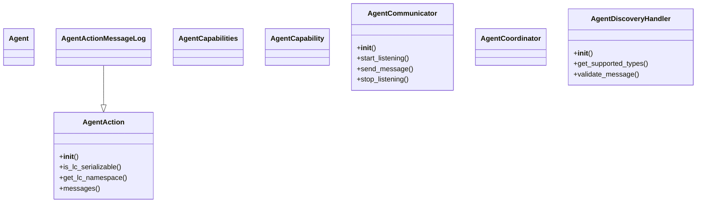
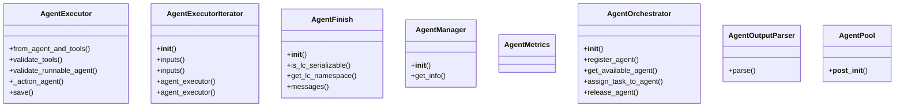
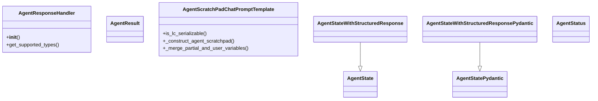
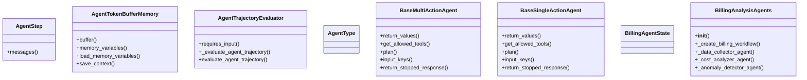
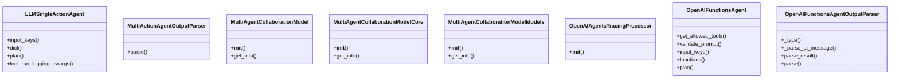
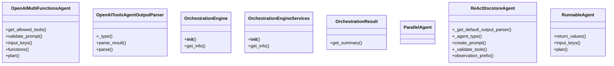
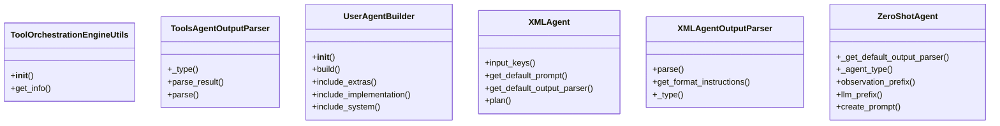

# Agent Domain Architecture

**Total Classes**: 78

## Section 1

## Section 2

## Section 3

## Section 4

## Section 5

```mermaid
classDiagram
    class ChatAgent {
        +observation_prefix()
        +llm_prefix()
        +_construct_scratchpad()
        +_get_default_output_parser()
        +_validate_tools()
    }
    class CodeQualityMentorAgent {
        +__init__()
        +get_specializations()
        +get_max_concurrent_tasks()
    }
    class ConversationalAgent {
        +_get_default_output_parser()
        +_agent_type()
        +observation_prefix()
        +llm_prefix()
        +create_prompt()
    }
    class ConversationalChatAgent {
        +_get_default_output_parser()
        +_agent_type()
        +observation_prefix()
        +llm_prefix()
        +_validate_tools()
    }
    class CostOptimizationAgent {
        +__init__()
        +get_specializations()
        +get_max_concurrent_tasks()
    }
    class DeploymentSpecialistAgent {
        +__init__()
        +get_specializations()
        +get_max_concurrent_tasks()
    }
    class GhostbustersExpertAgent {
        +__init__()
        +get_capabilities()
        +validate_confidence()
        +supports_capability()
        +get_agent_info()
    }
    class JSONAgentOutputParser {
        +parse()
        +_type()
    }
```

## Section 6

## Section 7

## Section 8

```mermaid
classDiagram
    class RunnableMultiActionAgent {
        +return_values()
        +input_keys()
        +plan()
    }
    class SelfAskWithSearchAgent {
        +_get_default_output_parser()
        +_agent_type()
        +create_prompt()
        +_validate_tools()
        +observation_prefix()
    }
    class SimpleBeastAgent {
        +__init__()
        +_get_primary_responsibility()
        +get_health_indicators()
        +get_module_status()
        +is_healthy()
    }
    class SimplifiedMultiAgentModel {
        +__init__()
        +get_module_status()
        +_get_primary_responsibility()
        +is_healthy()
        +get_health_indicators()
    }
    class StructuredChatAgent {
        +observation_prefix()
        +llm_prefix()
        +_construct_scratchpad()
        +_validate_tools()
        +_get_default_output_parser()
    }
    class ToolAgentAction {
    }
    class ToolOrchestrationEngine {
        +__init__()
        +get_module_status()
        +is_healthy()
        +get_health_indicators()
        +_get_primary_responsibility()
    }
    class ToolOrchestrationEngineCore {
        +__init__()
        +get_info()
    }
```

## Section 9

```mermaid
classDiagram
    class ToolOrchestrationEngineCoreCore {
        +__init__()
        +get_info()
    }
    class ToolOrchestrationEngineServices {
        +__init__()
        +get_info()
    }
    class ToolOrchestrationEngineServicesCore {
        +__init__()
        +get_info()
    }
    class ToolOrchestrationEngineServicesCoreCore {
        +__init__()
        +get_info()
    }
    class ToolOrchestrationEngineServicesServices {
        +__init__()
        +get_info()
    }
    class ToolOrchestrationEngineServicesServicesCore {
        +__init__()
        +get_info()
    }
    class ToolOrchestrationEngineServicesServicesUtils {
        +__init__()
        +get_info()
    }
    class ToolOrchestrationEngineServicesUtils {
        +__init__()
        +get_info()
    }
```

## Section 10

## All Classes in Domain

- `Agent`
- `AgentAction`
- `AgentActionMessageLog`
- `AgentCapabilities`
- `AgentCapability`
- `AgentCommunicator`
- `AgentCoordinator`
- `AgentDiscoveryHandler`
- `AgentExecutor`
- `AgentExecutorIterator`
- `AgentFinish`
- `AgentManager`
- `AgentMetrics`
- `AgentOrchestrator`
- `AgentOutputParser`
- `AgentPool`
- `AgentResponseHandler`
- `AgentResult`
- `AgentScratchPadChatPromptTemplate`
- `AgentState`
- `AgentStatePydantic`
- `AgentStateWithStructuredResponse`
- `AgentStateWithStructuredResponsePydantic`
- `AgentStatus`
- `AgentStep`
- `AgentTokenBufferMemory`
- `AgentTrajectoryEvaluator`
- `AgentType`
- `BaseMultiActionAgent`
- `BaseSingleActionAgent`
- `BillingAgentState`
- `BillingAnalysisAgents`
- `ChatAgent`
- `CodeQualityMentorAgent`
- `ConversationalAgent`
- `ConversationalChatAgent`
- `CostOptimizationAgent`
- `DeploymentSpecialistAgent`
- `GhostbustersExpertAgent`
- `JSONAgentOutputParser`
- `LLMSingleActionAgent`
- `MultiActionAgentOutputParser`
- `MultiAgentCollaborationModel`
- `MultiAgentCollaborationModelCore`
- `MultiAgentCollaborationModelModels`
- `OpenAIAgentsTracingProcessor`
- `OpenAIFunctionsAgent`
- `OpenAIFunctionsAgentOutputParser`
- `OpenAIMultiFunctionsAgent`
- `OpenAIToolsAgentOutputParser`
- `OrchestrationEngine`
- `OrchestrationEngineServices`
- `OrchestrationResult`
- `ParallelAgent`
- `ReActDocstoreAgent`
- `RunnableAgent`
- `RunnableMultiActionAgent`
- `SelfAskWithSearchAgent`
- `SimpleBeastAgent`
- `SimplifiedMultiAgentModel`
- `StructuredChatAgent`
- `ToolAgentAction`
- `ToolOrchestrationEngine`
- `ToolOrchestrationEngineCore`
- `ToolOrchestrationEngineCoreCore`
- `ToolOrchestrationEngineServices`
- `ToolOrchestrationEngineServicesCore`
- `ToolOrchestrationEngineServicesCoreCore`
- `ToolOrchestrationEngineServicesServices`
- `ToolOrchestrationEngineServicesServicesCore`
- `ToolOrchestrationEngineServicesServicesUtils`
- `ToolOrchestrationEngineServicesUtils`
- `ToolOrchestrationEngineUtils`
- `ToolsAgentOutputParser`
- `UserAgentBuilder`
- `XMLAgent`
- `XMLAgentOutputParser`
- `ZeroShotAgent`
