# Analysis Domain Architecture

**Total Classes**: 139

## Section 1

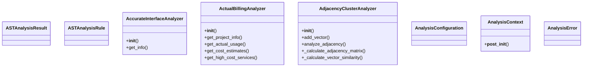

## Section 2

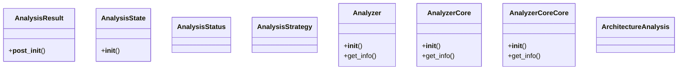

## Section 3

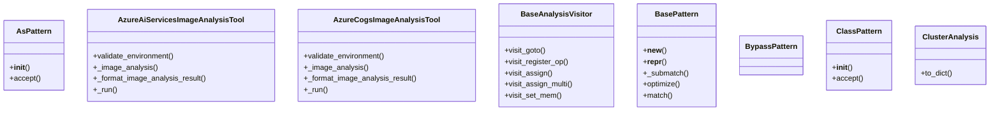

## Section 4

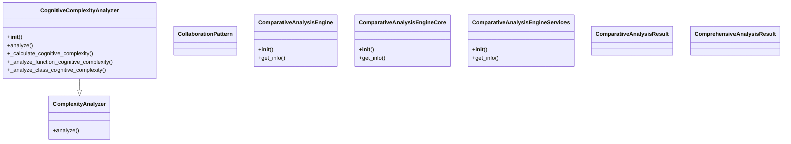

## Section 5

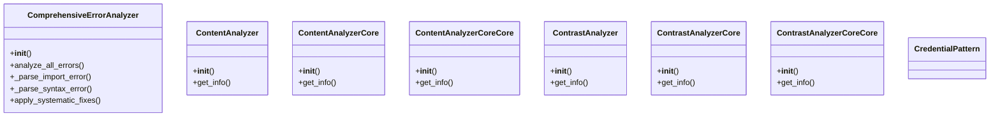

## Section 6

```mermaid
classDiagram
    class CriticalPathAnalysis {
    }
    class CriticalPathAnalyzer {
        +__init__()
        +analyze_critical_paths()
        +identify_bottlenecks()
        +calculate_completion_percentage()
        +estimate_remaining_work()
    }
    class CriticalPathAnalyzerCore {
        +__init__()
        +get_info()
    }
    class CriticalPathAnalyzerCoreCore {
        +__init__()
        +get_info()
    }
    class CuriousPageAnalyzer {
        +__init__()
        +analyze_page()
        +_heuristically_detect_page_type()
        +_find_status_indicators()
        +_find_navigation_elements()
    }
    class CyclomaticComplexityAnalyzer {
        +__init__()
        +analyze()
        +_calculate_cyclomatic_complexity()
        +_analyze_function_complexity()
        +_analyze_class_complexity()
    }
    class DeepErrorAnalysis {
    }
    class DeepErrorAnalyzer {
        +__init__()
        +perform_deep_analysis()
        +_parse_deep_import_error()
        +_parse_deep_syntax_error()
        +_parse_deep_attribute_error()
    }
```

## Section 7

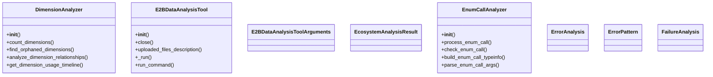

## Section 8

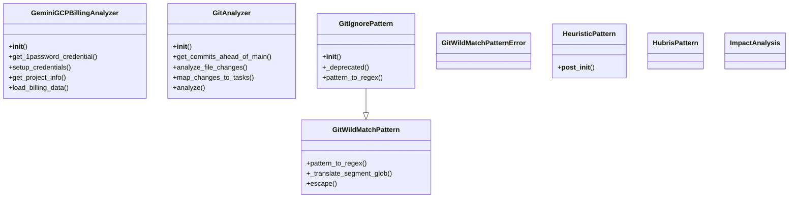

## Section 9

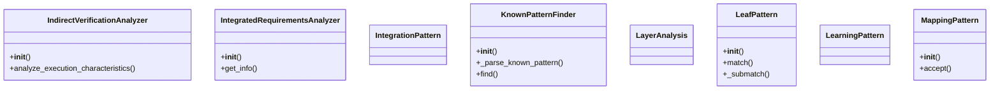

## Section 10

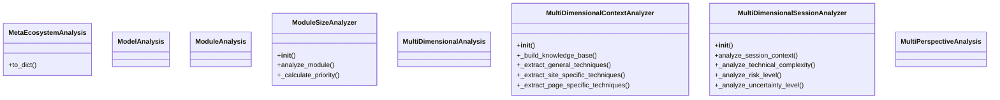

## Section 11

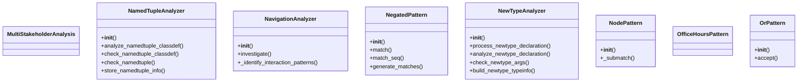

## Section 12

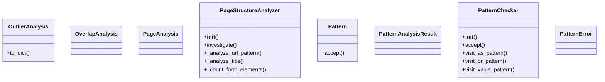

## Section 13

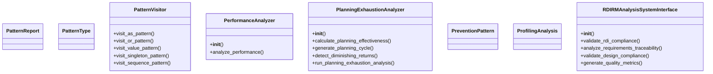

## Section 14

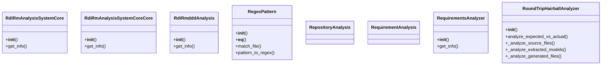

## Section 15

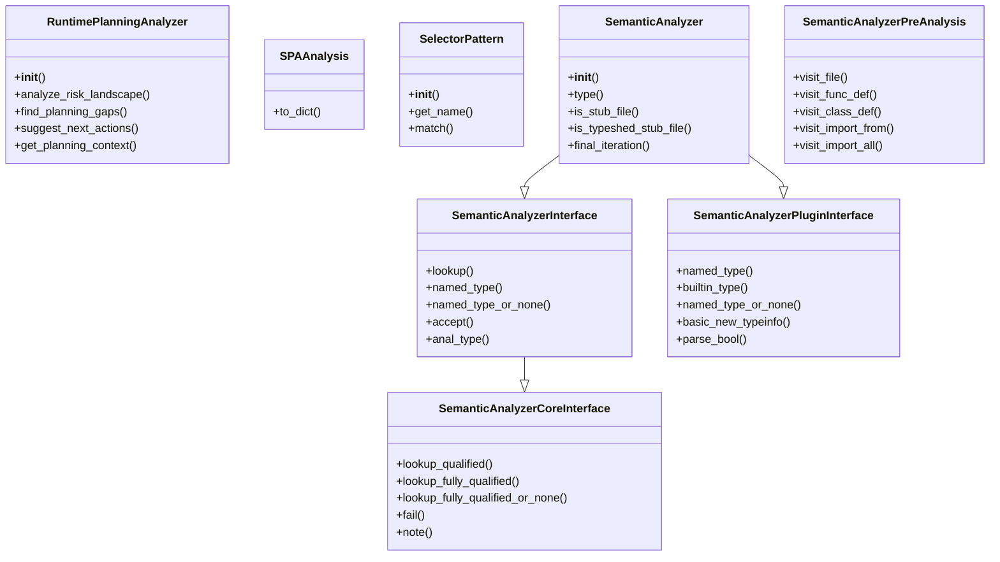

## Section 16

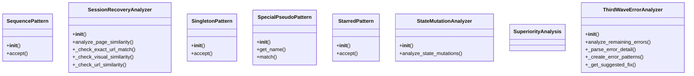

## Section 17

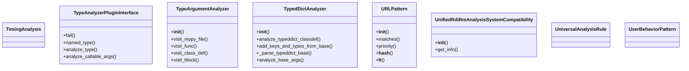

## Section 18

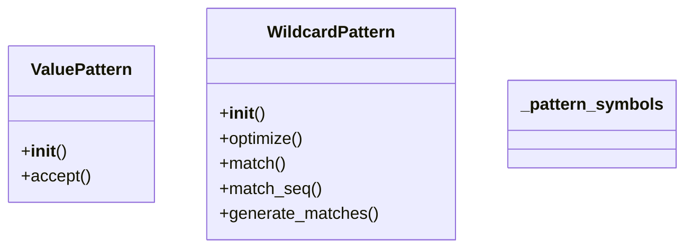

## All Classes in Domain

- `ASTAnalysisResult`
- `ASTAnalysisRule`
- `AccurateInterfaceAnalyzer`
- `ActualBillingAnalyzer`
- `AdjacencyClusterAnalyzer`
- `AnalysisConfiguration`
- `AnalysisContext`
- `AnalysisError`
- `AnalysisResult`
- `AnalysisState`
- `AnalysisStatus`
- `AnalysisStrategy`
- `Analyzer`
- `AnalyzerCore`
- `AnalyzerCoreCore`
- `ArchitectureAnalysis`
- `AsPattern`
- `AzureAiServicesImageAnalysisTool`
- `AzureCogsImageAnalysisTool`
- `BaseAnalysisVisitor`
- `BasePattern`
- `BypassPattern`
- `ClassPattern`
- `ClusterAnalysis`
- `CognitiveComplexityAnalyzer`
- `CollaborationPattern`
- `ComparativeAnalysisEngine`
- `ComparativeAnalysisEngineCore`
- `ComparativeAnalysisEngineServices`
- `ComparativeAnalysisResult`
- `ComplexityAnalyzer`
- `ComprehensiveAnalysisResult`
- `ComprehensiveErrorAnalyzer`
- `ContentAnalyzer`
- `ContentAnalyzerCore`
- `ContentAnalyzerCoreCore`
- `ContrastAnalyzer`
- `ContrastAnalyzerCore`
- `ContrastAnalyzerCoreCore`
- `CredentialPattern`
- `CriticalPathAnalysis`
- `CriticalPathAnalyzer`
- `CriticalPathAnalyzerCore`
- `CriticalPathAnalyzerCoreCore`
- `CuriousPageAnalyzer`
- `CyclomaticComplexityAnalyzer`
- `DeepErrorAnalysis`
- `DeepErrorAnalyzer`
- `DimensionAnalyzer`
- `E2BDataAnalysisTool`
- `E2BDataAnalysisToolArguments`
- `EcosystemAnalysisResult`
- `EnumCallAnalyzer`
- `ErrorAnalysis`
- `ErrorPattern`
- `FailureAnalysis`
- `GeminiGCPBillingAnalyzer`
- `GitAnalyzer`
- `GitIgnorePattern`
- `GitWildMatchPattern`
- `GitWildMatchPatternError`
- `HeuristicPattern`
- `HubrisPattern`
- `ImpactAnalysis`
- `IndirectVerificationAnalyzer`
- `IntegratedRequirementsAnalyzer`
- `IntegrationPattern`
- `KnownPatternFinder`
- `LayerAnalysis`
- `LeafPattern`
- `LearningPattern`
- `MappingPattern`
- `MetaEcosystemAnalysis`
- `ModelAnalysis`
- `ModuleAnalysis`
- `ModuleSizeAnalyzer`
- `MultiDimensionalAnalysis`
- `MultiDimensionalContextAnalyzer`
- `MultiDimensionalSessionAnalyzer`
- `MultiPerspectiveAnalysis`
- `MultiStakeholderAnalysis`
- `NamedTupleAnalyzer`
- `NavigationAnalyzer`
- `NegatedPattern`
- `NewTypeAnalyzer`
- `NodePattern`
- `OfficeHoursPattern`
- `OrPattern`
- `OutlierAnalysis`
- `OverlapAnalysis`
- `PageAnalysis`
- `PageStructureAnalyzer`
- `Pattern`
- `PatternAnalysisResult`
- `PatternChecker`
- `PatternError`
- `PatternReport`
- `PatternType`
- `PatternVisitor`
- `PerformanceAnalyzer`
- `PlanningExhaustionAnalyzer`
- `PreventionPattern`
- `ProfilingAnalysis`
- `RDIRMAnalysisSystemInterface`
- `RdiRmAnalysisSystemCore`
- `RdiRmAnalysisSystemCoreCore`
- `RdiRmdddAnalysis`
- `RegexPattern`
- `RepositoryAnalysis`
- `RequirementAnalysis`
- `RequirementsAnalyzer`
- `RoundTripHairballAnalyzer`
- `RuntimePlanningAnalyzer`
- `SPAAnalysis`
- `SelectorPattern`
- `SemanticAnalyzer`
- `SemanticAnalyzerCoreInterface`
- `SemanticAnalyzerInterface`
- `SemanticAnalyzerPluginInterface`
- `SemanticAnalyzerPreAnalysis`
- `SequencePattern`
- `SessionRecoveryAnalyzer`
- `SingletonPattern`
- `SpecialPseudoPattern`
- `StarredPattern`
- `StateMutationAnalyzer`
- `SuperiorityAnalysis`
- `ThirdWaveErrorAnalyzer`
- `TimingAnalysis`
- `TypeAnalyzerPluginInterface`
- `TypeArgumentAnalyzer`
- `TypedDictAnalyzer`
- `URLPattern`
- `UnifiedRdiRmAnalysisSystemCompatibility`
- `UniversalAnalysisRule`
- `UserBehaviorPattern`
- `ValuePattern`
- `WildcardPattern`
- `_pattern_symbols`
