# BeastMode Domain Architecture

**Total Classes**: 157

## Section 1

```mermaid
classDiagram
    class Anyscale {
        +is_lc_serializable()
        +validate_environment()
        +_identifying_params()
        +_invocation_params()
        +_llm_type()
    }
    class AnyscaleEmbeddings {
        +lc_secrets()
        +validate_environment()
        +_llm_type()
    }
    class AsyncRedisCache {
        +__init__()
        +lookup()
        +update()
        +clear()
    }
    class AsyncScalarResult {
        +__init__()
        +unique()
        +__aiter__()
    }
    class AsyncScanCommands {
    }
    class BanditSecurityScanner {
        +__init__()
        +_initialize_bandit()
        +scan_file()
        +scan_directory()
        +_collect_issues()
    }
    class BeastMode15MinScale {
        +__init__()
        +check_timeout()
        +phase1_fix_assessment_tool()
        +phase2_size_compliance_refactoring()
        +_find_oversized_modules()
    }
    class BeastMode95PercentComplianceTarget {
        +__init__()
        +run_95_percent_target()
        +get_current_compliance()
        +identify_error_files()
        +analyze_error_patterns()
    }
```

## Section 2

```mermaid
classDiagram
    class BeastModeASTESTAnalysisReport {
        +__init__()
        +generate_ast_est_analysis_report()
        +analyze_error_patterns()
        +generate_ast_est_recommendations()
        +generate_alternative_approaches()
    }
    class BeastModeAgent {
        +__init__()
        +get_specializations()
        +get_max_concurrent_tasks()
        +_can_handle_request()
        +_update_average_response_time()
    }
    class BeastModeAggressiveComplianceSpread {
        +__init__()
        +run_aggressive_compliance_spread()
        +aggressive_file_cleanup()
        +is_severely_corrupted()
        +systematic_syntax_fixes()
    }
    class BeastModeAggressiveRequirementsReimplementation {
        +__init__()
        +run_aggressive_reimplementation()
        +identify_all_syntax_error_files()
        +aggressive_reimplementation()
        +generate_requirements_based_implementation()
    }
    class BeastModeBackwardPassAsBuiltIntegrator {
        +__init__()
        +run_backward_pass_integration()
        +extract_as_built_features()
        +determine_component_type()
        +extract_features_from_file()
    }
    class BeastModeBidirectionalCycleValidator {
        +__init__()
        +validate_bidirectional_cycle()
        +load_all_cycle_reports()
        +validate_forward_pass()
        +validate_backward_pass()
    }
    class BeastModeBusClient {
        +__init__()
        +register_message_handler()
        +get_health_status()
        +get_recent_messages()
        +find_agents_with_capabilities()
    }
    class BeastModeCLI {
        +__init__()
        +get_module_status()
        +is_healthy()
        +get_health_indicators()
        +_get_primary_responsibility()
    }
```

## Section 3

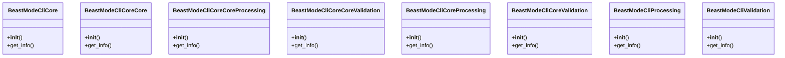

## Section 4

```mermaid
classDiagram
    class BeastModeClient {
        +__init__()
        +start()
        +stop()
        +send_message()
        +check_messages()
    }
    class BeastModeConsolidator {
        +__init__()
        +get_info()
    }
    class BeastModeConstraintResolver {
        +__init__()
        +get_module_status()
        +is_healthy()
        +get_health_indicators()
        +_get_primary_responsibility()
    }
    class BeastModeDAGLauncher {
        +__init__()
        +get_ready_tasks()
        +is_execution_complete()
        +generate_mermaid_dag()
        +calculate_spec_status()
    }
    class BeastModeDaemon {
        +__init__()
        +start_daemon()
        +stop_daemon()
        +_run_daemon()
        +send_message()
    }
    class BeastModeDebugSystem {
        +__init__()
        +setup_comprehensive_logging()
        +setup_signal_handlers()
        +setup_exit_handlers()
        +register_debug_hooks()
    }
    class BeastModeDesignSynchronizer {
        +__init__()
        +synchronize_designs()
        +load_updated_requirements()
        +analyze_existing_designs()
        +analyze_design_coverage()
    }
    class BeastModeDirectFixEngine {
        +__init__()
        +run_direct_fix_engine()
        +direct_file_processing()
        +apply_direct_modifications()
        +fix_indentation_direct()
    }
```

## Section 5

```mermaid
classDiagram
    class BeastModeEnhancedASTEngine {
        +__init__()
        +process_file_with_enhanced_ast()
        +run_enhanced_ast_convergence()
        +get_compliance()
    }
    class BeastModeEvidencePackage {
    }
    class BeastModeFinal95PercentPush {
        +__init__()
        +run_final_95_percent_push()
        +get_current_compliance()
        +identify_remaining_errors()
        +aggressive_deletion_strategy()
    }
    class BeastModeFinalBidirectionalSummary {
        +__init__()
        +generate_final_bidirectional_summary()
        +load_all_cycle_reports()
        +generate_comprehensive_bidirectional_analysis()
        +analyze_forward_pass()
    }
    class BeastModeFinalCompliance {
        +__init__()
        +run_assessment()
        +identify_oversized_modules()
        +refactor_oversized_module()
        +_refactor_methods_file()
    }
    class BeastModeFinalConvergenceReport {
        +__init__()
        +generate_final_convergence_report()
        +generate_recommended_next_steps()
        +generate_strategic_recommendations()
        +generate_technical_roadmap()
    }
    class BeastModeFinalForwardEngineeringSummary {
        +__init__()
        +generate_final_summary()
        +load_all_reports()
        +analyze_integration_completeness()
        +analyze_lessons_integration()
    }
    class BeastModeFinalHybridReport {
        +__init__()
        +generate_final_hybrid_report()
        +generate_hybrid_recommendations()
        +generate_strategic_roadmap()
    }
```

## Section 6

```mermaid
classDiagram
    class BeastModeFinalReport {
        +__init__()
        +generate_beast_mode_report()
    }
    class BeastModeFinalSuccessReport {
        +__init__()
        +generate_final_success_report()
        +load_all_reports()
        +generate_comprehensive_analysis()
        +analyze_reimplementation_success()
    }
    class BeastModeFixRefinementEngine {
        +__init__()
        +run_phase1_refinement()
        +advanced_error_analysis()
        +identify_error_pattern()
        +extract_context()
    }
    class BeastModeFocusedRDIAnalysis {
        +__init__()
        +run_focused_rdi_analysis()
        +analyze_key_files()
        +extract_requirements()
        +assess_compliance()
    }
    class BeastModeFullComplianceSpread {
        +__init__()
        +log_phase()
        +git_sync()
        +run_tests()
        +get_compliance_metrics()
    }
    class BeastModeFullComplianceSpreadReport {
        +__init__()
        +generate_full_compliance_spread_report()
    }
    class BeastModeFullComplianceSystem {
        +__init__()
        +_get_all_python_files()
        +_analyze_file_compliance()
        +_implement_reflective_module()
        +_implement_health_monitoring()
    }
    class BeastModeHealthMonitoring {
        +__init__()
        +analyze_module_health_compliance()
        +enhance_health_monitoring()
        +_add_health_monitoring_enhancements()
        +fix_single_module()
    }
```

## Section 7

```mermaid
classDiagram
    class BeastModeHybridErrorResolutionEngine {
        +__init__()
        +run_hybrid_resolution()
        +perform_ai_error_analysis()
        +apply_automated_fixes()
        +apply_ai_assisted_fixes()
    }
    class BeastModeImplementationUpdater {
        +__init__()
        +update_implementations()
        +load_synchronized_designs()
        +analyze_existing_implementations()
        +analyze_implementation_coverage()
    }
    class BeastModeIncrementalImprovementSystem {
        +__init__()
        +run_incremental_improvement()
        +analyze_errors_for_cycle()
        +calculate_error_priority()
        +apply_targeted_improvements()
    }
    class BeastModeInterfaceGovernance {
        +__init__()
        +validate_file()
        +_validate_reflective_module()
        +_validate_interface_patterns()
        +validate_files()
    }
    class BeastModeLessonsLearnedAnalysis {
        +__init__()
        +analyze_lessons_learned()
        +analyze_methodology_insights()
        +analyze_technical_discoveries()
        +analyze_process_improvements()
    }
    class BeastModeManualFixer {
        +__init__()
        +create_beast_mode_backup()
        +identify_critical_errors()
        +aggressive_fix_indented_block_errors()
        +aggressive_fix_unindent_errors()
    }
    class BeastModeManualSyntaxFixer {
        +__init__()
        +create_beast_mode_backup()
        +identify_syntax_errors()
        +categorize_errors()
        +fix_expected_indented_block_errors()
    }
    class BeastModeMessage {
        +to_dict()
        +to_json()
    }
```

## Section 8

```mermaid
classDiagram
    class BeastModeNegotiationSystem {
        +__init__()
        +start_beast_mode_negotiation()
        +handle_impasse_with_trace_capture()
        +stop_and_dump_all_traces()
        +_create_negotiation_specific_dump()
    }
    class BeastModeOptimalConvergenceEngine {
        +__init__()
        +create_beast_mode_backup()
        +plan_phase()
        +do_phase()
        +check_phase()
    }
    class BeastModePDCAConvergence {
        +__init__()
        +plan_phase()
        +do_phase()
        +check_phase()
        +act_phase()
    }
    class BeastModePDCAConvergenceFinalReport {
        +__init__()
        +generate_final_report()
    }
    class BeastModePRProcessAnalysis {
        +__init__()
        +analyze_pr_process_context()
        +analyze_repair_recovery_motion()
        +analyze_pr_process_context_analysis()
        +analyze_as_built_modifications()
    }
    class BeastModePrecisionFixEngine {
        +__init__()
        +run_precision_fix_engine()
        +intelligent_error_analysis()
        +extract_intelligent_context()
        +calculate_fix_confidence()
    }
    class BeastModeRDIAnalysisEngine {
        +__init__()
        +run_rdi_analysis()
        +identify_modified_files()
        +extract_code_elements()
        +extract_class_info()
    }
    class BeastModeRDIAttackSystem {
        +__init__()
        +log_phase()
        +git_sync()
        +run_tests()
        +validate_interface_registry()
    }
```

## Section 9

```mermaid
classDiagram
    class BeastModeRMImplementer {
        +__init__()
        +create_rm_interface_template()
        +analyze_module()
        +_determine_capabilities()
        +_extract_dependencies()
    }
    class BeastModeRMInterface {
        +__init__()
        +analyze_module_rm_compliance()
        +fix_syntax_errors()
        +_fix_common_syntax_issues()
        +implement_rm_interface()
    }
    class BeastModeRequirementsDrivenReimplementation {
        +__init__()
        +run_requirements_driven_reimplementation()
        +identify_syntax_error_files()
        +extract_requirements_from_registry()
        +reimplement_from_requirements()
    }
    class BeastModeRequirementsFidelityTester {
        +__init__()
        +run_requirements_fidelity_tests()
        +load_requirements_registry()
        +identify_reimplemented_files()
        +determine_component_type()
    }
    class BeastModeResourceMonitor {
        +__init__()
        +_load_config()
        +_get_service_emoji()
        +log_token_usage()
        +log_api_call()
    }
    class BeastModeSCA20Loops {
        +__init__()
        +log_loop()
        +git_sync()
        +run_tests()
        +discover_random_subset()
    }
    class BeastModeSecurityManager {
        +__init__()
        +_initialize_security_systems()
        +get_module_status()
        +is_healthy()
        +get_health_indicators()
    }
    class BeastModeSharedState {
        +__init__()
        +_deserialize_state()
    }
```

## Section 10

```mermaid
classDiagram
    class BeastModeSystem {
        +__init__()
        +get_info()
    }
    class BeastModeSystemBackup {
        +__init__()
        +get_info()
    }
    class BeastModeSystemBeastmodesysteminterface {
        +__init__()
        +get_info()
    }
    class BeastModeSystemOrchestrator {
        +__init__()
        +_complete_initialization()
        +get_module_status()
        +is_healthy()
        +get_health_indicators()
    }
    class BeastModeSystemReflectivemodule {
        +__init__()
        +get_info()
    }
    class BeastModeTargetedConvergence {
        +__init__()
        +get_current_compliance()
        +apply_beast_mode_syntax_fixes()
        +fix_missing_colons()
        +fix_indentation_issues()
    }
    class BeastModeTestRunner {
        +__init__()
        +log_info()
        +log_success()
        +log_error()
        +log_warning()
    }
    class BeastModeUpstreamRequirementsUpdater {
        +__init__()
        +update_upstream_requirements()
        +load_lessons_learned()
        +load_existing_requirements()
        +extract_requirements_from_fidelity()
    }
```

## Section 11

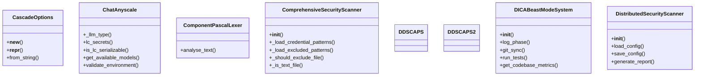

## Section 12

```mermaid
classDiagram
    class EnhancedInterfaceScanner {
        +__init__()
        +_load_domain_vocabulary()
        +_load_ubiquitous_language()
        +scan_file()
        +_is_reflective_module()
    }
    class EnhancedSCAProcedureV2 {
        +__init__()
        +execute_enhanced_loop()
        +_discover_random_subset()
        +_execute_phase()
        +run_enhanced_sca()
    }
    class EscapeSequence {
        +__init__()
        +escape()
        +color_string()
        +true_color_string()
        +reset_string()
    }
    class EtherscanLoader {
        +__init__()
        +lazy_load()
        +getNormTx()
        +getEthBalance()
        +getInternalTx()
    }
    class FriendlyGrayscaleStyle {
    }
    class HasCacheKey {
        +_generate_cache_attrs()
        +_gen_cache_key()
        +_generate_cache_key()
        +_generate_cache_key_for_object()
    }
    class HasCacheKeyImpl {
        +_implicit_coercions()
        +_literal_coercion()
    }
    class HasCacheKeyRole {
    }
```

## Section 13

```mermaid
classDiagram
    class HasCacheKeyTraverse {
    }
    class HealthMonitoringBeastMode {
        +__init__()
        +run()
        +_process_module()
        +_has_health_monitoring()
        +_find_reflective_module_classes()
    }
    class InterfaceScanner {
        +__init__()
        +scan_codebase()
        +scan_file()
        +is_reflective_module_class()
        +extract_interface_metadata()
    }
    class MarkSafeIfAutoescape {
        +as_const()
    }
    class MemoizedHasCacheKey {
        +_generate_cache_key()
    }
    class MetricsCalculatorModule {
        +calculate_enhanced_efficiency_metrics()
        +_calculate_improvement_rate()
        +_calculate_saturation_rate()
        +_calculate_resource_utilization()
    }
    class ModelDrivenSecurityScanner {
        +__init__()
        +_load_project_model()
        +scan_project()
        +_get_default_scan_paths()
        +generate_security_report()
    }
    class MyScale {
        +__init__()
        +embeddings()
        +escape_str()
        +_build_istr()
        +_insert()
    }
```

## Section 14

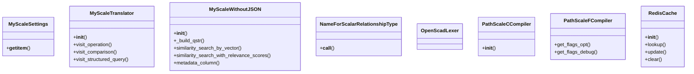

## Section 15

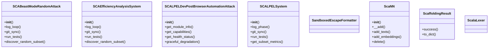

## Section 16

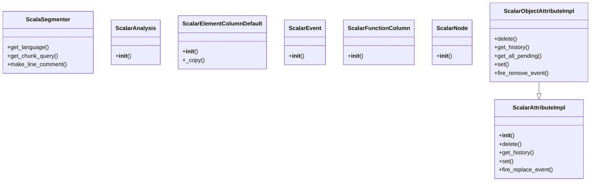

## Section 17

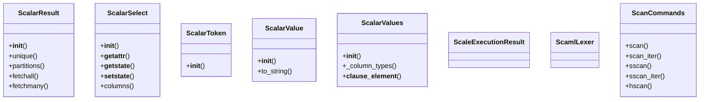

## Section 18

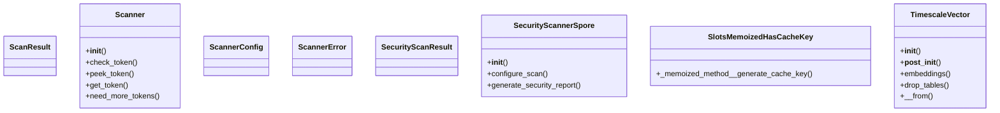

## Section 19

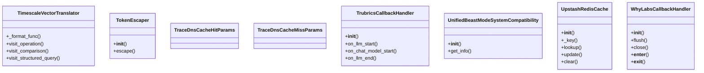

## Section 20

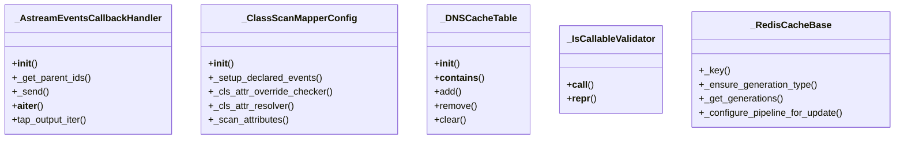

## All Classes in Domain

- `Anyscale`
- `AnyscaleEmbeddings`
- `AsyncRedisCache`
- `AsyncScalarResult`
- `AsyncScanCommands`
- `BanditSecurityScanner`
- `BeastMode15MinScale`
- `BeastMode95PercentComplianceTarget`
- `BeastModeASTESTAnalysisReport`
- `BeastModeAgent`
- `BeastModeAggressiveComplianceSpread`
- `BeastModeAggressiveRequirementsReimplementation`
- `BeastModeBackwardPassAsBuiltIntegrator`
- `BeastModeBidirectionalCycleValidator`
- `BeastModeBusClient`
- `BeastModeCLI`
- `BeastModeCliCore`
- `BeastModeCliCoreCore`
- `BeastModeCliCoreCoreProcessing`
- `BeastModeCliCoreCoreValidation`
- `BeastModeCliCoreProcessing`
- `BeastModeCliCoreValidation`
- `BeastModeCliProcessing`
- `BeastModeCliValidation`
- `BeastModeClient`
- `BeastModeConsolidator`
- `BeastModeConstraintResolver`
- `BeastModeDAGLauncher`
- `BeastModeDaemon`
- `BeastModeDebugSystem`
- `BeastModeDesignSynchronizer`
- `BeastModeDirectFixEngine`
- `BeastModeEnhancedASTEngine`
- `BeastModeEvidencePackage`
- `BeastModeFinal95PercentPush`
- `BeastModeFinalBidirectionalSummary`
- `BeastModeFinalCompliance`
- `BeastModeFinalConvergenceReport`
- `BeastModeFinalForwardEngineeringSummary`
- `BeastModeFinalHybridReport`
- `BeastModeFinalReport`
- `BeastModeFinalSuccessReport`
- `BeastModeFixRefinementEngine`
- `BeastModeFocusedRDIAnalysis`
- `BeastModeFullComplianceSpread`
- `BeastModeFullComplianceSpreadReport`
- `BeastModeFullComplianceSystem`
- `BeastModeHealthMonitoring`
- `BeastModeHybridErrorResolutionEngine`
- `BeastModeImplementationUpdater`
- `BeastModeIncrementalImprovementSystem`
- `BeastModeInterfaceGovernance`
- `BeastModeLessonsLearnedAnalysis`
- `BeastModeManualFixer`
- `BeastModeManualSyntaxFixer`
- `BeastModeMessage`
- `BeastModeNegotiationSystem`
- `BeastModeOptimalConvergenceEngine`
- `BeastModePDCAConvergence`
- `BeastModePDCAConvergenceFinalReport`
- `BeastModePRProcessAnalysis`
- `BeastModePrecisionFixEngine`
- `BeastModeRDIAnalysisEngine`
- `BeastModeRDIAttackSystem`
- `BeastModeRMImplementer`
- `BeastModeRMInterface`
- `BeastModeRequirementsDrivenReimplementation`
- `BeastModeRequirementsFidelityTester`
- `BeastModeResourceMonitor`
- `BeastModeSCA20Loops`
- `BeastModeSecurityManager`
- `BeastModeSharedState`
- `BeastModeSystem`
- `BeastModeSystemBackup`
- `BeastModeSystemBeastmodesysteminterface`
- `BeastModeSystemOrchestrator`
- `BeastModeSystemReflectivemodule`
- `BeastModeTargetedConvergence`
- `BeastModeTestRunner`
- `BeastModeUpstreamRequirementsUpdater`
- `CascadeOptions`
- `ChatAnyscale`
- `ComponentPascalLexer`
- `ComprehensiveSecurityScanner`
- `DDSCAPS`
- `DDSCAPS2`
- `DICABeastModeSystem`
- `DistributedSecurityScanner`
- `EnhancedInterfaceScanner`
- `EnhancedSCAProcedureV2`
- `EscapeSequence`
- `EtherscanLoader`
- `FriendlyGrayscaleStyle`
- `HasCacheKey`
- `HasCacheKeyImpl`
- `HasCacheKeyRole`
- `HasCacheKeyTraverse`
- `HealthMonitoringBeastMode`
- `InterfaceScanner`
- `MarkSafeIfAutoescape`
- `MemoizedHasCacheKey`
- `MetricsCalculatorModule`
- `ModelDrivenSecurityScanner`
- `MyScale`
- `MyScaleSettings`
- `MyScaleTranslator`
- `MyScaleWithoutJSON`
- `NameForScalarRelationshipType`
- `OpenScadLexer`
- `PathScaleCCompiler`
- `PathScaleFCompiler`
- `RedisCache`
- `SCABeastModeRandomAttack`
- `SCAEfficiencyAnalysisSystem`
- `SCALPELDevPostBrowserAutomationAttack`
- `SCALPELSystem`
- `SandboxedEscapeFormatter`
- `ScaNN`
- `ScaffoldingResult`
- `ScalaLexer`
- `ScalaSegmenter`
- `ScalarAnalysis`
- `ScalarAttributeImpl`
- `ScalarElementColumnDefault`
- `ScalarEvent`
- `ScalarFunctionColumn`
- `ScalarNode`
- `ScalarObjectAttributeImpl`
- `ScalarResult`
- `ScalarSelect`
- `ScalarToken`
- `ScalarValue`
- `ScalarValues`
- `ScaleExecutionResult`
- `ScamlLexer`
- `ScanCommands`
- `ScanResult`
- `Scanner`
- `ScannerConfig`
- `ScannerError`
- `SecurityScanResult`
- `SecurityScannerSpore`
- `SlotsMemoizedHasCacheKey`
- `TimescaleVector`
- `TimescaleVectorTranslator`
- `TokenEscaper`
- `TraceDnsCacheHitParams`
- `TraceDnsCacheMissParams`
- `TrubricsCallbackHandler`
- `UnifiedBeastModeSystemCompatibility`
- `UpstashRedisCache`
- `WhyLabsCallbackHandler`
- `_AstreamEventsCallbackHandler`
- `_ClassScanMapperConfig`
- `_DNSCacheTable`
- `_IsCallableValidator`
- `_RedisCacheBase`
