# CLI Domain Architecture

**Total Classes**: 201

## Section 1

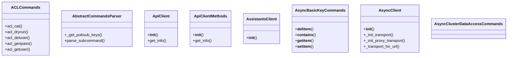

## Section 2

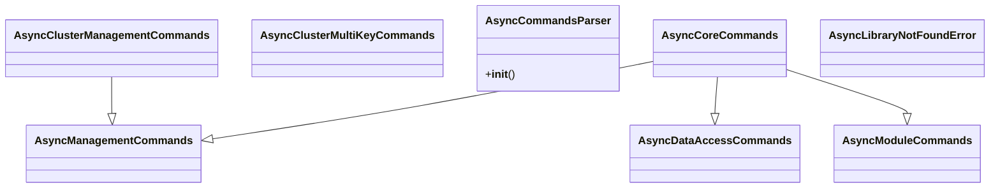

## Section 3

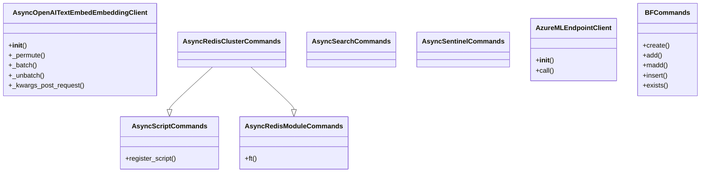

## Section 4

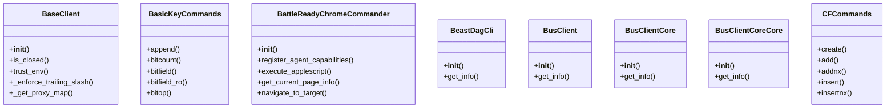

## Section 5

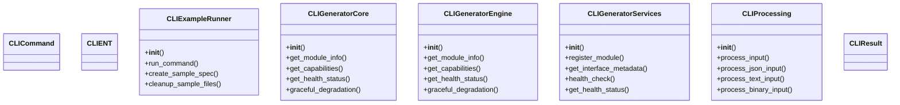

## Section 6

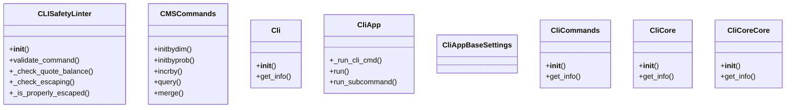

## Section 7

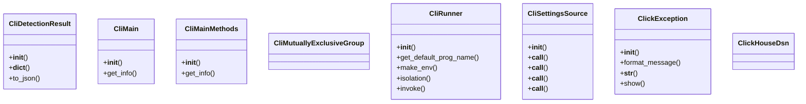

## Section 8

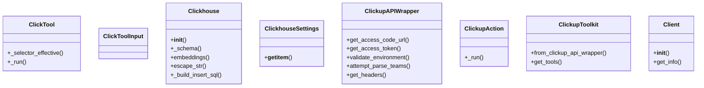

## Section 9

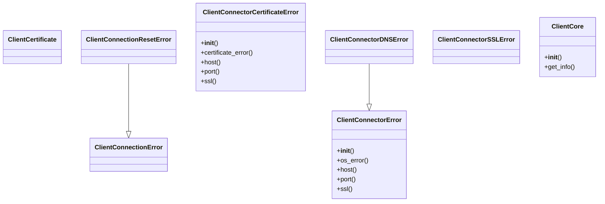

## Section 10

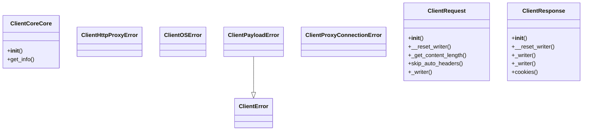

## Section 11

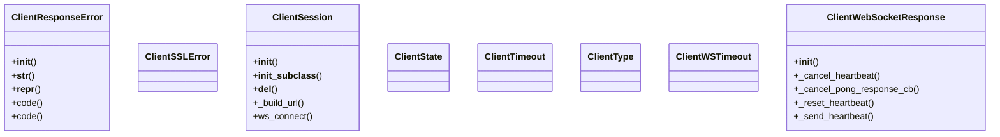

## Section 12

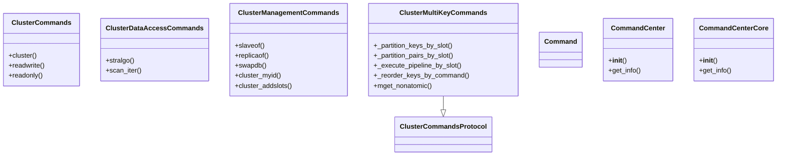

## Section 13

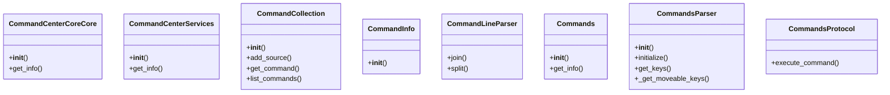

## Section 14

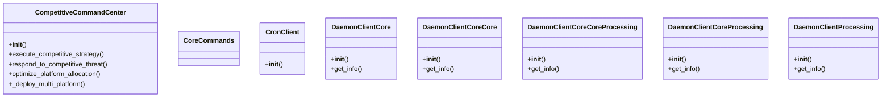

## Section 15

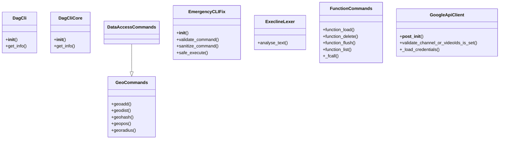

## Section 16

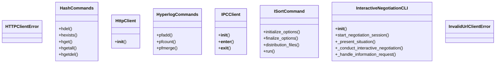

## Section 17

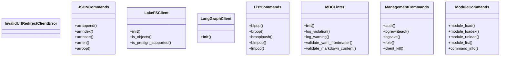

## Section 18

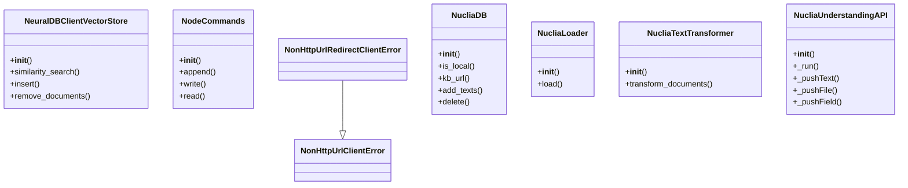

## Section 19

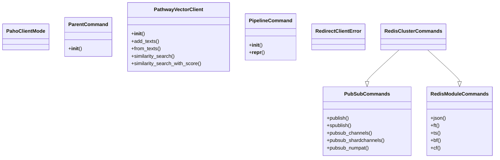

## Section 20

```mermaid
classDiagram
    class RunsClient {
        +__init__()
        +stream()
        +stream()
        +stream()
        +join_stream()
    }
    class SafeCLIExecutor {
        +__init__()
        +_setup_logging()
        +validate_command()
        +sanitize_command()
        +check_cli_availability()
    }
    class ScriptCommands {
        +_eval()
        +eval()
        +eval_ro()
        +_evalsha()
        +evalsha()
    }
    class SearchCommands {
        +_parse_results()
        +_parse_info()
        +_parse_search()
        +_parse_aggregate()
        +_parse_profile()
    }
    class SentinelCommands {
        +sentinel()
        +sentinel_get_master_addr_by_name()
        +sentinel_master()
        +sentinel_masters()
        +sentinel_monitor()
    }
    class SetCommands {
        +sadd()
        +scard()
        +sdiff()
        +sdiffstore()
        +sinter()
    }
    class ShellCommandFix {
        +__init__()
        +validate_command()
        +sanitize_command()
        +safe_execute()
    }
    class SortedSetCommands {
        +zadd()
        +zcard()
        +zcount()
        +zdiff()
        +zdiffstore()
    }
```

## Section 21

```mermaid
classDiagram
    class StoreClient {
        +__init__()
    }
    class StreamCommands {
        +xack()
        +xackdel()
        +xadd()
        +xautoclaim()
        +xclaim()
    }
    class StubgenCliParseSuite {
        +test_walk_packages()
    }
    class SyncAssistantsClient {
        +__init__()
        +get()
        +get_graph()
        +get_schemas()
        +get_subgraphs()
    }
    class SyncCronClient {
        +__init__()
        +create_for_thread()
        +create()
        +delete()
        +search()
    }
    class SyncHttpClient {
        +__init__()
        +get()
        +post()
        +put()
        +patch()
    }
    class SyncLangGraphClient {
        +__init__()
        +__enter__()
        +__exit__()
        +close()
    }
    class SyncRunsClient {
        +__init__()
        +stream()
        +stream()
        +stream()
        +create()
    }
```

## Section 22

```mermaid
classDiagram
    class SyncStoreClient {
        +__init__()
        +put_item()
        +get_item()
        +delete_item()
        +search_items()
    }
    class SyncThreadsClient {
        +__init__()
        +get()
        +create()
        +update()
        +delete()
    }
    class TDigestCommands {
        +create()
        +reset()
        +add()
        +merge()
        +min()
    }
    class TOPKCommands {
        +reserve()
        +add()
        +incrby()
        +query()
        +count()
    }
    class ThreadsClient {
        +__init__()
    }
    class TimeSeriesCommands {
        +create()
        +alter()
        +add()
        +madd()
        +incrby()
    }
    class TinyAsyncGradientEmbeddingClient {
        +__init__()
    }
    class TinyAsyncOpenAIInfinityEmbeddingClient {
        +__init__()
        +_permute()
        +_batch()
        +_unbatch()
        +_kwargs_post_request()
    }
```

## Section 23

```mermaid
classDiagram
    class UnifiedClient {
        +__init__()
        +get_info()
    }
    class UnifiedClientCore {
        +__init__()
        +get_info()
    }
    class UnifiedClientCoreCore {
        +__init__()
        +get_info()
    }
    class UnixClientConnectorError {
        +__init__()
        +path()
        +__str__()
    }
    class UseClientDefault {
    }
    class VectorSetCommands {
        +vadd()
        +vsim()
        +vdim()
        +vcard()
        +vrem()
    }
    class _BaseCommand {
    }
    class _CliExplicitFlag {
    }
```

## Section 24

```mermaid
classDiagram
    class _CliImplicitFlag {
    }
    class _CliInternalArgParser {
        +__init__()
        +error()
    }
    class _CliPositionalArg {
    }
    class _CliSubCommand {
    }
    class _CliUnknownArgs {
    }
    class _DatabricksClientBase {
        +request()
        +_get()
        +_post()
        +post()
        +llm()
    }
    class _DatabricksClusterDriverProxyClient {
        +set_api_url()
        +post()
    }
    class _DatabricksServingEndpointClient {
        +__init__()
        +llm()
        +set_api_url()
        +post()
    }
    _DatabricksClusterDriverProxyClient --|> _DatabricksClientBase
    _DatabricksServingEndpointClient --|> _DatabricksClientBase
```

## Section 25

```mermaid
classDiagram
    class _MemcachedClient {
        +get()
        +set()
    }
    class _MinimaxEndpointClient {
        +set_api_url()
        +post()
    }
    class _MoonshotClient {
        +completion()
    }
    class _MultiCommand {
    }
    class _SolarClient {
        +completion()
    }
    class _SparkLLMClient {
        +__init__()
        +_create_url()
        +run()
        +arun()
        +on_error()
    }
    class _VectorStoreClient {
        +__init__()
        +query()
        +get_vectorstore_statistics()
        +get_input_files()
    }
    class build_clib {
        +initialize_options()
        +finalize_options()
        +have_f_sources()
        +have_cxx_sources()
        +run()
    }
```

## Section 26

```mermaid
classDiagram
    class install_clib {
        +initialize_options()
        +finalize_options()
        +run()
        +get_outputs()
    }
```

## All Classes in Domain

- `ACLCommands`
- `AbstractCommandsParser`
- `ApiClient`
- `ApiClientMethods`
- `AssistantsClient`
- `AsyncBasicKeyCommands`
- `AsyncClient`
- `AsyncClusterDataAccessCommands`
- `AsyncClusterManagementCommands`
- `AsyncClusterMultiKeyCommands`
- `AsyncCommandsParser`
- `AsyncCoreCommands`
- `AsyncDataAccessCommands`
- `AsyncLibraryNotFoundError`
- `AsyncManagementCommands`
- `AsyncModuleCommands`
- `AsyncOpenAITextEmbedEmbeddingClient`
- `AsyncRedisClusterCommands`
- `AsyncRedisModuleCommands`
- `AsyncScriptCommands`
- `AsyncSearchCommands`
- `AsyncSentinelCommands`
- `AzureMLEndpointClient`
- `BFCommands`
- `BaseClient`
- `BasicKeyCommands`
- `BattleReadyChromeCommander`
- `BeastDagCli`
- `BusClient`
- `BusClientCore`
- `BusClientCoreCore`
- `CFCommands`
- `CLICommand`
- `CLIENT`
- `CLIExampleRunner`
- `CLIGeneratorCore`
- `CLIGeneratorEngine`
- `CLIGeneratorServices`
- `CLIProcessing`
- `CLIResult`
- `CLISafetyLinter`
- `CMSCommands`
- `Cli`
- `CliApp`
- `CliAppBaseSettings`
- `CliCommands`
- `CliCore`
- `CliCoreCore`
- `CliDetectionResult`
- `CliMain`
- `CliMainMethods`
- `CliMutuallyExclusiveGroup`
- `CliRunner`
- `CliSettingsSource`
- `ClickException`
- `ClickHouseDsn`
- `ClickTool`
- `ClickToolInput`
- `Clickhouse`
- `ClickhouseSettings`
- `ClickupAPIWrapper`
- `ClickupAction`
- `ClickupToolkit`
- `Client`
- `ClientCertificate`
- `ClientConnectionError`
- `ClientConnectionResetError`
- `ClientConnectorCertificateError`
- `ClientConnectorDNSError`
- `ClientConnectorError`
- `ClientConnectorSSLError`
- `ClientCore`
- `ClientCoreCore`
- `ClientError`
- `ClientHttpProxyError`
- `ClientOSError`
- `ClientPayloadError`
- `ClientProxyConnectionError`
- `ClientRequest`
- `ClientResponse`
- `ClientResponseError`
- `ClientSSLError`
- `ClientSession`
- `ClientState`
- `ClientTimeout`
- `ClientType`
- `ClientWSTimeout`
- `ClientWebSocketResponse`
- `ClusterCommands`
- `ClusterCommandsProtocol`
- `ClusterDataAccessCommands`
- `ClusterManagementCommands`
- `ClusterMultiKeyCommands`
- `Command`
- `CommandCenter`
- `CommandCenterCore`
- `CommandCenterCoreCore`
- `CommandCenterServices`
- `CommandCollection`
- `CommandInfo`
- `CommandLineParser`
- `Commands`
- `CommandsParser`
- `CommandsProtocol`
- `CompetitiveCommandCenter`
- `CoreCommands`
- `CronClient`
- `DaemonClientCore`
- `DaemonClientCoreCore`
- `DaemonClientCoreCoreProcessing`
- `DaemonClientCoreProcessing`
- `DaemonClientProcessing`
- `DagCli`
- `DagCliCore`
- `DataAccessCommands`
- `EmergencyCLIFix`
- `ExeclineLexer`
- `FunctionCommands`
- `GeoCommands`
- `GoogleApiClient`
- `HTTPClientError`
- `HashCommands`
- `HttpClient`
- `HyperlogCommands`
- `IPCClient`
- `ISortCommand`
- `InteractiveNegotiationCLI`
- `InvalidUrlClientError`
- `InvalidUrlRedirectClientError`
- `JSONCommands`
- `LakeFSClient`
- `LangGraphClient`
- `ListCommands`
- `MDCLinter`
- `ManagementCommands`
- `ModuleCommands`
- `NeuralDBClientVectorStore`
- `NodeCommands`
- `NonHttpUrlClientError`
- `NonHttpUrlRedirectClientError`
- `NucliaDB`
- `NucliaLoader`
- `NucliaTextTransformer`
- `NucliaUnderstandingAPI`
- `PahoClientMode`
- `ParentCommand`
- `PathwayVectorClient`
- `PipelineCommand`
- `PubSubCommands`
- `RedirectClientError`
- `RedisClusterCommands`
- `RedisModuleCommands`
- `RunsClient`
- `SafeCLIExecutor`
- `ScriptCommands`
- `SearchCommands`
- `SentinelCommands`
- `SetCommands`
- `ShellCommandFix`
- `SortedSetCommands`
- `StoreClient`
- `StreamCommands`
- `StubgenCliParseSuite`
- `SyncAssistantsClient`
- `SyncCronClient`
- `SyncHttpClient`
- `SyncLangGraphClient`
- `SyncRunsClient`
- `SyncStoreClient`
- `SyncThreadsClient`
- `TDigestCommands`
- `TOPKCommands`
- `ThreadsClient`
- `TimeSeriesCommands`
- `TinyAsyncGradientEmbeddingClient`
- `TinyAsyncOpenAIInfinityEmbeddingClient`
- `UnifiedClient`
- `UnifiedClientCore`
- `UnifiedClientCoreCore`
- `UnixClientConnectorError`
- `UseClientDefault`
- `VectorSetCommands`
- `_BaseCommand`
- `_CliExplicitFlag`
- `_CliImplicitFlag`
- `_CliInternalArgParser`
- `_CliPositionalArg`
- `_CliSubCommand`
- `_CliUnknownArgs`
- `_DatabricksClientBase`
- `_DatabricksClusterDriverProxyClient`
- `_DatabricksServingEndpointClient`
- `_MemcachedClient`
- `_MinimaxEndpointClient`
- `_MoonshotClient`
- `_MultiCommand`
- `_SolarClient`
- `_SparkLLMClient`
- `_VectorStoreClient`
- `build_clib`
- `install_clib`
