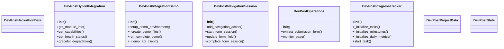

# DevPost Domain Architecture

**Total Classes**: 40

## Section 1

```mermaid
classDiagram
    class ConfigDevpostconfig {
        +__init__()
        +get_info()
    }
    class ConfigModelsDevpostconfig {
        +__init__()
        +get_info()
    }
    class DevPostAuthService {
        +__init__()
        +_load_credentials()
        +_save_credentials()
        +authenticate_with_api_key()
        +authenticate_with_oauth()
    }
    class DevPostBrowserAutomation {
        +__init__()
        +get_module_info()
        +get_capabilities()
        +get_health_status()
        +graceful_degradation()
    }
    class DevPostBrowserDaemon {
        +__init__()
        +signal_handler()
        +start_daemon()
        +connect_to_daemon()
        +navigate_to()
    }
    class DevPostCLI {
        +__init__()
        +get_module_info()
        +get_capabilities()
        +get_health_status()
        +graceful_degradation()
    }
    class DevPostFormInterrogation {
        +__init__()
        +get_module_info()
        +get_capabilities()
        +get_health_status()
        +graceful_degradation()
    }
    class DevPostFormORM {
        +__init__()
        +load_form_data()
        +analyze_forms()
        +determine_page_type()
        +create_field_mapping()
    }
```

## Section 2

## Section 3

```mermaid
classDiagram
    class DevPostStateModel {
        +__init__()
        +identify_page_type()
        +extract_navigation_elements()
        +_extract_step_number()
        +extract_form_fields()
    }
    class DevPostSubmissionModel {
    }
    class DevPostSubmissionPreparer {
        +__init__()
        +print_banner()
        +print_success()
        +print_warning()
        +print_error()
    }
    class DevPostWebScraping {
        +__init__()
        +get_module_info()
        +get_capabilities()
        +get_health_status()
        +graceful_degradation()
    }
    class DevPostWorkflow {
        +__init__()
        +_build_graph()
        +_route_from_browser_connection()
        +_route_from_session_recovery()
        +_route_from_prompt_mode()
    }
    class DevpostAPIClient {
        +__init__()
        +_is_valid_media_file()
        +_validate_media_file()
        +_get_request_headers()
        +_check_rate_limit()
    }
    class DevpostAuthService {
        +__init__()
        +get_module_info()
        +get_capabilities()
        +get_dependencies()
        +check_health()
    }
    class DevpostConfig {
        +__init__()
        +_get_default_config()
        +get_module_info()
        +get_capabilities()
        +get_dependencies()
    }
```

## Section 4

```mermaid
classDiagram
    class DevpostIntegrationComplianceAttack {
        +__init__()
        +log_phase()
        +git_sync()
        +run_tests()
        +get_devpost_metrics()
    }
    class DevpostProject {
        +__init__()
        +get_module_info()
        +get_capabilities()
        +get_dependencies()
        +check_health()
    }
    class DevpostProjectManager {
        +__init__()
        +connect_to_devpost()
        +get_project_config()
        +update_config()
        +get_project_metadata()
    }
    class DevpostconfigInterface {
        +__init__()
        +get_info()
    }
    class DevpostmediadetectorInterface {
        +__init__()
        +get_info()
    }
    class DevpostprojectInterface {
        +__init__()
        +get_info()
    }
    class DevpostprojectmanagerInterface {
        +__init__()
        +get_info()
    }
    class LiveDevPostDebugger {
        +__init__()
        +start_session()
        +connect_to_existing()
        +navigate_to()
        +analyze_current_page()
    }
```

## Section 5

```mermaid
classDiagram
    class MediaDetectorDevpostmediadetector {
        +__init__()
        +get_info()
    }
    class MediaDetectorDevpostmediadetectorDevpostmediadetector {
        +__init__()
        +get_info()
    }
    class ProjectDevpostproject {
        +__init__()
        +get_info()
    }
    class ProjectManagerMethodsDevpostprojectmanager {
        +__init__()
        +get_info()
    }
    class ProjectModelsDevpostproject {
        +__init__()
        +get_info()
    }
    class SimpleDevPostDaemon {
        +__init__()
        +start()
        +navigate()
        +get_navigation_steps()
        +click_next_step()
    }
    class SmartDevPostNavigator {
        +__init__()
        +start_navigation()
        +detect_current_step()
        +detect_navigation_options()
        +classify_step()
    }
    class SmartDevPostNavigatorV2 {
        +__init__()
        +start_navigation()
        +wait_for_page_ready()
        +run_automated_flow()
        +process_current_step()
    }
```

## All Classes in Domain

- `ConfigDevpostconfig`
- `ConfigModelsDevpostconfig`
- `DevPostAuthService`
- `DevPostBrowserAutomation`
- `DevPostBrowserDaemon`
- `DevPostCLI`
- `DevPostFormInterrogation`
- `DevPostFormORM`
- `DevPostHackathonData`
- `DevPostHybridIntegration`
- `DevPostIntegrationDemo`
- `DevPostNavigationSession`
- `DevPostOperations`
- `DevPostProgressTracker`
- `DevPostProjectData`
- `DevPostState`
- `DevPostStateModel`
- `DevPostSubmissionModel`
- `DevPostSubmissionPreparer`
- `DevPostWebScraping`
- `DevPostWorkflow`
- `DevpostAPIClient`
- `DevpostAuthService`
- `DevpostConfig`
- `DevpostIntegrationComplianceAttack`
- `DevpostProject`
- `DevpostProjectManager`
- `DevpostconfigInterface`
- `DevpostmediadetectorInterface`
- `DevpostprojectInterface`
- `DevpostprojectmanagerInterface`
- `LiveDevPostDebugger`
- `MediaDetectorDevpostmediadetector`
- `MediaDetectorDevpostmediadetectorDevpostmediadetector`
- `ProjectDevpostproject`
- `ProjectManagerMethodsDevpostprojectmanager`
- `ProjectModelsDevpostproject`
- `SimpleDevPostDaemon`
- `SmartDevPostNavigator`
- `SmartDevPostNavigatorV2`
