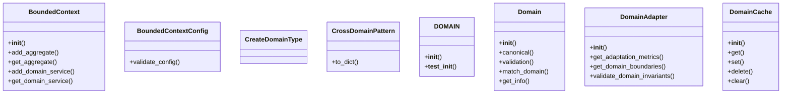
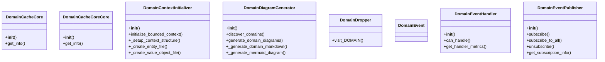
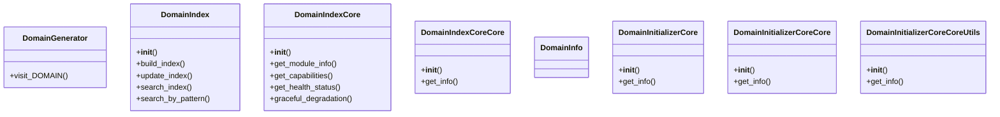
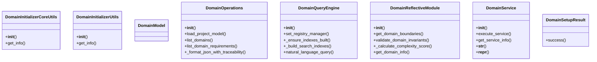
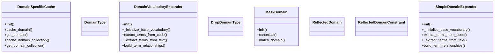
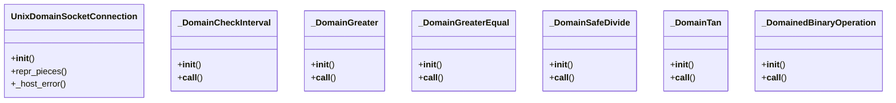

# Domain Domain Architecture

**Total Classes**: 47

## Section 1

## Section 2

## Section 3

## Section 4

## Section 5

## Section 6

## All Classes in Domain

- `BoundedContext`
- `BoundedContextConfig`
- `CreateDomainType`
- `CrossDomainPattern`
- `DOMAIN`
- `Domain`
- `DomainAdapter`
- `DomainCache`
- `DomainCacheCore`
- `DomainCacheCoreCore`
- `DomainContextInitializer`
- `DomainDiagramGenerator`
- `DomainDropper`
- `DomainEvent`
- `DomainEventHandler`
- `DomainEventPublisher`
- `DomainGenerator`
- `DomainIndex`
- `DomainIndexCore`
- `DomainIndexCoreCore`
- `DomainInfo`
- `DomainInitializerCore`
- `DomainInitializerCoreCore`
- `DomainInitializerCoreCoreUtils`
- `DomainInitializerCoreUtils`
- `DomainInitializerUtils`
- `DomainModel`
- `DomainOperations`
- `DomainQueryEngine`
- `DomainReflectiveModule`
- `DomainService`
- `DomainSetupResult`
- `DomainSpecificCache`
- `DomainType`
- `DomainVocabularyExpander`
- `DropDomainType`
- `MaskDomain`
- `ReflectedDomain`
- `ReflectedDomainConstraint`
- `SimpleDomainExpander`
- `UnixDomainSocketConnection`
- `_DomainCheckInterval`
- `_DomainGreater`
- `_DomainGreaterEqual`
- `_DomainSafeDivide`
- `_DomainTan`
- `_DomainedBinaryOperation`
