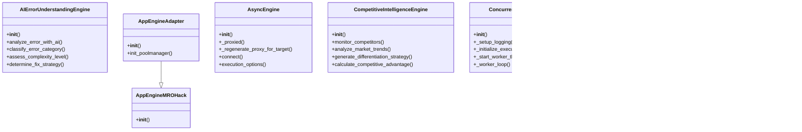
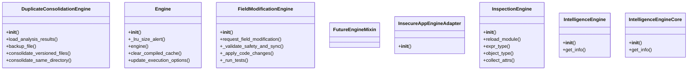
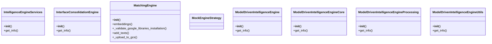
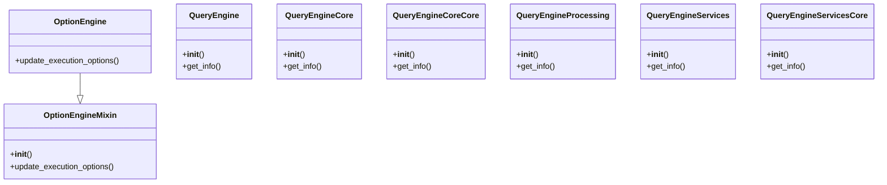
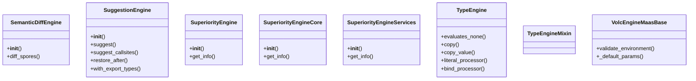
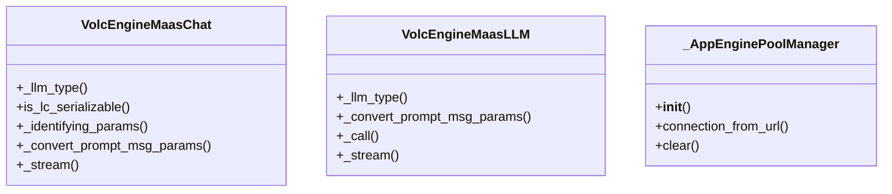

# Engine Domain Architecture

**Total Classes**: 59

## Section 1

## Section 2

```mermaid
classDiagram
    class DataEnrichmentEngine {
        +__init__()
        +load_session_data()
        +load_telemetry_data()
        +analyze_navigation_patterns()
        +analyze_form_completion_patterns()
    }
    class DebuggingEngine {
        +__init__()
        +get_info()
    }
    class DebuggingEngineMethods {
        +__init__()
        +get_info()
    }
    class DebuggingEngineMethodsDebuggingengine {
        +__init__()
        +get_info()
    }
    class DebuggingEngineMethodsDebuginfo {
        +__init__()
        +get_info()
    }
    class DebuggingEngineMethodsDebuglevel {
        +__init__()
        +get_info()
    }
    class DebuggingEngineMethodsDiagnosticresult {
        +__init__()
        +get_info()
    }
    class DecisionEngine {
        +__init__()
        +was_selected()
        +was_ignored()
        +make_decision()
        +decision_for()
    }
```

## Section 3

## Section 4

## Section 5

## Section 6

```mermaid
classDiagram
    class QueryEngineServicesCoreCore {
        +__init__()
        +get_info()
    }
    class QueryEngineServicesProcessing {
        +__init__()
        +get_info()
    }
    class QueryEngineServicesServices {
        +__init__()
        +get_info()
    }
    class QueryEngineServicesServicesCore {
        +__init__()
        +get_info()
    }
    class QueryEngineServicesServicesProcessing {
        +__init__()
        +get_info()
    }
    class RecoveryEngine {
        +__init__()
        +get_supported_delusion_types()
        +can_handle_delusion()
    }
    class RepositoryRefactoringEngine {
        +__init__()
        +_load_domain_patterns()
        +analyze_repository()
        +_analyze_file()
        +_classify_domain()
    }
    class ResourceAllocationEngine {
        +optimize_allocation()
        +allocate_for_response()
    }
```

## Section 7

## Section 8

## All Classes in Domain

- `AIErrorUnderstandingEngine`
- `AppEngineAdapter`
- `AppEngineMROHack`
- `AsyncEngine`
- `CompetitiveIntelligenceEngine`
- `ConcurrentProcessingEngine`
- `ConsensusEngine`
- `CreateEnginePlugin`
- `DataEnrichmentEngine`
- `DebuggingEngine`
- `DebuggingEngineMethods`
- `DebuggingEngineMethodsDebuggingengine`
- `DebuggingEngineMethodsDebuginfo`
- `DebuggingEngineMethodsDebuglevel`
- `DebuggingEngineMethodsDiagnosticresult`
- `DecisionEngine`
- `DuplicateConsolidationEngine`
- `Engine`
- `FieldModificationEngine`
- `FutureEngineMixin`
- `InsecureAppEngineAdapter`
- `InspectionEngine`
- `IntelligenceEngine`
- `IntelligenceEngineCore`
- `IntelligenceEngineServices`
- `InterfaceConsolidationEngine`
- `MatchingEngine`
- `MockEngineStrategy`
- `ModelDrivenIntelligenceEngine`
- `ModelDrivenIntelligenceEngineCore`
- `ModelDrivenIntelligenceEngineProcessing`
- `ModelDrivenIntelligenceEngineUtils`
- `OptionEngine`
- `OptionEngineMixin`
- `QueryEngine`
- `QueryEngineCore`
- `QueryEngineCoreCore`
- `QueryEngineProcessing`
- `QueryEngineServices`
- `QueryEngineServicesCore`
- `QueryEngineServicesCoreCore`
- `QueryEngineServicesProcessing`
- `QueryEngineServicesServices`
- `QueryEngineServicesServicesCore`
- `QueryEngineServicesServicesProcessing`
- `RecoveryEngine`
- `RepositoryRefactoringEngine`
- `ResourceAllocationEngine`
- `SemanticDiffEngine`
- `SuggestionEngine`
- `SuperiorityEngine`
- `SuperiorityEngineCore`
- `SuperiorityEngineServices`
- `TypeEngine`
- `TypeEngineMixin`
- `VolcEngineMaasBase`
- `VolcEngineMaasChat`
- `VolcEngineMaasLLM`
- `_AppEnginePoolManager`
