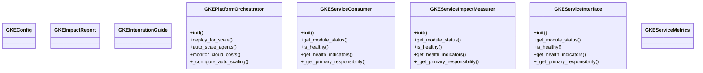
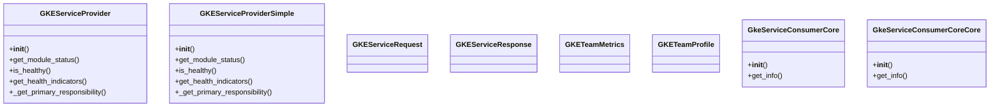
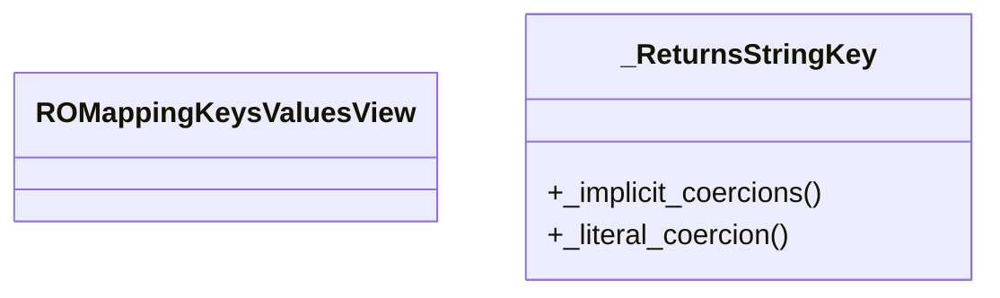

# GKE Domain Architecture

**Total Classes**: 50

## Section 1

## Section 2

## Section 3

## Section 4

```mermaid
classDiagram
    class GkeServiceConsumerServicesValidation {
        +__init__()
        +get_info()
    }
    class GkeServiceConsumerUtils {
        +__init__()
        +get_info()
    }
    class GkeServiceConsumerValidation {
        +__init__()
        +get_info()
    }
    class GkeServiceImpactMeasurer {
        +__init__()
        +get_info()
    }
    class GkeServiceInterface {
        +__init__()
        +get_info()
    }
    class GkeServiceInterfaceProcessing {
        +__init__()
        +get_info()
    }
    class GkeServiceInterfaceUtils {
        +__init__()
        +get_info()
    }
    class GkeServiceInterfaceValidation {
        +__init__()
        +get_info()
    }
```

## Section 5

```mermaid
classDiagram
    class GkeServiceProviderCore {
        +__init__()
        +get_info()
    }
    class GkeServiceProviderCoreCore {
        +__init__()
        +get_info()
    }
    class GkeServiceProviderServices {
        +__init__()
        +get_info()
    }
    class GkeServiceProviderServicesCore {
        +__init__()
        +get_info()
    }
    class GkeServiceProviderServicesCoreCore {
        +__init__()
        +get_info()
    }
    class GkeServiceProviderServicesServices {
        +__init__()
        +get_info()
    }
    class GkeServiceProviderServicesServicesCore {
        +__init__()
        +get_info()
    }
    class GkeServiceProviderServicesServicesUtils {
        +__init__()
        +get_info()
    }
```

## Section 6

```mermaid
classDiagram
    class GkeServiceProviderServicesServicesValidation {
        +__init__()
        +get_info()
    }
    class GkeServiceProviderServicesUtils {
        +__init__()
        +get_info()
    }
    class GkeServiceProviderServicesValidation {
        +__init__()
        +get_info()
    }
    class GkeServiceProviderSimple {
        +__init__()
        +get_info()
    }
    class GkeServiceProviderSimpleUtils {
        +__init__()
        +get_info()
    }
    class GkeServiceProviderUtils {
        +__init__()
        +get_info()
    }
    class GkeServiceProviderValidation {
        +__init__()
        +get_info()
    }
    class HasGettableStringKeys {
        +keys()
        +__getitem__()
    }
```

## Section 7

## All Classes in Domain

- `GKEConfig`
- `GKEImpactReport`
- `GKEIntegrationGuide`
- `GKEPlatformOrchestrator`
- `GKEServiceConsumer`
- `GKEServiceImpactMeasurer`
- `GKEServiceInterface`
- `GKEServiceMetrics`
- `GKEServiceProvider`
- `GKEServiceProviderSimple`
- `GKEServiceRequest`
- `GKEServiceResponse`
- `GKETeamMetrics`
- `GKETeamProfile`
- `GkeServiceConsumerCore`
- `GkeServiceConsumerCoreCore`
- `GkeServiceConsumerServices`
- `GkeServiceConsumerServicesCore`
- `GkeServiceConsumerServicesCoreCore`
- `GkeServiceConsumerServicesServices`
- `GkeServiceConsumerServicesServicesCore`
- `GkeServiceConsumerServicesServicesUtils`
- `GkeServiceConsumerServicesServicesValidation`
- `GkeServiceConsumerServicesUtils`
- `GkeServiceConsumerServicesValidation`
- `GkeServiceConsumerUtils`
- `GkeServiceConsumerValidation`
- `GkeServiceImpactMeasurer`
- `GkeServiceInterface`
- `GkeServiceInterfaceProcessing`
- `GkeServiceInterfaceUtils`
- `GkeServiceInterfaceValidation`
- `GkeServiceProviderCore`
- `GkeServiceProviderCoreCore`
- `GkeServiceProviderServices`
- `GkeServiceProviderServicesCore`
- `GkeServiceProviderServicesCoreCore`
- `GkeServiceProviderServicesServices`
- `GkeServiceProviderServicesServicesCore`
- `GkeServiceProviderServicesServicesUtils`
- `GkeServiceProviderServicesServicesValidation`
- `GkeServiceProviderServicesUtils`
- `GkeServiceProviderServicesValidation`
- `GkeServiceProviderSimple`
- `GkeServiceProviderSimpleUtils`
- `GkeServiceProviderUtils`
- `GkeServiceProviderValidation`
- `HasGettableStringKeys`
- `ROMappingKeysValuesView`
- `_ReturnsStringKey`
