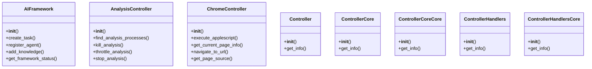
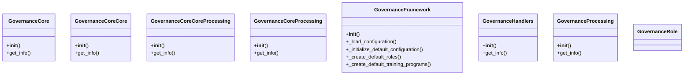
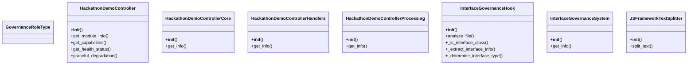
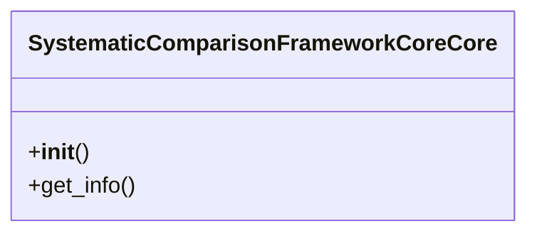

# Governance Domain Architecture

**Total Classes**: 41

## Section 1

## Section 2

```mermaid
classDiagram
    class ControllerHandlersCoreCore {
        +__init__()
        +get_info()
    }
    class ControllerHandlersHandlers {
        +__init__()
        +get_info()
    }
    class ControllerHandlersHandlersCore {
        +__init__()
        +get_info()
    }
    class DefaultSharedKernelGovernance {
        +can_modify_element()
        +requires_approval()
        +get_required_approvers()
    }
    class FormController {
        +__init__()
        +extract_form_data()
        +fill_form()
        +_fill_field()
        +_get_field_value()
    }
    class Framework {
    }
    class GovernanceBypassDetector {
        +__init__()
        +detect_bypass_attempts()
        +check_escalation_needed()
        +create_governance_intervention()
        +_detect_emergency_abuse()
    }
    class GovernanceController {
        +__init__()
        +validate_new_spec()
        +check_overlap_conflicts()
        +get_module_status()
    }
```

## Section 3

## Section 4

## Section 5

```mermaid
classDiagram
    class NavigationController {
        +__init__()
        +setup_page_events()
        +_on_page_load()
        +_on_dom_loaded()
        +_on_network_idle()
    }
    class OrchestrationController {
        +__init__()
        +launch_swarm()
        +distribute_tasks()
        +monitor_swarm()
        +handle_failure()
    }
    class PreventionFrameworkManager {
        +__init__()
        +_initialize_components()
        +validate_component()
        +validate_all_components()
        +install_pre_commit_hooks()
    }
    class RobotFrameworkLexer {
        +__init__()
        +get_tokens_unprocessed()
    }
    class SharedKernelGovernance {
        +can_modify_element()
        +requires_approval()
        +get_required_approvers()
    }
    class SimplifiedDemoController {
        +__init__()
        +create_demo_session()
        +create_spec_transformation()
        +create_agent_collaboration()
        +create_infrastructure_deployment()
    }
    class SystematicComparisonFramework {
        +__init__()
        +get_module_status()
        +is_healthy()
        +get_health_indicators()
        +_get_primary_responsibility()
    }
    class SystematicComparisonFrameworkCore {
        +__init__()
        +get_info()
    }
```

## Section 6

## All Classes in Domain

- `AIFramework`
- `AnalysisController`
- `ChromeController`
- `Controller`
- `ControllerCore`
- `ControllerCoreCore`
- `ControllerHandlers`
- `ControllerHandlersCore`
- `ControllerHandlersCoreCore`
- `ControllerHandlersHandlers`
- `ControllerHandlersHandlersCore`
- `DefaultSharedKernelGovernance`
- `FormController`
- `Framework`
- `GovernanceBypassDetector`
- `GovernanceController`
- `GovernanceCore`
- `GovernanceCoreCore`
- `GovernanceCoreCoreProcessing`
- `GovernanceCoreProcessing`
- `GovernanceFramework`
- `GovernanceHandlers`
- `GovernanceProcessing`
- `GovernanceRole`
- `GovernanceRoleType`
- `HackathonDemoController`
- `HackathonDemoControllerCore`
- `HackathonDemoControllerHandlers`
- `HackathonDemoControllerProcessing`
- `InterfaceGovernanceHook`
- `InterfaceGovernanceSystem`
- `JSFrameworkTextSplitter`
- `NavigationController`
- `OrchestrationController`
- `PreventionFrameworkManager`
- `RobotFrameworkLexer`
- `SharedKernelGovernance`
- `SimplifiedDemoController`
- `SystematicComparisonFramework`
- `SystematicComparisonFrameworkCore`
- `SystematicComparisonFrameworkCoreCore`
