# ImportDependency Domain Architecture

**Total Classes**: 128

## Section 1

```mermaid
classDiagram
    class AbstractEntityRegistry {
        +__init__()
        +_truncate_recursive()
        +root_entity()
        +entity_path()
        +mapper()
    }
    class AgentRegistry {
        +__init__()
        +start_background_cleanup()
        +stop_background_cleanup()
        +register_agent_discovery()
        +register_agent_response()
    }
    class AgentRegistryCore {
        +__init__()
        +get_info()
    }
    class AgentRegistryCoreCore {
        +__init__()
        +get_info()
    }
    class BacklogDependencyManager {
        +__init__()
        +get_module_status()
        +is_healthy()
        +get_health_indicators()
        +_get_primary_responsibility()
    }
    class BeastModeRegistry {
        +__init__()
        +_init_database()
        +register_module()
        +discover_modules()
        +get_module()
    }
    class BeastModeRegistryIntegration {
        +__init__()
        +analyze_module_registry_compliance()
        +integrate_with_registry()
        +_enhance_registry_integration()
        +fix_single_module()
    }
    class CLIRegistry {
        +__new__()
        +get_instance()
        +register_cli()
        +get_cli()
        +get_all_clis()
    }
```

## Section 2

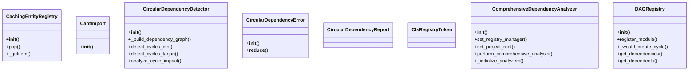

## Section 3

```mermaid
classDiagram
    class DependencyAnalyzer {
        +__init__()
        +validate_ecosystem_integrity()
        +_create_specification_nodes()
        +_create_ecosystem_dag()
    }
    class DependencyAnalyzerCore {
        +__init__()
        +get_info()
    }
    class DependencyAnalyzerCoreCore {
        +__init__()
        +get_info()
    }
    class DependencyAnalyzerValidation {
        +__init__()
        +get_info()
    }
    class DependencyChecker {
        +validate_core_dependencies()
        +validate_optional_dependencies()
        +generate_installation_commands()
        +print_validation_report()
    }
    class DependencyConflict {
    }
    class DependencyFinderVisitor {
        +__init__()
        +visit_Filter()
        +visit_Test()
        +visit_Block()
    }
    class DependencyGraph {
        +get_dependencies()
        +get_dependents()
    }
```

## Section 4

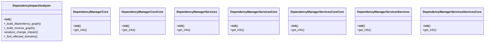

## Section 5

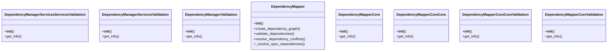

## Section 6

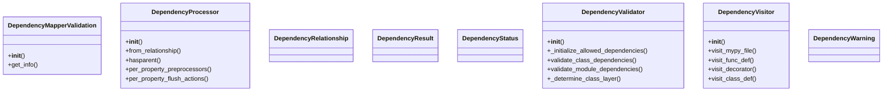

## Section 7

```mermaid
classDiagram
    class DomainRegistryManager {
        +__init__()
        +load_registry()
        +_parse_domains()
        +_create_domain_from_registry()
        +get_domain()
    }
    class EnhancedInterfaceRegistry {
        +__init__()
        +get_info()
    }
    class ExtendedInstrumentationRegistry {
        +_locate_extended_factory()
        +_check_conflicts()
        +_extended_class_manager()
        +_collect_management_factories_for()
        +unregister()
    }
    class FileSystemRegistryChecker {
        +__init__()
        +check_availability()
        +_can_read_files()
        +_can_write_files()
        +_can_create_directories()
    }
    class FromImport {
    }
    class FutureImportation {
        +__init__()
    }
    class GitRegistryChecker {
        +__init__()
        +check_availability()
        +_can_access_git_repo()
        +_can_sync_to_remote()
        +_can_create_commits()
    }
    class GlobalRegistry {
        +__init__()
        +register_module()
        +unregister_module()
        +get_module()
        +get_all_modules()
    }
```

## Section 8

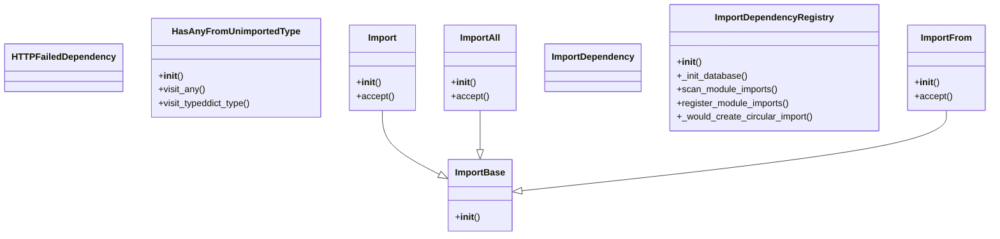

## Section 9

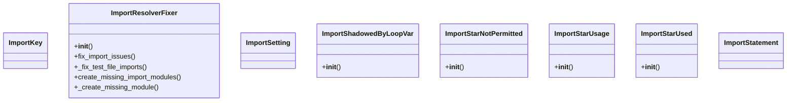

## Section 10

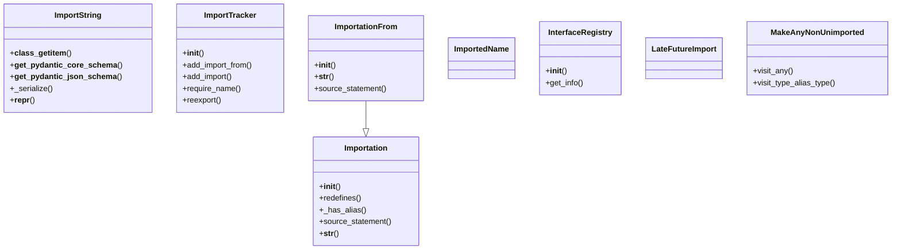

## Section 11

```mermaid
classDiagram
    class MarkImportsMypyOnlyVisitor {
        +visit_import()
        +visit_import_from()
        +visit_import_all()
        +visit_func_def()
    }
    class MarkImportsUnreachableVisitor {
        +visit_import()
        +visit_import_from()
        +visit_import_all()
    }
    class MemoryRegistryChecker {
        +__init__()
        +check_availability()
        +_can_write_to_memory()
        +_can_read_from_memory()
        +_can_persist_memory()
    }
    class MessageTypeRegistry {
        +__init__()
        +_build_type_info()
        +get_type_info()
        +validate_payload()
        +get_all_types()
    }
    class MockModelRegistry {
        +list_available_domains()
        +get_domain_intelligence()
        +get_learning_insights()
    }
    class ModelRegistry {
        +__init__()
        +get_info()
    }
    class ModelRegistryOperations {
        +__init__()
        +register_model()
        +unregister_model()
        +list_models()
        +get_model_info()
    }
    class ModelRegistryUtils {
        +__init__()
        +get_info()
    }
```

## Section 12

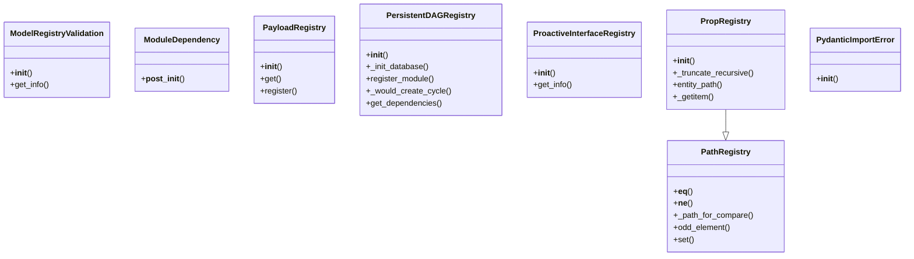

## Section 13

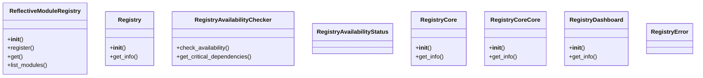

## Section 14

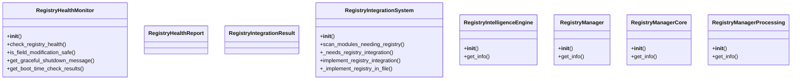

## Section 15

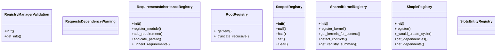

## Section 16

```mermaid
classDiagram
    class StarImportation {
        +__init__()
        +source_statement()
        +__str__()
    }
    class SubmoduleImportation {
        +__init__()
        +redefines()
        +__str__()
        +source_statement()
    }
    class TemplateRegistry {
        +__init__()
        +register_template()
        +get_template()
        +_get_parent_content()
        +_merge_template_content()
    }
    class ThreadLocalRegistry {
        +__init__()
        +__call__()
        +has()
        +set()
        +clear()
    }
    class TokenRegistry {
        +__init__()
        +generate_for_superclasses()
        +_generate_natural_for_superclasses()
        +_getitem()
    }
    class UnusedImport {
        +__init__()
    }
    class _ModuleRegistry {
        +__init__()
        +preload_module()
        +import_prefix()
    }
    class registry {
        +__init__()
        +update_type_annotation_map()
        +_resolve_type()
        +mappers()
        +_set_depends_on()
    }
```

## All Classes in Domain

- `AbstractEntityRegistry`
- `AgentRegistry`
- `AgentRegistryCore`
- `AgentRegistryCoreCore`
- `BacklogDependencyManager`
- `BeastModeRegistry`
- `BeastModeRegistryIntegration`
- `CLIRegistry`
- `CachingEntityRegistry`
- `CantImport`
- `CircularDependencyDetector`
- `CircularDependencyError`
- `CircularDependencyReport`
- `ClsRegistryToken`
- `ComprehensiveDependencyAnalyzer`
- `DAGRegistry`
- `DependencyAnalyzer`
- `DependencyAnalyzerCore`
- `DependencyAnalyzerCoreCore`
- `DependencyAnalyzerValidation`
- `DependencyChecker`
- `DependencyConflict`
- `DependencyFinderVisitor`
- `DependencyGraph`
- `DependencyImpactAnalyzer`
- `DependencyManagerCore`
- `DependencyManagerCoreCore`
- `DependencyManagerServices`
- `DependencyManagerServicesCore`
- `DependencyManagerServicesCoreCore`
- `DependencyManagerServicesServices`
- `DependencyManagerServicesServicesCore`
- `DependencyManagerServicesServicesValidation`
- `DependencyManagerServicesValidation`
- `DependencyManagerValidation`
- `DependencyMapper`
- `DependencyMapperCore`
- `DependencyMapperCoreCore`
- `DependencyMapperCoreCoreValidation`
- `DependencyMapperCoreValidation`
- `DependencyMapperValidation`
- `DependencyProcessor`
- `DependencyRelationship`
- `DependencyResult`
- `DependencyStatus`
- `DependencyValidator`
- `DependencyVisitor`
- `DependencyWarning`
- `DomainRegistryManager`
- `EnhancedInterfaceRegistry`
- `ExtendedInstrumentationRegistry`
- `FileSystemRegistryChecker`
- `FromImport`
- `FutureImportation`
- `GitRegistryChecker`
- `GlobalRegistry`
- `HTTPFailedDependency`
- `HasAnyFromUnimportedType`
- `Import`
- `ImportAll`
- `ImportBase`
- `ImportDependency`
- `ImportDependencyRegistry`
- `ImportFrom`
- `ImportKey`
- `ImportResolverFixer`
- `ImportSetting`
- `ImportShadowedByLoopVar`
- `ImportStarNotPermitted`
- `ImportStarUsage`
- `ImportStarUsed`
- `ImportStatement`
- `ImportString`
- `ImportTracker`
- `Importation`
- `ImportationFrom`
- `ImportedName`
- `InterfaceRegistry`
- `LateFutureImport`
- `MakeAnyNonUnimported`
- `MarkImportsMypyOnlyVisitor`
- `MarkImportsUnreachableVisitor`
- `MemoryRegistryChecker`
- `MessageTypeRegistry`
- `MockModelRegistry`
- `ModelRegistry`
- `ModelRegistryOperations`
- `ModelRegistryUtils`
- `ModelRegistryValidation`
- `ModuleDependency`
- `PathRegistry`
- `PayloadRegistry`
- `PersistentDAGRegistry`
- `ProactiveInterfaceRegistry`
- `PropRegistry`
- `PydanticImportError`
- `ReflectiveModuleRegistry`
- `Registry`
- `RegistryAvailabilityChecker`
- `RegistryAvailabilityStatus`
- `RegistryCore`
- `RegistryCoreCore`
- `RegistryDashboard`
- `RegistryError`
- `RegistryHealthMonitor`
- `RegistryHealthReport`
- `RegistryIntegrationResult`
- `RegistryIntegrationSystem`
- `RegistryIntelligenceEngine`
- `RegistryManager`
- `RegistryManagerCore`
- `RegistryManagerProcessing`
- `RegistryManagerValidation`
- `RequestsDependencyWarning`
- `RequirementsInheritanceRegistry`
- `RootRegistry`
- `ScopedRegistry`
- `SharedKernelRegistry`
- `SimpleRegistry`
- `SlotsEntityRegistry`
- `StarImportation`
- `SubmoduleImportation`
- `TemplateRegistry`
- `ThreadLocalRegistry`
- `TokenRegistry`
- `UnusedImport`
- `_ModuleRegistry`
- `registry`
