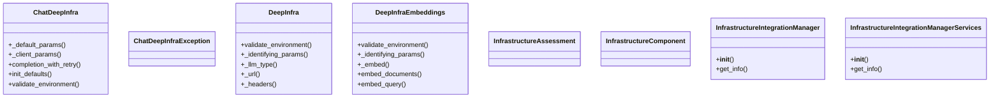
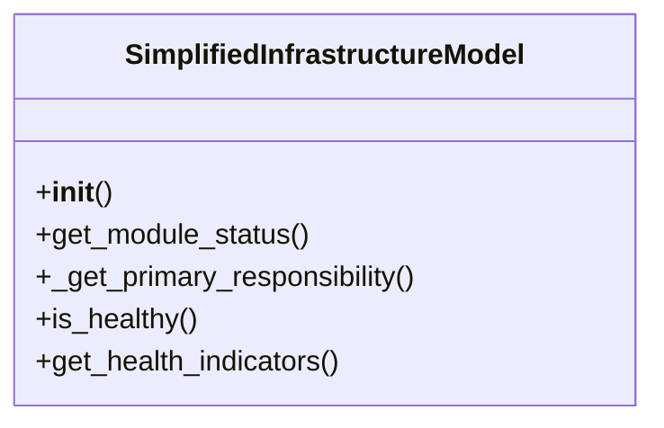

# Infrastructure Domain Architecture

**Total Classes**: 17

## Section 1

## Section 2

```mermaid
classDiagram
    class InfrastructureIntegrationManagerServicesCore {
        +__init__()
        +get_info()
    }
    class InfrastructureIntegrationManagerServicesServices {
        +__init__()
        +get_info()
    }
    class InfrastructureIntegrationManagerServicesServicesCore {
        +__init__()
        +get_info()
    }
    class InfrastructureIssue {
    }
    class InfrastructureService {
        +__init__()
        +record_external_call()
        +get_service_capabilities()
    }
    class ProductionInfrastructureModel {
        +__init__()
        +get_info()
    }
    class ProductionInfrastructureModelCore {
        +__init__()
        +get_info()
    }
    class ProductionInfrastructureModelModels {
        +__init__()
        +get_info()
    }
```

## Section 3

## All Classes in Domain

- `ChatDeepInfra`
- `ChatDeepInfraException`
- `DeepInfra`
- `DeepInfraEmbeddings`
- `InfrastructureAssessment`
- `InfrastructureComponent`
- `InfrastructureIntegrationManager`
- `InfrastructureIntegrationManagerServices`
- `InfrastructureIntegrationManagerServicesCore`
- `InfrastructureIntegrationManagerServicesServices`
- `InfrastructureIntegrationManagerServicesServicesCore`
- `InfrastructureIssue`
- `InfrastructureService`
- `ProductionInfrastructureModel`
- `ProductionInfrastructureModelCore`
- `ProductionInfrastructureModelModels`
- `SimplifiedInfrastructureModel`
