# Manager Domain Architecture

**Total Classes**: 132

## Section 1

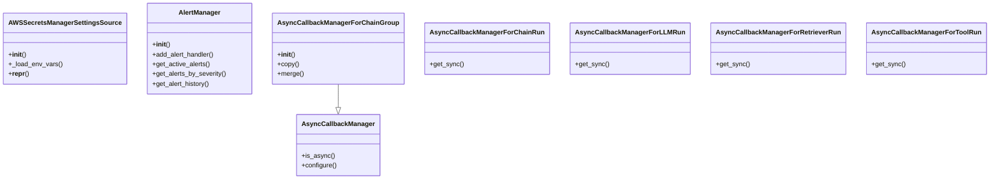

## Section 2

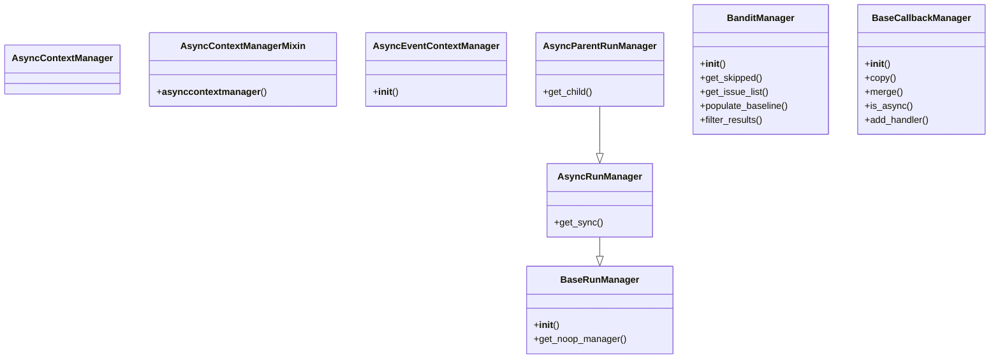

## Section 3

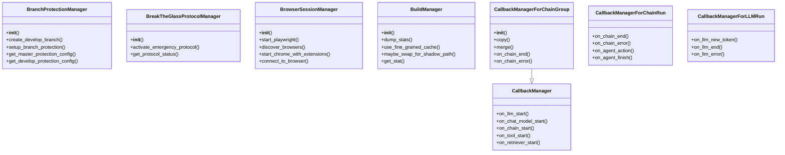

## Section 4

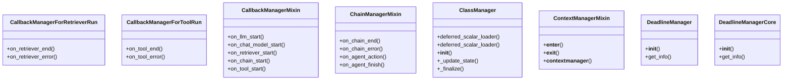

## Section 5

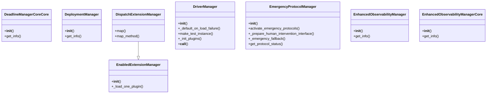

## Section 6

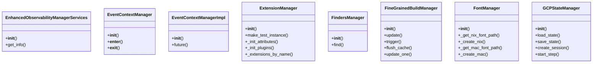

## Section 7

```mermaid
classDiagram
    class GitBranchManager {
        +__init__()
        +get_info()
    }
    class GitWorkflowManager {
        +__init__()
        +load_snapshots()
        +save_snapshots()
        +run_git()
        +create_snapshot()
    }
    class GoogleSecretManagerMapping {
        +__init__()
        +_gcp_project_path()
        +_secret_names()
        +_secret_version_path()
        +__getitem__()
    }
    class GoogleSecretManagerSettingsSource {
        +__init__()
        +_load_env_vars()
        +__repr__()
    }
    class GracefulDegradationManager {
        +__init__()
        +get_info()
    }
    class HackathonDeadlineManager {
        +__init__()
        +add_task()
        +update_task_status()
        +calculate_critical_path()
        +get_deadline_status()
    }
    class HookManager {
        +__init__()
        +_init_attributes()
        +__getitem__()
    }
    class InMemoryRecordManager {
        +__init__()
        +create_schema()
        +get_time()
        +update()
        +exists()
    }
```

## Section 8

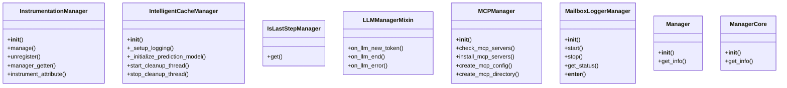

## Section 9

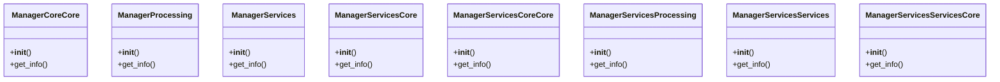

## Section 10

```mermaid
classDiagram
    class ManagerServicesServicesProcessing {
        +__init__()
        +get_info()
    }
    class MongoDocumentManager {
        +__init__()
        +create_schema()
        +update()
        +get_time()
        +exists()
    }
    class NameDispatchExtensionManager {
        +__init__()
        +_init_plugins()
        +map()
        +map_method()
    }
    class NamedExtensionManager {
        +__init__()
        +make_test_instance()
        +_init_attributes()
        +_init_plugins()
        +_load_one_plugin()
    }
    class NodesManager {
        +__init__()
        +get_node()
        +set_nodes()
        +update_moved_exception()
        +_update_moved_slots()
    }
    class OnePasswordAPIKeyManager {
        +__init__()
        +_is_api_key_item()
        +_extract_aws_account_id()
        +_organize_credentials()
        +_discover_all_apis()
    }
    class OperationalDashboardManager {
        +__init__()
        +get_info()
    }
    class OperationalDashboardManagerModels {
        +__init__()
        +get_info()
    }
```

## Section 11

```mermaid
classDiagram
    class OperationalDashboardManagerServices {
        +__init__()
        +get_info()
    }
    class OperatorSafetyManager {
        +__init__()
        +initialize_safety_systems()
        +shutdown_safety_systems()
        +get_safety_status()
        +is_operation_safe()
    }
    class OptionManager {
        +__init__()
        +register_plugins()
        +add_option()
        +extend_default_ignore()
        +extend_default_select()
    }
    class ParentRunManager {
        +get_child()
    }
    class PhaseManagerModule {
        +determine_phase_priority()
        +calculate_phase_weights()
    }
    class PlanningMemoryManager {
        +__init__()
        +start_planning_session()
        +add_planning_dimension()
        +add_planning_insight()
        +update_planning_depth()
    }
    class PlaywrightContextManager {
        +__init__()
        +__enter__()
        +start()
        +__exit__()
    }
    class PoolManager {
        +__init__()
        +__enter__()
        +__exit__()
        +_new_pool()
        +clear()
    }
```

## Section 12

```mermaid
classDiagram
    class PrometheusConfigManager {
        +__init__()
        +_load_config()
        +_get_bool_env()
        +_validate_config()
        +get_config()
    }
    class PromptModeManager {
        +__init__()
        +start_prompt_conversation()
        +handle_user_response()
        +_handle_ghostbusters_request()
        +_handle_proceed_request()
    }
    class ProxyManager {
        +__init__()
        +connection_from_host()
        +_set_proxy_headers()
        +urlopen()
    }
    class PubSubManager {
        +__init__()
        +register_handler()
        +get_health_status()
    }
    class RMDDDIntegrationManager {
        +__init__()
        +_setup_logging()
        +_initialize_default_services()
        +check_service_health()
        +_make_health_check_request()
    }
    class RecordManager {
        +__init__()
        +create_schema()
        +get_time()
        +update()
        +exists()
    }
    class RecoveryManager {
        +__init__()
        +add_recovery_callback()
        +get_recovery_history()
        +get_active_recoveries()
        +get_recovery_summary()
    }
    class RemainingStepsManager {
        +get()
    }
```

## Section 13

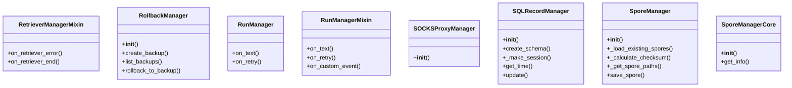

## Section 14

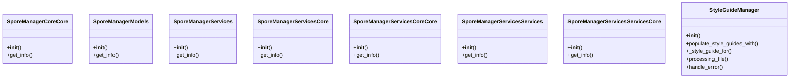

## Section 15

```mermaid
classDiagram
    class SyncContextManager {
        +__enter__()
        +__exit__()
        +close()
    }
    class SyncManager {
        +__init__()
        +get_info()
    }
    class SyncManagerQueuedsyncoperation {
        +__init__()
        +get_info()
    }
    class SyncManagerQueuedsyncoperationQueuedsyncoperation {
        +__init__()
        +get_info()
    }
    class TestExtensionManager {
        +__init__()
        +_load_plugins()
    }
    class TieredMemoryManager {
        +__init__()
        +add_short_term_memory()
        +get_short_term_memory()
        +queue_for_qualification()
        +qualify_memory()
    }
    class TokenManager {
        +__init__()
        +__del__()
        +start()
        +stop()
        +acquire_token()
    }
    class TokenManagerConfig {
        +__init__()
        +get_expiration_refresh_ratio()
        +get_lower_refresh_bound_millis()
        +get_token_request_execution_timeout_in_ms()
        +get_retry_policy()
    }
```

## Section 16

```mermaid
classDiagram
    class ToolManagerMixin {
        +on_tool_end()
        +on_tool_error()
    }
    class UserContextManager {
        +__init__()
        +__enter__()
        +__exit__()
    }
    class _AsyncExperimentManager {
        +__init__()
        +_reset_example_attachments()
        +_get_example_with_readers()
        +_copy()
    }
    class _AsyncSessionContextManager {
        +__init__()
    }
    class _BaseRequestContextManager {
        +__init__()
        +send()
        +throw()
        +close()
        +__await__()
    }
    class _BlockingAsyncContextManager {
        +__init__()
        +__enter__()
        +__exit__()
    }
    class _DNSResolverManager {
        +__new__()
        +_init()
        +get_resolver()
        +release_resolver()
    }
    class _ExperimentManager {
        +__init__()
        +_reset_example_attachment_readers()
        +examples()
        +dataset_id()
        +evaluation_results()
    }
```

## Section 17

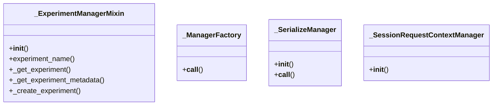

## All Classes in Domain

- `AWSSecretsManagerSettingsSource`
- `AlertManager`
- `AsyncCallbackManager`
- `AsyncCallbackManagerForChainGroup`
- `AsyncCallbackManagerForChainRun`
- `AsyncCallbackManagerForLLMRun`
- `AsyncCallbackManagerForRetrieverRun`
- `AsyncCallbackManagerForToolRun`
- `AsyncContextManager`
- `AsyncContextManagerMixin`
- `AsyncEventContextManager`
- `AsyncParentRunManager`
- `AsyncRunManager`
- `BanditManager`
- `BaseCallbackManager`
- `BaseRunManager`
- `BranchProtectionManager`
- `BreakTheGlassProtocolManager`
- `BrowserSessionManager`
- `BuildManager`
- `CallbackManager`
- `CallbackManagerForChainGroup`
- `CallbackManagerForChainRun`
- `CallbackManagerForLLMRun`
- `CallbackManagerForRetrieverRun`
- `CallbackManagerForToolRun`
- `CallbackManagerMixin`
- `ChainManagerMixin`
- `ClassManager`
- `ContextManagerMixin`
- `DeadlineManager`
- `DeadlineManagerCore`
- `DeadlineManagerCoreCore`
- `DeploymentManager`
- `DispatchExtensionManager`
- `DriverManager`
- `EmergencyProtocolManager`
- `EnabledExtensionManager`
- `EnhancedObservabilityManager`
- `EnhancedObservabilityManagerCore`
- `EnhancedObservabilityManagerServices`
- `EventContextManager`
- `EventContextManagerImpl`
- `ExtensionManager`
- `FindersManager`
- `FineGrainedBuildManager`
- `FontManager`
- `GCPStateManager`
- `GitBranchManager`
- `GitWorkflowManager`
- `GoogleSecretManagerMapping`
- `GoogleSecretManagerSettingsSource`
- `GracefulDegradationManager`
- `HackathonDeadlineManager`
- `HookManager`
- `InMemoryRecordManager`
- `InstrumentationManager`
- `IntelligentCacheManager`
- `IsLastStepManager`
- `LLMManagerMixin`
- `MCPManager`
- `MailboxLoggerManager`
- `Manager`
- `ManagerCore`
- `ManagerCoreCore`
- `ManagerProcessing`
- `ManagerServices`
- `ManagerServicesCore`
- `ManagerServicesCoreCore`
- `ManagerServicesProcessing`
- `ManagerServicesServices`
- `ManagerServicesServicesCore`
- `ManagerServicesServicesProcessing`
- `MongoDocumentManager`
- `NameDispatchExtensionManager`
- `NamedExtensionManager`
- `NodesManager`
- `OnePasswordAPIKeyManager`
- `OperationalDashboardManager`
- `OperationalDashboardManagerModels`
- `OperationalDashboardManagerServices`
- `OperatorSafetyManager`
- `OptionManager`
- `ParentRunManager`
- `PhaseManagerModule`
- `PlanningMemoryManager`
- `PlaywrightContextManager`
- `PoolManager`
- `PrometheusConfigManager`
- `PromptModeManager`
- `ProxyManager`
- `PubSubManager`
- `RMDDDIntegrationManager`
- `RecordManager`
- `RecoveryManager`
- `RemainingStepsManager`
- `RetrieverManagerMixin`
- `RollbackManager`
- `RunManager`
- `RunManagerMixin`
- `SOCKSProxyManager`
- `SQLRecordManager`
- `SporeManager`
- `SporeManagerCore`
- `SporeManagerCoreCore`
- `SporeManagerModels`
- `SporeManagerServices`
- `SporeManagerServicesCore`
- `SporeManagerServicesCoreCore`
- `SporeManagerServicesServices`
- `SporeManagerServicesServicesCore`
- `StyleGuideManager`
- `SyncContextManager`
- `SyncManager`
- `SyncManagerQueuedsyncoperation`
- `SyncManagerQueuedsyncoperationQueuedsyncoperation`
- `TestExtensionManager`
- `TieredMemoryManager`
- `TokenManager`
- `TokenManagerConfig`
- `ToolManagerMixin`
- `UserContextManager`
- `_AsyncExperimentManager`
- `_AsyncSessionContextManager`
- `_BaseRequestContextManager`
- `_BlockingAsyncContextManager`
- `_DNSResolverManager`
- `_ExperimentManager`
- `_ExperimentManagerMixin`
- `_ManagerFactory`
- `_SerializeManager`
- `_SessionRequestContextManager`
