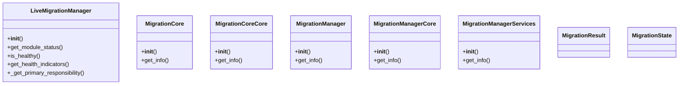

# Migration Domain Architecture

**Total Classes**: 9

## Section 1

## Section 2

## All Classes in Domain

- `LiveMigrationManager`
- `MigrationCore`
- `MigrationCoreCore`
- `MigrationManager`
- `MigrationManagerCore`
- `MigrationManagerServices`
- `MigrationResult`
- `MigrationState`
- `MigrationStep`
