# Monitoring Domain Architecture

**Total Classes**: 108

## Section 1

```mermaid
classDiagram
    class AzureAiServicesTextAnalyticsForHealthTool {
        +validate_environment()
        +_text_analysis()
        +_format_text_analysis_result()
        +_run()
    }
    class AzureCogsTextAnalyticsHealthTool {
        +validate_environment()
        +_text_analysis()
        +_format_text_analysis_result()
        +_run()
    }
    class ComplexityMonitor {
        +__init__()
        +_initialize_default_analyzers()
        +add_analyzer()
        +set_threshold()
        +analyze_element()
    }
    class ComponentHealth {
    }
    class ComprehensiveLoggingHandler {
        +__init__()
        +emit()
    }
    class ComprehensiveLoggingSystem {
        +__init__()
        +get_module_status()
        +is_healthy()
        +get_health_indicators()
        +_get_primary_responsibility()
    }
    class ComprehensiveLoggingSystemCore {
        +__init__()
        +get_info()
    }
    class ComprehensiveLoggingSystemCoreCore {
        +__init__()
        +get_info()
    }
```

## Section 2

```mermaid
classDiagram
    class ComprehensiveLoggingSystemHandlers {
        +__init__()
        +get_info()
    }
    class ComprehensiveMonitoringSystem {
        +__init__()
        +get_module_status()
        +is_healthy()
        +get_health_indicators()
        +_get_primary_responsibility()
    }
    class ComprehensiveMonitoringSystemCore {
        +__init__()
        +get_info()
    }
    class ComprehensiveMonitoringSystemCoreCore {
        +__init__()
        +get_info()
    }
    class ContinuousMonitor {
        +__init__()
        +monitor_spec_drift()
        +detect_terminology_inconsistencies()
        +validate_architectural_decisions()
        +trigger_automatic_correction()
    }
    class DomainHealth {
    }
    class DomainHealthMonitor {
        +__init__()
        +set_registry_manager()
        +set_project_root()
        +check_domain_health()
        +check_all_domains()
    }
    class ExecutionMonitor {
        +__init__()
        +find_active_executions()
        +get_execution_metrics()
        +_estimate_completion()
        +_calculate_critical_path_progress()
    }
```

## Section 3

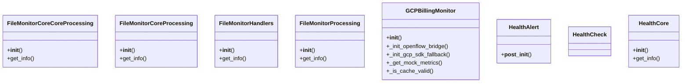

## Section 4

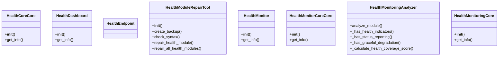

## Section 5

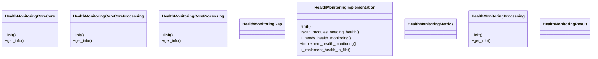

## Section 6

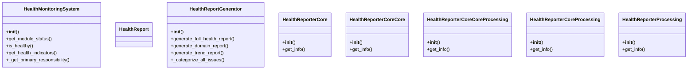

## Section 7

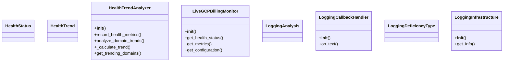

## Section 8

```mermaid
classDiagram
    class LoggingInfrastructureMethods {
        +__init__()
        +get_info()
    }
    class LoggingInfrastructureMethodsLoggingconfig {
        +__init__()
        +get_info()
    }
    class LoggingInfrastructureMethodsLogginginfrastructure {
        +__init__()
        +get_info()
    }
    class LoggingInfrastructureMethodsLoglevel {
        +__init__()
        +get_info()
    }
    class LoggingTokenCharacteristic {
        +reset_characteristic()
        +set_characteristic()
        +set_connection_characteristic()
        +get_characteristic()
        +get_connection_characteristic()
    }
    class LoggingUndefined {
        +_fail_with_undefined_error()
        +__str__()
        +__iter__()
        +__bool__()
    }
    class LoggingconfigInterface {
        +__init__()
        +get_info()
    }
    class LogginginfrastructureInterface {
        +__init__()
        +get_info()
    }
```

## Section 9

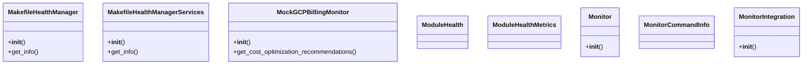

## Section 10

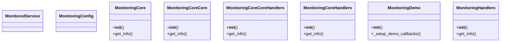

## Section 11

```mermaid
classDiagram
    class MonitoringSystemCleanCore {
        +__init__()
        +get_info()
    }
    class MonitoringSystemCleanCoreCore {
        +__init__()
        +get_info()
    }
    class MultipartEncoderMonitor {
        +__init__()
        +from_fields()
        +content_type()
        +to_string()
        +read()
    }
    class PDCAConvergenceMonitor {
        +__init__()
        +load_history()
        +save_history()
        +record_iteration()
        +_determine_convergence_status()
    }
    class PerformanceMonitorCore {
        +__init__()
        +get_info()
    }
    class PerformanceMonitorCoreCore {
        +__init__()
        +get_info()
    }
    class PerformanceMonitoringSystem {
        +__init__()
        +_setup_logging()
        +_should_enable_prometheus()
        +_initialize_prometheus_integration()
        +_initialize_alert_thresholds()
    }
    class ProjectFileMonitor {
        +__init__()
        +get_module_info()
        +get_capabilities()
        +get_dependencies()
        +check_health()
    }
```

## Section 12

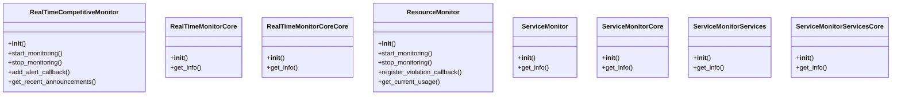

## Section 13

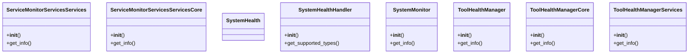

## Section 14

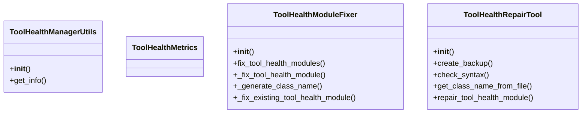

## All Classes in Domain

- `AzureAiServicesTextAnalyticsForHealthTool`
- `AzureCogsTextAnalyticsHealthTool`
- `ComplexityMonitor`
- `ComponentHealth`
- `ComprehensiveLoggingHandler`
- `ComprehensiveLoggingSystem`
- `ComprehensiveLoggingSystemCore`
- `ComprehensiveLoggingSystemCoreCore`
- `ComprehensiveLoggingSystemHandlers`
- `ComprehensiveMonitoringSystem`
- `ComprehensiveMonitoringSystemCore`
- `ComprehensiveMonitoringSystemCoreCore`
- `ContinuousMonitor`
- `DomainHealth`
- `DomainHealthMonitor`
- `ExecutionMonitor`
- `FileMonitorCoreCoreProcessing`
- `FileMonitorCoreProcessing`
- `FileMonitorHandlers`
- `FileMonitorProcessing`
- `GCPBillingMonitor`
- `HealthAlert`
- `HealthCheck`
- `HealthCore`
- `HealthCoreCore`
- `HealthDashboard`
- `HealthEndpoint`
- `HealthModuleRepairTool`
- `HealthMonitor`
- `HealthMonitorCoreCore`
- `HealthMonitoringAnalyzer`
- `HealthMonitoringCore`
- `HealthMonitoringCoreCore`
- `HealthMonitoringCoreCoreProcessing`
- `HealthMonitoringCoreProcessing`
- `HealthMonitoringGap`
- `HealthMonitoringImplementation`
- `HealthMonitoringMetrics`
- `HealthMonitoringProcessing`
- `HealthMonitoringResult`
- `HealthMonitoringSystem`
- `HealthReport`
- `HealthReportGenerator`
- `HealthReporterCore`
- `HealthReporterCoreCore`
- `HealthReporterCoreCoreProcessing`
- `HealthReporterCoreProcessing`
- `HealthReporterProcessing`
- `HealthStatus`
- `HealthTrend`
- `HealthTrendAnalyzer`
- `LiveGCPBillingMonitor`
- `LoggingAnalysis`
- `LoggingCallbackHandler`
- `LoggingDeficiencyType`
- `LoggingInfrastructure`
- `LoggingInfrastructureMethods`
- `LoggingInfrastructureMethodsLoggingconfig`
- `LoggingInfrastructureMethodsLogginginfrastructure`
- `LoggingInfrastructureMethodsLoglevel`
- `LoggingTokenCharacteristic`
- `LoggingUndefined`
- `LoggingconfigInterface`
- `LogginginfrastructureInterface`
- `MakefileHealthManager`
- `MakefileHealthManagerServices`
- `MockGCPBillingMonitor`
- `ModuleHealth`
- `ModuleHealthMetrics`
- `Monitor`
- `MonitorCommandInfo`
- `MonitorIntegration`
- `MonitoredService`
- `MonitoringConfig`
- `MonitoringCore`
- `MonitoringCoreCore`
- `MonitoringCoreCoreHandlers`
- `MonitoringCoreHandlers`
- `MonitoringDemo`
- `MonitoringHandlers`
- `MonitoringSystemCleanCore`
- `MonitoringSystemCleanCoreCore`
- `MultipartEncoderMonitor`
- `PDCAConvergenceMonitor`
- `PerformanceMonitorCore`
- `PerformanceMonitorCoreCore`
- `PerformanceMonitoringSystem`
- `ProjectFileMonitor`
- `RealTimeCompetitiveMonitor`
- `RealTimeMonitorCore`
- `RealTimeMonitorCoreCore`
- `ResourceMonitor`
- `ServiceMonitor`
- `ServiceMonitorCore`
- `ServiceMonitorServices`
- `ServiceMonitorServicesCore`
- `ServiceMonitorServicesServices`
- `ServiceMonitorServicesServicesCore`
- `SystemHealth`
- `SystemHealthHandler`
- `SystemMonitor`
- `ToolHealthManager`
- `ToolHealthManagerCore`
- `ToolHealthManagerServices`
- `ToolHealthManagerUtils`
- `ToolHealthMetrics`
- `ToolHealthModuleFixer`
- `ToolHealthRepairTool`
