# Notification Domain Architecture

**Total Classes**: 155

## Section 1

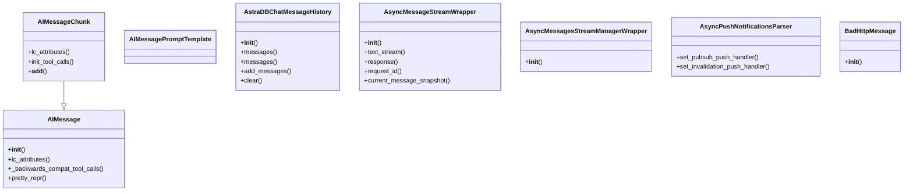

## Section 2

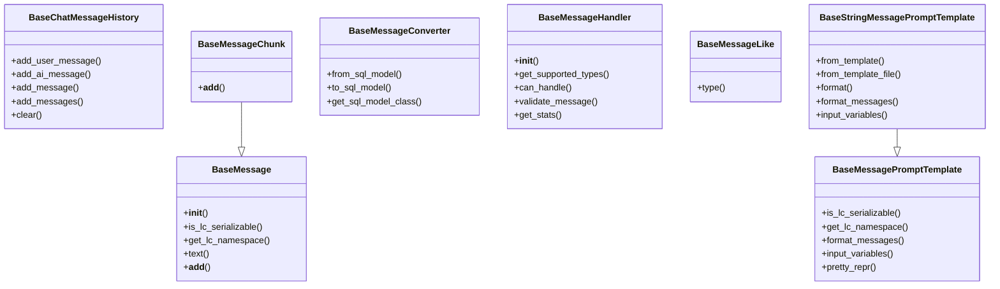

## Section 3

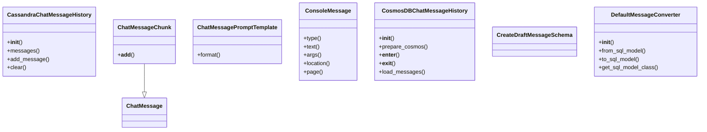

## Section 4

```mermaid
classDiagram
    class DynamoDBChatMessageHistory {
        +__init__()
        +messages()
        +messages()
        +add_messages()
        +clear()
    }
    class ElasticsearchChatMessageHistory {
        +__init__()
        +get_user_agent()
        +connect_to_elasticsearch()
        +messages()
        +messages()
    }
    class EndOfMessage {
        +__init__()
    }
    class ErrorMessage {
        +format()
        +with_additional_msg()
    }
    class FakeMessagesListChatModel {
        +_generate()
        +_llm_type()
    }
    class FewShotChatMessagePromptTemplate {
        +is_lc_serializable()
        +format_messages()
        +format()
        +pretty_repr()
    }
    class FileChatMessageHistory {
        +__init__()
        +messages()
        +add_message()
        +clear()
    }
    class FirestoreChatMessageHistory {
        +__init__()
        +prepare_firestore()
        +load_messages()
        +add_message()
        +upsert_messages()
    }
```

## Section 5

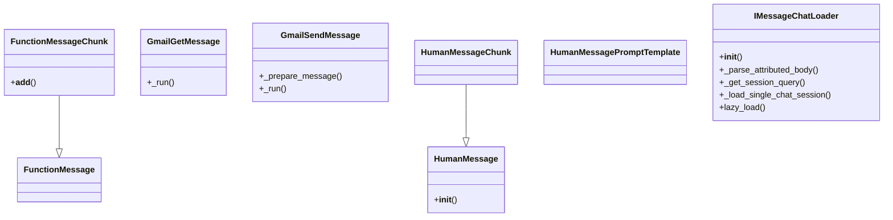

## Section 6

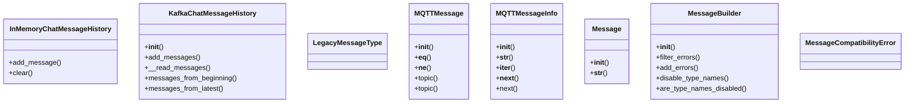

## Section 7

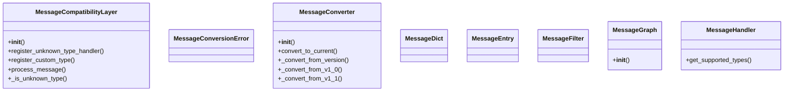

## Section 8

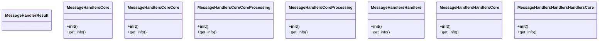

## Section 9

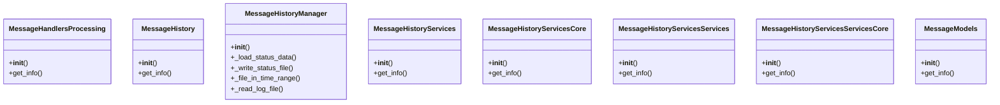

## Section 10

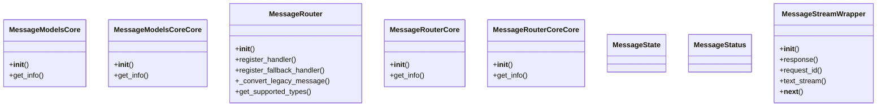

## Section 11

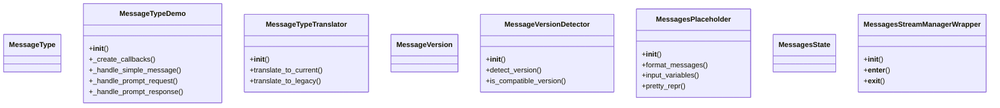

## Section 12

```mermaid
classDiagram
    class MomentoChatMessageHistory {
        +__init__()
        +from_client_params()
        +messages()
        +add_message()
        +clear()
    }
    class MongoDBChatMessageHistory {
        +__init__()
        +messages()
        +add_message()
        +clear()
    }
    class Neo4jChatMessageHistory {
        +__init__()
        +messages()
        +messages()
        +add_message()
        +clear()
    }
    class NotificationManager {
        +__init__()
        +get_info()
    }
    class NotificationManagerMethods {
        +__init__()
        +get_info()
    }
    class NotificationManagerMethodsNotificationconfig {
        +__init__()
        +get_info()
    }
    class NotificationManagerMethodsNotificationmanager {
        +__init__()
        +get_info()
    }
    class NotificationMessage {
        +__init__()
        +get_module_info()
        +get_capabilities()
        +get_dependencies()
        +check_health()
    }
```

## Section 13

```mermaid
classDiagram
    class NotificationModels {
        +__init__()
        +get_info()
    }
    class NotificationModelsNotificationmessage {
        +__init__()
        +get_info()
    }
    class NotificationModelsNotificationmessageNotificationmessage {
        +__init__()
        +get_info()
    }
    class NotificationModelsNotificationsettings {
        +__init__()
        +get_info()
    }
    class NotificationNotificationmessage {
        +__init__()
        +get_info()
    }
    class NotificationNotificationmessageNotificationmessage {
        +__init__()
        +get_info()
    }
    class NotificationNotificationmessageNotificationmessageNotificationmessage {
        +__init__()
        +get_info()
    }
    class NotificationNotificationsettings {
        +__init__()
        +get_info()
    }
```

## Section 14

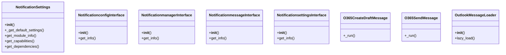

## Section 15

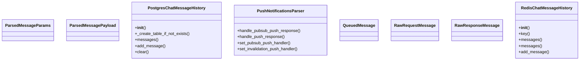

## Section 16

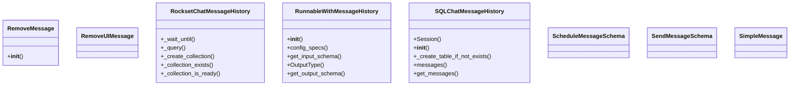

## Section 17

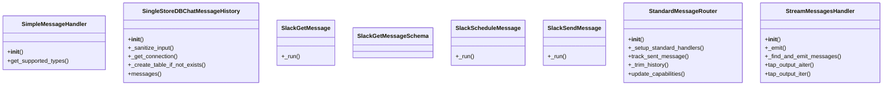

## Section 18

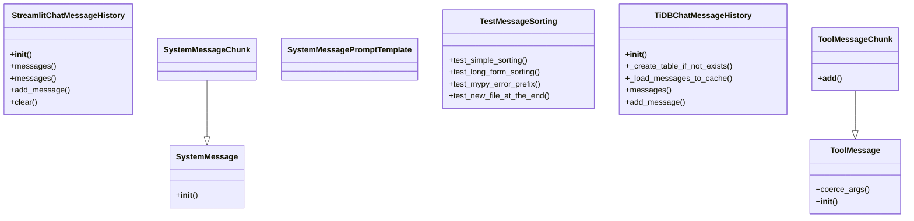

## Section 19

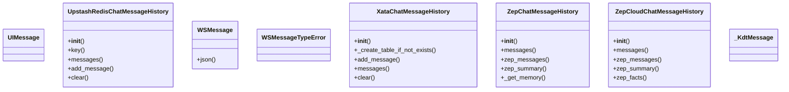

## Section 20

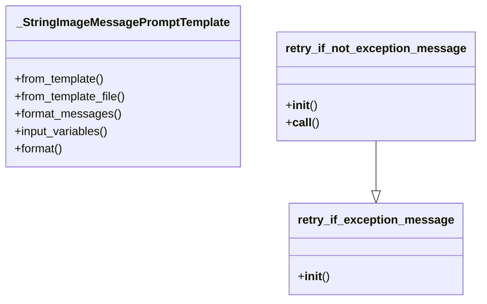

## All Classes in Domain

- `AIMessage`
- `AIMessageChunk`
- `AIMessagePromptTemplate`
- `AstraDBChatMessageHistory`
- `AsyncMessageStreamWrapper`
- `AsyncMessagesStreamManagerWrapper`
- `AsyncPushNotificationsParser`
- `BadHttpMessage`
- `BaseChatMessageHistory`
- `BaseMessage`
- `BaseMessageChunk`
- `BaseMessageConverter`
- `BaseMessageHandler`
- `BaseMessageLike`
- `BaseMessagePromptTemplate`
- `BaseStringMessagePromptTemplate`
- `CassandraChatMessageHistory`
- `ChatMessage`
- `ChatMessageChunk`
- `ChatMessagePromptTemplate`
- `ConsoleMessage`
- `CosmosDBChatMessageHistory`
- `CreateDraftMessageSchema`
- `DefaultMessageConverter`
- `DynamoDBChatMessageHistory`
- `ElasticsearchChatMessageHistory`
- `EndOfMessage`
- `ErrorMessage`
- `FakeMessagesListChatModel`
- `FewShotChatMessagePromptTemplate`
- `FileChatMessageHistory`
- `FirestoreChatMessageHistory`
- `FunctionMessage`
- `FunctionMessageChunk`
- `GmailGetMessage`
- `GmailSendMessage`
- `HumanMessage`
- `HumanMessageChunk`
- `HumanMessagePromptTemplate`
- `IMessageChatLoader`
- `InMemoryChatMessageHistory`
- `KafkaChatMessageHistory`
- `LegacyMessageType`
- `MQTTMessage`
- `MQTTMessageInfo`
- `Message`
- `MessageBuilder`
- `MessageCompatibilityError`
- `MessageCompatibilityLayer`
- `MessageConversionError`
- `MessageConverter`
- `MessageDict`
- `MessageEntry`
- `MessageFilter`
- `MessageGraph`
- `MessageHandler`
- `MessageHandlerResult`
- `MessageHandlersCore`
- `MessageHandlersCoreCore`
- `MessageHandlersCoreCoreProcessing`
- `MessageHandlersCoreProcessing`
- `MessageHandlersHandlers`
- `MessageHandlersHandlersCore`
- `MessageHandlersHandlersHandlersCore`
- `MessageHandlersProcessing`
- `MessageHistory`
- `MessageHistoryManager`
- `MessageHistoryServices`
- `MessageHistoryServicesCore`
- `MessageHistoryServicesServices`
- `MessageHistoryServicesServicesCore`
- `MessageModels`
- `MessageModelsCore`
- `MessageModelsCoreCore`
- `MessageRouter`
- `MessageRouterCore`
- `MessageRouterCoreCore`
- `MessageState`
- `MessageStatus`
- `MessageStreamWrapper`
- `MessageType`
- `MessageTypeDemo`
- `MessageTypeTranslator`
- `MessageVersion`
- `MessageVersionDetector`
- `MessagesPlaceholder`
- `MessagesState`
- `MessagesStreamManagerWrapper`
- `MomentoChatMessageHistory`
- `MongoDBChatMessageHistory`
- `Neo4jChatMessageHistory`
- `NotificationManager`
- `NotificationManagerMethods`
- `NotificationManagerMethodsNotificationconfig`
- `NotificationManagerMethodsNotificationmanager`
- `NotificationMessage`
- `NotificationModels`
- `NotificationModelsNotificationmessage`
- `NotificationModelsNotificationmessageNotificationmessage`
- `NotificationModelsNotificationsettings`
- `NotificationNotificationmessage`
- `NotificationNotificationmessageNotificationmessage`
- `NotificationNotificationmessageNotificationmessageNotificationmessage`
- `NotificationNotificationsettings`
- `NotificationSettings`
- `NotificationconfigInterface`
- `NotificationmanagerInterface`
- `NotificationmessageInterface`
- `NotificationsettingsInterface`
- `O365CreateDraftMessage`
- `O365SendMessage`
- `OutlookMessageLoader`
- `ParsedMessageParams`
- `ParsedMessagePayload`
- `PostgresChatMessageHistory`
- `PushNotificationsParser`
- `QueuedMessage`
- `RawRequestMessage`
- `RawResponseMessage`
- `RedisChatMessageHistory`
- `RemoveMessage`
- `RemoveUIMessage`
- `RocksetChatMessageHistory`
- `RunnableWithMessageHistory`
- `SQLChatMessageHistory`
- `ScheduleMessageSchema`
- `SendMessageSchema`
- `SimpleMessage`
- `SimpleMessageHandler`
- `SingleStoreDBChatMessageHistory`
- `SlackGetMessage`
- `SlackGetMessageSchema`
- `SlackScheduleMessage`
- `SlackSendMessage`
- `StandardMessageRouter`
- `StreamMessagesHandler`
- `StreamlitChatMessageHistory`
- `SystemMessage`
- `SystemMessageChunk`
- `SystemMessagePromptTemplate`
- `TestMessageSorting`
- `TiDBChatMessageHistory`
- `ToolMessage`
- `ToolMessageChunk`
- `UIMessage`
- `UpstashRedisChatMessageHistory`
- `WSMessage`
- `WSMessageTypeError`
- `XataChatMessageHistory`
- `ZepChatMessageHistory`
- `ZepCloudChatMessageHistory`
- `_KdtMessage`
- `_StringImageMessagePromptTemplate`
- `retry_if_exception_message`
- `retry_if_not_exception_message`
