# Project Domain Architecture

**Total Classes**: 358

## Section 1

```mermaid
classDiagram
    class AbstractConnection {
        +__init__()
        +__del__()
        +_close()
        +__repr__()
        +repr_pieces()
    }
    class AdaptedConnection {
        +driver_connection()
        +run_async()
        +__repr__()
    }
    class AdvancedFileChangeAnalysis {
    }
    class AfterConnectionReleasedEvent {
        +__init__()
        +connection()
    }
    class AfterPooledConnectionsInstantiationEvent {
        +__init__()
        +connection_pools()
        +client_type()
        +credential_provider()
    }
    class AfterPubSubConnectionInstantiationEvent {
        +__init__()
        +pubsub_connection()
        +connection_pool()
        +client_type()
        +connection_lock()
    }
    class AfterSingleConnectionInstantiationEvent {
        +__init__()
        +connection()
        +client_type()
        +connection_lock()
    }
    class AiofilesContextManager {
        +__init__()
        +__await__()
    }
```

## Section 2

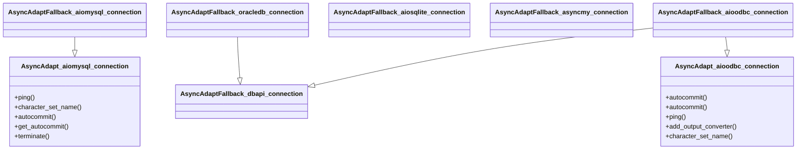

## Section 3

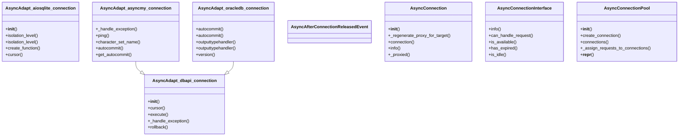

## Section 4

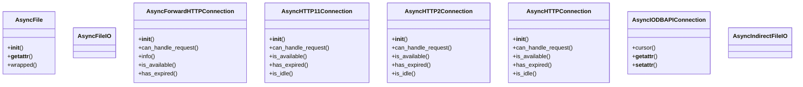

## Section 5

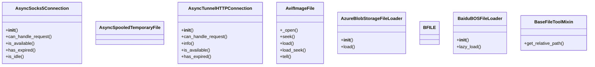

## Section 6

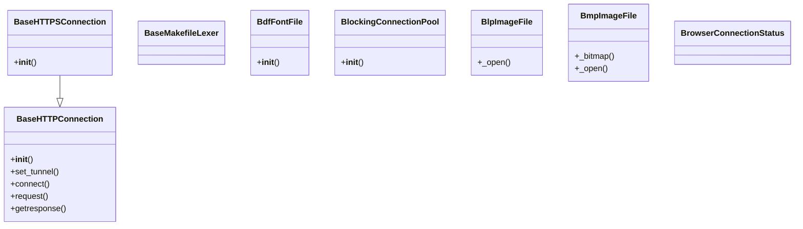

## Section 7

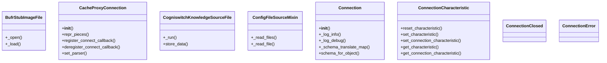

## Section 8

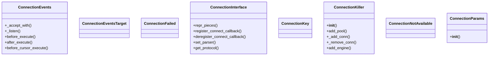

## Section 9

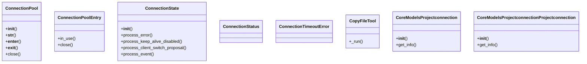

## Section 10

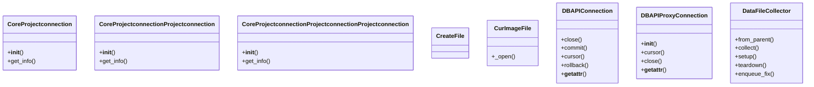

## Section 11

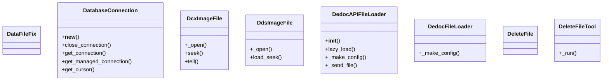

## Section 12

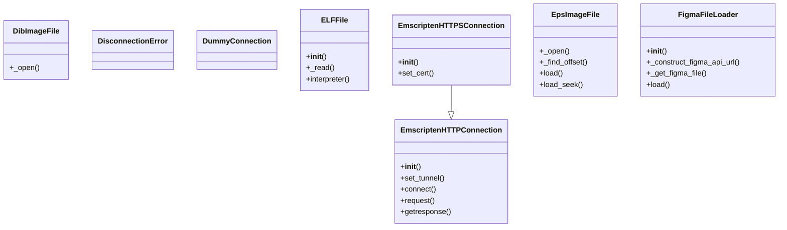

## Section 13

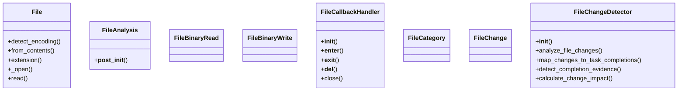

## Section 14

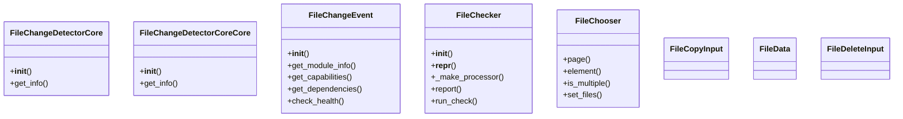

## Section 15

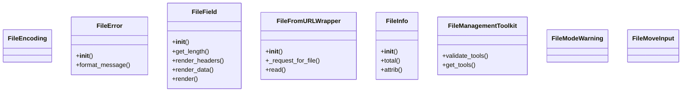

## Section 16

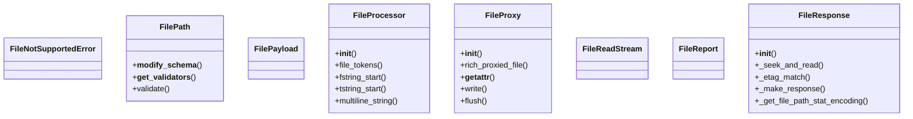

## Section 17

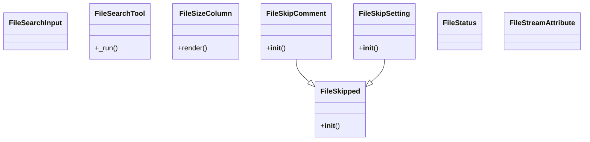

## Section 18

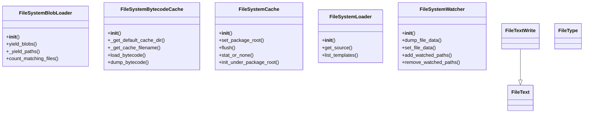

## Section 19

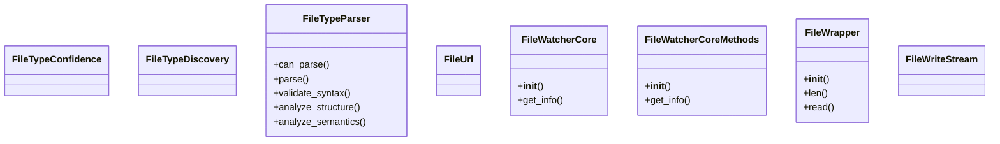

## Section 20

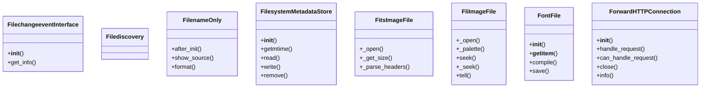

## Section 21

```mermaid
classDiagram
    class FpxImageFile {
        +_open()
        +_open_index()
        +_open_subimage()
        +load()
        +close()
    }
    class FtexImageFile {
        +_open()
        +load_seek()
    }
    class GCSFileLoader {
        +__init__()
        +load()
    }
    class GbrImageFile {
        +_open()
        +load()
    }
    class GdImageFile {
        +_open()
    }
    class GhostbustersFileTypeProcessor {
        +__init__()
        +_initialize_ghost_rules()
        +_initialize_proton_modes()
        +investigate_file()
        +_scan_with_pke_meter()
    }
    class GifImageFile {
        +data()
        +_is_palette_needed()
        +_open()
        +n_frames()
        +is_animated()
    }
    class GimpGradientFile {
        +__init__()
    }
```

## Section 22

```mermaid
classDiagram
    class GimpPaletteFile {
        +_read()
        +__init__()
        +frombytes()
        +getpalette()
    }
    class GithubFileLoader {
        +get_file_paths()
        +get_file_content_by_path()
        +lazy_load()
    }
    class GradientFile {
        +getpalette()
    }
    class GribStubImageFile {
        +_open()
        +_load()
    }
    class HDF5StubImageFile {
        +_open()
        +_load()
    }
    class HTTP11Connection {
        +__init__()
        +handle_request()
        +_send_request_headers()
        +_send_request_body()
        +_send_event()
    }
    class HTTP11ConnectionByteStream {
        +__init__()
        +__iter__()
        +close()
    }
    class HTTP2Connection {
        +__init__()
        +_new_h2_conn()
        +connect()
        +putrequest()
        +putheader()
    }
```

## Section 23

```mermaid
classDiagram
    class HTTP2ConnectionByteStream {
        +__init__()
        +__iter__()
        +close()
    }
    class HTTPConnection {
        +__init__()
        +host()
        +host()
        +_new_conn()
        +set_tunnel()
    }
    class HTTPConnectionPool {
        +__init__()
        +_new_conn()
        +_get_conn()
        +_put_conn()
        +_validate_conn()
    }
    class HTTPConnectionState {
    }
    class HTTPSConnection {
        +__init__()
        +set_cert()
        +connect()
        +_connect_tls_proxy()
    }
    class HTTPSConnectionPool {
        +__init__()
        +_prepare_proxy()
        +_new_conn()
        +_validate_conn()
    }
    class HeuristicFileTypeProcessor {
        +__init__()
        +_initialize_heuristic_patterns()
        +_initialize_exception_mappings()
        +discover_file_type()
        +_extension_based_discovery()
    }
    class IcnsFile {
        +__init__()
        +itersizes()
        +bestsize()
        +dataforsize()
        +getimage()
    }
    HTTPSConnection --|> HTTPConnection
    HTTPSConnectionPool --|> HTTPConnectionPool
```

## Section 24

```mermaid
classDiagram
    class IcnsImageFile {
        +_open()
        +size()
        +size()
        +load()
    }
    class IcoFile {
        +__init__()
        +sizes()
        +getentryindex()
        +getimage()
        +frame()
    }
    class IcoImageFile {
        +_open()
        +size()
        +size()
        +load()
        +load_seek()
    }
    class ImImageFile {
        +_open()
        +n_frames()
        +is_animated()
        +seek()
        +tell()
    }
    class ImageCmsProfile {
        +__init__()
        +tobytes()
    }
    class ImageFile {
        +__init__()
        +_open()
        +_close_fp()
        +close()
        +get_child_images()
    }
    class ImageFileDirectory_v1 {
        +__init__()
        +from_v2()
        +to_v2()
        +__contains__()
        +__len__()
    }
    class ImageFileDirectory_v2 {
        +__init__()
        +legacy_api()
        +legacy_api()
        +reset()
        +__str__()
    }
    ImageFileDirectory_v1 --|> ImageFileDirectory_v2
```

## Section 25

```mermaid
classDiagram
    class ImtImageFile {
        +_open()
    }
    class InputFilesList {
    }
    class InvalidSdistFilename {
    }
    class InvalidWheelFilename {
    }
    class IptcImageFile {
        +getint()
        +field()
        +_open()
        +load()
    }
    class Jpeg2KImageFile {
        +_open()
        +_parse_comment()
        +reduce()
        +reduce()
        +load()
    }
    class JpegImageFile {
        +_open()
        +__getattr__()
        +__getstate__()
        +__setstate__()
        +load_read()
    }
    class KeepOpenFile {
        +__init__()
        +__getattr__()
        +__enter__()
        +__exit__()
        +__repr__()
    }
```

## Section 26

```mermaid
classDiagram
    class LLMSherpaFileLoader {
        +__init__()
        +_is_valid_url()
        +_validate_llmsherpa_url()
        +lazy_load()
    }
    class LangSmithConnectionError {
    }
    class LazyFile {
        +__init__()
        +__getattr__()
        +__repr__()
        +open()
        +close()
    }
    class Llamafile {
        +_llm_type()
        +_param_fieldnames()
        +_default_params()
        +_get_parameters()
        +_call()
    }
    class LlamafileEmbeddings {
        +_embed()
        +embed_documents()
        +embed_query()
    }
    class LocalFileStore {
        +__init__()
        +_get_full_path()
        +_mkdir_for_store()
        +mget()
        +mset()
    }
    class MDCProjector {
        +__init__()
        +_load_model()
        +get_mdc_constraints()
        +get_generation_rules()
        +validate_against_model()
    }
    class MakefileDiagnosisResult {
    }
```

## Section 27

```mermaid
classDiagram
    class MakefileIntegrator {
        +__init__()
        +set_registry_manager()
        +set_project_root()
        +_scan_makefiles()
        +_parse_makefile()
    }
    class MakefileIntegratorCore {
        +__init__()
        +get_info()
    }
    class MakefileIntegratorCoreCore {
        +__init__()
        +get_info()
    }
    class MakefileIntegratorCoreCoreProcessing {
        +__init__()
        +get_info()
    }
    class MakefileIntegratorCoreProcessing {
        +__init__()
        +get_info()
    }
    class MakefileIntegratorProcessing {
        +__init__()
        +get_info()
    }
    class MakefileLexer {
        +get_tokens_unprocessed()
        +analyse_text()
    }
    class MakefileRepairResult {
    }
```

## Section 28

```mermaid
classDiagram
    class ManagesConnection {
        +info()
        +record_info()
        +invalidate()
    }
    class MaxConnectionsError {
    }
    class McIdasImageFile {
        +_open()
    }
    class MediaFileDetector {
        +__init__()
        +get_module_info()
        +get_capabilities()
        +get_dependencies()
        +check_health()
    }
    class MediaFileInfo {
    }
    class MicImageFile {
        +_open()
        +seek()
        +tell()
        +close()
        +__exit__()
    }
    class MockConnection {
        +__init__()
        +connect()
        +schema_for_object()
        +execution_options()
        +_run_ddl_visitor()
    }
    class ModelsModelsModelsModelsProjectmetadata {
        +__init__()
        +get_info()
    }
```

## Section 29

```mermaid
classDiagram
    class MoveFileTool {
        +_run()
    }
    class MpegImageFile {
        +_open()
    }
    class MpoImageFile {
        +_open()
        +_after_jpeg_open()
        +load_seek()
        +seek()
        +tell()
    }
    class MspImageFile {
        +_open()
    }
    class MultiProjectManager {
        +__init__()
        +get_info()
    }
    class MypyFile {
        +__init__()
        +local_definitions()
        +name()
        +fullname()
        +accept()
    }
    class NamedTemporaryFile {
        +__init__()
        +__init__()
        +__init__()
    }
    class NewConnectionError {
        +__init__()
        +__reduce__()
        +pool()
    }
```

## Section 30

```mermaid
classDiagram
    class NpzFile {
        +__init__()
        +__enter__()
        +__exit__()
        +close()
        +__del__()
    }
    class NullFile {
        +close()
        +isatty()
        +read()
        +readable()
        +readline()
    }
    class OBSFileLoader {
        +__init__()
        +load()
    }
    class OneDriveFileLoader {
        +load()
    }
    class OrphanedFileDetector {
        +__init__()
        +detect_orphaned_files()
        +_get_all_project_files()
        +_collect_domain_patterns()
        +_find_covering_domains()
    }
    class PGDeferrableConnectionCharacteristic {
        +reset_characteristic()
        +set_characteristic()
        +get_characteristic()
    }
    class PGReadOnlyConnectionCharacteristic {
        +reset_characteristic()
        +set_characteristic()
        +get_characteristic()
    }
    class PaletteFile {
        +__init__()
        +getpalette()
    }
```

## Section 31

```mermaid
classDiagram
    class PathNotAFileError {
    }
    class PcdImageFile {
        +_open()
        +load_end()
    }
    class PcfFontFile {
        +__init__()
        +_getformat()
        +_load_properties()
        +_load_metrics()
        +_load_bitmaps()
    }
    class PcxImageFile {
        +_open()
    }
    class PerformanceProfiler {
        +__init__()
        +get_info()
    }
    class PerformanceProfilerMethods {
        +__init__()
        +get_info()
    }
    class PerformanceProfilerMethodsPerformanceprofiler {
        +__init__()
        +get_info()
    }
    class PerformanceProfilerMethodsProfilingcontext {
        +__init__()
        +get_info()
    }
```

## Section 32

```mermaid
classDiagram
    class PerformanceProfilerMethodsProfilingresult {
        +__init__()
        +get_info()
    }
    class PerformanceprofilerInterface {
        +__init__()
        +get_info()
    }
    class PixarImageFile {
        +_open()
    }
    class PngImageFile {
        +_open()
        +text()
        +verify()
        +seek()
        +_seek()
    }
    class PoolProxiedConnection {
        +is_valid()
        +is_detached()
        +detach()
        +close()
    }
    class PpmImageFile {
        +_read_magic()
        +_read_token()
        +_open()
    }
    class ProcfileLexer {
    }
    class ProfileDoesNotExist {
        +__init__()
    }
```

## Section 33

```mermaid
classDiagram
    class ProfileInformation {
        +__init__()
        +info()
    }
    class ProfileNotFound {
        +__init__()
    }
    class ProfileStatsFile {
        +__init__()
        +platform_key()
        +has_stats()
        +result()
        +reset_count()
    }
    class ProjectConfig {
        +validate_config()
    }
    class ProjectConnection {
        +__init__()
        +get_module_info()
        +get_capabilities()
        +get_dependencies()
        +check_health()
    }
    class ProjectFileEventHandler {
        +__init__()
        +get_module_info()
        +get_capabilities()
        +get_dependencies()
        +check_health()
    }
    class ProjectGenerator {
        +__init__()
        +_initialize_default_templates()
        +_create_minimal_template()
        +_create_standard_template()
        +_create_enterprise_template()
    }
    class ProjectGeneratorCore {
        +__init__()
        +get_info()
    }
```

## Section 34

```mermaid
classDiagram
    class ProjectGeneratorCoreCore {
        +__init__()
        +get_info()
    }
    class ProjectManagerMethods {
        +__init__()
        +get_info()
    }
    class ProjectManagerMethodsProjectstatus {
        +__init__()
        +get_info()
    }
    class ProjectMetadata {
        +__init__()
        +get_module_info()
        +get_capabilities()
        +get_dependencies()
        +check_health()
    }
    class ProjectModelConfig {
        +__init__()
        +_load_black_config()
        +_load_quality_gates()
    }
    class ProjectModels {
        +__init__()
        +get_info()
    }
    class ProjectModelsTeammember {
        +__init__()
        +get_info()
    }
    class ProjectModelsTeammemberTeammember {
        +__init__()
        +get_info()
    }
```

## Section 35

```mermaid
classDiagram
    class ProjectTeammember {
        +__init__()
        +get_info()
    }
    class ProjectTeammemberTeammember {
        +__init__()
        +get_info()
    }
    class ProjectTeammemberTeammemberTeammember {
        +__init__()
        +get_info()
    }
    class ProjectTemplate {
        +__init__()
        +add_file_template()
        +add_directory()
        +add_dependency()
        +add_dev_dependency()
    }
    class ProjectType {
    }
    class ProjectconnectionInterface {
        +__init__()
        +get_info()
    }
    class ProjectmetadataInterface {
        +__init__()
        +get_info()
    }
    class ProjectstatusInterface {
        +__init__()
        +get_info()
    }
```

## Section 36

```mermaid
classDiagram
    class ProxyConnectionError {
    }
    class PsdImageFile {
        +_open()
        +layers()
        +n_frames()
        +is_animated()
        +seek()
    }
    class PyprojectTomlConfigSettingsSource {
        +__init__()
        +_pick_pyproject_toml_file()
    }
    class QoiImageFile {
        +_open()
    }
    class ReadFile {
    }
    class ReadFileInput {
    }
    class ReadFileTool {
        +_run()
    }
    class RobustFileReader {
        +__init__()
        +read_file()
        +can_read_file()
        +get_failed_files_report()
        +_suggest_new_encodings()
    }
```

## Section 37

```mermaid
classDiagram
    class S3FileLoader {
        +__init__()
        +_get_elements()
        +_get_metadata()
    }
    class SOCKSConnection {
        +__init__()
        +_new_conn()
    }
    class SOCKSHTTPConnectionPool {
    }
    class SOCKSHTTPSConnection {
    }
    class SOCKSHTTPSConnectionPool {
    }
    class SQLiteFix99953Connection {
        +cursor()
        +execute()
        +executemany()
    }
    class SSLConnection {
        +__init__()
        +_connection_arguments()
        +keyfile()
        +certfile()
        +cert_reqs()
    }
    class SentinelConnectionPool {
        +__init__()
        +__repr__()
        +reset()
        +owns_connection()
    }
    SOCKSHTTPSConnection --|> SOCKSConnection
```

## Section 38

```mermaid
classDiagram
    class SentinelConnectionPoolProxy {
        +__init__()
        +reset()
        +get_master_address()
        +rotate_slaves()
    }
    class SentinelManagedConnection {
        +__init__()
        +__repr__()
    }
    class SentinelManagedSSLConnection {
    }
    class ServerConnectionError {
    }
    class ServerFilePayload {
    }
    class SgiImageFile {
        +_open()
    }
    class SingleFileFacebookMessengerChatLoader {
        +__init__()
        +lazy_load()
    }
    class Socks5Connection {
        +__init__()
        +handle_request()
        +can_handle_request()
        +close()
        +is_available()
    }
    SentinelManagedSSLConnection --|> SentinelManagedConnection
```

## Section 39

```mermaid
classDiagram
    class SpiderImageFile {
        +_open()
        +n_frames()
        +is_animated()
        +tell()
        +seek()
    }
    class SpooledTemporaryFile {
        +__init__()
        +__init__()
        +__init__()
        +closed()
    }
    class StubFile {
        +write()
    }
    class StubImageFile {
        +_open()
        +load()
        +_load()
    }
    class SubprojectScrubber {
        +__init__()
        +discover_subprojects()
        +_deploy_ruff_config()
        +scrub_subproject()
        +_run_ruff_check()
    }
    class SunImageFile {
        +_open()
    }
    class SyncFilechangeevent {
        +__init__()
        +get_info()
    }
    class SyncFilechangeeventFilechangeevent {
        +__init__()
        +get_info()
    }
```

## Section 40

```mermaid
classDiagram
    class SyncFilechangeeventFilechangeeventFilechangeevent {
        +__init__()
        +get_info()
    }
    class SyncModelsFilechangeevent {
        +__init__()
        +get_info()
    }
    class SyncModelsFilechangeeventFilechangeevent {
        +__init__()
        +get_info()
    }
    class TOMLFile {
        +__init__()
        +read()
        +write()
    }
    class TelegramChatFileLoader {
        +__init__()
        +load()
    }
    class TemporaryFile {
        +__init__()
        +__init__()
        +__init__()
    }
    class TencentCOSFileLoader {
        +__init__()
        +lazy_load()
    }
    class TestFileSystemCache {
        +setUp()
        +tearDown()
        +test_isfile_case_1()
        +test_isfile_case_2()
        +test_isfile_case_3()
    }
```

## Section 41

```mermaid
classDiagram
    class TgaImageFile {
        +_open()
        +load_end()
    }
    class TiffImageFile {
        +__init__()
        +_open()
        +n_frames()
        +seek()
        +_seek()
    }
    class TotalFileSizeColumn {
        +render()
    }
    class TraceConnectionCreateEndParams {
    }
    class TraceConnectionCreateStartParams {
    }
    class TraceConnectionQueuedEndParams {
    }
    class TraceConnectionQueuedStartParams {
    }
    class TraceConnectionReuseconnParams {
    }
```

## Section 42

```mermaid
classDiagram
    class TunnelHTTPConnection {
        +__init__()
        +handle_request()
        +can_handle_request()
        +close()
        +info()
    }
    class UnstructuredAPIFileIOLoader {
        +__init__()
        +_get_elements()
        +_get_metadata()
        +_post_process_elements()
    }
    class UnstructuredAPIFileLoader {
        +__init__()
        +_get_metadata()
        +_get_elements()
        +_post_process_elements()
    }
    class UnstructuredFileIOLoader {
        +__init__()
        +_get_elements()
        +_get_metadata()
        +_post_process_elements()
    }
    class UnstructuredFileLoader {
        +__init__()
        +_get_elements()
        +_get_metadata()
    }
    class UpdateFile {
    }
    class UploadedFile {
    }
    class WalImageFile {
        +_open()
        +load()
    }
```

## Section 43

```mermaid
classDiagram
    class WebPImageFile {
        +_open()
        +_getexif()
        +seek()
        +_reset()
        +_get_next()
    }
    class WebSocketConnectionClosedException {
    }
    class WebsocketConnectionError {
    }
    class WmfStubImageFile {
        +_open()
        +_load()
        +load()
    }
    class WriteFileInput {
    }
    class WriteFileTool {
        +_run()
    }
    class XVThumbImageFile {
        +_open()
    }
    class XbmImageFile {
        +_open()
    }
```

## Section 44

```mermaid
classDiagram
    class XpmImageFile {
        +_open()
        +load_read()
    }
    class _AdhocProxiedConnection {
        +__init__()
        +driver_connection()
        +connection()
        +is_valid()
        +invalidate()
    }
    class _AppEngineConnection {
        +__init__()
        +urlopen()
    }
    class _AtomicFile {
        +__init__()
        +name()
        +close()
        +__getattr__()
        +__enter__()
    }
    class _BaseFileStream {
        +__init__()
        +extra_attributes()
    }
    class _ConnectTunnelConnection {
        +release()
    }
    class _ConnectionCallableProto {
        +__call__()
    }
    class _ConnectionFairy {
        +__init__()
        +driver_connection()
        +connection()
        +_checkout()
        +_checkout_existing()
    }
```

## Section 45

```mermaid
classDiagram
    class _ConnectionRecord {
        +__init__()
        +driver_connection()
        +connection()
        +info()
        +record_info()
    }
    class _ConnectionState {
    }
    class _FileOpeners {
        +__init__()
        +_load()
        +keys()
        +__getitem__()
    }
    class _FileResponseResult {
    }
    class _IteratorAsBinaryFile {
        +__init__()
        +_get_bytes()
        +_load_bytes()
        +read()
    }
    class _KineticaLlmFileContextParser {
        +_removesuffix()
        +parse_dialogue_file()
        +parse_dialogue()
    }
```

## All Classes in Domain

- `AbstractConnection`
- `AdaptedConnection`
- `AdvancedFileChangeAnalysis`
- `AfterConnectionReleasedEvent`
- `AfterPooledConnectionsInstantiationEvent`
- `AfterPubSubConnectionInstantiationEvent`
- `AfterSingleConnectionInstantiationEvent`
- `AiofilesContextManager`
- `AsyncAdaptFallback_aiomysql_connection`
- `AsyncAdaptFallback_aioodbc_connection`
- `AsyncAdaptFallback_aiosqlite_connection`
- `AsyncAdaptFallback_asyncmy_connection`
- `AsyncAdaptFallback_dbapi_connection`
- `AsyncAdaptFallback_oracledb_connection`
- `AsyncAdapt_aiomysql_connection`
- `AsyncAdapt_aioodbc_connection`
- `AsyncAdapt_aiosqlite_connection`
- `AsyncAdapt_asyncmy_connection`
- `AsyncAdapt_dbapi_connection`
- `AsyncAdapt_oracledb_connection`
- `AsyncAfterConnectionReleasedEvent`
- `AsyncConnection`
- `AsyncConnectionInterface`
- `AsyncConnectionPool`
- `AsyncFile`
- `AsyncFileIO`
- `AsyncForwardHTTPConnection`
- `AsyncHTTP11Connection`
- `AsyncHTTP2Connection`
- `AsyncHTTPConnection`
- `AsyncIODBAPIConnection`
- `AsyncIndirectFileIO`
- `AsyncSocks5Connection`
- `AsyncSpooledTemporaryFile`
- `AsyncTunnelHTTPConnection`
- `AvifImageFile`
- `AzureBlobStorageFileLoader`
- `BFILE`
- `BaiduBOSFileLoader`
- `BaseFileToolMixin`
- `BaseHTTPConnection`
- `BaseHTTPSConnection`
- `BaseMakefileLexer`
- `BdfFontFile`
- `BlockingConnectionPool`
- `BlpImageFile`
- `BmpImageFile`
- `BrowserConnectionStatus`
- `BufrStubImageFile`
- `CacheProxyConnection`
- `CogniswitchKnowledgeSourceFile`
- `ConfigFileSourceMixin`
- `Connection`
- `ConnectionCharacteristic`
- `ConnectionClosed`
- `ConnectionError`
- `ConnectionEvents`
- `ConnectionEventsTarget`
- `ConnectionFailed`
- `ConnectionInterface`
- `ConnectionKey`
- `ConnectionKiller`
- `ConnectionNotAvailable`
- `ConnectionParams`
- `ConnectionPool`
- `ConnectionPoolEntry`
- `ConnectionState`
- `ConnectionStatus`
- `ConnectionTimeoutError`
- `CopyFileTool`
- `CoreModelsProjectconnection`
- `CoreModelsProjectconnectionProjectconnection`
- `CoreProjectconnection`
- `CoreProjectconnectionProjectconnection`
- `CoreProjectconnectionProjectconnectionProjectconnection`
- `CreateFile`
- `CurImageFile`
- `DBAPIConnection`
- `DBAPIProxyConnection`
- `DataFileCollector`
- `DataFileFix`
- `DatabaseConnection`
- `DcxImageFile`
- `DdsImageFile`
- `DedocAPIFileLoader`
- `DedocFileLoader`
- `DeleteFile`
- `DeleteFileTool`
- `DibImageFile`
- `DisconnectionError`
- `DummyConnection`
- `ELFFile`
- `EmscriptenHTTPConnection`
- `EmscriptenHTTPSConnection`
- `EpsImageFile`
- `FigmaFileLoader`
- `File`
- `FileAnalysis`
- `FileBinaryRead`
- `FileBinaryWrite`
- `FileCallbackHandler`
- `FileCategory`
- `FileChange`
- `FileChangeDetector`
- `FileChangeDetectorCore`
- `FileChangeDetectorCoreCore`
- `FileChangeEvent`
- `FileChecker`
- `FileChooser`
- `FileCopyInput`
- `FileData`
- `FileDeleteInput`
- `FileEncoding`
- `FileError`
- `FileField`
- `FileFromURLWrapper`
- `FileInfo`
- `FileManagementToolkit`
- `FileModeWarning`
- `FileMoveInput`
- `FileNotSupportedError`
- `FilePath`
- `FilePayload`
- `FileProcessor`
- `FileProxy`
- `FileReadStream`
- `FileReport`
- `FileResponse`
- `FileSearchInput`
- `FileSearchTool`
- `FileSizeColumn`
- `FileSkipComment`
- `FileSkipSetting`
- `FileSkipped`
- `FileStatus`
- `FileStreamAttribute`
- `FileSystemBlobLoader`
- `FileSystemBytecodeCache`
- `FileSystemCache`
- `FileSystemLoader`
- `FileSystemWatcher`
- `FileText`
- `FileTextWrite`
- `FileType`
- `FileTypeConfidence`
- `FileTypeDiscovery`
- `FileTypeParser`
- `FileUrl`
- `FileWatcherCore`
- `FileWatcherCoreMethods`
- `FileWrapper`
- `FileWriteStream`
- `FilechangeeventInterface`
- `Filediscovery`
- `FilenameOnly`
- `FilesystemMetadataStore`
- `FitsImageFile`
- `FliImageFile`
- `FontFile`
- `ForwardHTTPConnection`
- `FpxImageFile`
- `FtexImageFile`
- `GCSFileLoader`
- `GbrImageFile`
- `GdImageFile`
- `GhostbustersFileTypeProcessor`
- `GifImageFile`
- `GimpGradientFile`
- `GimpPaletteFile`
- `GithubFileLoader`
- `GradientFile`
- `GribStubImageFile`
- `HDF5StubImageFile`
- `HTTP11Connection`
- `HTTP11ConnectionByteStream`
- `HTTP2Connection`
- `HTTP2ConnectionByteStream`
- `HTTPConnection`
- `HTTPConnectionPool`
- `HTTPConnectionState`
- `HTTPSConnection`
- `HTTPSConnectionPool`
- `HeuristicFileTypeProcessor`
- `IcnsFile`
- `IcnsImageFile`
- `IcoFile`
- `IcoImageFile`
- `ImImageFile`
- `ImageCmsProfile`
- `ImageFile`
- `ImageFileDirectory_v1`
- `ImageFileDirectory_v2`
- `ImtImageFile`
- `InputFilesList`
- `InvalidSdistFilename`
- `InvalidWheelFilename`
- `IptcImageFile`
- `Jpeg2KImageFile`
- `JpegImageFile`
- `KeepOpenFile`
- `LLMSherpaFileLoader`
- `LangSmithConnectionError`
- `LazyFile`
- `Llamafile`
- `LlamafileEmbeddings`
- `LocalFileStore`
- `MDCProjector`
- `MakefileDiagnosisResult`
- `MakefileIntegrator`
- `MakefileIntegratorCore`
- `MakefileIntegratorCoreCore`
- `MakefileIntegratorCoreCoreProcessing`
- `MakefileIntegratorCoreProcessing`
- `MakefileIntegratorProcessing`
- `MakefileLexer`
- `MakefileRepairResult`
- `ManagesConnection`
- `MaxConnectionsError`
- `McIdasImageFile`
- `MediaFileDetector`
- `MediaFileInfo`
- `MicImageFile`
- `MockConnection`
- `ModelsModelsModelsModelsProjectmetadata`
- `MoveFileTool`
- `MpegImageFile`
- `MpoImageFile`
- `MspImageFile`
- `MultiProjectManager`
- `MypyFile`
- `NamedTemporaryFile`
- `NewConnectionError`
- `NpzFile`
- `NullFile`
- `OBSFileLoader`
- `OneDriveFileLoader`
- `OrphanedFileDetector`
- `PGDeferrableConnectionCharacteristic`
- `PGReadOnlyConnectionCharacteristic`
- `PaletteFile`
- `PathNotAFileError`
- `PcdImageFile`
- `PcfFontFile`
- `PcxImageFile`
- `PerformanceProfiler`
- `PerformanceProfilerMethods`
- `PerformanceProfilerMethodsPerformanceprofiler`
- `PerformanceProfilerMethodsProfilingcontext`
- `PerformanceProfilerMethodsProfilingresult`
- `PerformanceprofilerInterface`
- `PixarImageFile`
- `PngImageFile`
- `PoolProxiedConnection`
- `PpmImageFile`
- `ProcfileLexer`
- `ProfileDoesNotExist`
- `ProfileInformation`
- `ProfileNotFound`
- `ProfileStatsFile`
- `ProjectConfig`
- `ProjectConnection`
- `ProjectFileEventHandler`
- `ProjectGenerator`
- `ProjectGeneratorCore`
- `ProjectGeneratorCoreCore`
- `ProjectManagerMethods`
- `ProjectManagerMethodsProjectstatus`
- `ProjectMetadata`
- `ProjectModelConfig`
- `ProjectModels`
- `ProjectModelsTeammember`
- `ProjectModelsTeammemberTeammember`
- `ProjectTeammember`
- `ProjectTeammemberTeammember`
- `ProjectTeammemberTeammemberTeammember`
- `ProjectTemplate`
- `ProjectType`
- `ProjectconnectionInterface`
- `ProjectmetadataInterface`
- `ProjectstatusInterface`
- `ProxyConnectionError`
- `PsdImageFile`
- `PyprojectTomlConfigSettingsSource`
- `QoiImageFile`
- `ReadFile`
- `ReadFileInput`
- `ReadFileTool`
- `RobustFileReader`
- `S3FileLoader`
- `SOCKSConnection`
- `SOCKSHTTPConnectionPool`
- `SOCKSHTTPSConnection`
- `SOCKSHTTPSConnectionPool`
- `SQLiteFix99953Connection`
- `SSLConnection`
- `SentinelConnectionPool`
- `SentinelConnectionPoolProxy`
- `SentinelManagedConnection`
- `SentinelManagedSSLConnection`
- `ServerConnectionError`
- `ServerFilePayload`
- `SgiImageFile`
- `SingleFileFacebookMessengerChatLoader`
- `Socks5Connection`
- `SpiderImageFile`
- `SpooledTemporaryFile`
- `StubFile`
- `StubImageFile`
- `SubprojectScrubber`
- `SunImageFile`
- `SyncFilechangeevent`
- `SyncFilechangeeventFilechangeevent`
- `SyncFilechangeeventFilechangeeventFilechangeevent`
- `SyncModelsFilechangeevent`
- `SyncModelsFilechangeeventFilechangeevent`
- `TOMLFile`
- `TelegramChatFileLoader`
- `TemporaryFile`
- `TencentCOSFileLoader`
- `TestFileSystemCache`
- `TgaImageFile`
- `TiffImageFile`
- `TotalFileSizeColumn`
- `TraceConnectionCreateEndParams`
- `TraceConnectionCreateStartParams`
- `TraceConnectionQueuedEndParams`
- `TraceConnectionQueuedStartParams`
- `TraceConnectionReuseconnParams`
- `TunnelHTTPConnection`
- `UnstructuredAPIFileIOLoader`
- `UnstructuredAPIFileLoader`
- `UnstructuredFileIOLoader`
- `UnstructuredFileLoader`
- `UpdateFile`
- `UploadedFile`
- `WalImageFile`
- `WebPImageFile`
- `WebSocketConnectionClosedException`
- `WebsocketConnectionError`
- `WmfStubImageFile`
- `WriteFileInput`
- `WriteFileTool`
- `XVThumbImageFile`
- `XbmImageFile`
- `XpmImageFile`
- `_AdhocProxiedConnection`
- `_AppEngineConnection`
- `_AtomicFile`
- `_BaseFileStream`
- `_ConnectTunnelConnection`
- `_ConnectionCallableProto`
- `_ConnectionFairy`
- `_ConnectionRecord`
- `_ConnectionState`
- `_FileOpeners`
- `_FileResponseResult`
- `_IteratorAsBinaryFile`
- `_KineticaLlmFileContextParser`
