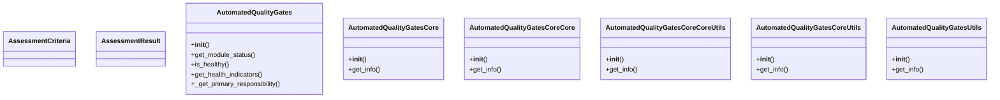
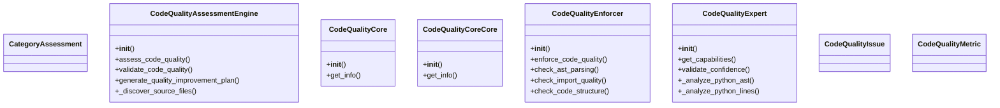
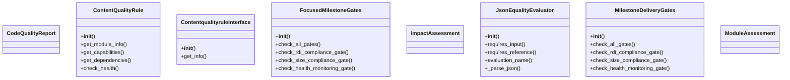
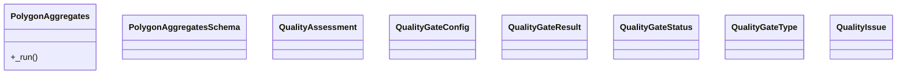
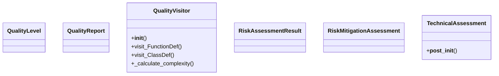

# Quality Domain Architecture

**Total Classes**: 38

## Section 1

## Section 2

## Section 3

## Section 4

## Section 5

## All Classes in Domain

- `AssessmentCriteria`
- `AssessmentResult`
- `AutomatedQualityGates`
- `AutomatedQualityGatesCore`
- `AutomatedQualityGatesCoreCore`
- `AutomatedQualityGatesCoreCoreUtils`
- `AutomatedQualityGatesCoreUtils`
- `AutomatedQualityGatesUtils`
- `CategoryAssessment`
- `CodeQualityAssessmentEngine`
- `CodeQualityCore`
- `CodeQualityCoreCore`
- `CodeQualityEnforcer`
- `CodeQualityExpert`
- `CodeQualityIssue`
- `CodeQualityMetric`
- `CodeQualityReport`
- `ContentQualityRule`
- `ContentqualityruleInterface`
- `FocusedMilestoneGates`
- `ImpactAssessment`
- `JsonEqualityEvaluator`
- `MilestoneDeliveryGates`
- `ModuleAssessment`
- `PolygonAggregates`
- `PolygonAggregatesSchema`
- `QualityAssessment`
- `QualityGateConfig`
- `QualityGateResult`
- `QualityGateStatus`
- `QualityGateType`
- `QualityIssue`
- `QualityLevel`
- `QualityReport`
- `QualityVisitor`
- `RiskAssessmentResult`
- `RiskMitigationAssessment`
- `TechnicalAssessment`
