# RCA Domain Architecture

**Total Classes**: 82

## Section 1

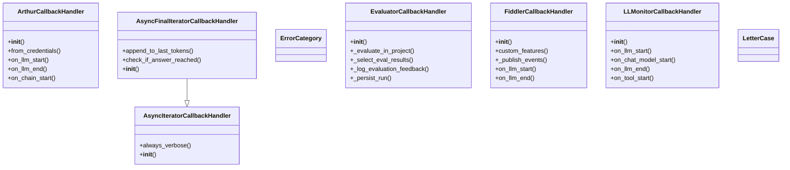

## Section 2

```mermaid
classDiagram
    class LoaderCallableStatus {
    }
    class NetRCAuth {
        +__init__()
        +auth_flow()
        +_build_auth_header()
    }
    class ProgressBarCallback {
        +__init__()
        +increment()
        +_print_bar()
        +on_chain_error()
        +on_chain_end()
    }
    class PromptLayerCallbackHandler {
        +__init__()
        +on_chat_model_start()
        +on_llm_start()
        +on_llm_end()
        +_convert_message_to_dict()
    }
    class RCAAnalyzer {
        +__init__()
        +analyze_issue()
        +_identify_root_causes()
        +_identify_contributing_factors()
        +_generate_recommendations()
    }
    class RCACategory {
    }
    class RCAEngine {
        +__init__()
        +get_module_status()
        +is_healthy()
        +get_health_indicators()
        +_get_primary_responsibility()
    }
    class RCAErrorHandler {
        +__init__()
        +get_module_status()
        +is_healthy()
        +get_health_indicators()
        +_get_primary_responsibility()
    }
```

## Section 3

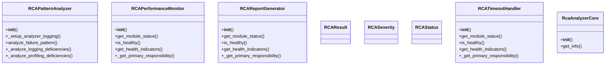

## Section 4

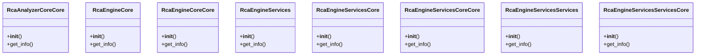

## Section 5

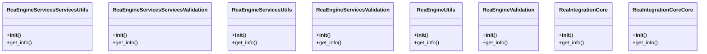

## Section 6

```mermaid
classDiagram
    class RcaIntegrationModels {
        +__init__()
        +get_info()
    }
    class RcaIntegrationProcessing {
        +__init__()
        +get_info()
    }
    class RcaIntegrationServices {
        +__init__()
        +get_info()
    }
    class RcaIntegrationServicesCore {
        +__init__()
        +get_info()
    }
    class RcaIntegrationServicesCoreCore {
        +__init__()
        +get_info()
    }
    class RcaIntegrationServicesProcessing {
        +__init__()
        +get_info()
    }
    class RcaIntegrationServicesServices {
        +__init__()
        +get_info()
    }
    class RcaIntegrationServicesServicesCore {
        +__init__()
        +get_info()
    }
```

## Section 7

```mermaid
classDiagram
    class RcaIntegrationServicesServicesProcessing {
        +__init__()
        +get_info()
    }
    class RcaIntegrationServicesServicesValidation {
        +__init__()
        +get_info()
    }
    class RcaIntegrationServicesValidation {
        +__init__()
        +get_info()
    }
    class RcaIntegrationValidation {
        +__init__()
        +get_info()
    }
    class RcaPatternAnalyzerCore {
        +__init__()
        +get_info()
    }
    class RcaPatternAnalyzerCoreCore {
        +__init__()
        +get_info()
    }
    class RcaPatternAnalyzerCoreCoreProcessing {
        +__init__()
        +get_info()
    }
    class RcaPatternAnalyzerCoreProcessing {
        +__init__()
        +get_info()
    }
```

## Section 8

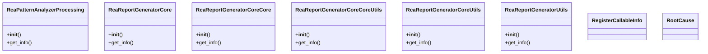

## Section 9

```mermaid
classDiagram
    class RootCauseType {
    }
    class RunCollectorCallbackHandler {
        +__init__()
        +_persist_run()
    }
    class SageMakerCallbackHandler {
        +__init__()
        +_reset()
        +on_llm_start()
        +on_llm_new_token()
        +on_llm_end()
    }
    class SystemicRCAAnalyzer {
        +__init__()
        +analyze_syntax_error_patterns()
        +analyze_automated_modification_patterns()
        +analyze_compliance_monitoring_failures()
        +identify_root_causes()
    }
    class TestRCAIntegrationEngine {
        +__init__()
        +get_module_status()
        +is_healthy()
        +get_health_indicators()
        +_get_primary_responsibility()
    }
    class TestRCAReportData {
    }
    class TestRCASummaryData {
    }
    class TestingRCAFrameworkInterface {
        +__init__()
        +execute_comprehensive_rca()
        +trigger_automated_resolution()
        +execute_integrated_testing()
        +monitor_system_health()
    }
```

## Section 10

```mermaid
classDiagram
    class TestingRcaFrameworkCore {
        +__init__()
        +get_info()
    }
    class TestingRcaFrameworkCoreCore {
        +__init__()
        +get_info()
    }
    class TestingRcaFrameworkCoreCoreValidation {
        +__init__()
        +get_info()
    }
    class TestingRcaFrameworkCoreValidation {
        +__init__()
        +get_info()
    }
    class TestingRcaFrameworkValidation {
        +__init__()
        +get_info()
    }
    class UnifiedTestingRcaFrameworkCompatibility {
        +__init__()
        +get_info()
    }
    class _HybridComparatorCallableType {
        +__call__()
    }
    class _HybridExprCallableType {
        +__call__()
    }
```

## Section 11

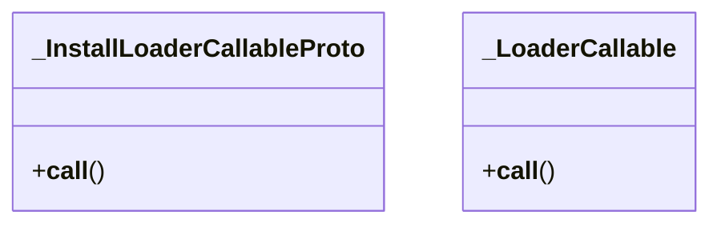

## All Classes in Domain

- `ArthurCallbackHandler`
- `AsyncFinalIteratorCallbackHandler`
- `AsyncIteratorCallbackHandler`
- `ErrorCategory`
- `EvaluatorCallbackHandler`
- `FiddlerCallbackHandler`
- `LLMonitorCallbackHandler`
- `LetterCase`
- `LoaderCallableStatus`
- `NetRCAuth`
- `ProgressBarCallback`
- `PromptLayerCallbackHandler`
- `RCAAnalyzer`
- `RCACategory`
- `RCAEngine`
- `RCAErrorHandler`
- `RCAPatternAnalyzer`
- `RCAPerformanceMonitor`
- `RCAReportGenerator`
- `RCAResult`
- `RCASeverity`
- `RCAStatus`
- `RCATimeoutHandler`
- `RcaAnalyzerCore`
- `RcaAnalyzerCoreCore`
- `RcaEngineCore`
- `RcaEngineCoreCore`
- `RcaEngineServices`
- `RcaEngineServicesCore`
- `RcaEngineServicesCoreCore`
- `RcaEngineServicesServices`
- `RcaEngineServicesServicesCore`
- `RcaEngineServicesServicesUtils`
- `RcaEngineServicesServicesValidation`
- `RcaEngineServicesUtils`
- `RcaEngineServicesValidation`
- `RcaEngineUtils`
- `RcaEngineValidation`
- `RcaIntegrationCore`
- `RcaIntegrationCoreCore`
- `RcaIntegrationModels`
- `RcaIntegrationProcessing`
- `RcaIntegrationServices`
- `RcaIntegrationServicesCore`
- `RcaIntegrationServicesCoreCore`
- `RcaIntegrationServicesProcessing`
- `RcaIntegrationServicesServices`
- `RcaIntegrationServicesServicesCore`
- `RcaIntegrationServicesServicesProcessing`
- `RcaIntegrationServicesServicesValidation`
- `RcaIntegrationServicesValidation`
- `RcaIntegrationValidation`
- `RcaPatternAnalyzerCore`
- `RcaPatternAnalyzerCoreCore`
- `RcaPatternAnalyzerCoreCoreProcessing`
- `RcaPatternAnalyzerCoreProcessing`
- `RcaPatternAnalyzerProcessing`
- `RcaReportGeneratorCore`
- `RcaReportGeneratorCoreCore`
- `RcaReportGeneratorCoreCoreUtils`
- `RcaReportGeneratorCoreUtils`
- `RcaReportGeneratorUtils`
- `RegisterCallableInfo`
- `RootCause`
- `RootCauseType`
- `RunCollectorCallbackHandler`
- `SageMakerCallbackHandler`
- `SystemicRCAAnalyzer`
- `TestRCAIntegrationEngine`
- `TestRCAReportData`
- `TestRCASummaryData`
- `TestingRCAFrameworkInterface`
- `TestingRcaFrameworkCore`
- `TestingRcaFrameworkCoreCore`
- `TestingRcaFrameworkCoreCoreValidation`
- `TestingRcaFrameworkCoreValidation`
- `TestingRcaFrameworkValidation`
- `UnifiedTestingRcaFrameworkCompatibility`
- `_HybridComparatorCallableType`
- `_HybridExprCallableType`
- `_InstallLoaderCallableProto`
- `_LoaderCallable`
