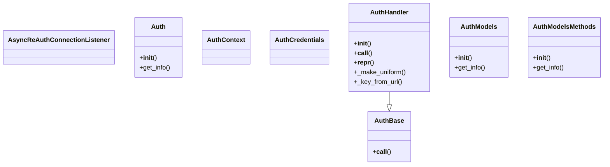
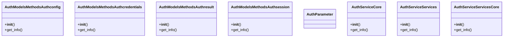
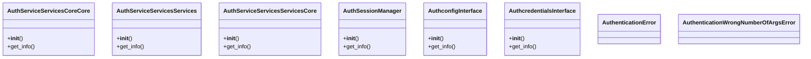
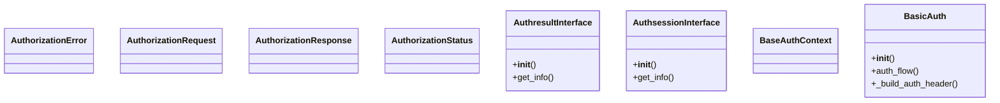
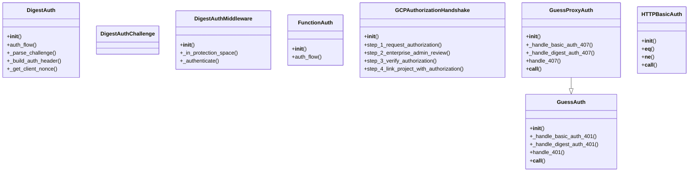
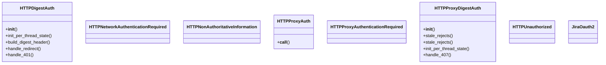
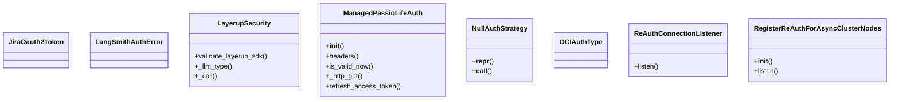
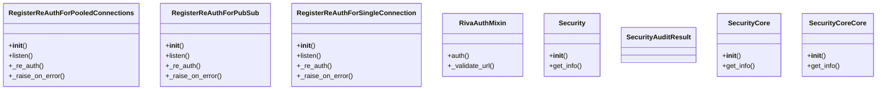
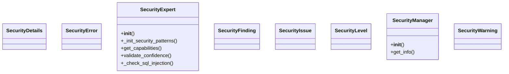
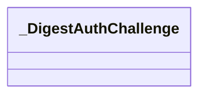

# Security Domain Architecture

**Total Classes**: 73

## Section 1

## Section 2

## Section 3

## Section 4

## Section 5

## Section 6

## Section 7

## Section 8

## Section 9

## Section 10

## All Classes in Domain

- `AsyncReAuthConnectionListener`
- `Auth`
- `AuthBase`
- `AuthContext`
- `AuthCredentials`
- `AuthHandler`
- `AuthModels`
- `AuthModelsMethods`
- `AuthModelsMethodsAuthconfig`
- `AuthModelsMethodsAuthcredentials`
- `AuthModelsMethodsAuthresult`
- `AuthModelsMethodsAuthsession`
- `AuthParameter`
- `AuthServiceCore`
- `AuthServiceServices`
- `AuthServiceServicesCore`
- `AuthServiceServicesCoreCore`
- `AuthServiceServicesServices`
- `AuthServiceServicesServicesCore`
- `AuthSessionManager`
- `AuthconfigInterface`
- `AuthcredentialsInterface`
- `AuthenticationError`
- `AuthenticationWrongNumberOfArgsError`
- `AuthorizationError`
- `AuthorizationRequest`
- `AuthorizationResponse`
- `AuthorizationStatus`
- `AuthresultInterface`
- `AuthsessionInterface`
- `BaseAuthContext`
- `BasicAuth`
- `DigestAuth`
- `DigestAuthChallenge`
- `DigestAuthMiddleware`
- `FunctionAuth`
- `GCPAuthorizationHandshake`
- `GuessAuth`
- `GuessProxyAuth`
- `HTTPBasicAuth`
- `HTTPDigestAuth`
- `HTTPNetworkAuthenticationRequired`
- `HTTPNonAuthoritativeInformation`
- `HTTPProxyAuth`
- `HTTPProxyAuthenticationRequired`
- `HTTPProxyDigestAuth`
- `HTTPUnauthorized`
- `JiraOauth2`
- `JiraOauth2Token`
- `LangSmithAuthError`
- `LayerupSecurity`
- `ManagedPassioLifeAuth`
- `NullAuthStrategy`
- `OCIAuthType`
- `ReAuthConnectionListener`
- `RegisterReAuthForAsyncClusterNodes`
- `RegisterReAuthForPooledConnections`
- `RegisterReAuthForPubSub`
- `RegisterReAuthForSingleConnection`
- `RivaAuthMixin`
- `Security`
- `SecurityAuditResult`
- `SecurityCore`
- `SecurityCoreCore`
- `SecurityDetails`
- `SecurityError`
- `SecurityExpert`
- `SecurityFinding`
- `SecurityIssue`
- `SecurityLevel`
- `SecurityManager`
- `SecurityWarning`
- `_DigestAuthChallenge`
