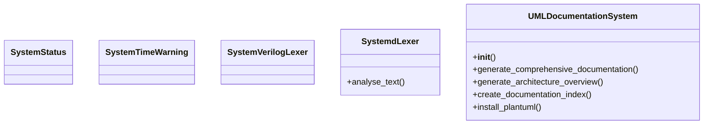

# System Domain Architecture

**Total Classes**: 37

## Section 1

```mermaid
classDiagram
    class ADRSystem {
        +__init__()
        +get_module_status()
        +is_healthy()
        +get_health_indicators()
        +_get_primary_responsibility()
    }
    class AdaptiveLearningSystem {
        +__init__()
        +_load_knowledge_base()
        +_save_knowledge_base()
        +_observe_environment()
        +_extract_step_information()
    }
    class AdrSystemCore {
        +__init__()
        +get_info()
    }
    class AdrSystemCoreCore {
        +__init__()
        +get_info()
    }
    class ColorSystem {
        +__repr__()
        +__str__()
    }
    class ComprehensiveRDIDeploymentSystem {
        +__init__()
        +deploy_comprehensive_rdi()
        +deploy_reflective_modules()
        +deploy_health_monitoring()
        +deploy_registry_integration()
    }
    class DeadlineManagementSystem {
        +__init__()
        +calculate_critical_path()
        +trigger_emergency_acceleration()
        +optimize_scope_for_deadline()
        +_build_dependency_graph()
    }
    class EnhancedClassificationSystem {
        +__init__()
        +analyze_page_comprehensive()
        +detect_spa_characteristics()
        +detect_meta_ecosystem()
        +detect_cross_domain_patterns()
    }
```

## Section 2

```mermaid
classDiagram
    class ExternalSystemAdapter {
        +__init__()
    }
    class FailureRecoverySystem {
        +__init__()
        +detect_failure()
        +generate_recovery_plan()
        +perform_rca()
        +execute_recovery_plan()
    }
    class FixedOversizedDetectionSystem {
        +__init__()
        +analyze_workspace()
        +_discover_python_files()
        +_analyze_single_file()
        +_basic_file_analysis()
    }
    class GlacierSporeSyncSystem {
        +__init__()
        +_initialize_current_version()
        +create_model_version()
        +_get_current_version_id()
        +sync_models()
    }
    class GlacierSporeSystem {
        +__init__()
        +_initialize_default_dimensions()
        +create_discovery_spore()
        +get_dimension_analysis()
        +find_orphaned_dimensions()
    }
    class HelpSystemCore {
        +__init__()
        +get_info()
    }
    class HelpSystemCoreCore {
        +__init__()
        +get_info()
    }
    class HelpSystemCoreCoreProcessing {
        +__init__()
        +get_info()
    }
```

## Section 3

```mermaid
classDiagram
    class HelpSystemCoreProcessing {
        +__init__()
        +get_info()
    }
    class HelpSystemDemo {
        +__init__()
    }
    class HelpSystemProcessing {
        +__init__()
        +get_info()
    }
    class HelpWantedSystem {
        +__init__()
        +create_help_request()
        +create_help_request_message()
        +process_help_request()
        +create_help_response_message()
    }
    class InFlightRepairSystem {
        +__init__()
        +initialize_in_flight_repair()
        +detect_in_flight_issues()
        +_determine_repair_strategy()
        +execute_in_flight_repair()
    }
    class InterfaceConsolidationSystem {
        +__init__()
        +scan_interfaces()
        +_scan_file()
        +identify_duplicates()
        +create_consolidation_plan()
    }
    class LearningMVCSystem {
        +__init__()
        +initialize()
        +_setup_event_listeners()
        +_on_page_load()
        +_on_dom_loaded()
    }
    class MockChaosSystem {
        +__init__()
    }
```

## Section 4

```mermaid
classDiagram
    class RefactoredVerificationSystem {
        +__init__()
        +verify_integration()
        +_run_scenario()
        +_combine_scenario_results()
        +_get_memory_usage()
    }
    class ReflectiveModuleDeploymentSystem {
        +__init__()
        +deploy_to_all_modules()
        +find_all_python_modules()
        +process_module()
        +has_reflective_module()
    }
    class SophisticatedVerificationSystem {
        +__init__()
        +verify_integration()
        +_run_scenario()
        +_analyze_state_mutations()
        +_extract_performance_data()
    }
    class SystemOrchestratorCore {
        +__init__()
        +get_info()
    }
    class SystemOrchestratorCoreCore {
        +__init__()
        +get_info()
    }
    class SystemPager {
        +_pager()
        +show()
    }
    class SystemResourceUsage {
    }
    class SystemRoute {
        +__init__()
        +url_for()
        +name()
        +get_info()
        +status()
    }
```

## Section 5

## All Classes in Domain

- `ADRSystem`
- `AdaptiveLearningSystem`
- `AdrSystemCore`
- `AdrSystemCoreCore`
- `ColorSystem`
- `ComprehensiveRDIDeploymentSystem`
- `DeadlineManagementSystem`
- `EnhancedClassificationSystem`
- `ExternalSystemAdapter`
- `FailureRecoverySystem`
- `FixedOversizedDetectionSystem`
- `GlacierSporeSyncSystem`
- `GlacierSporeSystem`
- `HelpSystemCore`
- `HelpSystemCoreCore`
- `HelpSystemCoreCoreProcessing`
- `HelpSystemCoreProcessing`
- `HelpSystemDemo`
- `HelpSystemProcessing`
- `HelpWantedSystem`
- `InFlightRepairSystem`
- `InterfaceConsolidationSystem`
- `LearningMVCSystem`
- `MockChaosSystem`
- `RefactoredVerificationSystem`
- `ReflectiveModuleDeploymentSystem`
- `SophisticatedVerificationSystem`
- `SystemOrchestratorCore`
- `SystemOrchestratorCoreCore`
- `SystemPager`
- `SystemResourceUsage`
- `SystemRoute`
- `SystemStatus`
- `SystemTimeWarning`
- `SystemVerilogLexer`
- `SystemdLexer`
- `UMLDocumentationSystem`
