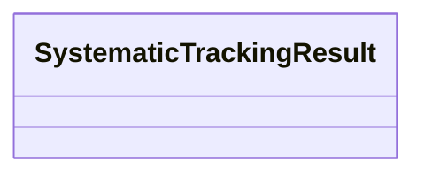

# Systematic Domain Architecture

**Total Classes**: 25

## Section 1

```mermaid
classDiagram
    class SimplifiedSystematicSuperiorityModel {
        +__init__()
        +get_module_status()
        +_get_primary_responsibility()
        +is_healthy()
        +get_health_indicators()
    }
    class SystematicApproachTracker {
        +__init__()
        +get_info()
    }
    class SystematicApproachTrackerCore {
        +__init__()
        +get_info()
    }
    class SystematicApproachTrackerUtils {
        +__init__()
        +get_info()
    }
    class SystematicCleanupEngine {
        +__init__()
        +_setup_cleanup_logging()
        +analyze_organizational_entropy()
        +create_systematic_cleanup_plan()
        +execute_systematic_cleanup()
    }
    class SystematicCleanupEngineCore {
        +__init__()
        +get_info()
    }
    class SystematicCleanupEngineCoreCore {
        +__init__()
        +get_info()
    }
    class SystematicCleanupEngineServices {
        +__init__()
        +get_info()
    }
```

## Section 2

```mermaid
classDiagram
    class SystematicCleanupEngineServicesCore {
        +__init__()
        +get_info()
    }
    class SystematicCleanupEngineServicesCoreCore {
        +__init__()
        +get_info()
    }
    class SystematicCleanupEngineServicesServices {
        +__init__()
        +get_info()
    }
    class SystematicCleanupEngineServicesServicesCore {
        +__init__()
        +get_info()
    }
    class SystematicEvidence {
    }
    class SystematicFailureDetector {
        +__init__()
        +_setup_logging()
        +_initialize_recovery_strategies()
        +detect_dquote_error()
        +detect_cli_availability()
    }
    class SystematicFix {
    }
    class SystematicMetricsEngine {
        +__init__()
        +get_module_info()
        +get_capabilities()
        +get_health_status()
        +graceful_degradation()
    }
```

## Section 3

```mermaid
classDiagram
    class SystematicMetricsEngineModels {
        +__init__()
        +get_info()
    }
    class SystematicMetricsEngineServices {
        +__init__()
        +get_info()
    }
    class SystematicPDCAOrchestrator {
        +__init__()
        +get_module_info()
        +get_capabilities()
        +get_health_status()
        +graceful_degradation()
    }
    class SystematicSuperiorityEngine {
        +__init__()
        +generate_superiority_metrics()
        +calculate_roi()
        +generate_evidence_package()
        +get_superiority_summary()
    }
    class SystematicSuperiorityModel {
        +__init__()
        +get_info()
    }
    class SystematicSuperiorityModelCore {
        +__init__()
        +get_info()
    }
    class SystematicSuperiorityModelModels {
        +__init__()
        +get_info()
    }
    class SystematicSyntaxFixer {
        +__init__()
        +create_emergency_backup()
        +identify_syntax_errors()
        +fix_common_syntax_errors()
        +apply_systematic_fixes()
    }
```

## Section 4

## All Classes in Domain

- `SimplifiedSystematicSuperiorityModel`
- `SystematicApproachTracker`
- `SystematicApproachTrackerCore`
- `SystematicApproachTrackerUtils`
- `SystematicCleanupEngine`
- `SystematicCleanupEngineCore`
- `SystematicCleanupEngineCoreCore`
- `SystematicCleanupEngineServices`
- `SystematicCleanupEngineServicesCore`
- `SystematicCleanupEngineServicesCoreCore`
- `SystematicCleanupEngineServicesServices`
- `SystematicCleanupEngineServicesServicesCore`
- `SystematicEvidence`
- `SystematicFailureDetector`
- `SystematicFix`
- `SystematicMetricsEngine`
- `SystematicMetricsEngineModels`
- `SystematicMetricsEngineServices`
- `SystematicPDCAOrchestrator`
- `SystematicSuperiorityEngine`
- `SystematicSuperiorityModel`
- `SystematicSuperiorityModelCore`
- `SystematicSuperiorityModelModels`
- `SystematicSyntaxFixer`
- `SystematicTrackingResult`
