# Task Domain Architecture

**Total Classes**: 100

## Section 1

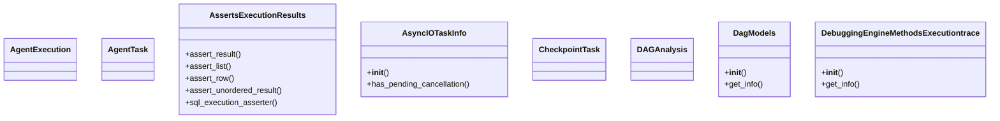

## Section 2

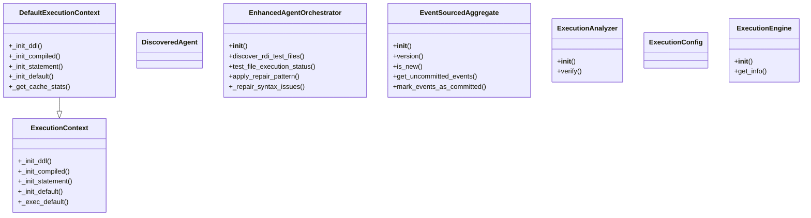

## Section 3

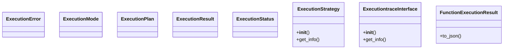

## Section 4

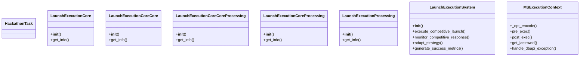

## Section 5

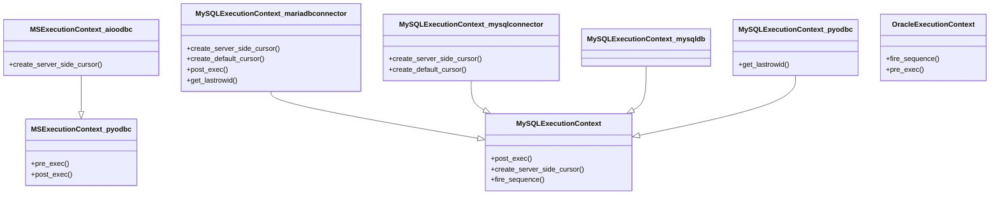

## Section 6

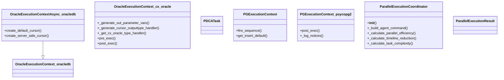

## Section 7

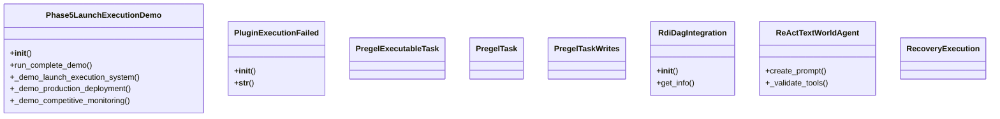

## Section 8

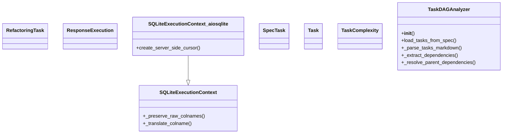

## Section 9

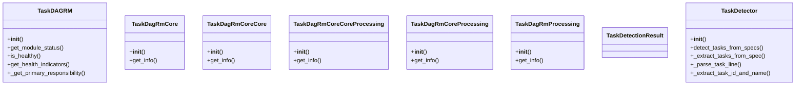

## Section 10

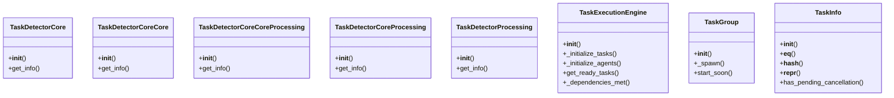

## Section 11

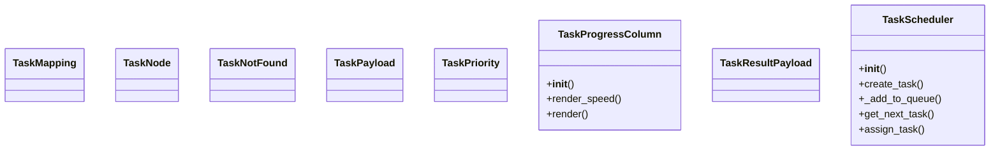

## Section 12

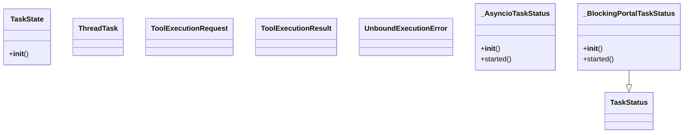

## Section 13

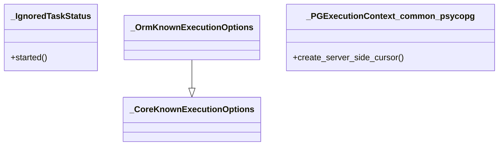

## All Classes in Domain

- `AgentExecution`
- `AgentTask`
- `AssertsExecutionResults`
- `AsyncIOTaskInfo`
- `CheckpointTask`
- `DAGAnalysis`
- `DagModels`
- `DebuggingEngineMethodsExecutiontrace`
- `DefaultExecutionContext`
- `DiscoveredAgent`
- `EnhancedAgentOrchestrator`
- `EventSourcedAggregate`
- `ExecutionAnalyzer`
- `ExecutionConfig`
- `ExecutionContext`
- `ExecutionEngine`
- `ExecutionError`
- `ExecutionMode`
- `ExecutionPlan`
- `ExecutionResult`
- `ExecutionStatus`
- `ExecutionStrategy`
- `ExecutiontraceInterface`
- `FunctionExecutionResult`
- `HackathonTask`
- `LaunchExecutionCore`
- `LaunchExecutionCoreCore`
- `LaunchExecutionCoreCoreProcessing`
- `LaunchExecutionCoreProcessing`
- `LaunchExecutionProcessing`
- `LaunchExecutionSystem`
- `MSExecutionContext`
- `MSExecutionContext_aioodbc`
- `MSExecutionContext_pyodbc`
- `MySQLExecutionContext`
- `MySQLExecutionContext_mariadbconnector`
- `MySQLExecutionContext_mysqlconnector`
- `MySQLExecutionContext_mysqldb`
- `MySQLExecutionContext_pyodbc`
- `OracleExecutionContext`
- `OracleExecutionContextAsync_oracledb`
- `OracleExecutionContext_cx_oracle`
- `OracleExecutionContext_oracledb`
- `PDCATask`
- `PGExecutionContext`
- `PGExecutionContext_psycopg2`
- `ParallelExecutionCoordinator`
- `ParallelExecutionResult`
- `Phase5LaunchExecutionDemo`
- `PluginExecutionFailed`
- `PregelExecutableTask`
- `PregelTask`
- `PregelTaskWrites`
- `RdiDagIntegration`
- `ReActTextWorldAgent`
- `RecoveryExecution`
- `RefactoringTask`
- `ResponseExecution`
- `SQLiteExecutionContext`
- `SQLiteExecutionContext_aiosqlite`
- `SpecTask`
- `Task`
- `TaskComplexity`
- `TaskDAGAnalyzer`
- `TaskDAGRM`
- `TaskDagRmCore`
- `TaskDagRmCoreCore`
- `TaskDagRmCoreCoreProcessing`
- `TaskDagRmCoreProcessing`
- `TaskDagRmProcessing`
- `TaskDetectionResult`
- `TaskDetector`
- `TaskDetectorCore`
- `TaskDetectorCoreCore`
- `TaskDetectorCoreCoreProcessing`
- `TaskDetectorCoreProcessing`
- `TaskDetectorProcessing`
- `TaskExecutionEngine`
- `TaskGroup`
- `TaskInfo`
- `TaskMapping`
- `TaskNode`
- `TaskNotFound`
- `TaskPayload`
- `TaskPriority`
- `TaskProgressColumn`
- `TaskResultPayload`
- `TaskScheduler`
- `TaskState`
- `TaskStatus`
- `ThreadTask`
- `ToolExecutionRequest`
- `ToolExecutionResult`
- `UnboundExecutionError`
- `_AsyncioTaskStatus`
- `_BlockingPortalTaskStatus`
- `_CoreKnownExecutionOptions`
- `_IgnoredTaskStatus`
- `_OrmKnownExecutionOptions`
- `_PGExecutionContext_common_psycopg`
