# Validation Domain Architecture

**Total Classes**: 581

## Section 1

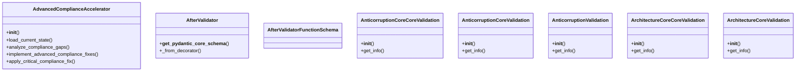

## Section 2

```mermaid
classDiagram
    class ArchitectureValidation {
        +__init__()
        +get_info()
    }
    class AuthServiceServicesServicesValidation {
        +__init__()
        +get_info()
    }
    class AuthServiceServicesValidation {
        +__init__()
        +get_info()
    }
    class AuthServiceValidation {
        +__init__()
        +get_info()
    }
    class AutomatedComplianceEnforcement {
        +__init__()
        +create_pre_commit_hooks()
        +create_compliance_check_hook()
        +create_auto_fix_hook()
        +create_documentation_hook()
    }
    class AutomatedDocumentationGeneratorValidation {
        +__init__()
        +get_info()
    }
    class AutomatedQualityGatesCoreCoreValidation {
        +__init__()
        +get_info()
    }
    class AutomatedQualityGatesCoreValidation {
        +__init__()
        +get_info()
    }
```

## Section 3

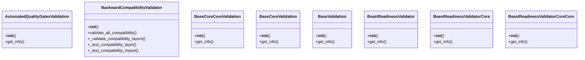

## Section 4

```mermaid
classDiagram
    class BeastReadinessValidatorCoreCoreValidation {
        +__init__()
        +get_info()
    }
    class BeastReadinessValidatorCoreValidation {
        +__init__()
        +get_info()
    }
    class BeastReadinessValidatorValidation {
        +__init__()
        +get_info()
    }
    class BeforeValidator {
        +__get_pydantic_core_schema__()
        +_from_decorator()
    }
    class BeforeValidatorFunctionSchema {
    }
    class BoundaryResolverCoreCoreValidation {
        +__init__()
        +get_info()
    }
    class BoundaryResolverCoreValidation {
        +__init__()
        +get_info()
    }
    class BoundaryResolverValidation {
        +__init__()
        +get_info()
    }
```

## Section 5

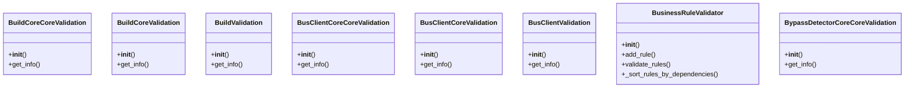

## Section 6

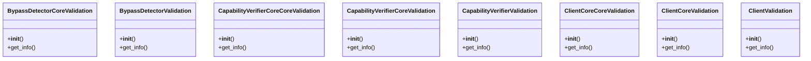

## Section 7

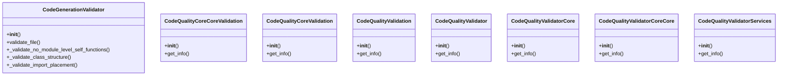

## Section 8

```mermaid
classDiagram
    class CodeQualityValidatorServicesCore {
        +__init__()
        +get_info()
    }
    class CodeQualityValidatorServicesCoreCore {
        +__init__()
        +get_info()
    }
    class CodeQualityValidatorServicesServices {
        +__init__()
        +get_info()
    }
    class CodeQualityValidatorServicesServicesCore {
        +__init__()
        +get_info()
    }
    class CodeQualityValidatorServicesServicesValidation {
        +__init__()
        +get_info()
    }
    class CodeQualityValidatorServicesValidation {
        +__init__()
        +get_info()
    }
    class CodeQualityValidatorValidation {
        +__init__()
        +get_info()
    }
    class CodeValidator {
        +validate_syntax()
        +check_quality()
    }
```

## Section 9

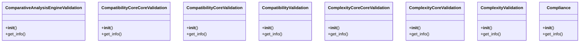

## Section 10

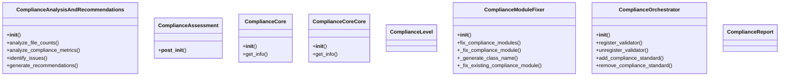

## Section 11

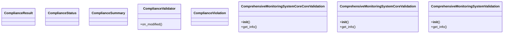

## Section 12

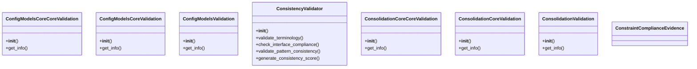

## Section 13

```mermaid
classDiagram
    class ConstraintComplianceValidator {
        +__init__()
        +get_module_status()
        +is_healthy()
        +get_health_indicators()
        +_get_primary_responsibility()
    }
    class ConstraintComplianceValidatorCore {
        +__init__()
        +get_info()
    }
    class ConstraintComplianceValidatorCoreCore {
        +__init__()
        +get_info()
    }
    class ConstraintComplianceValidatorCoreCoreValidation {
        +__init__()
        +get_info()
    }
    class ConstraintComplianceValidatorCoreValidation {
        +__init__()
        +get_info()
    }
    class ConstraintComplianceValidatorValidation {
        +__init__()
        +get_info()
    }
    class ConstraintResolverCoreCoreValidation {
        +__init__()
        +get_info()
    }
    class ConstraintResolverCoreValidation {
        +__init__()
        +get_info()
    }
```

## Section 14

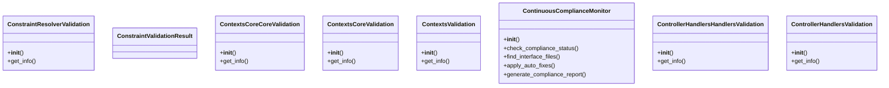

## Section 15

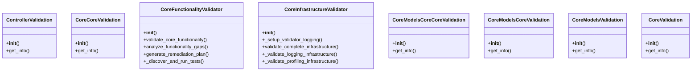

## Section 16

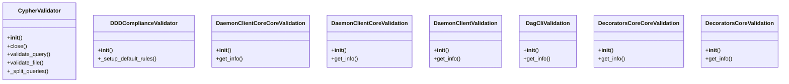

## Section 17

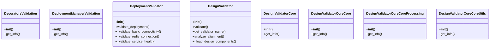

## Section 18

```mermaid
classDiagram
    class DesignValidatorCoreCoreValidation {
        +__init__()
        +get_info()
    }
    class DesignValidatorCoreProcessing {
        +__init__()
        +get_info()
    }
    class DesignValidatorCoreUtils {
        +__init__()
        +get_info()
    }
    class DesignValidatorCoreValidation {
        +__init__()
        +get_info()
    }
    class DesignValidatorProcessing {
        +__init__()
        +get_info()
    }
    class DesignValidatorUtils {
        +__init__()
        +get_info()
    }
    class DesignValidatorValidation {
        +__init__()
        +get_info()
    }
    class DocumentManagementRmCoreCoreValidation {
        +__init__()
        +get_info()
    }
```

## Section 19

```mermaid
classDiagram
    class DocumentManagementRmCoreValidation {
        +__init__()
        +get_info()
    }
    class DocumentManagementRmValidation {
        +__init__()
        +get_info()
    }
    class DomainCacheCoreCoreValidation {
        +__init__()
        +get_info()
    }
    class DomainCacheCoreValidation {
        +__init__()
        +get_info()
    }
    class DomainCacheValidation {
        +__init__()
        +get_info()
    }
    class DomainInitializerCoreCoreValidation {
        +__init__()
        +get_info()
    }
    class DomainInitializerCoreValidation {
        +__init__()
        +get_info()
    }
    class DomainInitializerValidation {
        +__init__()
        +get_info()
    }
```

## Section 20

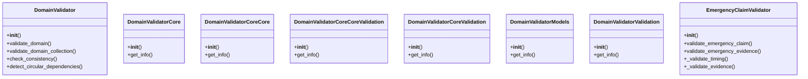

## Section 21

```mermaid
classDiagram
    class EmergencyComplianceFixer {
        +__init__()
        +fix_import_paths()
        +configure_timeouts()
        +fix_syntax_errors_quick()
        +generate_honest_compliance_report()
    }
    class EmergencyValidator {
        +__init__()
        +get_info()
    }
    class EmergencyValidatorValidation {
        +__init__()
        +get_info()
    }
    class EnhancedComplianceMonitor {
        +__init__()
        +get_info()
    }
    class EnhancedMultiPerspectiveValidator {
        +__init__()
        +get_module_status()
        +is_healthy()
        +get_health_indicators()
        +_get_primary_responsibility()
    }
    class EnhancedMultiPerspectiveValidatorCore {
        +__init__()
        +get_info()
    }
    class EnhancedMultiPerspectiveValidatorCoreCore {
        +__init__()
        +get_info()
    }
    class EnhancedMultiPerspectiveValidatorCoreCoreUtils {
        +__init__()
        +get_info()
    }
```

## Section 22

```mermaid
classDiagram
    class EnhancedMultiPerspectiveValidatorCoreCoreValidation {
        +__init__()
        +get_info()
    }
    class EnhancedMultiPerspectiveValidatorCoreUtils {
        +__init__()
        +get_info()
    }
    class EnhancedMultiPerspectiveValidatorCoreValidation {
        +__init__()
        +get_info()
    }
    class EnhancedMultiPerspectiveValidatorUtils {
        +__init__()
        +get_info()
    }
    class EnhancedMultiPerspectiveValidatorValidation {
        +__init__()
        +get_info()
    }
    class EnhancedValidationFramework {
        +__init__()
        +get_info()
    }
    class EntitiesCoreCoreValidation {
        +__init__()
        +get_info()
    }
    class EntitiesCoreValidation {
        +__init__()
        +get_info()
    }
```

## Section 23

```mermaid
classDiagram
    class EntitiesValidation {
        +__init__()
        +get_info()
    }
    class ErrorHandlerHandlersHandlersValidation {
        +__init__()
        +get_info()
    }
    class ErrorHandlerHandlersValidation {
        +__init__()
        +get_info()
    }
    class ErrorHandlerValidation {
        +__init__()
        +get_info()
    }
    class EventSourcingCoreCoreValidation {
        +__init__()
        +get_info()
    }
    class EventSourcingCoreValidation {
        +__init__()
        +get_info()
    }
    class EventSourcingValidation {
        +__init__()
        +get_info()
    }
    class EventsCoreCoreValidation {
        +__init__()
        +get_info()
    }
```

## Section 24

```mermaid
classDiagram
    class EventsCoreValidation {
        +__init__()
        +get_info()
    }
    class EventsValidation {
        +__init__()
        +get_info()
    }
    class EvidencePackageGeneratorCoreCoreValidation {
        +__init__()
        +get_info()
    }
    class EvidencePackageGeneratorCoreValidation {
        +__init__()
        +get_info()
    }
    class EvidencePackageGeneratorValidation {
        +__init__()
        +get_info()
    }
    class FieldValidatorDecoratorInfo {
    }
    class FileChangeDetectorCoreCoreValidation {
        +__init__()
        +get_info()
    }
    class FileChangeDetectorCoreValidation {
        +__init__()
        +get_info()
    }
```

## Section 25

```mermaid
classDiagram
    class FileChangeDetectorValidation {
        +__init__()
        +get_info()
    }
    class FileMonitorCoreCoreValidation {
        +__init__()
        +get_info()
    }
    class FileMonitorCoreValidation {
        +__init__()
        +get_info()
    }
    class FileMonitorValidation {
        +__init__()
        +get_info()
    }
    class FileValidationError {
    }
    class FinalCompliancePushSystem {
        +__init__()
        +_get_all_python_files()
        +_analyze_file_compliance()
        +_fix_large_files_surgically()
        +_implement_reflective_module_surgically()
    }
    class FinalComplianceStatusReport {
        +__init__()
        +get_current_syntax_compliance()
        +validate_corrective_actions()
        +assess_system_status()
        +generate_final_report()
    }
    class FreeModelBeforeValidator {
        +__call__()
    }
```

## Section 26

```mermaid
classDiagram
    class FreeModelBeforeValidatorWithoutInfo {
        +__call__()
    }
    class FullComplianceSpreadEngine {
        +__init__()
        +load_enhanced_data()
        +backup_file()
        +analyze_compliance_gaps()
        +analyze_interface_improvements()
    }
    class FunctionalityValidator {
        +__init__()
        +get_info()
    }
    class FunctionalityValidatorCore {
        +__init__()
        +get_info()
    }
    class FunctionalityValidatorCoreCore {
        +__init__()
        +get_info()
    }
    class FunctionalityValidatorCoreCoreValidation {
        +__init__()
        +get_info()
    }
    class FunctionalityValidatorCoreValidation {
        +__init__()
        +get_info()
    }
    class FunctionalityValidatorValidation {
        +__init__()
        +get_info()
    }
```

## Section 27

```mermaid
classDiagram
    class GeneratorsCoreCoreValidation {
        +__init__()
        +get_info()
    }
    class GeneratorsCoreValidation {
        +__init__()
        +get_info()
    }
    class GeneratorsValidation {
        +__init__()
        +get_info()
    }
    class GitProviderCoreCoreValidation {
        +__init__()
        +get_info()
    }
    class GitProviderCoreValidation {
        +__init__()
        +get_info()
    }
    class GitProviderValidation {
        +__init__()
        +get_info()
    }
    class GovernanceValidation {
        +__init__()
        +get_info()
    }
    class GracefulDegradationManagerValidation {
        +__init__()
        +get_info()
    }
```

## Section 28

```mermaid
classDiagram
    class GraphValidationResult {
    }
    class HandlerValidation {
        +__init__()
        +get_info()
    }
    class HealthMonitorCoreCoreValidation {
        +__init__()
        +get_info()
    }
    class HealthMonitorCoreValidation {
        +__init__()
        +get_info()
    }
    class HealthMonitorValidation {
        +__init__()
        +get_info()
    }
    class HealthMonitoringCoreCoreValidation {
        +__init__()
        +get_info()
    }
    class HealthMonitoringCoreValidation {
        +__init__()
        +get_info()
    }
    class HealthMonitoringValidation {
        +__init__()
        +get_info()
    }
```

## Section 29

```mermaid
classDiagram
    class HonestComplianceReporter {
        +__init__()
        +check_syntax_compliance()
        +generate_honest_report()
    }
    class HubrisDetectorCoreCoreValidation {
        +__init__()
        +get_info()
    }
    class HubrisDetectorCoreValidation {
        +__init__()
        +get_info()
    }
    class HubrisDetectorValidation {
        +__init__()
        +get_info()
    }
    class HumanExpertiseValidator {
        +__init__()
        +validate_fix()
        +preserves_intent()
        +extract_structure()
        +check_common_pitfalls()
    }
    class HumilityEnforcerCoreCoreValidation {
        +__init__()
        +get_info()
    }
    class HumilityEnforcerCoreValidation {
        +__init__()
        +get_info()
    }
    class HumilityEnforcerValidation {
        +__init__()
        +get_info()
    }
```

## Section 30

```mermaid
classDiagram
    class IndentationValidator {
        +__init__()
        +validate_file()
        +validate_files()
    }
    class InfrastructureIntegrationManagerServicesServicesValidation {
        +__init__()
        +get_info()
    }
    class InfrastructureIntegrationManagerServicesValidation {
        +__init__()
        +get_info()
    }
    class InfrastructureIntegrationManagerValidation {
        +__init__()
        +get_info()
    }
    class InstallationSetupValidator {
        +__init__()
        +validate_installation_setup()
        +validate_installation_reliability()
        +generate_installation_guide()
        +_validate_configuration_files()
    }
    class InstallationValidator {
        +__init__()
        +get_info()
    }
    class InstallationValidatorCore {
        +__init__()
        +get_info()
    }
    class InstallationValidatorCoreCore {
        +__init__()
        +get_info()
    }
```

## Section 31

```mermaid
classDiagram
    class InstallationValidatorCoreCoreValidation {
        +__init__()
        +get_info()
    }
    class InstallationValidatorCoreValidation {
        +__init__()
        +get_info()
    }
    class InstallationValidatorCoreValidationValidation {
        +__init__()
        +get_info()
    }
    class InstallationValidatorValidation {
        +__init__()
        +get_info()
    }
    class InstallationValidatorValidationValidation {
        +__init__()
        +get_info()
    }
    class InstallationValidatorValidationValidationValidation {
        +__init__()
        +get_info()
    }
    class IntegrationValidator {
        +__init__()
        +validate_github_mcp()
        +validate_simone_mcp()
        +validate_docker_github_mcp()
        +validate_interface_registry()
    }
    class InterfacesCoreCoreValidation {
        +__init__()
        +get_info()
    }
```

## Section 32

```mermaid
classDiagram
    class InterfacesCoreValidation {
        +__init__()
        +get_info()
    }
    class InterfacesValidation {
        +__init__()
        +get_info()
    }
    class InvariantValidator {
        +__init__()
        +add_invariant()
        +validate_invariants()
        +_evaluate_invariant()
    }
    class LinkValidationRule {
        +__init__()
        +get_module_info()
        +get_capabilities()
        +get_dependencies()
        +check_health()
    }
    class LinkvalidationruleInterface {
        +__init__()
        +get_info()
    }
    class LuhnValidationError {
    }
    class MCPConfigValidator {
        +__init__()
        +validate_and_fix_mcp_config()
        +load_mcp_config()
        +validate_server_configurations()
        +validate_single_server()
    }
    class MakefileHealthManagerValidation {
        +__init__()
        +get_info()
    }
```

## Section 33

```mermaid
classDiagram
    class MakefileIntegratorCoreCoreValidation {
        +__init__()
        +get_info()
    }
    class MakefileIntegratorCoreValidation {
        +__init__()
        +get_info()
    }
    class MakefileIntegratorValidation {
        +__init__()
        +get_info()
    }
    class MamaDiscovererCoreCoreValidation {
        +__init__()
        +get_info()
    }
    class MamaDiscovererCoreValidation {
        +__init__()
        +get_info()
    }
    class MamaDiscovererValidation {
        +__init__()
        +get_info()
    }
    class ManagerServicesServicesValidation {
        +__init__()
        +get_info()
    }
    class ManagerServicesValidation {
        +__init__()
        +get_info()
    }
```

## Section 34

```mermaid
classDiagram
    class ManagerValidation {
        +__init__()
        +get_info()
    }
    class MessageHandlersCoreCoreValidation {
        +__init__()
        +get_info()
    }
    class MessageHandlersCoreValidation {
        +__init__()
        +get_info()
    }
    class MessageHandlersHandlersHandlersValidation {
        +__init__()
        +get_info()
    }
    class MessageHandlersHandlersValidation {
        +__init__()
        +get_info()
    }
    class MessageHandlersValidation {
        +__init__()
        +get_info()
    }
    class MessageModelsCoreCoreValidation {
        +__init__()
        +get_info()
    }
    class MessageModelsCoreValidation {
        +__init__()
        +get_info()
    }
```

## Section 35

```mermaid
classDiagram
    class MessageModelsValidation {
        +__init__()
        +get_info()
    }
    class MessageRouterCoreCoreValidation {
        +__init__()
        +get_info()
    }
    class MessageRouterCoreValidation {
        +__init__()
        +get_info()
    }
    class MessageRouterValidation {
        +__init__()
        +get_info()
    }
    class MessageValidationError {
    }
    class MigrationCoreCoreValidation {
        +__init__()
        +get_info()
    }
    class MigrationCoreValidation {
        +__init__()
        +get_info()
    }
    class MigrationValidation {
        +__init__()
        +get_info()
    }
```

## Section 36

```mermaid
classDiagram
    class ModelBeforeValidator {
        +__call__()
    }
    class ModelBeforeValidatorWithoutInfo {
        +__call__()
    }
    class ModelValidatorDecoratorInfo {
    }
    class ModelWrapValidator {
        +__call__()
    }
    class ModelWrapValidatorHandler {
        +__call__()
    }
    class ModelWrapValidatorWithoutInfo {
        +__call__()
    }
    class ModelsCoreCoreValidation {
        +__init__()
        +get_info()
    }
    class ModelsCoreValidation {
        +__init__()
        +get_info()
    }
```

## Section 37

```mermaid
classDiagram
    class ModelsCoreValidationValidation {
        +__init__()
        +get_info()
    }
    class ModelsModelsModelsValidation {
        +__init__()
        +get_info()
    }
    class ModelsModelsValidation {
        +__init__()
        +get_info()
    }
    class ModelsValidation {
        +__init__()
        +get_info()
    }
    class ModelsValidationValidation {
        +__init__()
        +get_info()
    }
    class ModelsValidationValidationValidation {
        +__init__()
        +get_info()
    }
    class ModuleCompletenessValidator {
        +__init__()
        +find_all_python_files()
        +extract_imports()
        +is_local_import()
        +convert_import_to_path()
    }
    class ModuleCompliance {
    }
```

## Section 38

```mermaid
classDiagram
    class MonitoringCoreCoreValidation {
        +__init__()
        +get_info()
    }
    class MonitoringCoreValidation {
        +__init__()
        +get_info()
    }
    class MonitoringSystemCleanCoreCoreValidation {
        +__init__()
        +get_info()
    }
    class MonitoringSystemCleanCoreValidation {
        +__init__()
        +get_info()
    }
    class MonitoringSystemCleanValidation {
        +__init__()
        +get_info()
    }
    class MonitoringValidation {
        +__init__()
        +get_info()
    }
    class MpmDashboardCoreCoreValidation {
        +__init__()
        +get_info()
    }
    class MpmDashboardCoreValidation {
        +__init__()
        +get_info()
    }
```

## Section 39

```mermaid
classDiagram
    class MpmDashboardValidation {
        +__init__()
        +get_info()
    }
    class MultiAgentCollaborationModelValidation {
        +__init__()
        +get_info()
    }
    class MultiPerspectiveValidator {
        +__init__()
        +get_module_status()
        +is_healthy()
        +get_health_indicators()
        +_get_primary_responsibility()
    }
    class MultiPerspectiveValidatorCore {
        +__init__()
        +get_info()
    }
    class MultiPerspectiveValidatorCoreCore {
        +__init__()
        +get_info()
    }
    class MultiPerspectiveValidatorCoreCoreValidation {
        +__init__()
        +get_info()
    }
    class MultiPerspectiveValidatorCoreValidation {
        +__init__()
        +get_info()
    }
    class MultiPerspectiveValidatorValidation {
        +__init__()
        +get_info()
    }
```

## Section 40

```mermaid
classDiagram
    class MvpCalculatorCoreCoreValidation {
        +__init__()
        +get_info()
    }
    class MvpCalculatorCoreValidation {
        +__init__()
        +get_info()
    }
    class MvpCalculatorValidation {
        +__init__()
        +get_info()
    }
    class NameValidator {
        +__init__()
        +validate()
        +__call__()
    }
    class NoInfoValidatorFunctionSchema {
    }
    class NoInfoWrapValidatorFunctionSchema {
    }
    class NotificationModelsCoreCoreValidation {
        +__init__()
        +get_info()
    }
    class NotificationModelsCoreValidation {
        +__init__()
        +get_info()
    }
```

## Section 41

```mermaid
classDiagram
    class NotificationModelsValidation {
        +__init__()
        +get_info()
    }
    class OperationalDashboardManagerValidation {
        +__init__()
        +get_info()
    }
    class OrchestrationEngineValidation {
        +__init__()
        +get_info()
    }
    class OrchestratorCoreCoreValidation {
        +__init__()
        +get_info()
    }
    class OrchestratorCoreValidation {
        +__init__()
        +get_info()
    }
    class OrchestratorValidation {
        +__init__()
        +get_info()
    }
    class PDCAValidator {
        +validate_task()
        +validate_plan_result()
        +validate_do_result()
        +validate_check_result()
        +validate_act_result()
    }
    class PathNormalizerCoreCoreValidation {
        +__init__()
        +get_info()
    }
```

## Section 42

```mermaid
classDiagram
    class PathNormalizerCoreValidation {
        +__init__()
        +get_info()
    }
    class PathNormalizerValidation {
        +__init__()
        +get_info()
    }
    class PathValidator {
        +is_safe_path()
        +validate_file_extension()
        +validate_path_length()
    }
    class PdcaOrchestratorCoreCoreValidation {
        +__init__()
        +get_info()
    }
    class PdcaOrchestratorCoreValidation {
        +__init__()
        +get_info()
    }
    class PerformanceCoreCoreValidation {
        +__init__()
        +get_info()
    }
    class PerformanceCoreValidation {
        +__init__()
        +get_info()
    }
    class PerformanceMonitorCoreCoreValidation {
        +__init__()
        +get_info()
    }
```

## Section 43

```mermaid
classDiagram
    class PerformanceMonitorCoreValidation {
        +__init__()
        +get_info()
    }
    class PerformanceMonitorValidation {
        +__init__()
        +get_info()
    }
    class PerformanceValidation {
        +__init__()
        +get_info()
    }
    class Phase3ReadinessAssessorCoreCoreValidation {
        +__init__()
        +get_info()
    }
    class Phase3ReadinessAssessorCoreValidation {
        +__init__()
        +get_info()
    }
    class Phase3ReadinessAssessorValidation {
        +__init__()
        +get_info()
    }
    class PlainValidator {
        +__get_pydantic_core_schema__()
        +_from_decorator()
    }
    class PlainValidatorFunctionSchema {
    }
```

## Section 44

```mermaid
classDiagram
    class PlatformOrchestratorsCoreCoreValidation {
        +__init__()
        +get_info()
    }
    class PlatformOrchestratorsCoreValidation {
        +__init__()
        +get_info()
    }
    class PlatformOrchestratorsValidation {
        +__init__()
        +get_info()
    }
    class PluggableSchemaValidator {
        +__init__()
        +__getattr__()
    }
    class PreCommitValidator {
        +__init__()
        +run_module_completeness_check()
        +run_import_tests()
        +run_component_tests()
        +run_quality_checks()
    }
    class ProductionInfrastructureModelValidation {
        +__init__()
        +get_info()
    }
    class ProjectGeneratorCoreCoreValidation {
        +__init__()
        +get_info()
    }
    class ProjectGeneratorCoreValidation {
        +__init__()
        +get_info()
    }
```

## Section 45

```mermaid
classDiagram
    class ProjectGeneratorValidation {
        +__init__()
        +get_info()
    }
    class ProjectModelsCoreCoreValidation {
        +__init__()
        +get_info()
    }
    class ProjectModelsCoreValidation {
        +__init__()
        +get_info()
    }
    class ProjectModelsValidation {
        +__init__()
        +get_info()
    }
    class RDIComplianceLevel {
    }
    class RDIValidationResult {
    }
    class RDIValidationType {
    }
    class RDIValidator {
        +__init__()
        +_initialize_compliance_standards()
        +validate_component()
        +_perform_validation()
        +_validate_requirements_traceability()
    }
```

## Section 46

```mermaid
classDiagram
    class RMComplianceAnalyzer {
        +analyze_module()
        +_has_reflective_module_inheritance()
        +_find_missing_methods()
        +_calculate_compliance_score()
    }
    class RMComplianceAssessmentTool {
        +__init__()
        +assess_all_modules()
        +_assess_single_module()
        +_check_registry_integration()
        +_generate_compliance_report()
    }
    class RMComplianceValidator {
        +__init__()
        +validate_all_modules()
        +validate_module()
        +_get_module_name()
        +_assess_size_compliance()
    }
    class RMValidator {
        +__init__()
        +validate_rm_interface_implementation()
        +check_size_constraints()
        +validate_health_monitoring()
        +check_registry_integration()
    }
    class RdiChainOrchestratorValidation {
        +__init__()
        +get_info()
    }
    class RdiRmAnalysisSystemCoreCoreValidation {
        +__init__()
        +get_info()
    }
    class RdiRmAnalysisSystemCoreValidation {
        +__init__()
        +get_info()
    }
    class RdiRmAnalysisSystemValidation {
        +__init__()
        +get_info()
    }
```

## Section 47

```mermaid
classDiagram
    class RdiValidator {
        +__init__()
        +get_info()
    }
    class RdiValidatorCore {
        +__init__()
        +get_info()
    }
    class RdiValidatorCoreCore {
        +__init__()
        +get_info()
    }
    class RdiValidatorCoreCoreValidation {
        +__init__()
        +get_info()
    }
    class RdiValidatorCoreValidation {
        +__init__()
        +get_info()
    }
    class RdiValidatorValidation {
        +__init__()
        +get_info()
    }
    class ReadinessValidation {
        +__post_init__()
    }
    class RealityCheckerValidation {
        +__init__()
        +get_info()
    }
```

## Section 48

```mermaid
classDiagram
    class RefactoringValidator {
        +__init__()
        +validate_module()
        +_validate_syntax()
        +_validate_imports()
        +_validate_rm_ddd_compliance()
    }
    class RemediationGuideCoreCoreValidation {
        +__init__()
        +get_info()
    }
    class RemediationGuideCoreValidation {
        +__init__()
        +get_info()
    }
    class RemediationGuideValidation {
        +__init__()
        +get_info()
    }
    class ReportGeneratorCoreCoreValidation {
        +__init__()
        +get_info()
    }
    class ReportGeneratorCoreValidation {
        +__init__()
        +get_info()
    }
    class ReportGeneratorValidation {
        +__init__()
        +get_info()
    }
    class RepositoriesCoreCoreValidation {
        +__init__()
        +get_info()
    }
```

## Section 49

```mermaid
classDiagram
    class RepositoriesCoreValidation {
        +__init__()
        +get_info()
    }
    class RepositoriesValidation {
        +__init__()
        +get_info()
    }
    class RequirementTracerCoreCoreValidation {
        +__init__()
        +get_info()
    }
    class RequirementTracerCoreValidation {
        +__init__()
        +get_info()
    }
    class RequirementTracerValidation {
        +__init__()
        +get_info()
    }
    class RequirementsValidator {
        +__init__()
        +_setup_logging()
        +_initialize_validation_rules()
        +load_requirements_from_file()
        +_load_from_json()
    }
    class RmValidator {
        +__init__()
        +get_info()
    }
    class RmValidatorCore {
        +__init__()
        +get_info()
    }
```

## Section 50

```mermaid
classDiagram
    class RmValidatorCoreCore {
        +__init__()
        +get_info()
    }
    class RmValidatorCoreCoreValidation {
        +__init__()
        +get_info()
    }
    class RmValidatorCoreValidation {
        +__init__()
        +get_info()
    }
    class RmValidatorValidation {
        +__init__()
        +get_info()
    }
    class RootValidatorDecoratorInfo {
    }
    class SafetyCoreCoreValidation {
        +__init__()
        +get_info()
    }
    class SafetyCoreValidation {
        +__init__()
        +get_info()
    }
    class SafetyValidation {
        +__init__()
        +get_info()
    }
```

## Section 51

```mermaid
classDiagram
    class SafetyValidator {
        +__init__()
        +validate_read_only_access()
        +validate_no_system_modifications()
        +validate_isolation()
    }
    class SchemaValidator {
        +__init__()
        +validate_schema()
        +_basic_schema_validation()
    }
    class SecurityCoreCoreValidation {
        +__init__()
        +get_info()
    }
    class SecurityCoreValidation {
        +__init__()
        +get_info()
    }
    class SecurityManagerValidation {
        +__init__()
        +get_info()
    }
    class SecurityValidation {
        +__init__()
        +get_info()
    }
    class SecurityValidationResult {
    }
    class SelfConsistencyValidator {
        +__init__()
        +get_info()
    }
```

## Section 52

```mermaid
classDiagram
    class SelfConsistencyValidatorCore {
        +__init__()
        +get_info()
    }
    class SelfConsistencyValidatorCoreCore {
        +__init__()
        +get_info()
    }
    class SelfConsistencyValidatorCoreCoreValidation {
        +__init__()
        +get_module_info()
        +get_capabilities()
        +get_health_status()
        +graceful_degradation()
    }
    class SelfConsistencyValidatorCoreValidation {
        +__init__()
        +get_info()
    }
    class SelfConsistencyValidatorCoreValidationValidation {
        +__init__()
        +get_info()
    }
    class SelfConsistencyValidatorValidation {
        +__init__()
        +get_info()
    }
    class SelfConsistencyValidatorValidationValidation {
        +__init__()
        +get_info()
    }
    class SelfConsistencyValidatorValidationValidationValidation {
        +__init__()
        +get_info()
    }
```

## Section 53

```mermaid
classDiagram
    class SelfValidationProtocol {
        +__init__()
        +validate_tool_effectiveness()
        +_test_ast_parsing()
        +_test_method_implementation()
        +_test_functional_capability()
    }
    class SeparationCoreCoreValidation {
        +__init__()
        +get_info()
    }
    class SeparationCoreValidation {
        +__init__()
        +get_info()
    }
    class SeparationValidation {
        +__init__()
        +get_info()
    }
    class ServiceMonitorServicesServicesValidation {
        +__init__()
        +get_info()
    }
    class ServiceMonitorServicesValidation {
        +__init__()
        +get_info()
    }
    class ServiceMonitorValidation {
        +__init__()
        +get_info()
    }
    class ServicesServicesServicesValidation {
        +__init__()
        +get_info()
    }
```

## Section 54

```mermaid
classDiagram
    class ServicesServicesValidation {
        +__init__()
        +get_info()
    }
    class ServicesValidation {
        +__init__()
        +get_info()
    }
    class SharedKernelCoreCoreValidation {
        +__init__()
        +get_info()
    }
    class SharedKernelCoreValidation {
        +__init__()
        +get_info()
    }
    class SharedKernelValidation {
        +__init__()
        +get_info()
    }
    class SkipValidation {
        +__class_getitem__()
        +__get_pydantic_core_schema__()
    }
    class SpecToCodeModelValidation {
        +__init__()
        +get_info()
    }
    class SporeManagerServicesServicesValidation {
        +__init__()
        +get_info()
    }
```

## Section 55

```mermaid
classDiagram
    class SporeManagerServicesValidation {
        +__init__()
        +get_info()
    }
    class SporeManagerValidation {
        +__init__()
        +get_info()
    }
    class StandardGitProviderCoreCoreValidation {
        +__init__()
        +get_info()
    }
    class StandardGitProviderCoreValidation {
        +__init__()
        +get_info()
    }
    class StandardGitProviderValidation {
        +__init__()
        +get_info()
    }
    class SuperiorityEngineValidation {
        +__init__()
        +get_info()
    }
    class SyncModelsCoreCoreValidation {
        +__init__()
        +get_info()
    }
    class SyncModelsCoreValidation {
        +__init__()
        +get_info()
    }
```

## Section 56

```mermaid
classDiagram
    class SyncModelsValidation {
        +__init__()
        +get_info()
    }
    class SystemValidationResult {
    }
    class SystematicComplianceImprovementEngine {
        +__init__()
        +load_audit_results()
        +backup_file()
        +fix_error_handling_violations()
        +fix_type_annotation_violations()
    }
    class SystematicSuperiorityModelValidation {
        +__init__()
        +get_info()
    }
    class SystematicValidationEngine {
        +__init__()
        +_serialize_validation_result()
        +_serialize_system_validation_result()
        +_generate_validation_evidence_package()
        +get_module_status()
    }
    class TagValidationRule {
        +__init__()
        +get_module_info()
        +get_capabilities()
        +get_dependencies()
        +check_health()
    }
    class TagvalidationruleInterface {
        +__init__()
        +get_info()
    }
    class TargetedComplianceFixer {
        +__init__()
        +create_syntax_validation_gate()
        +fix_import_paths_in_scripts()
        +create_honest_compliance_reporter()
        +create_rollback_mechanism()
    }
```

## Section 57

```mermaid
classDiagram
    class TargetedComplianceImprovementSystem {
        +__init__()
        +_get_all_python_files()
        +_analyze_file_compliance()
        +_implement_reflective_module_string_based()
        +_implement_health_monitoring_string_based()
    }
    class TaskDagRmCoreCoreValidation {
        +__init__()
        +get_info()
    }
    class TaskDagRmCoreValidation {
        +__init__()
        +get_info()
    }
    class TaskDagRmValidation {
        +__init__()
        +get_info()
    }
    class TeamValidationRule {
        +__init__()
        +get_module_info()
        +get_capabilities()
        +get_dependencies()
        +check_health()
    }
    class TeamvalidationruleInterface {
        +__init__()
        +get_info()
    }
    class TechnicalValidationResult {
    }
    class TimeoutHandlerHandlersHandlersValidation {
        +__init__()
        +get_info()
    }
```

## Section 58

```mermaid
classDiagram
    class TimeoutHandlerHandlersValidation {
        +__init__()
        +get_info()
    }
    class TimeoutHandlerValidation {
        +__init__()
        +get_info()
    }
    class ToolHealthManagerValidation {
        +__init__()
        +get_info()
    }
    class ToolOrchestrationEngineServicesServicesValidation {
        +__init__()
        +get_info()
    }
    class ToolOrchestrationEngineServicesValidation {
        +__init__()
        +get_info()
    }
    class ToolOrchestrationEngineValidation {
        +__init__()
        +get_info()
    }
    class ToolOrchestratorUtilsUtilsValidation {
        +__init__()
        +get_info()
    }
    class ToolOrchestratorUtilsValidation {
        +__init__()
        +get_info()
    }
```

## Section 59

```mermaid
classDiagram
    class ToolOrchestratorValidation {
        +__init__()
        +get_info()
    }
    class V1OnlyValueValidator {
        +__call__()
    }
    class V1RootValidatorFunction {
        +__call__()
    }
    class V1ValidatorWithKwargs {
        +__call__()
    }
    class V1ValidatorWithValues {
        +__call__()
    }
    class V1ValidatorWithValuesAndKwargs {
        +__call__()
    }
    class V1ValidatorWithValuesKwOnly {
        +__call__()
    }
    class V2CoreAfterRootValidator {
        +__call__()
    }
```

## Section 60

```mermaid
classDiagram
    class V2CoreBeforeRootValidator {
        +__call__()
    }
    class Validation {
        +__init__()
        +get_info()
    }
    class ValidationCategory {
        +__init__()
        +get_module_info()
        +get_capabilities()
        +get_dependencies()
        +check_health()
    }
    class ValidationCertificate {
        +__post_init__()
    }
    class ValidationContext {
        +__init__()
        +get_module_info()
        +get_capabilities()
        +get_dependencies()
        +check_health()
    }
    class ValidationCore {
        +__init__()
        +get_info()
    }
    class ValidationCoreCore {
        +__init__()
        +get_info()
    }
    class ValidationCoreCoreValidation {
        +__init__()
        +get_info()
    }
```

## Section 61

```mermaid
classDiagram
    class ValidationCoreValidation {
        +__init__()
        +get_info()
    }
    class ValidationCriterion {
    }
    class ValidationEngine {
        +__init__()
        +get_info()
    }
    class ValidationEngineCore {
        +__init__()
        +get_info()
    }
    class ValidationEngineMethods {
        +__init__()
        +get_info()
    }
    class ValidationEngineMethodsContentqualityrule {
        +__init__()
        +get_info()
    }
    class ValidationEngineMethodsCoreCoreValidation {
        +__init__()
        +get_info()
    }
    class ValidationEngineMethodsCoreValidation {
        +__init__()
        +get_info()
    }
```

## Section 62

```mermaid
classDiagram
    class ValidationEngineMethodsInit {
        +__init__()
        +get_info()
    }
    class ValidationEngineMethodsLinkvalidationrule {
        +__init__()
        +get_info()
    }
    class ValidationEngineMethodsRequiredfieldrule {
        +__init__()
        +get_info()
    }
    class ValidationEngineMethodsServices {
        +__init__()
        +get_info()
    }
    class ValidationEngineMethodsTagvalidationrule {
        +__init__()
        +get_info()
    }
    class ValidationEngineMethodsTagvalidationruleTagvalidationrule {
        +__init__()
        +get_info()
    }
    class ValidationEngineMethodsTeamvalidationrule {
        +__init__()
        +get_info()
    }
    class ValidationEngineMethodsValidation {
        +__init__()
        +get_info()
    }
```

## Section 63

```mermaid
classDiagram
    class ValidationEngineMethodsValidationcategory {
        +__init__()
        +get_info()
    }
    class ValidationEngineMethodsValidationcontext {
        +__init__()
        +get_info()
    }
    class ValidationEngineMethodsValidationissue {
        +__init__()
        +get_info()
    }
    class ValidationEngineMethodsValidationreport {
        +__init__()
        +get_info()
    }
    class ValidationEngineMethodsValidationrule {
        +__init__()
        +get_info()
    }
    class ValidationEngineMethodsValidationseverity {
        +__init__()
        +get_info()
    }
    class ValidationEngineServices {
        +__init__()
        +get_info()
    }
    class ValidationError {
    }
```

## Section 64

```mermaid
classDiagram
    class ValidationFramework {
        +__init__()
        +calculate_confidence()
        +get_validation_dimensions()
    }
    class ValidationFrameworkCore {
        +__init__()
        +get_info()
    }
    class ValidationFrameworkCoreCore {
        +__init__()
        +get_info()
    }
    class ValidationFrameworkCoreCoreValidation {
        +__init__()
        +get_info()
    }
    class ValidationFrameworkCoreValidation {
        +__init__()
        +get_info()
    }
    class ValidationFrameworkValidation {
        +__init__()
        +get_info()
    }
    class ValidationInfo {
        +context()
        +config()
        +mode()
        +data()
        +field_name()
    }
    class ValidationIssue {
        +is_blocking()
    }
```

## Section 65

```mermaid
classDiagram
    class ValidationLevel {
    }
    class ValidationModels {
        +__init__()
        +get_info()
    }
    class ValidationModelsValidationresult {
        +__init__()
        +get_info()
    }
    class ValidationModelsValidationresultValidationresult {
        +__init__()
        +get_info()
    }
    class ValidationNode {
        +__init__()
        +_get_message()
        +_func()
    }
    class ValidationReport {
    }
    class ValidationResult {
    }
    class ValidationRule {
        +validate()
    }
```

## Section 66

```mermaid
classDiagram
    class ValidationSeverity {
    }
    class ValidationStatus {
    }
    class ValidationValidation {
        +__init__()
        +get_info()
    }
    class ValidationcategoryInterface {
        +__init__()
        +get_info()
    }
    class ValidationcontextInterface {
        +__init__()
        +get_info()
    }
    class ValidationissueInterface {
        +__init__()
        +get_info()
    }
    class ValidationreportInterface {
        +__init__()
        +get_info()
    }
    class ValidationresultInterface {
        +__init__()
        +get_info()
    }
```

## Section 67

```mermaid
classDiagram
    class ValidationruleInterface {
        +__init__()
        +get_info()
    }
    class ValidationsMapping {
    }
    class ValidationseverityInterface {
        +__init__()
        +get_info()
    }
    class Validator {
        +__init__()
    }
    class ValidatorCore {
        +__init__()
        +get_info()
    }
    class ValidatorCoreCore {
        +__init__()
        +get_info()
    }
    class ValidatorCoreCoreValidation {
        +__init__()
        +get_info()
    }
    class ValidatorCoreValidation {
        +__init__()
        +get_info()
    }
```

## Section 68

```mermaid
classDiagram
    class ValidatorDecoratorInfo {
    }
    class ValidatorFunctionWrapHandler {
        +__call__()
    }
    class ValidatorGroup {
        +__init__()
        +get_validators()
        +check_for_unused()
    }
    class ValidatorValidation {
        +__init__()
        +get_info()
    }
    class Validators {
        +__init__()
        +get_info()
    }
    class ValidatorsCore {
        +__init__()
        +get_info()
    }
    class ValidatorsCoreCore {
        +__init__()
        +get_info()
    }
    class ValidatorsCoreCoreValidation {
        +__init__()
        +get_info()
    }
```

## Section 69

```mermaid
classDiagram
    class ValidatorsCoreValidation {
        +__init__()
        +get_info()
    }
    class ValidatorsValidation {
        +__init__()
        +get_info()
    }
    class ValueObjectsCoreCoreValidation {
        +__init__()
        +get_info()
    }
    class ValueObjectsCoreValidation {
        +__init__()
        +get_info()
    }
    class ValueObjectsValidation {
        +__init__()
        +get_info()
    }
    class WhiskeyModeCoreCoreValidation {
        +__init__()
        +get_info()
    }
    class WhiskeyModeCoreValidation {
        +__init__()
        +get_info()
    }
    class WhiskeyModeValidation {
        +__init__()
        +get_info()
    }
```

## Section 70

```mermaid
classDiagram
    class WithInfoValidatorFunctionSchema {
    }
    class WithInfoWrapValidatorFunctionSchema {
    }
    class WorkflowCoreCoreValidation {
        +__init__()
        +get_info()
    }
    class WorkflowCoreValidation {
        +__init__()
        +get_info()
    }
    class WorkflowValidation {
        +__init__()
        +get_info()
    }
    class WrapValidator {
        +__get_pydantic_core_schema__()
        +_from_decorator()
    }
    class WrapValidatorFunctionSchema {
    }
    class _AndValidator {
        +__call__()
    }
```

## Section 71

```mermaid
classDiagram
    class _InValidator {
        +__call__()
        +__repr__()
    }
    class _InstanceOfValidator {
        +__call__()
        +__repr__()
    }
    class _MatchesReValidator {
        +__call__()
        +__repr__()
    }
    class _MaxLengthValidator {
        +__call__()
        +__repr__()
    }
    class _MinLengthValidator {
        +__call__()
        +__repr__()
    }
    class _NotValidator {
        +__call__()
        +__repr__()
    }
    class _NumberValidator {
        +__call__()
        +__repr__()
    }
    class _OnlyValueValidatorClsMethod {
        +__call__()
    }
```

## Section 72

```mermaid
classDiagram
    class _OnlyValueWrapValidatorClsMethod {
        +__call__()
    }
    class _OptionalValidator {
        +__call__()
        +__repr__()
    }
    class _OrValidator {
        +__call__()
        +__repr__()
    }
    class _SubclassOfValidator {
        +__call__()
        +__repr__()
    }
    class _V1RootValidatorClsMethod {
        +__call__()
    }
    class _V1ValidatorWithKwargsClsMethod {
        +__call__()
    }
    class _V1ValidatorWithValuesAndKwargsClsMethod {
        +__call__()
    }
    class _V1ValidatorWithValuesClsMethod {
        +__call__()
    }
```

## Section 73

```mermaid
classDiagram
    class _V1ValidatorWithValuesKwOnlyClsMethod {
        +__call__()
    }
    class _V2ValidatorClsMethod {
        +__call__()
    }
    class _V2WrapValidatorClsMethod {
        +__call__()
    }
    class _Validator {
        +__init__()
        +__set_name__()
        +__get__()
        +_invalid_metadata()
        +_process_metadata_version()
    }
    class _ValidatorFunctionSchema {
    }
```

## All Classes in Domain

- `AdvancedComplianceAccelerator`
- `AfterValidator`
- `AfterValidatorFunctionSchema`
- `AnticorruptionCoreCoreValidation`
- `AnticorruptionCoreValidation`
- `AnticorruptionValidation`
- `ArchitectureCoreCoreValidation`
- `ArchitectureCoreValidation`
- `ArchitectureValidation`
- `AuthServiceServicesServicesValidation`
- `AuthServiceServicesValidation`
- `AuthServiceValidation`
- `AutomatedComplianceEnforcement`
- `AutomatedDocumentationGeneratorValidation`
- `AutomatedQualityGatesCoreCoreValidation`
- `AutomatedQualityGatesCoreValidation`
- `AutomatedQualityGatesValidation`
- `BackwardCompatibilityValidator`
- `BaseCoreCoreValidation`
- `BaseCoreValidation`
- `BaseValidation`
- `BeastReadinessValidator`
- `BeastReadinessValidatorCore`
- `BeastReadinessValidatorCoreCore`
- `BeastReadinessValidatorCoreCoreValidation`
- `BeastReadinessValidatorCoreValidation`
- `BeastReadinessValidatorValidation`
- `BeforeValidator`
- `BeforeValidatorFunctionSchema`
- `BoundaryResolverCoreCoreValidation`
- `BoundaryResolverCoreValidation`
- `BoundaryResolverValidation`
- `BuildCoreCoreValidation`
- `BuildCoreValidation`
- `BuildValidation`
- `BusClientCoreCoreValidation`
- `BusClientCoreValidation`
- `BusClientValidation`
- `BusinessRuleValidator`
- `BypassDetectorCoreCoreValidation`
- `BypassDetectorCoreValidation`
- `BypassDetectorValidation`
- `CapabilityVerifierCoreCoreValidation`
- `CapabilityVerifierCoreValidation`
- `CapabilityVerifierValidation`
- `ClientCoreCoreValidation`
- `ClientCoreValidation`
- `ClientValidation`
- `CodeGenerationValidator`
- `CodeQualityCoreCoreValidation`
- `CodeQualityCoreValidation`
- `CodeQualityValidation`
- `CodeQualityValidator`
- `CodeQualityValidatorCore`
- `CodeQualityValidatorCoreCore`
- `CodeQualityValidatorServices`
- `CodeQualityValidatorServicesCore`
- `CodeQualityValidatorServicesCoreCore`
- `CodeQualityValidatorServicesServices`
- `CodeQualityValidatorServicesServicesCore`
- `CodeQualityValidatorServicesServicesValidation`
- `CodeQualityValidatorServicesValidation`
- `CodeQualityValidatorValidation`
- `CodeValidator`
- `ComparativeAnalysisEngineValidation`
- `CompatibilityCoreCoreValidation`
- `CompatibilityCoreValidation`
- `CompatibilityValidation`
- `ComplexityCoreCoreValidation`
- `ComplexityCoreValidation`
- `ComplexityValidation`
- `Compliance`
- `ComplianceAnalysisAndRecommendations`
- `ComplianceAssessment`
- `ComplianceCore`
- `ComplianceCoreCore`
- `ComplianceLevel`
- `ComplianceModuleFixer`
- `ComplianceOrchestrator`
- `ComplianceReport`
- `ComplianceResult`
- `ComplianceStatus`
- `ComplianceSummary`
- `ComplianceValidator`
- `ComplianceViolation`
- `ComprehensiveMonitoringSystemCoreCoreValidation`
- `ComprehensiveMonitoringSystemCoreValidation`
- `ComprehensiveMonitoringSystemValidation`
- `ConfigModelsCoreCoreValidation`
- `ConfigModelsCoreValidation`
- `ConfigModelsValidation`
- `ConsistencyValidator`
- `ConsolidationCoreCoreValidation`
- `ConsolidationCoreValidation`
- `ConsolidationValidation`
- `ConstraintComplianceEvidence`
- `ConstraintComplianceValidator`
- `ConstraintComplianceValidatorCore`
- `ConstraintComplianceValidatorCoreCore`
- `ConstraintComplianceValidatorCoreCoreValidation`
- `ConstraintComplianceValidatorCoreValidation`
- `ConstraintComplianceValidatorValidation`
- `ConstraintResolverCoreCoreValidation`
- `ConstraintResolverCoreValidation`
- `ConstraintResolverValidation`
- `ConstraintValidationResult`
- `ContextsCoreCoreValidation`
- `ContextsCoreValidation`
- `ContextsValidation`
- `ContinuousComplianceMonitor`
- `ControllerHandlersHandlersValidation`
- `ControllerHandlersValidation`
- `ControllerValidation`
- `CoreCoreValidation`
- `CoreFunctionalityValidator`
- `CoreInfrastructureValidator`
- `CoreModelsCoreCoreValidation`
- `CoreModelsCoreValidation`
- `CoreModelsValidation`
- `CoreValidation`
- `CypherValidator`
- `DDDComplianceValidator`
- `DaemonClientCoreCoreValidation`
- `DaemonClientCoreValidation`
- `DaemonClientValidation`
- `DagCliValidation`
- `DecoratorsCoreCoreValidation`
- `DecoratorsCoreValidation`
- `DecoratorsValidation`
- `DeploymentManagerValidation`
- `DeploymentValidator`
- `DesignValidator`
- `DesignValidatorCore`
- `DesignValidatorCoreCore`
- `DesignValidatorCoreCoreProcessing`
- `DesignValidatorCoreCoreUtils`
- `DesignValidatorCoreCoreValidation`
- `DesignValidatorCoreProcessing`
- `DesignValidatorCoreUtils`
- `DesignValidatorCoreValidation`
- `DesignValidatorProcessing`
- `DesignValidatorUtils`
- `DesignValidatorValidation`
- `DocumentManagementRmCoreCoreValidation`
- `DocumentManagementRmCoreValidation`
- `DocumentManagementRmValidation`
- `DomainCacheCoreCoreValidation`
- `DomainCacheCoreValidation`
- `DomainCacheValidation`
- `DomainInitializerCoreCoreValidation`
- `DomainInitializerCoreValidation`
- `DomainInitializerValidation`
- `DomainValidator`
- `DomainValidatorCore`
- `DomainValidatorCoreCore`
- `DomainValidatorCoreCoreValidation`
- `DomainValidatorCoreValidation`
- `DomainValidatorModels`
- `DomainValidatorValidation`
- `EmergencyClaimValidator`
- `EmergencyComplianceFixer`
- `EmergencyValidator`
- `EmergencyValidatorValidation`
- `EnhancedComplianceMonitor`
- `EnhancedMultiPerspectiveValidator`
- `EnhancedMultiPerspectiveValidatorCore`
- `EnhancedMultiPerspectiveValidatorCoreCore`
- `EnhancedMultiPerspectiveValidatorCoreCoreUtils`
- `EnhancedMultiPerspectiveValidatorCoreCoreValidation`
- `EnhancedMultiPerspectiveValidatorCoreUtils`
- `EnhancedMultiPerspectiveValidatorCoreValidation`
- `EnhancedMultiPerspectiveValidatorUtils`
- `EnhancedMultiPerspectiveValidatorValidation`
- `EnhancedValidationFramework`
- `EntitiesCoreCoreValidation`
- `EntitiesCoreValidation`
- `EntitiesValidation`
- `ErrorHandlerHandlersHandlersValidation`
- `ErrorHandlerHandlersValidation`
- `ErrorHandlerValidation`
- `EventSourcingCoreCoreValidation`
- `EventSourcingCoreValidation`
- `EventSourcingValidation`
- `EventsCoreCoreValidation`
- `EventsCoreValidation`
- `EventsValidation`
- `EvidencePackageGeneratorCoreCoreValidation`
- `EvidencePackageGeneratorCoreValidation`
- `EvidencePackageGeneratorValidation`
- `FieldValidatorDecoratorInfo`
- `FileChangeDetectorCoreCoreValidation`
- `FileChangeDetectorCoreValidation`
- `FileChangeDetectorValidation`
- `FileMonitorCoreCoreValidation`
- `FileMonitorCoreValidation`
- `FileMonitorValidation`
- `FileValidationError`
- `FinalCompliancePushSystem`
- `FinalComplianceStatusReport`
- `FreeModelBeforeValidator`
- `FreeModelBeforeValidatorWithoutInfo`
- `FullComplianceSpreadEngine`
- `FunctionalityValidator`
- `FunctionalityValidatorCore`
- `FunctionalityValidatorCoreCore`
- `FunctionalityValidatorCoreCoreValidation`
- `FunctionalityValidatorCoreValidation`
- `FunctionalityValidatorValidation`
- `GeneratorsCoreCoreValidation`
- `GeneratorsCoreValidation`
- `GeneratorsValidation`
- `GitProviderCoreCoreValidation`
- `GitProviderCoreValidation`
- `GitProviderValidation`
- `GovernanceValidation`
- `GracefulDegradationManagerValidation`
- `GraphValidationResult`
- `HandlerValidation`
- `HealthMonitorCoreCoreValidation`
- `HealthMonitorCoreValidation`
- `HealthMonitorValidation`
- `HealthMonitoringCoreCoreValidation`
- `HealthMonitoringCoreValidation`
- `HealthMonitoringValidation`
- `HonestComplianceReporter`
- `HubrisDetectorCoreCoreValidation`
- `HubrisDetectorCoreValidation`
- `HubrisDetectorValidation`
- `HumanExpertiseValidator`
- `HumilityEnforcerCoreCoreValidation`
- `HumilityEnforcerCoreValidation`
- `HumilityEnforcerValidation`
- `IndentationValidator`
- `InfrastructureIntegrationManagerServicesServicesValidation`
- `InfrastructureIntegrationManagerServicesValidation`
- `InfrastructureIntegrationManagerValidation`
- `InstallationSetupValidator`
- `InstallationValidator`
- `InstallationValidatorCore`
- `InstallationValidatorCoreCore`
- `InstallationValidatorCoreCoreValidation`
- `InstallationValidatorCoreValidation`
- `InstallationValidatorCoreValidationValidation`
- `InstallationValidatorValidation`
- `InstallationValidatorValidationValidation`
- `InstallationValidatorValidationValidationValidation`
- `IntegrationValidator`
- `InterfacesCoreCoreValidation`
- `InterfacesCoreValidation`
- `InterfacesValidation`
- `InvariantValidator`
- `LinkValidationRule`
- `LinkvalidationruleInterface`
- `LuhnValidationError`
- `MCPConfigValidator`
- `MakefileHealthManagerValidation`
- `MakefileIntegratorCoreCoreValidation`
- `MakefileIntegratorCoreValidation`
- `MakefileIntegratorValidation`
- `MamaDiscovererCoreCoreValidation`
- `MamaDiscovererCoreValidation`
- `MamaDiscovererValidation`
- `ManagerServicesServicesValidation`
- `ManagerServicesValidation`
- `ManagerValidation`
- `MessageHandlersCoreCoreValidation`
- `MessageHandlersCoreValidation`
- `MessageHandlersHandlersHandlersValidation`
- `MessageHandlersHandlersValidation`
- `MessageHandlersValidation`
- `MessageModelsCoreCoreValidation`
- `MessageModelsCoreValidation`
- `MessageModelsValidation`
- `MessageRouterCoreCoreValidation`
- `MessageRouterCoreValidation`
- `MessageRouterValidation`
- `MessageValidationError`
- `MigrationCoreCoreValidation`
- `MigrationCoreValidation`
- `MigrationValidation`
- `ModelBeforeValidator`
- `ModelBeforeValidatorWithoutInfo`
- `ModelValidatorDecoratorInfo`
- `ModelWrapValidator`
- `ModelWrapValidatorHandler`
- `ModelWrapValidatorWithoutInfo`
- `ModelsCoreCoreValidation`
- `ModelsCoreValidation`
- `ModelsCoreValidationValidation`
- `ModelsModelsModelsValidation`
- `ModelsModelsValidation`
- `ModelsValidation`
- `ModelsValidationValidation`
- `ModelsValidationValidationValidation`
- `ModuleCompletenessValidator`
- `ModuleCompliance`
- `MonitoringCoreCoreValidation`
- `MonitoringCoreValidation`
- `MonitoringSystemCleanCoreCoreValidation`
- `MonitoringSystemCleanCoreValidation`
- `MonitoringSystemCleanValidation`
- `MonitoringValidation`
- `MpmDashboardCoreCoreValidation`
- `MpmDashboardCoreValidation`
- `MpmDashboardValidation`
- `MultiAgentCollaborationModelValidation`
- `MultiPerspectiveValidator`
- `MultiPerspectiveValidatorCore`
- `MultiPerspectiveValidatorCoreCore`
- `MultiPerspectiveValidatorCoreCoreValidation`
- `MultiPerspectiveValidatorCoreValidation`
- `MultiPerspectiveValidatorValidation`
- `MvpCalculatorCoreCoreValidation`
- `MvpCalculatorCoreValidation`
- `MvpCalculatorValidation`
- `NameValidator`
- `NoInfoValidatorFunctionSchema`
- `NoInfoWrapValidatorFunctionSchema`
- `NotificationModelsCoreCoreValidation`
- `NotificationModelsCoreValidation`
- `NotificationModelsValidation`
- `OperationalDashboardManagerValidation`
- `OrchestrationEngineValidation`
- `OrchestratorCoreCoreValidation`
- `OrchestratorCoreValidation`
- `OrchestratorValidation`
- `PDCAValidator`
- `PathNormalizerCoreCoreValidation`
- `PathNormalizerCoreValidation`
- `PathNormalizerValidation`
- `PathValidator`
- `PdcaOrchestratorCoreCoreValidation`
- `PdcaOrchestratorCoreValidation`
- `PerformanceCoreCoreValidation`
- `PerformanceCoreValidation`
- `PerformanceMonitorCoreCoreValidation`
- `PerformanceMonitorCoreValidation`
- `PerformanceMonitorValidation`
- `PerformanceValidation`
- `Phase3ReadinessAssessorCoreCoreValidation`
- `Phase3ReadinessAssessorCoreValidation`
- `Phase3ReadinessAssessorValidation`
- `PlainValidator`
- `PlainValidatorFunctionSchema`
- `PlatformOrchestratorsCoreCoreValidation`
- `PlatformOrchestratorsCoreValidation`
- `PlatformOrchestratorsValidation`
- `PluggableSchemaValidator`
- `PreCommitValidator`
- `ProductionInfrastructureModelValidation`
- `ProjectGeneratorCoreCoreValidation`
- `ProjectGeneratorCoreValidation`
- `ProjectGeneratorValidation`
- `ProjectModelsCoreCoreValidation`
- `ProjectModelsCoreValidation`
- `ProjectModelsValidation`
- `RDIComplianceLevel`
- `RDIValidationResult`
- `RDIValidationType`
- `RDIValidator`
- `RMComplianceAnalyzer`
- `RMComplianceAssessmentTool`
- `RMComplianceValidator`
- `RMValidator`
- `RdiChainOrchestratorValidation`
- `RdiRmAnalysisSystemCoreCoreValidation`
- `RdiRmAnalysisSystemCoreValidation`
- `RdiRmAnalysisSystemValidation`
- `RdiValidator`
- `RdiValidatorCore`
- `RdiValidatorCoreCore`
- `RdiValidatorCoreCoreValidation`
- `RdiValidatorCoreValidation`
- `RdiValidatorValidation`
- `ReadinessValidation`
- `RealityCheckerValidation`
- `RefactoringValidator`
- `RemediationGuideCoreCoreValidation`
- `RemediationGuideCoreValidation`
- `RemediationGuideValidation`
- `ReportGeneratorCoreCoreValidation`
- `ReportGeneratorCoreValidation`
- `ReportGeneratorValidation`
- `RepositoriesCoreCoreValidation`
- `RepositoriesCoreValidation`
- `RepositoriesValidation`
- `RequirementTracerCoreCoreValidation`
- `RequirementTracerCoreValidation`
- `RequirementTracerValidation`
- `RequirementsValidator`
- `RmValidator`
- `RmValidatorCore`
- `RmValidatorCoreCore`
- `RmValidatorCoreCoreValidation`
- `RmValidatorCoreValidation`
- `RmValidatorValidation`
- `RootValidatorDecoratorInfo`
- `SafetyCoreCoreValidation`
- `SafetyCoreValidation`
- `SafetyValidation`
- `SafetyValidator`
- `SchemaValidator`
- `SecurityCoreCoreValidation`
- `SecurityCoreValidation`
- `SecurityManagerValidation`
- `SecurityValidation`
- `SecurityValidationResult`
- `SelfConsistencyValidator`
- `SelfConsistencyValidatorCore`
- `SelfConsistencyValidatorCoreCore`
- `SelfConsistencyValidatorCoreCoreValidation`
- `SelfConsistencyValidatorCoreValidation`
- `SelfConsistencyValidatorCoreValidationValidation`
- `SelfConsistencyValidatorValidation`
- `SelfConsistencyValidatorValidationValidation`
- `SelfConsistencyValidatorValidationValidationValidation`
- `SelfValidationProtocol`
- `SeparationCoreCoreValidation`
- `SeparationCoreValidation`
- `SeparationValidation`
- `ServiceMonitorServicesServicesValidation`
- `ServiceMonitorServicesValidation`
- `ServiceMonitorValidation`
- `ServicesServicesServicesValidation`
- `ServicesServicesValidation`
- `ServicesValidation`
- `SharedKernelCoreCoreValidation`
- `SharedKernelCoreValidation`
- `SharedKernelValidation`
- `SkipValidation`
- `SpecToCodeModelValidation`
- `SporeManagerServicesServicesValidation`
- `SporeManagerServicesValidation`
- `SporeManagerValidation`
- `StandardGitProviderCoreCoreValidation`
- `StandardGitProviderCoreValidation`
- `StandardGitProviderValidation`
- `SuperiorityEngineValidation`
- `SyncModelsCoreCoreValidation`
- `SyncModelsCoreValidation`
- `SyncModelsValidation`
- `SystemValidationResult`
- `SystematicComplianceImprovementEngine`
- `SystematicSuperiorityModelValidation`
- `SystematicValidationEngine`
- `TagValidationRule`
- `TagvalidationruleInterface`
- `TargetedComplianceFixer`
- `TargetedComplianceImprovementSystem`
- `TaskDagRmCoreCoreValidation`
- `TaskDagRmCoreValidation`
- `TaskDagRmValidation`
- `TeamValidationRule`
- `TeamvalidationruleInterface`
- `TechnicalValidationResult`
- `TimeoutHandlerHandlersHandlersValidation`
- `TimeoutHandlerHandlersValidation`
- `TimeoutHandlerValidation`
- `ToolHealthManagerValidation`
- `ToolOrchestrationEngineServicesServicesValidation`
- `ToolOrchestrationEngineServicesValidation`
- `ToolOrchestrationEngineValidation`
- `ToolOrchestratorUtilsUtilsValidation`
- `ToolOrchestratorUtilsValidation`
- `ToolOrchestratorValidation`
- `V1OnlyValueValidator`
- `V1RootValidatorFunction`
- `V1ValidatorWithKwargs`
- `V1ValidatorWithValues`
- `V1ValidatorWithValuesAndKwargs`
- `V1ValidatorWithValuesKwOnly`
- `V2CoreAfterRootValidator`
- `V2CoreBeforeRootValidator`
- `Validation`
- `ValidationCategory`
- `ValidationCertificate`
- `ValidationContext`
- `ValidationCore`
- `ValidationCoreCore`
- `ValidationCoreCoreValidation`
- `ValidationCoreValidation`
- `ValidationCriterion`
- `ValidationEngine`
- `ValidationEngineCore`
- `ValidationEngineMethods`
- `ValidationEngineMethodsContentqualityrule`
- `ValidationEngineMethodsCoreCoreValidation`
- `ValidationEngineMethodsCoreValidation`
- `ValidationEngineMethodsInit`
- `ValidationEngineMethodsLinkvalidationrule`
- `ValidationEngineMethodsRequiredfieldrule`
- `ValidationEngineMethodsServices`
- `ValidationEngineMethodsTagvalidationrule`
- `ValidationEngineMethodsTagvalidationruleTagvalidationrule`
- `ValidationEngineMethodsTeamvalidationrule`
- `ValidationEngineMethodsValidation`
- `ValidationEngineMethodsValidationcategory`
- `ValidationEngineMethodsValidationcontext`
- `ValidationEngineMethodsValidationissue`
- `ValidationEngineMethodsValidationreport`
- `ValidationEngineMethodsValidationrule`
- `ValidationEngineMethodsValidationseverity`
- `ValidationEngineServices`
- `ValidationError`
- `ValidationFramework`
- `ValidationFrameworkCore`
- `ValidationFrameworkCoreCore`
- `ValidationFrameworkCoreCoreValidation`
- `ValidationFrameworkCoreValidation`
- `ValidationFrameworkValidation`
- `ValidationInfo`
- `ValidationIssue`
- `ValidationLevel`
- `ValidationModels`
- `ValidationModelsValidationresult`
- `ValidationModelsValidationresultValidationresult`
- `ValidationNode`
- `ValidationReport`
- `ValidationResult`
- `ValidationRule`
- `ValidationSeverity`
- `ValidationStatus`
- `ValidationValidation`
- `ValidationcategoryInterface`
- `ValidationcontextInterface`
- `ValidationissueInterface`
- `ValidationreportInterface`
- `ValidationresultInterface`
- `ValidationruleInterface`
- `ValidationsMapping`
- `ValidationseverityInterface`
- `Validator`
- `ValidatorCore`
- `ValidatorCoreCore`
- `ValidatorCoreCoreValidation`
- `ValidatorCoreValidation`
- `ValidatorDecoratorInfo`
- `ValidatorFunctionWrapHandler`
- `ValidatorGroup`
- `ValidatorValidation`
- `Validators`
- `ValidatorsCore`
- `ValidatorsCoreCore`
- `ValidatorsCoreCoreValidation`
- `ValidatorsCoreValidation`
- `ValidatorsValidation`
- `ValueObjectsCoreCoreValidation`
- `ValueObjectsCoreValidation`
- `ValueObjectsValidation`
- `WhiskeyModeCoreCoreValidation`
- `WhiskeyModeCoreValidation`
- `WhiskeyModeValidation`
- `WithInfoValidatorFunctionSchema`
- `WithInfoWrapValidatorFunctionSchema`
- `WorkflowCoreCoreValidation`
- `WorkflowCoreValidation`
- `WorkflowValidation`
- `WrapValidator`
- `WrapValidatorFunctionSchema`
- `_AndValidator`
- `_InValidator`
- `_InstanceOfValidator`
- `_MatchesReValidator`
- `_MaxLengthValidator`
- `_MinLengthValidator`
- `_NotValidator`
- `_NumberValidator`
- `_OnlyValueValidatorClsMethod`
- `_OnlyValueWrapValidatorClsMethod`
- `_OptionalValidator`
- `_OrValidator`
- `_SubclassOfValidator`
- `_V1RootValidatorClsMethod`
- `_V1ValidatorWithKwargsClsMethod`
- `_V1ValidatorWithValuesAndKwargsClsMethod`
- `_V1ValidatorWithValuesClsMethod`
- `_V1ValidatorWithValuesKwOnlyClsMethod`
- `_V2ValidatorClsMethod`
- `_V2WrapValidatorClsMethod`
- `_Validator`
- `_ValidatorFunctionSchema`
