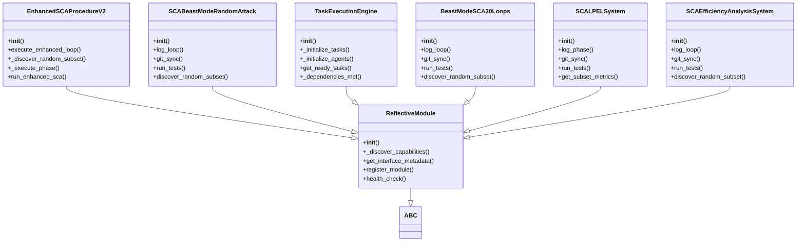
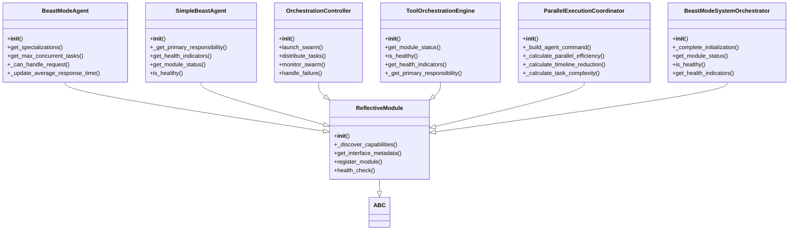
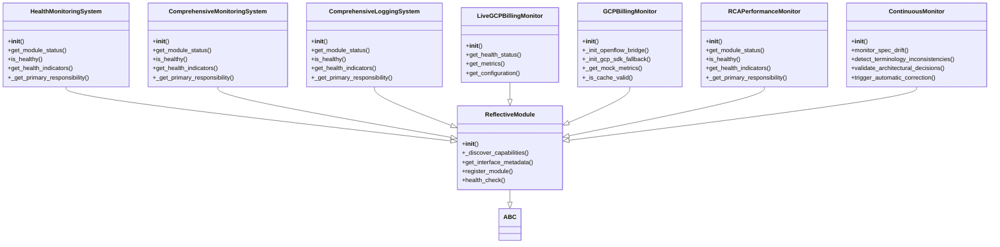
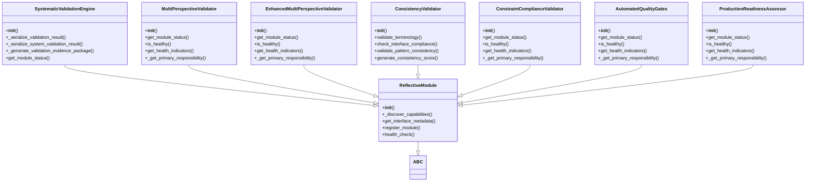
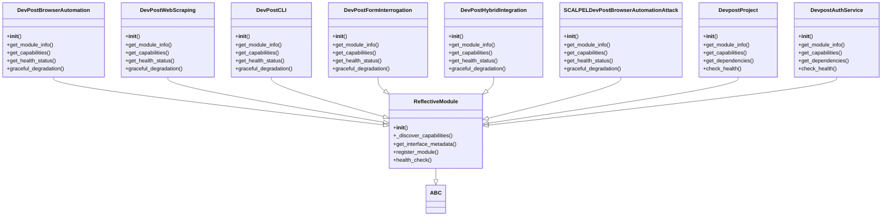
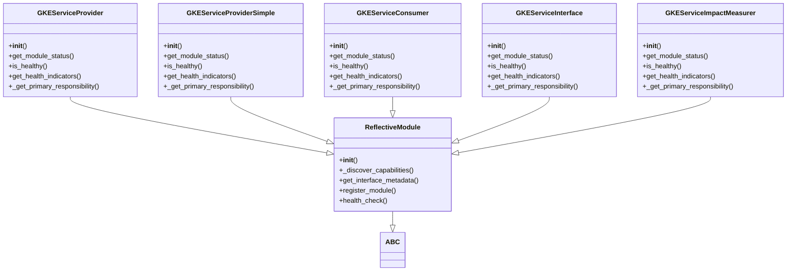
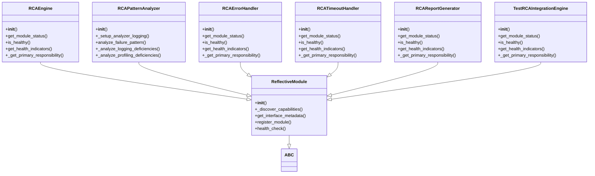
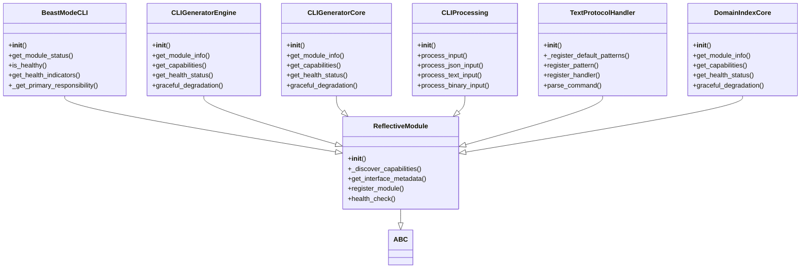

# ReflectiveModule Architecture - Vertical Sections

## Section 1: Core ReflectiveModule and Direct Subclasses

## Section 2: Agent and Orchestration Classes

## Section 3: Monitoring and Health Management

## Section 4: Validation and Quality Assurance

## Section 5: DevPost Integration Classes

## Section 6: GKE Service Classes

## Section 7: RCA and Analysis Classes

## Section 8: CLI and Interface Classes

---

**Note**: Each section is designed to fit vertically on a standard page and focuses on related functionality. This makes the architecture much more readable and understandable!

