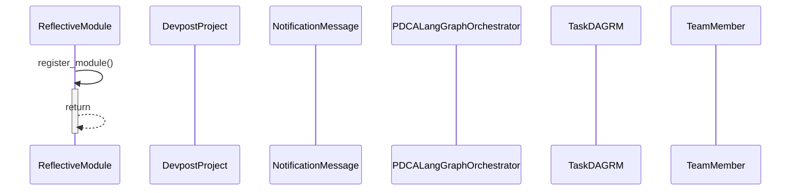
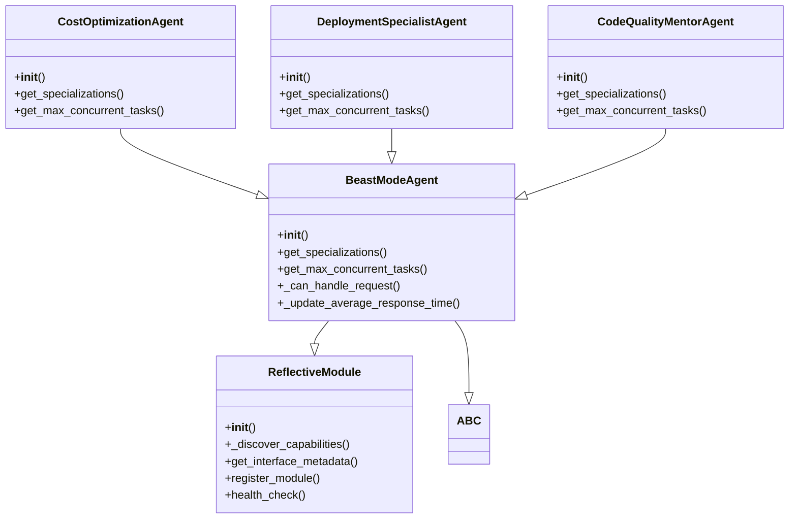

# UML Diagrams - Rendered Visualizations

## ReflectiveModule Static Structure Diagram

```mermaid
classDiagram
    class ReflectiveModule {
        +__init__()
        +_discover_capabilities()
        +get_interface_metadata()
        +register_module()
        +health_check()
    }
    class RCAPatternAnalyzer {
        +__init__()
        +_setup_analyzer_logging()
        +analyze_failure_pattern()
        +_analyze_logging_deficiencies()
        +_analyze_profiling_deficiencies()
    }
    class DomainIndexCore {
        +__init__()
        +get_module_info()
        +get_capabilities()
        +get_health_status()
        +graceful_degradation()
    }
    class LiveGCPBillingMonitor {
        +__init__()
        +get_health_status()
        +get_metrics()
        +get_configuration()
    }
    class EnhancedSCAProcedureV2 {
        +__init__()
        +execute_enhanced_loop()
        +_discover_random_subset()
        +_execute_phase()
        +run_enhanced_sca()
    }
    class DevPostFormInterrogation {
        +__init__()
        +get_module_info()
        +get_capabilities()
        +get_health_status()
        +graceful_degradation()
    }
    class SimplifiedInfrastructureModel {
        +__init__()
        +get_module_status()
        +_get_primary_responsibility()
        +is_healthy()
        +get_health_indicators()
    }
    class HackathonDemoController {
        +__init__()
        +get_module_info()
        +get_capabilities()
        +get_health_status()
        +graceful_degradation()
    }
    class SystematicComparisonFramework {
        +__init__()
        +get_module_status()
        +is_healthy()
        +get_health_indicators()
        +_get_primary_responsibility()
    }
    class EnhancedMultiPerspectiveValidator {
        +__init__()
        +get_module_status()
        +is_healthy()
        +get_health_indicators()
        +_get_primary_responsibility()
    }
    class ProjectConnection {
        +__init__()
        +get_module_info()
        +get_capabilities()
        +get_dependencies()
        +check_health()
    }
    class ProductionReadinessAssessor {
        +__init__()
        +get_module_status()
        +is_healthy()
        +get_health_indicators()
        +_get_primary_responsibility()
    }
    class MockTextProtocolHandler {
        +__init__()
    }
    class ProjectFileEventHandler {
        +__init__()
        +get_module_info()
        +get_capabilities()
        +get_dependencies()
        +check_health()
    }
    class RDIChainOrchestrator {
        +__init__()
        +get_module_status()
        +is_healthy()
        +get_health_indicators()
        +_get_primary_responsibility()
    }
    class DevPostHybridIntegration {
        +__init__()
        +get_module_info()
        +get_capabilities()
        +get_health_status()
        +graceful_degradation()
    }
    class RequiredFieldRule {
        +__init__()
        +get_module_info()
        +get_capabilities()
        +get_dependencies()
        +check_health()
    }
    class EvidencePackageGenerator {
        +__init__()
        +get_module_status()
        +is_healthy()
        +get_health_indicators()
        +_get_primary_responsibility()
    }
    class DevPostCLI {
        +__init__()
        +get_module_info()
        +get_capabilities()
        +get_health_status()
        +graceful_degradation()
    }
    class ConstraintComplianceValidator {
        +__init__()
        +get_module_status()
        +is_healthy()
        +get_health_indicators()
        +_get_primary_responsibility()
    }
    class TaskExecutionEngine {
        +__init__()
        +_initialize_tasks()
        +_initialize_agents()
        +get_ready_tasks()
        +_dependencies_met()
    }
    class DevpostAuthService {
        +__init__()
        +get_module_info()
        +get_capabilities()
        +get_dependencies()
        +check_health()
    }
    class DevPostBrowserAutomation {
        +__init__()
        +get_module_info()
        +get_capabilities()
        +get_health_status()
        +graceful_degradation()
    }
    class MediaFileDetector {
        +__init__()
        +get_module_info()
        +get_capabilities()
        +get_dependencies()
        +check_health()
    }
    class SimplifiedSystematicSuperiorityModel {
        +__init__()
        +get_module_status()
        +_get_primary_responsibility()
        +is_healthy()
        +get_health_indicators()
    }
    class MockStructuredAction {
        +__init__()
    }
    class SystematicValidationEngine {
        +__init__()
        +_serialize_validation_result()
        +_serialize_system_validation_result()
        +_generate_validation_evidence_package()
        +get_module_status()
    }
    class GKEServiceInterface {
        +__init__()
        +get_module_status()
        +is_healthy()
        +get_health_indicators()
        +_get_primary_responsibility()
    }
    class GKEServiceImpactMeasurer {
        +__init__()
        +get_module_status()
        +is_healthy()
        +get_health_indicators()
        +_get_primary_responsibility()
    }
    class DevPostWebScraping {
        +__init__()
        +get_module_info()
        +get_capabilities()
        +get_health_status()
        +graceful_degradation()
    }
    class ValidationContext {
        +__init__()
        +get_module_info()
        +get_capabilities()
        +get_dependencies()
        +check_health()
    }
    class TextProtocolHandler {
        +__init__()
        +_register_default_patterns()
        +register_pattern()
        +register_handler()
        +parse_command()
    }
    class ConsistencyValidator {
        +__init__()
        +validate_terminology()
        +check_interface_compliance()
        +validate_pattern_consistency()
        +generate_consistency_score()
    }
    class GovernanceController {
        +__init__()
        +validate_new_spec()
        +check_overlap_conflicts()
        +get_module_status()
    }
    class SCABeastModeRandomAttack {
        +__init__()
        +log_loop()
        +git_sync()
        +run_tests()
        +discover_random_subset()
    }
    class SyntaxFixedObservabilityModule {
        +__init__()
        +perform_core_operation()
        +check_health()
        +get_capabilities()
        +get_dependencies()
    }
    class GKEServiceConsumer {
        +__init__()
        +get_module_status()
        +is_healthy()
        +get_health_indicators()
        +_get_primary_responsibility()
    }
    class SyncResult {
        +__init__()
        +get_module_info()
        +get_capabilities()
        +get_dependencies()
        +check_health()
    }
    class ADRSystem {
        +__init__()
        +get_module_status()
        +is_healthy()
        +get_health_indicators()
        +_get_primary_responsibility()
    }
    class SyntaxFixedModule {
        +__init__()
        +perform_core_operation()
        +check_health()
        +get_capabilities()
        +get_dependencies()
    }
    class TaskDAGRM {
        +__init__()
        +get_module_status()
        +is_healthy()
        +get_health_indicators()
        +_get_primary_responsibility()
    }
    class GKEServiceProviderSimple {
        +__init__()
        +get_module_status()
        +is_healthy()
        +get_health_indicators()
        +_get_primary_responsibility()
    }
    class CoreInfrastructureValidator {
        +__init__()
        +_setup_validator_logging()
        +validate_complete_infrastructure()
        +_validate_logging_infrastructure()
        +_validate_profiling_infrastructure()
    }
    class DocumentManagementRM {
        +__init__()
        +get_module_status()
        +is_healthy()
        +get_health_indicators()
        +_get_primary_responsibility()
    }
    class SystematicCleanupEngine {
        +__init__()
        +_setup_cleanup_logging()
        +analyze_organizational_entropy()
        +create_systematic_cleanup_plan()
        +execute_systematic_cleanup()
    }
    class NotificationMessage {
        +__init__()
        +get_module_info()
        +get_capabilities()
        +get_dependencies()
        +check_health()
    }
    class RCAPerformanceMonitor {
        +__init__()
        +get_module_status()
        +is_healthy()
        +get_health_indicators()
        +_get_primary_responsibility()
    }
    class SpecConsolidator {
        +__init__()
        +analyze_overlap()
        +_parse_spec_comprehensively()
        +_extract_requirements()
        +_extract_interfaces_detailed()
    }
    class BeastModeSystemOrchestrator {
        +__init__()
        +_complete_initialization()
        +get_module_status()
        +is_healthy()
        +get_health_indicators()
    }
    class WhiskeyModeDisplay {
        +__init__()
        +_setup_layout()
        +_create_header()
        +_create_test_matrix()
        +_create_sparkline()
    }
    class CLIGeneratorEngine {
        +__init__()
        +get_module_info()
        +get_capabilities()
        +get_health_status()
        +graceful_degradation()
    }
    class LiveMigrationManager {
        +__init__()
        +get_module_status()
        +is_healthy()
        +get_health_indicators()
        +_get_primary_responsibility()
    }
    class TestRCAIntegrationEngine {
        +__init__()
        +get_module_status()
        +is_healthy()
        +get_health_indicators()
        +_get_primary_responsibility()
    }
    class RCAErrorHandler {
        +__init__()
        +get_module_status()
        +is_healthy()
        +get_health_indicators()
        +_get_primary_responsibility()
    }
    class BacklogDependencyManager {
        +__init__()
        +get_module_status()
        +is_healthy()
        +get_health_indicators()
        +_get_primary_responsibility()
    }
    class GitAnalyzer {
        +__init__()
        +get_commits_ahead_of_main()
        +analyze_file_changes()
        +map_changes_to_tasks()
        +analyze()
    }
    class DevpostProject {
        +__init__()
        +get_module_info()
        +get_capabilities()
        +get_dependencies()
        +check_health()
    }
    class ContinuousMonitor {
        +__init__()
        +monitor_spec_drift()
        +detect_terminology_inconsistencies()
        +validate_architectural_decisions()
        +trigger_automatic_correction()
    }
    class ContentBasedChangeDetector {
        +__init__()
        +get_module_info()
        +get_capabilities()
        +get_dependencies()
        +check_health()
    }
    class FileChangeEvent {
        +__init__()
        +get_module_info()
        +get_capabilities()
        +get_dependencies()
        +check_health()
    }
    class ValidationCategory {
        +__init__()
        +get_module_info()
        +get_capabilities()
        +get_dependencies()
        +check_health()
    }
    class GCPBillingMonitor {
        +__init__()
        +_init_openflow_bridge()
        +_init_gcp_sdk_fallback()
        +_get_mock_metrics()
        +_is_cache_valid()
    }
    class GovernanceFramework {
        +__init__()
        +_load_configuration()
        +_initialize_default_configuration()
        +_create_default_roles()
        +_create_default_training_programs()
    }
    class BeastModeSecurityManager {
        +__init__()
        +_initialize_security_systems()
        +get_module_status()
        +is_healthy()
        +get_health_indicators()
    }
    class SystematicPDCAOrchestrator {
        +__init__()
        +get_module_info()
        +get_capabilities()
        +get_health_status()
        +graceful_degradation()
    }
    class RCAReportGenerator {
        +__init__()
        +get_module_status()
        +is_healthy()
        +get_health_indicators()
        +_get_primary_responsibility()
    }
    class BeastModeSCA20Loops {
        +__init__()
        +log_loop()
        +git_sync()
        +run_tests()
        +discover_random_subset()
    }
    class ComprehensiveMonitoringSystem {
        +__init__()
        +get_module_status()
        +is_healthy()
        +get_health_indicators()
        +_get_primary_responsibility()
    }
    class ContentQualityRule {
        +__init__()
        +get_module_info()
        +get_capabilities()
        +get_dependencies()
        +check_health()
    }
    class FileChangeDetector {
        +__init__()
        +analyze_file_changes()
        +map_changes_to_task_completions()
        +detect_completion_evidence()
        +calculate_change_impact()
    }
    class CLIProcessing {
        +__init__()
        +process_input()
        +process_json_input()
        +process_text_input()
        +process_binary_input()
    }
    class SCAEfficiencyAnalysisSystem {
        +__init__()
        +log_loop()
        +git_sync()
        +run_tests()
        +discover_random_subset()
    }
    class BeastModeConstraintResolver {
        +__init__()
        +get_module_status()
        +is_healthy()
        +get_health_indicators()
        +_get_primary_responsibility()
    }
    class ComprehensiveLoggingSystem {
        +__init__()
        +get_module_status()
        +is_healthy()
        +get_health_indicators()
        +_get_primary_responsibility()
    }
    class BeastModeAgent {
        +__init__()
        +get_specializations()
        +get_max_concurrent_tasks()
        +_can_handle_request()
        +_update_average_response_time()
    }
    class SelfConsistencyValidatorCoreCoreValidation {
        +__init__()
        +get_module_info()
        +get_capabilities()
        +get_health_status()
        +graceful_degradation()
    }
    class SCALPELSystem {
        +__init__()
        +log_phase()
        +git_sync()
        +run_tests()
        +get_subset_metrics()
    }
    class ToolOrchestrationEngine {
        +__init__()
        +get_module_status()
        +is_healthy()
        +get_health_indicators()
        +_get_primary_responsibility()
    }
    class SCALPELDevPostBrowserAutomationAttack {
        +__init__()
        +get_module_info()
        +get_capabilities()
        +get_health_status()
        +graceful_degradation()
    }
    class LinkValidationRule {
        +__init__()
        +get_module_info()
        +get_capabilities()
        +get_dependencies()
        +check_health()
    }
    class CLIGeneratorCore {
        +__init__()
        +get_module_info()
        +get_capabilities()
        +get_health_status()
        +graceful_degradation()
    }
    class BeastModeCLI {
        +__init__()
        +get_module_status()
        +is_healthy()
        +get_health_indicators()
        +_get_primary_responsibility()
    }
    class DevpostConfig {
        +__init__()
        +_get_default_config()
        +get_module_info()
        +get_capabilities()
        +get_dependencies()
    }
    class TeamMember {
        +__init__()
        +get_module_info()
        +get_capabilities()
        +get_dependencies()
        +check_health()
    }
    class MockActionResult {
        +__init__()
    }
    class OrchestrationController {
        +__init__()
        +launch_swarm()
        +distribute_tasks()
        +monitor_swarm()
        +handle_failure()
    }
    class RCATimeoutHandler {
        +__init__()
        +get_module_status()
        +is_healthy()
        +get_health_indicators()
        +_get_primary_responsibility()
    }
    class HealthMonitoringSystem {
        +__init__()
        +get_module_status()
        +is_healthy()
        +get_health_indicators()
        +_get_primary_responsibility()
    }
    class RCAEngine {
        +__init__()
        +get_module_status()
        +is_healthy()
        +get_health_indicators()
        +_get_primary_responsibility()
    }
    class MultiPerspectiveValidator {
        +__init__()
        +get_module_status()
        +is_healthy()
        +get_health_indicators()
        +_get_primary_responsibility()
    }
    class SimplifiedMultiAgentModel {
        +__init__()
        +get_module_status()
        +_get_primary_responsibility()
        +is_healthy()
        +get_health_indicators()
    }
    class SimpleBeastAgent {
        +__init__()
        +_get_primary_responsibility()
        +get_health_indicators()
        +get_module_status()
        +is_healthy()
    }
    class SimplifiedSpecToCodeModel {
        +__init__()
        +get_module_status()
        +_get_primary_responsibility()
        +is_healthy()
        +get_health_indicators()
    }
    class SystematicMetricsEngine {
        +__init__()
        +get_module_info()
        +get_capabilities()
        +get_health_status()
        +graceful_degradation()
    }
    class ParallelExecutionCoordinator {
        +__init__()
        +_build_agent_command()
        +_calculate_parallel_efficiency()
        +_calculate_timeline_reduction()
        +_calculate_task_complexity()
    }
    class ProjectMetadata {
        +__init__()
        +get_module_info()
        +get_capabilities()
        +get_dependencies()
        +check_health()
    }
    class GKEServiceProvider {
        +__init__()
        +get_module_status()
        +is_healthy()
        +get_health_indicators()
        +_get_primary_responsibility()
    }
    class ComponentBoundaryResolver {
        +__init__()
        +get_module_status()
        +is_healthy()
        +get_health_indicators()
        +_get_primary_responsibility()
    }
    class PDCALangGraphOrchestrator {
        +__init__()
        +get_module_status()
        +is_healthy()
        +get_health_indicators()
        +_get_primary_responsibility()
    }
    class TagValidationRule {
        +__init__()
        +get_module_info()
        +get_capabilities()
        +get_dependencies()
        +check_health()
    }
    class PreviewData {
        +__init__()
        +_get_default_preview_data()
        +_generate_preview_id()
        +get_module_info()
        +get_capabilities()
    }
    class GlobalSettings {
        +__init__()
        +_get_default_settings()
        +get_module_info()
        +get_capabilities()
        +get_dependencies()
    }
    class ProjectFileMonitor {
        +__init__()
        +get_module_info()
        +get_capabilities()
        +get_dependencies()
        +check_health()
    }
    class TeamValidationRule {
        +__init__()
        +get_module_info()
        +get_capabilities()
        +get_dependencies()
        +check_health()
    }
    class AutomatedQualityGates {
        +__init__()
        +get_module_status()
        +is_healthy()
        +get_health_indicators()
        +_get_primary_responsibility()
    }
    class ASTValidatedModule {
        +__init__()
        +perform_core_operation()
        +check_health()
        +get_capabilities()
        +get_dependencies()
    }
    class NotificationSettings {
        +__init__()
        +_get_default_settings()
        +get_module_info()
        +get_capabilities()
        +get_dependencies()
    }
    ReflectiveModule --|> ABC
    EnhancedSCAProcedureV2 --|> ReflectiveModule
    SCABeastModeRandomAttack --|> ReflectiveModule
    TaskExecutionEngine --|> ReflectiveModule
    BeastModeSCA20Loops --|> ReflectiveModule
    SCALPELSystem --|> ReflectiveModule
    LiveGCPBillingMonitor --|> ReflectiveModule
    SCAEfficiencyAnalysisSystem --|> ReflectiveModule
    SimplifiedSpecToCodeModel --|> ReflectiveModule
    SimplifiedSystematicSuperiorityModel --|> ReflectiveModule
    SimplifiedMultiAgentModel --|> ReflectiveModule
    SimplifiedInfrastructureModel --|> ReflectiveModule
    SCALPELDevPostBrowserAutomationAttack --|> ReflectiveModule
    MockTextProtocolHandler --|> ReflectiveModule
    MockStructuredAction --|> ReflectiveModule
    MockActionResult --|> ReflectiveModule
    BeastModeAgent --|> ReflectiveModule
    SimpleBeastAgent --|> ReflectiveModule
    RCAPatternAnalyzer --|> ReflectiveModule
    RCAEngine --|> ReflectiveModule
    MultiPerspectiveValidator --|> ReflectiveModule
    WhiskeyModeDisplay --|> ReflectiveModule
    GitAnalyzer --|> ReflectiveModule
    AutomatedQualityGates --|> ReflectiveModule
    HealthMonitoringSystem --|> ReflectiveModule
    ValidationContext --|> ReflectiveModule
    ValidationCategory --|> ReflectiveModule
    RequiredFieldRule --|> ReflectiveModule
    ContentQualityRule --|> ReflectiveModule
    LinkValidationRule --|> ReflectiveModule
    TeamValidationRule --|> ReflectiveModule
    TagValidationRule --|> ReflectiveModule
    GKEServiceProvider --|> ReflectiveModule
    SystematicComparisonFramework --|> ReflectiveModule
    SpecConsolidator --|> ReflectiveModule
    BeastModeSystemOrchestrator --|> ReflectiveModule
    ProjectConnection --|> ReflectiveModule
    DevpostAuthService --|> ReflectiveModule
    GKEServiceImpactMeasurer --|> ReflectiveModule
    ADRSystem --|> ReflectiveModule
    ProductionReadinessAssessor --|> ReflectiveModule
    DevpostProject --|> ReflectiveModule
    TeamMember --|> ReflectiveModule
    FileChangeDetector --|> ReflectiveModule
    RCATimeoutHandler --|> ReflectiveModule
    ToolOrchestrationEngine --|> ReflectiveModule
    NotificationSettings --|> ReflectiveModule
    NotificationMessage --|> ReflectiveModule
    OrchestrationController --|> ReflectiveModule
    ProjectFileMonitor --|> ReflectiveModule
    ContentBasedChangeDetector --|> ReflectiveModule
    MediaFileDetector --|> ReflectiveModule
    ProjectFileEventHandler --|> ReflectiveModule
    BeastModeCLI --|> ReflectiveModule
    PDCALangGraphOrchestrator --|> ReflectiveModule
    TaskDAGRM --|> ReflectiveModule
    TextProtocolHandler --|> ReflectiveModule
    ComprehensiveLoggingSystem --|> ReflectiveModule
    ComprehensiveMonitoringSystem --|> ReflectiveModule
    SystematicValidationEngine --|> ReflectiveModule
    BacklogDependencyManager --|> ReflectiveModule
    EvidencePackageGenerator --|> ReflectiveModule
    SystematicCleanupEngine --|> ReflectiveModule
    ConstraintComplianceValidator --|> ReflectiveModule
    ParallelExecutionCoordinator --|> ReflectiveModule
    SyncResult --|> ReflectiveModule
    FileChangeEvent --|> ReflectiveModule
    TestRCAIntegrationEngine --|> ReflectiveModule
    RCAReportGenerator --|> ReflectiveModule
    ContinuousMonitor --|> ReflectiveModule
    GCPBillingMonitor --|> ReflectiveModule
    HackathonDemoController --|> ReflectiveModule
    ComponentBoundaryResolver --|> ReflectiveModule
    GKEServiceConsumer --|> ReflectiveModule
    CoreInfrastructureValidator --|> ReflectiveModule
    ConsistencyValidator --|> ReflectiveModule
    ProjectMetadata --|> ReflectiveModule
    RCAPerformanceMonitor --|> ReflectiveModule
    EnhancedMultiPerspectiveValidator --|> ReflectiveModule
    BeastModeSecurityManager --|> ReflectiveModule
    BeastModeConstraintResolver --|> ReflectiveModule
    GKEServiceProviderSimple --|> ReflectiveModule
    DevpostConfig --|> ReflectiveModule
    GlobalSettings --|> ReflectiveModule
    CLIGeneratorEngine --|> ReflectiveModule
    RDIChainOrchestrator --|> ReflectiveModule
    DocumentManagementRM --|> ReflectiveModule
    RCAErrorHandler --|> ReflectiveModule
    SystematicPDCAOrchestrator --|> ReflectiveModule
    GKEServiceInterface --|> ReflectiveModule
    GovernanceFramework --|> ReflectiveModule
    SystematicMetricsEngine --|> ReflectiveModule
    PreviewData --|> ReflectiveModule
    LiveMigrationManager --|> ReflectiveModule
    GovernanceController --|> ReflectiveModule
    DomainIndexCore --|> ReflectiveModule
    ASTValidatedModule --|> ReflectiveModule
    SyntaxFixedModule --|> ReflectiveModule
    SyntaxFixedObservabilityModule --|> ReflectiveModule
    SelfConsistencyValidatorCoreCoreValidation --|> ReflectiveModule
    CLIGeneratorCore --|> ReflectiveModule
    DevPostHybridIntegration --|> ReflectiveModule
    CLIProcessing --|> ReflectiveModule
    DevPostCLI --|> ReflectiveModule
    DevPostWebScraping --|> ReflectiveModule
    DevPostBrowserAutomation --|> ReflectiveModule
    DevPostFormInterrogation --|> ReflectiveModule
```

## ReflectiveModule Sequence Diagram



## BeastModeAgent Class Hierarchy



---

**Note**: These diagrams will render with a white background when viewed on GitHub. The Mermaid diagrams are automatically rendered by GitHub's markdown renderer.

