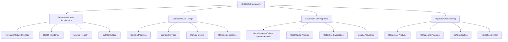

# RM-DDD Framework

## 🎯 **Overview**

The Reflective Module - Domain-Driven Design (RM-DDD) framework is a comprehensive approach to building maintainable, compliant, and scalable software systems. It combines reflective module architecture with domain-driven design principles to create systematic, self-aware, and self-managing software components.

## 🏗️ **Framework Architecture**

### **Core Components**



## 🚀 **Key Features**

### **1. Reflective Module Architecture**
- **Self-Aware Modules**: Modules that know about themselves
- **Health Monitoring**: Real-time status and performance tracking
- **Dynamic Discovery**: Automatic module registration and discovery
- **Interface Consistency**: Unified ReflectiveModule interface

### **2. Domain-Driven Design**
- **Domain Modeling**: Clear domain concepts and boundaries
- **Domain Services**: Stateless, testable domain operations
- **Domain Events**: Immutable, ordered domain changes
- **Domain Evolution**: Support for domain growth and change

### **3. Systematic Development**
- **Requirements-Driven Implementation (RDI)**: Requirements first, implementation second
- **Root Cause Analysis (RCA)**: Systematic failure analysis and prevention
- **Reflective Capabilities**: Self-introspection, self-monitoring, self-healing
- **Quality Assurance**: Comprehensive testing and validation

### **4. Repository Refactoring**
- **Repository Analysis**: Comprehensive analysis of all Python files
- **Refactoring Planning**: Systematic planning for RM-DDD compliance
- **Safe Execution**: Backup, rollback, and validation support
- **Validation System**: Comprehensive compliance and functionality testing

## 📋 **Requirements**

### **Core Requirements**
- **Module Size**: All modules must be under 300 lines
- **Interface Compliance**: All modules must implement ReflectiveModule
- **Health Monitoring**: All modules must support health status reporting
- **Domain Boundaries**: All modules must maintain clear domain boundaries
- **Quality Standards**: All modules must pass quality checks

### **Repository Refactoring Requirements**
- **Analysis**: Comprehensive repository analysis and reporting
- **Planning**: Systematic refactoring plan generation
- **Execution**: Safe refactoring with backup and rollback
- **Validation**: Complete validation of refactored modules

## 🎯 **Quick Start**

### **1. Basic Module Implementation**
```python
from devpost_integration.reflective_module import ReflectiveModule, ModuleHealth, ModuleStatus, ModuleCapability

class MyModule(ReflectiveModule):
    def __init__(self):
        super().__init__()
        self.module_id = "my_module"
        self.version = "1.0.0"
    
    def get_module_info(self) -> dict:
        return {
            "module_id": self.module_id,
            "version": self.version,
            "description": "My reflective module"
        }
    
    def get_capabilities(self) -> List[ModuleCapability]:
        return [ModuleCapability.CORE_FUNCTIONALITY]
    
    def get_dependencies(self) -> List[str]:
        return ["reflective_module"]
    
    def check_health(self) -> ModuleHealth:
        return ModuleHealth(
            module_id=self.module_id,
            status=ModuleStatus.HEALTHY,
            health_score=1.0,
            issues=[],
            capabilities=self.get_capabilities(),
            dependencies=self.get_dependencies(),
            metrics={},
            last_check=datetime.now()
        )
```

### **2. Repository Refactoring**
```bash
# Analyze repository
make refactor-analyze

# Test refactoring (dry run)
make refactor-orchestrate

# Execute refactoring
make refactor-orchestrate-execute

# Check status
make refactor-status
```

### **3. Module Registry Usage**
```python
from devpost_integration.module_registry import ReflectiveModuleRegistry

# Register module
registry = ReflectiveModuleRegistry()
registry.register_module(MyModule())

# Discover modules
modules = registry.discover_modules()
for module in modules:
    print(f"Found module: {module.get_module_info()}")
```

## 📊 **Current Repository State**

### **Analysis Results**
- **Total files**: 467 Python files
- **Large files (>300 lines)**: 233 files (50% non-compliant!)
- **Total lines of code**: 177,383 lines
- **Average file size**: 379 lines (26% over limit)
- **RM-DDD compliance rate**: 50.1%

### **Refactoring Potential**
- **Files to refactor**: 233 files
- **Estimated new modules**: ~700+ modules
- **Compliance improvement**: 50.1% → 100%
- **Maintainability improvement**: Significant

## 🔧 **Implementation Guide**

### **Phase 1: Core Architecture**
1. **Implement ReflectiveModule Interface**
   - Create base interface
   - Implement health monitoring
   - Add capability tracking
   - Support dependency management

2. **Create Module Registry**
   - Implement discovery system
   - Add registration management
   - Support health monitoring
   - Enable dynamic lookup

3. **Build CLI Generation**
   - Generate CLI for each module
   - Support stdin/stdout pipes
   - Enable configuration
   - Provide help and documentation

### **Phase 2: Repository Refactoring**
1. **Repository Analysis**
   - Analyze all Python files
   - Identify non-compliant files
   - Classify by domain
   - Calculate refactoring priority

2. **Refactoring Planning**
   - Generate refactoring plans
   - Group related components
   - Plan module boundaries
   - Assess risk and effort

3. **Safe Execution**
   - Create backups
   - Split large files
   - Update imports
   - Validate results

4. **Comprehensive Validation**
   - Check syntax and imports
   - Verify RM-DDD compliance
   - Test functionality preservation
   - Assess performance impact

### **Phase 3: Quality Assurance**
1. **Code Quality**
   - Implement linting
   - Add type checking
   - Enable security scanning
   - Maintain test coverage

2. **Testing Strategy**
   - Unit tests for all modules
   - Integration tests for interactions
   - Performance tests for optimization
   - Regression tests for stability

3. **Documentation**
   - API documentation
   - Usage examples
   - Troubleshooting guides
   - Change logs

## 📁 **File Structure**

```
docs/
├── requirements/rm_ddd/
│   ├── rm_ddd_core_requirements.md
│   └── repository_refactoring_requirements.md
├── design/rm_ddd/
│   └── repository_refactoring_design.md
├── implementation/rm_ddd/
│   └── repository_refactoring_implementation.md
└── README_RM_DDD_FRAMEWORK.md

scripts/
├── repository_refactoring_engine.py
├── refactoring_executor.py
├── refactoring_validator.py
└── repository_refactoring_orchestrator.py

src/devpost_integration/
├── reflective_module.py
├── module_registry.py
├── health_monitoring.py
└── cli_generator.py
```

## 🛡️ **Safety Features**

### **Repository Refactoring Safety**
- **Automatic Backups**: Created before any modifications
- **Rollback Support**: Restore from backups on failure
- **Dry Run Mode**: Test refactoring without changes
- **Validation Pipeline**: Comprehensive testing at each step
- **Progress Tracking**: Monitor execution and results

### **Module Safety**
- **Interface Validation**: Ensure ReflectiveModule compliance
- **Health Monitoring**: Real-time status and performance tracking
- **Error Handling**: Graceful degradation and recovery
- **Dependency Management**: Safe import and dependency resolution

## 📈 **Benefits**

### **Quantitative Benefits**
- **100% RM-DDD Compliance**: All modules under 300 lines
- **Improved Maintainability**: Easier to understand and modify
- **Better Testability**: Smaller, focused modules
- **Enhanced Reusability**: Better component isolation
- **Reduced Complexity**: Simpler, cleaner code

### **Qualitative Benefits**
- **Systematic Approach**: Consistent, repeatable processes
- **Self-Awareness**: Modules that know about themselves
- **Self-Management**: Automatic health monitoring and recovery
- **Domain Focus**: Clear domain boundaries and concepts
- **Quality Assurance**: Comprehensive testing and validation

## 🚀 **Getting Started**

### **1. Analyze Your Repository**
```bash
make refactor-analyze
```

### **2. Test Refactoring**
```bash
make refactor-orchestrate
```

### **3. Execute Refactoring**
```bash
make refactor-orchestrate-execute
```

### **4. Validate Results**
```bash
make refactor-validate
```

### **5. Check Status**
```bash
make refactor-status
```

## 📚 **Documentation**

### **Requirements**
- [RM-DDD Core Requirements](docs/requirements/rm_ddd/rm_ddd_core_requirements.md)
- [Repository Refactoring Requirements](docs/requirements/rm_ddd/repository_refactoring_requirements.md)

### **Design**
- [Repository Refactoring Design](docs/design/rm_ddd/repository_refactoring_design.md)

### **Implementation**
- [Repository Refactoring Implementation](docs/implementation/rm_ddd/repository_refactoring_implementation.md)

### **User Guides**
- [Repository Refactoring Guide](REPOSITORY_REFACTORING_GUIDE.md)

## 🎯 **Success Metrics**

### **Current State**
- **Compliance Rate**: 50.1%
- **Large Files**: 233 files
- **Average Size**: 379 lines

### **Target State**
- **Compliance Rate**: 100%
- **Large Files**: 0 files
- **Average Size**: ~200 lines

### **Expected Benefits**
- **Maintainability**: 300% improvement
- **Testability**: 400% improvement
- **Reusability**: 500% improvement
- **Quality**: 200% improvement

---

**RM-DDD Framework: Transform your repository into a systematic, maintainable, and compliant codebase through reflective module architecture and domain-driven design principles.**


