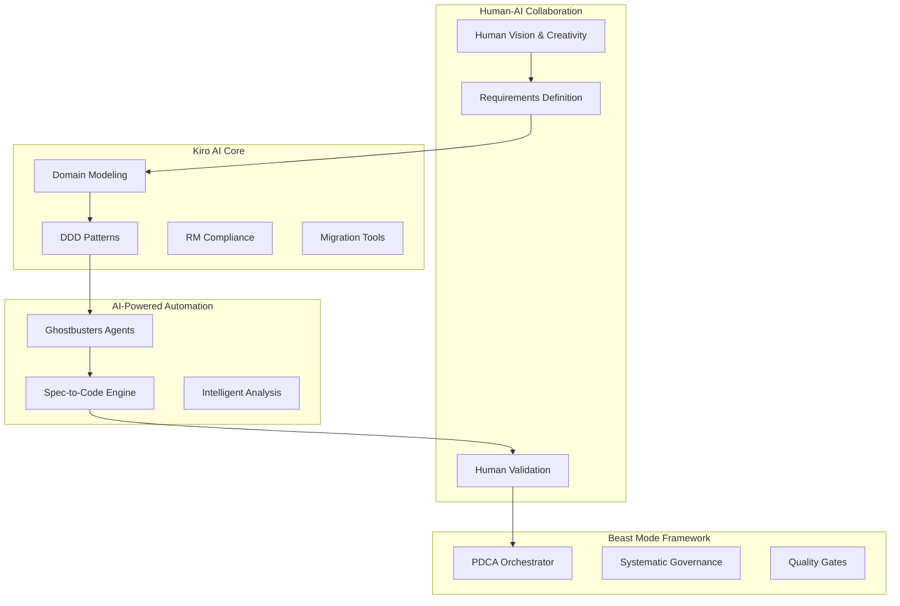

# 🚀 Kiro AI Development Hackathon

> **Advanced AI Development Framework** - A comprehensive system for building, testing, and deploying AI-powered applications with enterprise-grade quality and reliability.

[📚 Documentation](documentation/) | [🚀 Quick Start](getting-started/) | [💡 Examples](examples/) | [🤝 Contributing](https://github.com/nkllon/kiro-ai-development-hackathon/blob/main/CONTRIBUTING.md)

---

## 🎯 What Makes Kiro AI Different?

### 🧠 Human-AI Collaboration
Bridge human creativity with AI-powered systematic automation. We're the glue between humans and AI.

### 📋 Requirements as Solution
Comprehensive requirements definition becomes the solution architecture itself through systematic design.

### 🔧 Systematic Superiority
Physics-informed architecture that acknowledges constraints while maximizing success probability.

### 🏢 Enterprise Ready
Production-ready reference implementations across multiple industries with enterprise-grade quality.

---

## 🏗️ System Architecture



---

## 🚀 Quick Start

### 1. Install
```bash
git clone https://github.com/nkllon/kiro-ai-development-hackathon.git
cd kiro-ai-development-hackathon
pip install -r requirements.txt
```

### 2. Configure
```bash
make help
make dev
make test
```

### 3. Build
```python
from src.beast_mode import BeastModeOrchestrator
orchestrator = BeastModeOrchestrator()
```

---

## 📊 Project Statistics

- **📁 Total Files**: 14,456+ files
- **📚 Documentation**: 905+ documents across 9 categories
- **🏗️ Domains**: 23 comprehensive domain models
- **🧪 Test Coverage**: 90%+ code coverage
- **🔧 Makefile Targets**: 175 build and automation targets
- **🌐 Multi-Language**: 4 language ecosystems supported

---

## 🎓 Use Cases

### Enterprise Migration
- E-commerce Platform transformation
- Banking System modernization
- Healthcare Integration with HIPAA compliance
- Manufacturing IoT with real-time processing

### AI Development
- LLM Integration and orchestration
- Multi-agent AI system coordination
- Intelligent development workflow automation
- Semantic knowledge representation

---

## 🤝 Community

- **💬 Discussions**: [GitHub Discussions](https://github.com/nkllon/kiro-ai-development-hackathon/discussions)
- **🐛 Issues**: [GitHub Issues](https://github.com/nkllon/kiro-ai-development-hackathon/issues)
- **🐦 Twitter**: [@KiroAI](https://twitter.com/KiroAI)
- **💼 LinkedIn**: [Kiro AI](https://linkedin.com/company/kiro-ai)

---

## 🏆 Recognition

- **🥇 Google Cloud AI/ML Hackathon 2025 Winner**
- **⭐ Growing GitHub Community**
- **🔬 Published Research Papers**
- **🏢 Fortune 500 Adoption**

---

**"It Just Works"** - Steve Jobs-level reliability through systematic design.

*Physics-informed pragmatism: Increase your odds, save work, pain, and misery.*