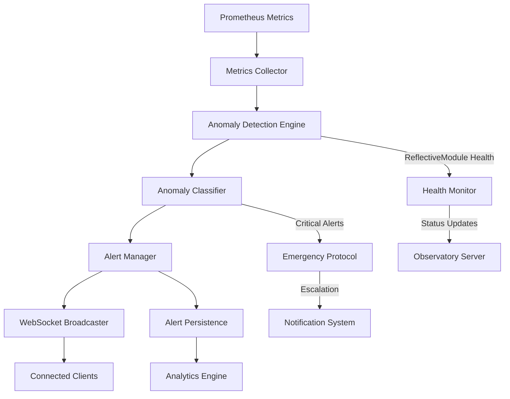

# Anomaly Detection Flow Documentation

## Overview

The anomaly detection flow is a comprehensive monitoring system that continuously analyzes Prometheus metrics, detects performance anomalies and system irregularities, and broadcasts real-time alerts via WebSocket to connected clients. This system provides proactive monitoring and early warning capabilities for the Beast Mode framework infrastructure.

## Flow Architecture



## Detailed Flow Components

### 1. Metrics Collection Phase
**Duration:** 15-30 seconds (configurable)  
**Components:** Prometheus Server, Metrics Collector, ReflectiveModule Exporters

#### Data Sources:
```yaml
prometheus_scrape_targets:
  - job_name: "observatory"
    static_configs:
      - targets: ["localhost:8888"]
    scrape_interval: 15s
    metrics_path: "/metrics"
    
  - job_name: "reflective_modules"
    static_configs:
      - targets: ["localhost:8888", "localhost:9090", "localhost:3000"]
    scrape_interval: 30s
    
  - job_name: "system_metrics"
    static_configs:
      - targets: ["localhost:9100"]  # Node exporter
    scrape_interval: 15s
```

#### Key Metrics Monitored:
- **System Performance**: CPU usage, memory consumption, disk I/O, network throughput
- **Application Metrics**: Request latency, error rates, throughput, queue depths
- **WebSocket Metrics**: Connection counts, message rates, disconnection frequency
- **ReflectiveModule Health**: Component health scores, response times, error counts
- **Infrastructure Metrics**: Redis coordination health, tunnel connectivity, DNS resolution times

### 2. Anomaly Detection Engine
**Duration:** 1-5 seconds per analysis cycle  
**Components:** Statistical Analyzer, Machine Learning Detector, Threshold Monitor

#### Detection Algorithms:

##### Statistical Anomaly Detection
```python
class StatisticalAnomalyDetector:
    def __init__(self):
        self.baseline_window = 300  # 5 minutes
        self.sensitivity = 2.5  # Standard deviations
        
    def detect_anomalies(self, metric_data: List[float]) -> List[Anomaly]:
        """Detect statistical anomalies using z-score analysis."""
        baseline = self.calculate_baseline(metric_data)
        anomalies = []
        
        for value in metric_data[-60:]:  # Last minute
            z_score = abs((value - baseline.mean) / baseline.std_dev)
            if z_score > self.sensitivity:
                anomalies.append(Anomaly(
                    type="statistical",
                    severity=self.calculate_severity(z_score),
                    value=value,
                    baseline=baseline.mean,
                    deviation=z_score
                ))
        
        return anomalies
```

##### Threshold-Based Detection
```python
class ThresholdAnomalyDetector:
    def __init__(self):
        self.thresholds = {
            "cpu_usage_percent": {"warning": 80, "critical": 95},
            "memory_usage_percent": {"warning": 85, "critical": 95},
            "error_rate_percent": {"warning": 5, "critical": 10},
            "response_time_ms": {"warning": 1000, "critical": 5000},
            "websocket_disconnections": {"warning": 10, "critical": 50}
        }
    
    def detect_threshold_violations(self, metrics: Dict[str, float]) -> List[Anomaly]:
        """Detect threshold violations for critical metrics."""
        anomalies = []
        
        for metric_name, value in metrics.items():
            if metric_name in self.thresholds:
                thresholds = self.thresholds[metric_name]
                
                if value >= thresholds["critical"]:
                    anomalies.append(Anomaly(
                        type="threshold_critical",
                        metric=metric_name,
                        value=value,
                        threshold=thresholds["critical"],
                        severity="critical"
                    ))
                elif value >= thresholds["warning"]:
                    anomalies.append(Anomaly(
                        type="threshold_warning",
                        metric=metric_name,
                        value=value,
                        threshold=thresholds["warning"],
                        severity="warning"
                    ))
        
        return anomalies
```

##### Pattern-Based Detection
```python
class PatternAnomalyDetector:
    def __init__(self):
        self.known_patterns = {
            "memory_leak": {
                "pattern": "increasing_trend",
                "duration_minutes": 10,
                "threshold_increase": 20  # 20% increase over 10 minutes
            },
            "connection_storm": {
                "pattern": "spike_pattern",
                "spike_multiplier": 5,
                "duration_seconds": 60
            },
            "cascading_failure": {
                "pattern": "error_propagation",
                "error_rate_threshold": 15,
                "affected_services": 3
            }
        }
    
    def detect_pattern_anomalies(self, time_series_data: Dict[str, List[float]]) -> List[Anomaly]:
        """Detect complex pattern-based anomalies."""
        anomalies = []
        
        # Memory leak detection
        memory_data = time_series_data.get("memory_usage_percent", [])
        if self.detect_memory_leak_pattern(memory_data):
            anomalies.append(Anomaly(
                type="pattern_memory_leak",
                severity="warning",
                description="Potential memory leak detected - increasing memory usage trend"
            ))
        
        # Connection storm detection
        connection_data = time_series_data.get("websocket_connections", [])
        if self.detect_connection_storm(connection_data):
            anomalies.append(Anomaly(
                type="pattern_connection_storm",
                severity="critical",
                description="Connection storm detected - unusual spike in WebSocket connections"
            ))
        
        return anomalies
```

### 3. Anomaly Classification and Prioritization
**Duration:** 100-500 milliseconds  
**Components:** Anomaly Classifier, Severity Calculator, Impact Assessor

#### Classification Logic:
```python
class AnomalyClassifier:
    def __init__(self):
        self.classification_rules = {
            "system_critical": {
                "conditions": ["cpu_usage > 95%", "memory_usage > 95%", "disk_full > 95%"],
                "severity": "critical",
                "escalation": "immediate"
            },
            "service_degradation": {
                "conditions": ["error_rate > 10%", "response_time > 5000ms"],
                "severity": "high",
                "escalation": "5_minutes"
            },
            "connectivity_issues": {
                "conditions": ["websocket_disconnections > 50", "tunnel_connectivity_failed"],
                "severity": "high",
                "escalation": "2_minutes"
            },
            "performance_warning": {
                "conditions": ["cpu_usage > 80%", "memory_usage > 85%", "response_time > 1000ms"],
                "severity": "medium",
                "escalation": "15_minutes"
            }
        }
    
    def classify_anomaly(self, anomaly: Anomaly, context: Dict[str, Any]) -> ClassifiedAnomaly:
        """Classify anomaly and determine appropriate response."""
        classification = self.determine_classification(anomaly, context)
        
        return ClassifiedAnomaly(
            anomaly=anomaly,
            classification=classification["type"],
            severity=classification["severity"],
            escalation_time=classification["escalation"],
            impact_assessment=self.assess_impact(anomaly, context),
            recommended_actions=self.get_recommended_actions(classification)
        )
```

### 4. Alert Management and Broadcasting
**Duration:** 50-200 milliseconds  
**Components:** Alert Manager, WebSocket Broadcaster, Notification Router

#### WebSocket Alert Broadcasting:
```python
class AnomalyAlertBroadcaster:
    def __init__(self, websocket_manager):
        self.websocket_manager = websocket_manager
        self.alert_queue = asyncio.Queue()
        
    async def broadcast_anomaly_alert(self, classified_anomaly: ClassifiedAnomaly):
        """Broadcast anomaly alert via WebSocket."""
        alert_message = {
            "type": "anomaly_alert",
            "anomaly_id": classified_anomaly.anomaly.id,
            "classification": classified_anomaly.classification,
            "severity": classified_anomaly.severity,
            "metric": classified_anomaly.anomaly.metric,
            "current_value": classified_anomaly.anomaly.value,
            "threshold": classified_anomaly.anomaly.threshold,
            "impact_assessment": classified_anomaly.impact_assessment,
            "recommended_actions": classified_anomaly.recommended_actions,
            "timestamp": datetime.now().isoformat(),
            "correlation_id": f"anomaly_{classified_anomaly.anomaly.id}"
        }
        
        # Broadcast to /ws/anomalies endpoint
        await self.websocket_manager.broadcast_to_endpoint(
            "/ws/anomalies", 
            alert_message
        )
        
        # Coordinate with other WebSocket endpoints
        await self.coordinate_with_other_endpoints(alert_message)
    
    async def coordinate_with_other_endpoints(self, alert_message: Dict[str, Any]):
        """Coordinate anomaly alerts with other WebSocket endpoints."""
        # Notify Observatory endpoint of anomaly
        observatory_message = {
            "type": "system_event",
            "event": "anomaly_detected",
            "severity": alert_message["severity"],
            "correlation_id": alert_message["correlation_id"]
        }
        await self.websocket_manager.broadcast_to_endpoint("/ws/observatory", observatory_message)
        
        # Update doctor status with anomaly information
        if alert_message["severity"] in ["critical", "high"]:
            doctor_message = {
                "type": "health_alert",
                "component": alert_message["metric"],
                "status": "degraded" if alert_message["severity"] == "high" else "critical",
                "correlation_id": alert_message["correlation_id"]
            }
            await self.websocket_manager.broadcast_to_endpoint("/ws/doctor-status", doctor_message)
```

### 5. Emergency Protocol Integration
**Duration:** Immediate for critical anomalies  
**Components:** Emergency Protocol Handler, Escalation Manager, Notification System

#### Critical Anomaly Response:
```python
class EmergencyAnomalyHandler:
    def __init__(self, emergency_protocol_system):
        self.emergency_system = emergency_protocol_system
        self.escalation_thresholds = {
            "system_failure": {"cpu": 98, "memory": 98, "error_rate": 25},
            "service_outage": {"response_time": 10000, "error_rate": 50},
            "security_incident": {"failed_auth": 100, "suspicious_activity": True}
        }
    
    async def handle_critical_anomaly(self, classified_anomaly: ClassifiedAnomaly):
        """Handle critical anomalies with emergency protocol integration."""
        if classified_anomaly.severity == "critical":
            # Trigger emergency protocol
            emergency_event = {
                "event_type": "anomaly_critical",
                "source": "anomaly_detection_system",
                "details": classified_anomaly.to_dict(),
                "automatic_response": True
            }
            
            await self.emergency_system.trigger_emergency_response(emergency_event)
            
            # Implement automatic mitigation if configured
            if classified_anomaly.classification in self.auto_mitigation_rules:
                await self.execute_auto_mitigation(classified_anomaly)
    
    async def execute_auto_mitigation(self, classified_anomaly: ClassifiedAnomaly):
        """Execute automatic mitigation for known anomaly patterns."""
        mitigation_actions = {
            "memory_leak": ["restart_affected_service", "clear_caches"],
            "connection_storm": ["enable_rate_limiting", "scale_websocket_handlers"],
            "disk_full": ["cleanup_temp_files", "rotate_logs", "alert_administrators"]
        }
        
        actions = mitigation_actions.get(classified_anomaly.classification, [])
        for action in actions:
            await self.execute_mitigation_action(action, classified_anomaly)
```

## Integration with ReflectiveModule Pattern

All anomaly detection components implement the ReflectiveModule pattern:

```python
class AnomalyDetectionEngine(ReflectiveModule):
    def __init__(self):
        super().__init__()
        self.module_id = "AnomalyDetectionEngine"
        self.detectors = [
            StatisticalAnomalyDetector(),
            ThresholdAnomalyDetector(),
            PatternAnomalyDetector()
        ]
    
    def get_health_status(self) -> Dict[str, Any]:
        return {
            "status": "healthy",
            "active_detectors": len(self.detectors),
            "anomalies_detected_last_hour": self.get_recent_anomaly_count(),
            "detection_latency_ms": self.get_average_detection_latency(),
            "prometheus_connectivity": self.check_prometheus_connectivity(),
            "websocket_broadcast_health": self.check_websocket_health()
        }
    
    def get_metrics(self) -> Dict[str, float]:
        return {
            "anomalies_detected_total": self.total_anomalies_detected,
            "false_positive_rate": self.calculate_false_positive_rate(),
            "detection_accuracy": self.calculate_detection_accuracy(),
            "average_detection_time_seconds": self.get_average_detection_time()
        }
```

## Configuration and Tuning

### Detection Sensitivity Configuration:
```yaml
anomaly_detection_config:
  statistical_detection:
    baseline_window_minutes: 5
    sensitivity_std_deviations: 2.5
    minimum_data_points: 30
  
  threshold_detection:
    cpu_warning: 80
    cpu_critical: 95
    memory_warning: 85
    memory_critical: 95
    error_rate_warning: 5
    error_rate_critical: 10
  
  pattern_detection:
    memory_leak_threshold_percent: 20
    connection_storm_multiplier: 5
    cascading_failure_services: 3
  
  alert_management:
    rate_limiting_per_minute: 10
    duplicate_suppression_minutes: 5
    escalation_delays:
      warning: 15
      high: 5
      critical: 0
```

## Monitoring and Observability

### Key Performance Indicators:
- **Detection Latency**: Time from metric collection to anomaly detection
- **False Positive Rate**: Percentage of false anomaly alerts
- **Coverage**: Percentage of actual issues detected
- **Response Time**: Time from detection to WebSocket broadcast

### Health Monitoring:
- **Prometheus Connectivity**: Monitor scrape target availability
- **WebSocket Performance**: Track broadcast success rates
- **Detection Engine Health**: Monitor detector performance and accuracy
- **Alert Delivery**: Verify client receipt of anomaly alerts

## Success Criteria

### Functional Requirements:
- ✅ Detect anomalies within 30 seconds of occurrence
- ✅ Broadcast alerts via WebSocket within 200ms of detection
- ✅ Integrate with emergency protocols for critical anomalies
- ✅ Maintain <5% false positive rate
- ✅ Achieve >95% detection accuracy for known anomaly patterns

### Performance Requirements:
- ✅ Process 1000+ metrics per minute without degradation
- ✅ Support 100+ concurrent WebSocket alert subscribers
- ✅ Maintain <100ms alert broadcast latency
- ✅ Handle 50+ simultaneous anomalies without performance impact

### Integration Requirements:
- ✅ Seamless integration with Prometheus metrics collection
- ✅ Coordination with all Observatory WebSocket endpoints
- ✅ Emergency protocol integration for critical anomalies
- ✅ ReflectiveModule pattern compliance throughout

This anomaly detection flow provides comprehensive monitoring and alerting capabilities, ensuring proactive identification and response to system issues within the Beast Mode framework infrastructure.