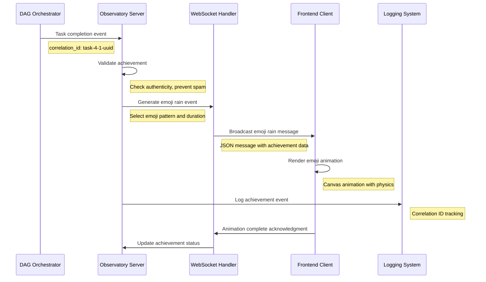
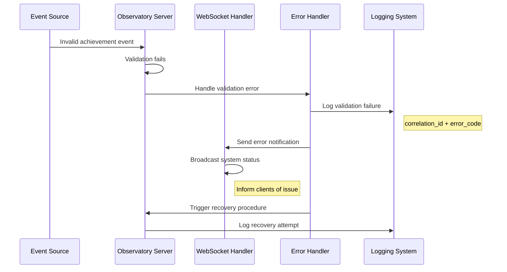

# Emoji Rain Celebration Workflow

## Overview

The emoji rain celebration workflow provides visual feedback for system achievements and coordination events through real-time WebSocket streaming. This workflow demonstrates the integration between achievement detection, WebSocket broadcasting, and frontend rendering within the Beast Mode framework.

## Workflow Components

### 1. Achievement Detection Engine

**Component**: Observatory Server ReflectiveModule
**Location**: `src/observatory_infrastructure/achievement_detector.py`
**Endpoint**: `/ws/emoji-rain`

#### Detection Triggers
- **Task Completion**: DAG orchestration task completion events
- **System Health**: Service recovery and health improvements
- **Performance Milestones**: Response time improvements, error rate reductions
- **Integration Success**: Successful ACE Reporter → AI Memory Palace → DAG Registry coordination
- **Manual Triggers**: Administrative celebration commands

#### Achievement Classification
```python
@dataclass
class Achievement:
    achievement_id: str
    type: AchievementType  # TASK_COMPLETE, HEALTH_RECOVERY, PERFORMANCE, INTEGRATION, MANUAL
    severity: str  # INFO, SUCCESS, CELEBRATION, MILESTONE
    emoji_pattern: str  # 🎉, 🚀, ✅, 🎯, 🌟
    duration_seconds: int  # 3-10 seconds based on achievement importance
    metadata: Dict[str, Any]
    triggered_at: datetime
    correlation_id: str
```

### 2. WebSocket Broadcasting System

**Component**: Observatory WebSocket Handler
**Endpoint**: `ws://localhost:8888/ws/emoji-rain`
**Protocol**: WebSocket with JSON message format

#### Message Structure
```json
{
  "type": "emoji_rain_start",
  "achievement": {
    "id": "task_4_1_complete",
    "type": "TASK_COMPLETE",
    "emoji": "🎉",
    "duration": 5,
    "intensity": "high",
    "pattern": "cascade"
  },
  "metadata": {
    "correlation_id": "uuid-4-correlation",
    "timestamp": "2025-01-03T10:30:00Z",
    "source": "dag_orchestrator"
  }
}
```

#### Broadcasting Logic
1. **Achievement Detection** → Generate achievement event
2. **Validation** → Verify achievement authenticity and prevent spam
3. **Message Creation** → Format WebSocket message with emoji pattern
4. **Broadcast** → Send to all connected WebSocket clients
5. **Logging** → Record achievement event with correlation ID

### 3. Frontend Rendering Engine

**Component**: Web-based visualization client
**Technology**: HTML5 Canvas with JavaScript animation
**Connection**: WebSocket client to `/ws/emoji-rain`

#### Rendering Patterns
- **Cascade**: Emojis fall from top to bottom with physics simulation
- **Burst**: Emojis explode from center with radial distribution
- **Wave**: Emojis move in wave patterns across the screen
- **Spiral**: Emojis follow spiral trajectories with rotation

#### Animation Parameters
```javascript
const emojiRainConfig = {
  patterns: {
    cascade: {
      gravity: 0.5,
      initialVelocity: { x: 0, y: 2 },
      count: 50,
      duration: 5000
    },
    burst: {
      explosionForce: 10,
      particleCount: 30,
      fadeOut: true,
      duration: 3000
    }
  },
  emojis: {
    celebration: ["🎉", "🎊", "✨", "🌟"],
    success: ["✅", "🎯", "💯", "🏆"],
    rocket: ["🚀", "⭐", "💫", "🌠"]
  }
}
```

## Operational Sequence

### Normal Operation Flow



### Error Handling Flow



## Configuration Management

### Achievement Thresholds
```yaml
# docs/operational-workflows/emoji-rain-config.yml
achievement_detection:
  task_completion:
    enabled: true
    emoji_pattern: "celebration"
    duration_seconds: 5
    cooldown_seconds: 30
  
  health_recovery:
    enabled: true
    emoji_pattern: "success"
    duration_seconds: 3
    threshold_improvement: 0.1
  
  performance_milestone:
    enabled: true
    emoji_pattern: "rocket"
    duration_seconds: 7
    response_time_improvement: 0.2

websocket_settings:
  max_concurrent_animations: 3
  rate_limit_per_minute: 10
  message_queue_size: 100
  connection_timeout_seconds: 30
```

### ReflectiveModule Integration
```python
class EmojiRainController(ReflectiveModule):
    """Controls emoji rain celebrations with systematic observability."""
    
    def __init__(self):
        super().__init__()
        self.module_id = "EmojiRainController"
        self._achievement_queue = asyncio.Queue()
        self._active_animations = {}
        
    def get_health_status(self) -> Dict[str, Any]:
        """Health endpoint for emoji rain system."""
        return {
            "status": "healthy",
            "active_animations": len(self._active_animations),
            "queue_size": self._achievement_queue.qsize(),
            "websocket_connections": self._get_connection_count(),
            "last_achievement": self._last_achievement_time
        }
    
    def get_metrics(self) -> Dict[str, float]:
        """Prometheus metrics for emoji rain system."""
        return {
            "emoji_rain_achievements_total": self._total_achievements,
            "emoji_rain_active_animations": len(self._active_animations),
            "emoji_rain_websocket_connections": self._get_connection_count(),
            "emoji_rain_queue_size": self._achievement_queue.qsize()
        }
```

## Monitoring and Validation

### Health Checks
- **WebSocket Connectivity**: Verify `/ws/emoji-rain` endpoint responds
- **Achievement Detection**: Test achievement trigger mechanisms
- **Animation Rendering**: Validate frontend animation performance
- **Message Queue**: Monitor queue size and processing latency

### Performance Metrics
- **Achievement Latency**: Time from trigger to WebSocket broadcast
- **Animation Performance**: Frontend rendering frame rate and smoothness
- **Connection Count**: Number of active WebSocket connections
- **Message Throughput**: Messages per second through emoji rain endpoint

### Validation Procedures
1. **Manual Achievement Trigger**: Test administrative celebration commands
2. **Automated Achievement**: Verify task completion triggers work correctly
3. **WebSocket Connectivity**: Confirm all clients receive messages
4. **Animation Quality**: Validate smooth rendering across browsers
5. **Error Recovery**: Test system behavior during WebSocket failures

## Integration Points

### ACE Reporter Integration
- **Progress Broadcasting**: Achievement events broadcast to ACE Reporter
- **Correlation Tracking**: Shared correlation IDs across systems
- **Status Updates**: Achievement status updates in progress reports

### AI Memory Palace Integration
- **Context Storage**: Achievement patterns stored for learning
- **Historical Analysis**: Achievement frequency and pattern analysis
- **Predictive Triggers**: AI-driven achievement prediction

### DAG Registry Integration
- **Task Completion Events**: DAG task completion triggers achievements
- **Dependency Validation**: Achievement triggers respect task dependencies
- **Orchestration Coordination**: Achievement timing coordinated with DAG execution

## Troubleshooting Guide

### Common Issues

**WebSocket Connection Failures**:
- Check Observatory server status: `curl http://localhost:8888/health`
- Verify WebSocket endpoint: `wscat -c ws://localhost:8888/ws/emoji-rain`
- Review connection logs in Observatory server output

**Missing Achievement Triggers**:
- Verify achievement detection configuration
- Check correlation ID tracking in logs
- Validate event source integration

**Animation Performance Issues**:
- Monitor browser console for JavaScript errors
- Check WebSocket message delivery timing
- Validate Canvas rendering performance

**Rate Limiting Issues**:
- Review rate limiting configuration
- Check achievement cooldown settings
- Monitor message queue size and processing

### Recovery Procedures

1. **Restart WebSocket Handler**: `make dashboard-restart`
2. **Clear Achievement Queue**: Administrative command to reset queue
3. **Reconnect Clients**: Force WebSocket reconnection from frontend
4. **Validate Configuration**: Check emoji rain configuration file
5. **Monitor Health**: Continuous monitoring of health endpoints

This emoji rain celebration workflow demonstrates the systematic integration of achievement detection, real-time communication, and visual feedback within the Beast Mode framework's observability ecosystem.