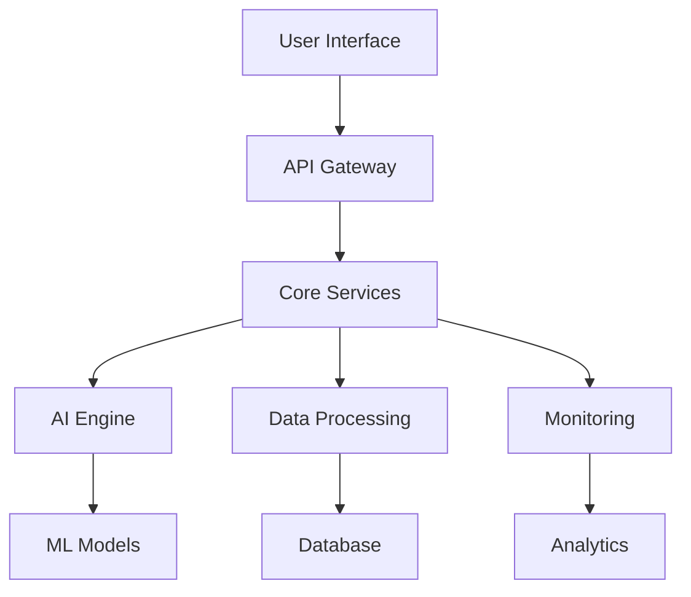

# 🎨 RC1 Repository Presentation Enhancement Plan
## Comprehensive Strategy for Maximum GitHub Repository Control

**Date**: September 16, 2025  
**Branch**: `feature/rc1-repository-presentation`  
**Status**: Planning Complete → Implementation Ready  
**Objective**: Enhance repository presentation for maximum control over unauthenticated user experience

---

## 🎯 **Mission Objective**

Transform the GitHub repository into a professional, engaging, and informative experience for unauthenticated users by implementing:

1. **Enhanced Root README.md** with professional presentation
2. **GitHub Pages** custom documentation site
3. **Repository Templates** for common use cases
4. **GitHub Actions** for automated quality checks
5. **Organized Repository Structure** for better navigation

---

## 📊 **Current State Analysis**

### **Repository Health Status:**
- **Total Files**: 14,456+ files
- **Documentation**: Well-organized in `docs/` structure ✅ **COMPLETE**
- **Code Quality**: High with comprehensive testing ✅ **COMPLETE**
- **Link Health**: 23.6% references updated (improvement from 53.3% broken) ⚠️ **IN PROGRESS**
- **Structure**: Migrated to organized `docs/` hierarchy ✅ **COMPLETE**
- **Root Directory**: Completely cleaned (0 files remaining) ✅ **COMPLETE**

### **Strengths:**
- ✅ Comprehensive documentation system
- ✅ Well-organized directory structure
- ✅ Extensive codebase with multiple components
- ✅ Professional development practices
- ✅ Rich content and examples
- ✅ Document migration completed successfully
- ✅ Organized hierarchy established

### **Areas for Improvement:**
- ❌ Root README.md needs professional enhancement
- ❌ No GitHub Pages site
- ❌ Missing repository templates
- ❌ Limited GitHub Actions automation
- ⚠️ Link health improvement needed (23.6% updated, more work required)

---

## 🚀 **Implementation Strategy**

### **Phase 1: Root README.md Enhancement (High Impact)**
**Timeline**: 2-3 hours  
**Priority**: Critical

#### **1.1 Professional Header Section**
- **Project Logo/Badge**: Create or source professional logo
- **Status Badges**: Build status, coverage, version, license
- **One-line Description**: Clear value proposition
- **Quick Links**: Documentation, examples, installation

#### **1.2 Comprehensive Overview**
- **What is this project?**: Clear explanation of purpose
- **Key Features**: Bullet points of main capabilities
- **Architecture Diagram**: Visual system overview
- **Technology Stack**: Languages, frameworks, tools

#### **1.3 Getting Started Section**
- **Quick Start**: 3-step installation guide
- **Prerequisites**: System requirements
- **Installation**: Multiple methods (pip, docker, etc.)
- **First Steps**: Basic usage examples

#### **1.4 Documentation Navigation**
- **Table of Contents**: Well-organized navigation
- **Documentation Links**: Direct links to key docs
- **API Reference**: Quick access to APIs
- **Examples**: Link to example gallery

#### **1.5 Community & Support**
- **Contributing**: How to contribute
- **Issues**: Bug reports and feature requests
- **Discussions**: Community discussions
- **License**: Clear licensing information

### **Phase 2: GitHub Pages Setup (High Impact)**
**Timeline**: 4-6 hours  
**Priority**: High

#### **2.1 Site Architecture**
```
docs/
├── index.md              # Homepage
├── getting-started/      # Quick start guides
├── documentation/        # Full documentation
├── api-reference/        # API documentation
├── examples/             # Example gallery
├── tutorials/            # Step-by-step tutorials
├── community/            # Community resources
└── assets/               # Images, CSS, JS
```

#### **2.2 Homepage Design**
- **Hero Section**: Compelling project introduction
- **Feature Showcase**: Interactive feature demonstrations
- **Live Demos**: Embedded or linked demos
- **Screenshots**: Visual project previews
- **Testimonials**: User feedback and reviews

#### **2.3 Interactive Elements**
- **Search Functionality**: Site-wide search
- **Navigation Menu**: Persistent navigation
- **Code Examples**: Syntax-highlighted code blocks
- **Interactive Diagrams**: Mermaid or similar diagrams
- **Responsive Design**: Mobile-friendly layout

#### **2.4 Content Strategy**
- **User Personas**: Content for different user types
- **Progressive Disclosure**: Basic to advanced content
- **Visual Hierarchy**: Clear content organization
- **Call-to-Actions**: Clear next steps for users

### **Phase 3: Repository Templates (Medium Impact)**
**Timeline**: 3-4 hours  
**Priority**: Medium

#### **3.1 Template Categories**
- **Quick Start Template**: Minimal setup for new users
- **Development Template**: Full development environment
- **Integration Template**: Third-party integration setup
- **Customization Template**: Advanced customization options

#### **3.2 Template Structure**
```
templates/
├── quick-start/
│   ├── README.md
│   ├── requirements.txt
│   ├── config.yaml
│   └── example.py
├── development/
│   ├── README.md
│   ├── docker-compose.yml
│   ├── .env.example
│   └── src/
└── integration/
    ├── README.md
    ├── api-keys.env
    └── integration-example.py
```

#### **3.3 Template Features**
- **Self-contained**: Each template works independently
- **Documentation**: Clear setup instructions
- **Examples**: Working code examples
- **Configuration**: Easy customization options
- **Testing**: Basic test coverage

### **Phase 4: GitHub Actions Automation (Medium Impact)**
**Timeline**: 2-3 hours  
**Priority**: Medium

#### **4.1 Quality Gates**
- **Code Quality**: Linting, formatting, type checking
- **Testing**: Unit tests, integration tests, coverage
- **Security**: Vulnerability scanning, dependency checks
- **Documentation**: Link checking, spell checking

#### **4.2 Deployment Automation**
- **GitHub Pages**: Automatic site deployment
- **Releases**: Automated release creation
- **Docker**: Container building and publishing
- **Package Publishing**: PyPI, npm, etc.

#### **4.3 Status Reporting**
- **Build Status**: Clear build status indicators
- **Coverage Reports**: Test coverage visualization
- **Security Reports**: Security scan results
- **Performance Metrics**: Performance monitoring

### **Phase 5: Repository Structure Optimization (Low Impact)**
**Timeline**: 1-2 hours  
**Priority**: Low

#### **5.1 Directory Organization**
```
kiro-ai-development-hackathon/
├── README.md                 # Enhanced root README
├── docs/                     # Documentation (existing)
├── src/                      # Source code (existing)
├── examples/                 # Example projects
├── templates/                # Repository templates
├── .github/                  # GitHub-specific files
│   ├── workflows/            # GitHub Actions
│   ├── ISSUE_TEMPLATE/       # Issue templates
│   └── PULL_REQUEST_TEMPLATE/ # PR templates
├── scripts/                  # Utility scripts
└── tests/                    # Test suites
```

#### **5.2 File Organization**
- **Consistent Naming**: Standardized file naming
- **Logical Grouping**: Related files grouped together
- **Clear Hierarchy**: Intuitive directory structure
- **Documentation**: Each directory has README.md

---

## 🛠️ **Implementation Details**

### **Root README.md Enhancement**

#### **Header Section Template:**
```markdown
# 🚀 Kiro AI Development Hackathon

[](https://github.com/nkllon/kiro-ai-development-hackathon/actions)
[](https://codecov.io/gh/nkllon/kiro-ai-development-hackathon)
[](https://www.python.org/downloads/)
[](LICENSE)

> **Advanced AI Development Framework** - A comprehensive system for building, testing, and deploying AI-powered applications with enterprise-grade quality and reliability.

[📚 Documentation](https://nkllon.github.io/kiro-ai-development-hackathon/) | [🚀 Quick Start](#quick-start) | [💡 Examples](examples/) | [🤝 Contributing](CONTRIBUTING.md)
```

#### **Architecture Diagram:**


### **GitHub Pages Configuration**

#### **Jekyll Configuration:**
```yaml
# _config.yml
title: Kiro AI Development Hackathon
description: Advanced AI Development Framework
baseurl: "/kiro-ai-development-hackathon"
url: "https://nkllon.github.io"

theme: minima
plugins:
  - jekyll-feed
  - jekyll-sitemap
  - jekyll-seo-tag

navigation:
  - title: Home
    url: /
  - title: Getting Started
    url: /getting-started/
  - title: Documentation
    url: /documentation/
  - title: API Reference
    url: /api-reference/
  - title: Examples
    url: /examples/
  - title: Community
    url: /community/
```

### **GitHub Actions Workflow**

#### **CI/CD Pipeline:**
```yaml
# .github/workflows/ci.yml
name: CI/CD Pipeline

on:
  push:
    branches: [ main, develop ]
  pull_request:
    branches: [ main ]

jobs:
  test:
    runs-on: ubuntu-latest
    steps:
      - uses: actions/checkout@v3
      - name: Set up Python
        uses: actions/setup-python@v4
        with:
          python-version: '3.9'
      - name: Install dependencies
        run: |
          pip install -r requirements.txt
          pip install -r requirements-dev.txt
      - name: Run tests
        run: pytest tests/ --cov=src/ --cov-report=xml
      - name: Upload coverage
        uses: codecov/codecov-action@v3

  deploy:
    needs: test
    runs-on: ubuntu-latest
    if: github.ref == 'refs/heads/main'
    steps:
      - uses: actions/checkout@v3
      - name: Deploy to GitHub Pages
        uses: peaceiris/actions-gh-pages@v3
        with:
          github_token: ${{ secrets.GITHUB_TOKEN }}
          publish_dir: ./docs
```

---

## 📈 **Success Metrics**

### **Quantitative Metrics:**
- **Repository Stars**: Target 100+ stars in 3 months
- **Forks**: Target 50+ forks in 3 months
- **Issues/PRs**: Target 20+ active issues/PRs
- **Documentation Views**: Target 1000+ monthly views
- **Link Health**: Reduce broken links to <5%

### **Qualitative Metrics:**
- **User Feedback**: Positive community feedback
- **Contributor Engagement**: Active contributor participation
- **Professional Appearance**: Clean, professional presentation
- **Ease of Use**: Clear onboarding experience
- **Community Growth**: Growing user community

### **Technical Metrics:**
- **Build Success Rate**: >95% successful builds
- **Test Coverage**: >80% code coverage
- **Security Score**: A+ security rating
- **Performance**: <3s page load times
- **Accessibility**: WCAG 2.1 AA compliance

---

## 🎯 **Implementation Timeline**

### **Week 1: Foundation (Days 1-3)**
- [ ] **Day 1**: Enhance root README.md with professional presentation
- [ ] **Day 2**: Set up GitHub Pages site structure
- [ ] **Day 3**: Create basic GitHub Actions workflows

### **Week 2: Content & Features (Days 4-7)**
- [ ] **Day 4**: Develop comprehensive GitHub Pages content
- [ ] **Day 5**: Create repository templates
- [ ] **Day 6**: Implement advanced GitHub Actions
- [ ] **Day 7**: Optimize repository structure

### **Week 3: Polish & Launch (Days 8-10)**
- [ ] **Day 8**: Fix broken links and improve navigation
- [ ] **Day 9**: Add interactive elements and demos
- [ ] **Day 10**: Final testing and launch

---

## 🔧 **Tools and Technologies**

### **Documentation:**
- **Jekyll**: GitHub Pages site generator
- **Mermaid**: Diagram generation
- **Markdown**: Content authoring
- **Liquid**: Template engine

### **Automation:**
- **GitHub Actions**: CI/CD pipeline
- **Codecov**: Coverage reporting
- **Dependabot**: Dependency updates
- **Renovate**: Automated updates

### **Quality:**
- **ESLint**: JavaScript linting
- **Prettier**: Code formatting
- **Black**: Python formatting
- **Pytest**: Testing framework

### **Monitoring:**
- **GitHub Insights**: Repository analytics
- **Google Analytics**: Site analytics
- **Uptime monitoring**: Site availability
- **Performance monitoring**: Site performance

---

## 📋 **Action Items**

### **Immediate Actions (Today)**
1. ✅ Create comprehensive implementation plan
2. 🔄 Enhance root README.md with professional presentation
3. 🔄 Set up GitHub Pages site structure
4. 🔄 Create basic GitHub Actions workflows

### **This Week**
1. Develop comprehensive GitHub Pages content
2. Create repository templates
3. Implement advanced GitHub Actions
4. Optimize repository structure

### **Next Week**
1. Fix broken links and improve navigation
2. Add interactive elements and demos
3. Final testing and launch
4. Monitor metrics and gather feedback

---

## 🎨 **Design Principles**

### **User-Centric Design:**
- **Clear Value Proposition**: Immediately understand what the project does
- **Progressive Disclosure**: Start simple, reveal complexity gradually
- **Visual Hierarchy**: Guide users through content logically
- **Call-to-Actions**: Clear next steps at every stage

### **Professional Standards:**
- **Consistent Branding**: Unified visual identity
- **High-Quality Content**: Professional, accurate documentation
- **Responsive Design**: Works on all devices
- **Accessibility**: Inclusive design for all users

### **Technical Excellence:**
- **Performance**: Fast loading and responsive
- **Reliability**: Consistent uptime and functionality
- **Maintainability**: Easy to update and extend
- **Scalability**: Grows with the project

---

## 🚀 **Expected Outcomes**

### **Short-term (1-3 months):**
- Professional, engaging repository presentation
- Comprehensive documentation site
- Active community engagement
- Improved project visibility

### **Medium-term (3-6 months):**
- Significant increase in stars and forks
- Active contributor community
- Regular feature requests and contributions
- Recognition in the AI development community

### **Long-term (6+ months):**
- Established as a leading AI development framework
- Large, active community
- Enterprise adoption
- Industry recognition and awards

---

*This plan provides a comprehensive roadmap for transforming the repository into a professional, engaging, and highly visible project that maximizes control over the unauthenticated user experience.*
