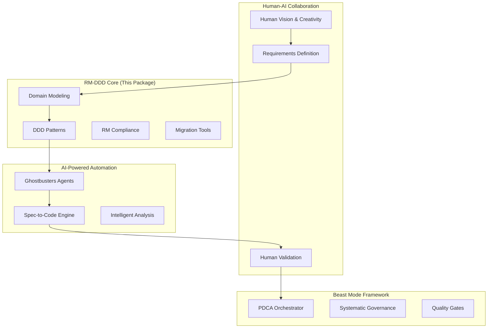

# RM-DDD SDK: Systematic Domain-Driven Development

[](https://badge.fury.io/py/rm-ddd)
[](https://www.python.org/downloads/)
[](https://opensource.org/licenses/MIT)
[](https://rm-ddd.readthedocs.io/en/latest/?badge=latest)

**The foundational package and comprehensive ecosystem entry point for systematic domain-driven development using the Beast Mode framework.**

## 🚀 Quick Navigation

| **Category** | **Quick Links** |
|--------------|-----------------|
| **🏗️ Architecture** | [UML Diagrams](docs/readme/project/docs/readme/project/README.md) • [Domain Index](docs/readme/project/README.md) • [ReflectiveModule](diagrams/reflective_module_vertical_sections.md) |
| **📚 Vocabulary** | [Ubiquitous Language](docs/ubiquitous_language_vocabulary.md) • [By Stakeholder](docs/vocabulary_projections/vocabulary_by_stakeholder.md) • [By Phase](docs/vocabulary_projections/vocabulary_by_implementation_phase.md) |
| **🧠 Ontology** | [Beastmaster Ontology](README.md) • [Session Analysis](docs/beastmaster-ontology/session-analysis.md) • [Extended Intelligence](docs/BEAST_MODE_EXTENDED_INTELLIGENCE_FRAMEWORK.md) |
| **📋 Documentation** | [API Reference](docs/API_REFERENCE.md) • [CLI Guide](docs/CLI_USAGE_GUIDE.md) • [Implementation](docs/implementation-reference.md) • [Ecosystem](docs/ecosystem-overview.md) |
| **🔧 Operations** | [Deployment](docs/deployment_guide.md) • [Governance](docs/governance_implementation_guide.md) • [DevPost Integration](docs/devpost_integration_guide.md) • [Makefile System](README.md) |

## 🎯 "The Requirements ARE the Solution"

RM-DDD embodies the core philosophy where comprehensive requirements definition becomes the solution architecture itself. This approach bridges human creativity with AI-powered systematic automation, creating a development ecosystem that increases odds of success while reducing pain and rework.

## 🌟 What Makes RM-DDD Different

### Systematic Superiority Over Ad-Hoc Development

- **Physics-Informed Architecture**: Acknowledges constraints while maximizing success probability
- **Requirements Traceability**: Every implementation traces back to validated requirements  
- **Accountability Chains**: Every component has clear ownership and validation
- **PDCA Integration**: Continuous improvement built into the development process
- **Automated Quality Assurance**: >90% coverage through systematic validation

### Human-AI Collaboration Bridge

*"We're the glue between humans and AI"* - RM-DDD enables:

- **LLMs Need Human Creativity**: AI provides systematic capability, humans provide vision
- **Ghostbusters Enable Human Teams**: AI agents amplify rather than replace human creativity
- **Collaborative Intelligence**: Making AI accessible for creative human collaboration
- **The Real Team is Human**: AI becomes the systematic foundation for human breakthroughs

## 🏗️ Complete Ecosystem Integration

RM-DDD serves as the central hub for the entire Beast Mode systematic development ecosystem:



## 🚀 Quick Start

### Installation

```bash
pip install rm-ddd
```

### Makefile System

The project includes a comprehensive Makefile system with 175 targets across 31 Makefiles:

```bash
# Show all available targets
make help

# Use the unified Makefile system
make -f makefile_system_implemented/unified/Makefile help

# Include modular Makefiles in your project
include makefile_system_implemented/modular/*.mk
```

**Key Makefile Features:**
- **Unified System**: Single Makefile consolidating all 175 targets
- **Modular Organization**: Category-based Makefiles (build, test, clean, etc.)
- **Projections**: Specialized views (Beast Mode, RDI, RM-DDD)
- **Comprehensive Documentation**: API docs, usage guides, troubleshooting
- **Validation Scripts**: Automated testing and validation
- **Integration Tools**: Easy setup and maintenance scripts

**Quick Commands:**
```bash
# Build everything
make build

# Run tests
make test

# Clean up
make clean

# Show project status
make status

# Run comprehensive validation
make validate-all
```

### Basic Usage

```python
from rm_ddd import DomainEntity, AggregateRoot, DomainService
from rm_ddd.decorators import domain_entity, aggregate_root

@domain_entity("order_management")
class Order(AggregateRoot[str]):
    def __init__(self, order_id: str, customer_id: str):
        super().__init__(order_id, "order_management")
        self.customer_id = customer_id
        self.items = []
        self.status = "pending"
    
    def add_item(self, product_id: str, quantity: int, price: float):
        """Add item to order with domain validation"""
        if quantity <= 0:
            raise ValueError("Quantity must be positive")
        
        self.items.append({
            "product_id": product_id,
            "quantity": quantity,
            "price": price
        })
        
        # Emit domain event
        self.add_domain_event(OrderItemAdded(
            order_id=self.id,
            product_id=product_id,
            quantity=quantity
        ))
    
    def get_domain_boundaries(self):
        return DomainBoundaries(
            context="order_management",
            invariants=["total_amount >= 0", "items not empty when confirmed"]
        )
    
    def validate_domain_invariants(self):
        result = ValidationResult(is_valid=True)
        
        if self.status == "confirmed" and not self.items:
            result.add_error("Confirmed order must have items")
        
        total = sum(item["price"] * item["quantity"] for item in self.items)
        if total < 0:
            result.add_error("Order total cannot be negative")
        
        return result
```

## 📚 Comprehensive Reference Implementations

### Enterprise Migration Scenarios

RM-DDD provides complete, production-ready reference implementations:

1. **E-commerce Platform Migration**: Complete transformation from monolith to systematic architecture
2. **Banking System Modernization**: Regulatory compliance with systematic domain modeling
3. **Healthcare System Integration**: HIPAA compliance with privacy-by-design patterns
4. **Manufacturing IoT Integration**: Real-time processing with systematic event sourcing
5. **Government System Transformation**: Security-first with systematic audit trails

### Multi-Language Ecosystem Consistency

```python
# Python (source of truth)
from rm_ddd.multilang import generate_cross_language_stubs

domain_model = define_ecommerce_domain()
stubs = generate_cross_language_stubs(domain_model, languages=[
    "java", "csharp", "typescript", "go"
])
```

Generated Java equivalent:
```java
@DomainEntity("order_management")
public class Order extends AggregateRoot<String> {
    // Consistent domain model across languages
}
```

## 🎓 DDD Fundamentals: Modeling, Not Deployment

**Critical Clarification**: Domain-Driven Design is fundamentally about modeling and collaboration, not deployment architecture.

### Core DDD Purpose
- **Domain Modeling**: Accurate business reality through systematic patterns
- **Team Collaboration**: Ubiquitous language and bounded contexts for effective communication
- **Complexity Management**: Strategic and tactical patterns for domain complexity

### Common Misconception Correction
- **DDD ≠ Microservices**: Domain boundaries don't automatically imply service boundaries
- **Bounded Contexts ≠ Services**: Contexts are modeling constructs, deployable as modules or services
- **Deployment is Separate**: Architecture driven by operational requirements, not domain boundaries

### Systematic Deployment Decision Framework

RM-DDD provides systematic frameworks for deployment decisions based on:

- **Conway's Law**: Team size and communication patterns
- **Performance Requirements**: Specific scalability and latency needs
- **Technology Diversity**: Different technology stack requirements  
- **Compliance Isolation**: Regulatory and security isolation needs
- **Operational Complexity**: Trade-offs between simplicity and flexibility

**Default Recommendation**: Modular monolith with clear migration paths when systematic triggers justify additional complexity.

## 🛠️ Key Features

### Core RM Layer
- **ReflectiveModule Base Classes**: Automatic RM compliance and health monitoring
- **Health Monitoring System**: Comprehensive module and domain health tracking
- **Registry Integration**: Automatic component discovery and registration
- **Compliance Validation**: Built-in RM compliance checking and reporting

### DDD Pattern Layer
- **Entity Base Classes**: Identity, equality, and domain boundary management
- **Value Object Patterns**: Immutability enforcement and validation
- **Aggregate Root Management**: Consistency boundaries and domain events
- **Domain Service Framework**: Stateless domain logic encapsulation
- **Repository Abstractions**: Clean separation of domain and infrastructure
- **Domain Event System**: Event sourcing and event-driven architecture

### Convenience Layer
- **Decorators & Annotations**: `@domain_entity`, `@aggregate_root`, `@domain_service`
- **Validation Utilities**: Comprehensive domain validation and invariant checking
- **Code Generators**: Automatic generation of boilerplate domain code
- **Complexity Monitoring**: Cognitive complexity tracking and refactoring suggestions

### Multi-Language Support
- **Java Stubs**: Enterprise integration with Spring Boot patterns
- **C# Interfaces**: .NET Core integration with Entity Framework patterns
- **TypeScript Definitions**: Type-safe domain modeling for Node.js
- **Go Interfaces**: Microservices patterns with systematic bounded contexts

## 📖 Documentation

### Getting Started
- [Installation Guide](docs/installation.md)
- [Quick Start Tutorial](docs/quickstart.md)
- [Core Concepts](docs/concepts.md)
- [Ecosystem Overview](docs/ecosystem.md)

### 🏗️ System Architecture Diagrams

#### ReflectiveModule Architecture
- **[ReflectiveModule Vertical Sections](diagrams/reflective_module_vertical_sections.md)** - Core reflective module architecture broken into 8 readable sections
- **[Rendered UML Diagrams](diagrams/rendered_diagrams.md)** - All major system diagrams with white background

#### Domain Architecture Overview
- **[Domain Index](README.md)** - Complete overview of all 23 system domains
- **[All Domain Diagrams](diagrams/domains/)** - Individual domain architecture diagrams

### 📚 Ubiquitous Language & Vocabulary

#### Core Vocabulary
- **[Ubiquitous Language Vocabulary](docs/ubiquitous_language_vocabulary.md)** - Complete vocabulary with 39 terms across 9 categories
- **[Multi-Dimensional Projections](README.md)** - 8 different organizational perspectives

#### Vocabulary by Perspective
- **[By Stakeholder](docs/vocabulary_projections/vocabulary_by_stakeholder.md)** - Developers, Architects, Product Managers, DevOps, AI Engineers
- **[By Implementation Phase](docs/vocabulary_projections/vocabulary_by_implementation_phase.md)** - Foundation, Design, Development, AI Integration, Deployment, Competitive
- **[By Complexity](docs/vocabulary_projections/vocabulary_by_complexity.md)** - Basic, Intermediate, Advanced, Expert levels
- **[By Relationships](docs/vocabulary_projections/vocabulary_by_relationships.md)** - How terms connect and relate to each other
- **[By Category](docs/vocabulary_projections/vocabulary_by_category.md)** - Core Framework, DDD, Reflective Architecture, etc.
- **[By Context](docs/vocabulary_projections/vocabulary_by_context.md)** - Usage context and domain organization
- **[By Domain Boundary](docs/vocabulary_projections/vocabulary_by_domain_boundary.md)** - Core, Supporting, Generic, AI, Strategic domains
- **[Alphabetical Reference](docs/vocabulary_projections/vocabulary_by_alphabetical.md)** - Quick lookup by term name

#### Major Domain Diagrams
- **[Validation Domain](diagrams/domains/validation_domain_diagrams.md)** (581 classes) - Comprehensive validation framework
- **[Project Domain](diagrams/domains/project_domain_diagrams.md)** (358 classes) - File and connection management
- **[CLI Domain](diagrams/domains/cli_domain_diagrams.md)** (201 classes) - Command line interface system
- **[BeastMode Domain](diagrams/domains/beastmode_domain_diagrams.md)** (157 classes) - Core optimization engine
- **[Notification Domain](diagrams/domains/notification_domain_diagrams.md)** (155 classes) - Messaging and notification system
- **[Analysis Domain](diagrams/domains/analysis_domain_diagrams.md)** (139 classes) - Code analysis and pattern detection
- **[Manager Domain](diagrams/domains/manager_domain_diagrams.md)** (132 classes) - System management and orchestration
- **[ImportDependency Domain](diagrams/domains/importdependency_domain_diagrams.md)** (128 classes) - Dependency tracking and management
- **[Monitoring Domain](diagrams/domains/monitoring_domain_diagrams.md)** (108 classes) - Health monitoring and observability
- **[Task Domain](diagrams/domains/task_domain_diagrams.md)** (100 classes) - Task execution and workflow management

#### Specialized Domains
- **[RCA Domain](diagrams/domains/rca_domain_diagrams.md)** (82 classes) - Root cause analysis
- **[Agent Domain](diagrams/domains/agent_domain_diagrams.md)** (78 classes) - AI agent orchestration
- **[Security Domain](diagrams/domains/security_domain_diagrams.md)** (73 classes) - Authentication and security
- **[Engine Domain](diagrams/domains/engine_domain_diagrams.md)** (59 classes) - Processing engines
- **[GKE Domain](diagrams/domains/gke_domain_diagrams.md)** (50 classes) - Google Kubernetes Engine integration
- **[Domain Domain](diagrams/domains/domain_domain_diagrams.md)** (47 classes) - Bounded context management
- **[Governance Domain](diagrams/domains/governance_domain_diagrams.md)** (41 classes) - Framework governance
- **[DevPost Domain](diagrams/domains/devpost_domain_diagrams.md)** (40 classes) - DevPost integration
- **[Quality Domain](diagrams/domains/quality_domain_diagrams.md)** (38 classes) - Quality gates and assessment
- **[System Domain](diagrams/domains/system_domain_diagrams.md)** (37 classes) - Core system components
- **[Systematic Domain](diagrams/domains/systematic_domain_diagrams.md)** (25 classes) - Systematic analysis tools
- **[Infrastructure Domain](diagrams/domains/infrastructure_domain_diagrams.md)** (17 classes) - Infrastructure management
- **[Migration Domain](diagrams/domains/migration_domain_diagrams.md)** (9 classes) - Live migration tools

> **📋 All diagrams are vertically oriented for readability and designed to fit on standard paper sizes. Each domain is broken into logical sections with a maximum of 8 classes per section for optimal readability.**

### Reference Implementations
- [E-commerce Migration](README.md)
- [Banking System](README.md)
- [Healthcare Integration](README.md)
- [Multi-Language Examples](README.md)

### Advanced Topics
- [Beast Mode Integration](docs/beast-mode-integration.md)
- [Ghostbusters AI Agents](docs/ghostbusters-integration.md)
- [Performance Optimization](docs/performance.md)
- [Security Patterns](docs/security.md)
- [Compliance Framework](docs/compliance.md)

### 🧠 Ontology & Knowledge Management
- **[Beastmaster Ontology](README.md)** - Complete semantic framework with mathematical alignment
- **[Session Analysis](docs/beastmaster-ontology/session-analysis.md)** - RCA and PDCA cycle analysis
- **[Extended Intelligence Framework](docs/BEAST_MODE_EXTENDED_INTELLIGENCE_FRAMEWORK.md)** - AI-powered systematic development

### 📋 Comprehensive Documentation
- **[📚 Complete Documentation Index](README.md)** - **905 documents** organized by category and audience
- **[🔍 Browse by Audience](README.md)** - Find docs by role (Developers, Architects, etc.)
- **[📊 Browse by Status](README.md)** - Active, Draft, Beta, Deprecated documents
- **[✨ Browse by Features](README.md)** - Documents with examples, code, TOC, etc.
- **[🕒 Recent Updates](README.md)** - Most recently updated documents
- **[🔧 Makefile System](README.md)** - Complete Makefile system documentation

#### Key Documentation Categories
- **[Architecture](README.md)** (479 docs) - System architecture and design patterns
- **[Requirements](README.md)** (107 docs) - Functional and non-functional requirements
- **[Design](README.md)** (68 docs) - Detailed design specifications and patterns
- **[Testing](README.md)** (76 docs) - Testing strategies and procedures
- **[Research](README.md)** (47 docs) - Research findings and analysis
- **[API Reference](README.md)** (21 docs) - API documentation and references
- **[Guides](README.md)** (22 docs) - User guides and tutorials
- **[Deployment](README.md)** (11 docs) - Deployment guides and configurations
- **[Makefile System](README.md)** - Complete build system documentation

### 🔧 Development & Operations
- **[Deployment Guide](docs/deployment_guide.md)** - Production deployment instructions
- **[Governance Implementation](docs/governance_implementation_guide.md)** - Governance framework implementation
- **[Transport Implementation](docs/transport_implementation_guide.md)** - Message transport system
- **[DevPost Integration](docs/devpost_integration_guide.md)** - DevPost platform integration
- **[Makefile System](README.md)** - Complete build system with 175 targets
- **[Git Workflow Research](docs/PROPER_GIT_WORKFLOW_RESEARCH.md)** - Git workflow best practices

## 🤝 Contributing

We welcome contributions! Please see our [Contributing Guide](CONTRIBUTING.md) for details.

### Development Setup

```bash
git clone https://github.com/beast-mode/rm-ddd.git
cd rm-ddd
pip install -e ".[dev]"
pre-commit install
```

### Running Tests

```bash
pytest
pytest --cov=rm_ddd --cov-report=html
```

## 📄 License

This project is licensed under the MIT License - see the [LICENSE](LICENSE) file for details.

## 🌐 Ecosystem Links

- **Beast Mode Framework**: [beast-mode.dev](https://beast-mode.dev)
- **Ghostbusters AI Agents**: [ghostbusters.dev](https://ghostbusters.dev)
- **Spec-to-Code Engine**: [spec-to-code.dev](https://spec-to-code.dev)
- **Documentation**: [rm-ddd.readthedocs.io](https://rm-ddd.readthedocs.io)

## 💬 Community

- **Discord**: [Join our community](https://discord.gg/beast-mode)
- **GitHub Discussions**: [Share ideas and ask questions](https://github.com/beast-mode/rm-ddd/discussions)
- **Twitter**: [@BeastModeDev](https://twitter.com/BeastModeDev)

---

**"It Just Works"** - Steve Jobs-level reliability through systematic design.

*Physics-informed pragmatism: Increase your odds, save work, pain, and misery.*