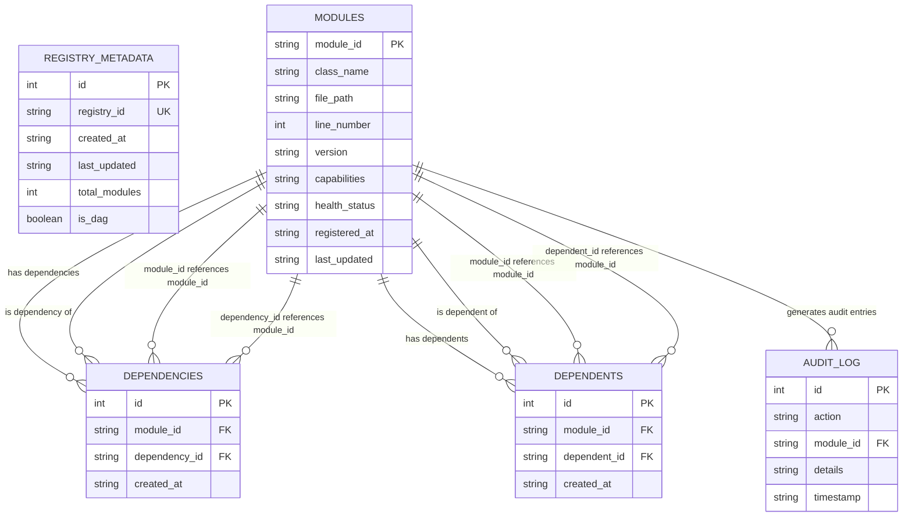

# Persistent DAG Registry - Entity Relationship Diagram

## Mermaid ER Diagram

## Database Schema Details

### REGISTRY_METADATA
- **Primary Key**: `id` (auto-increment)
- **Unique Key**: `registry_id` (registry identifier)
- **Purpose**: Tracks overall registry state and statistics
- **Constraints**: Single row per registry instance

### MODULES
- **Primary Key**: `module_id` (module identifier)
- **Purpose**: Stores module metadata and information
- **Foreign Key**: Self-referencing through dependencies/dependents
- **JSON Fields**: `capabilities` (array of capability strings)

### DEPENDENCIES
- **Primary Key**: `id` (auto-increment)
- **Foreign Keys**: 
  - `module_id` → `MODULES.module_id` (CASCADE DELETE)
  - `dependency_id` → `MODULES.module_id` (CASCADE DELETE)
- **Unique Constraint**: `(module_id, dependency_id)` prevents duplicates
- **Purpose**: Tracks what each module depends on

### DEPENDENTS
- **Primary Key**: `id` (auto-increment)
- **Foreign Keys**:
  - `module_id` → `MODULES.module_id` (CASCADE DELETE)
  - `dependent_id` → `MODULES.module_id` (CASCADE DELETE)
- **Unique Constraint**: `(module_id, dependent_id)` prevents duplicates
- **Purpose**: Reverse lookup for performance (what depends on each module)

### AUDIT_LOG
- **Primary Key**: `id` (auto-increment)
- **Foreign Key**: `module_id` → `MODULES.module_id` (SET NULL on delete)
- **JSON Fields**: `details` (action-specific metadata)
- **Purpose**: Complete audit trail of all registry operations

## Referential Integrity Features

1. **CASCADE DELETE**: Removing a module removes all its dependencies and dependents
2. **FOREIGN KEY CONSTRAINTS**: All references must point to existing modules
3. **UNIQUE CONSTRAINTS**: Prevent duplicate dependency relationships
4. **CHECK CONSTRAINTS**: Ensure data validity (version format, status values)
5. **INDEXES**: Optimized for common queries (dependency lookups, audit trails)

## DAG Enforcement

- **Cycle Detection**: DFS algorithm prevents circular dependencies
- **Bidirectional Tracking**: Both dependencies and dependents maintained
- **Transaction Safety**: All operations wrapped in transactions
- **Validation**: Continuous DAG validation with `validate_dag()` method
