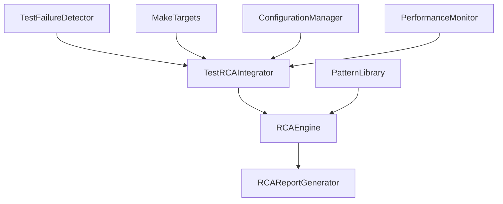

# Test RCA Integration Developer Guide

## Overview

This guide provides comprehensive information for developers who want to extend, modify, or contribute to the Test RCA Integration system. The system is built on the Beast Mode framework and follows its architectural principles.

## Architecture Overview

### Core Components



### Component Responsibilities

1. **TestFailureDetector**: Monitors and parses test execution output
2. **TestRCAIntegrator**: Coordinates RCA analysis workflow
3. **RCAEngine**: Performs root cause analysis (existing Beast Mode component)
4. **RCAReportGenerator**: Formats and outputs analysis results
5. **PatternLibrary**: Stores and matches known failure patterns
6. **MakeTargets**: Provides command-line interface integration
7. **ConfigurationManager**: Handles environment variables and settings
8. **PerformanceMonitor**: Tracks analysis performance and resource usage

## Development Environment Setup

### Prerequisites
```bash
# Install development dependencies
make install-dev

# Verify Beast Mode framework
python -c "from src.beast_mode.analysis.rca_engine import RCAEngine; print('Beast Mode available')"

# Install testing dependencies
pip install pytest pytest-cov pytest-mock
```

### Development Workflow
```bash
# 1. Create feature branch
git checkout -b feature/rca-enhancement

# 2. Make changes
# ... edit code ...

# 3. Run tests
make test-rca-integration

# 4. Run RCA on your own changes
make rca-task TASK=your_new_test

# 5. Generate documentation
make docs-update

# 6. Commit and push
git add .
git commit -m "Add RCA enhancement"
git push origin feature/rca-enhancement
```

## Extending Core Components

### Adding New Failure Detection Types

#### 1. Extend TestFailureDetector

```python
# src/beast_mode/testing/test_failure_detector.py

class TestFailureDetector(ReflectiveModule):
    def __init__(self):
        super().__init__()
        self.failure_parsers = {
            'pytest': self._parse_pytest_failure,
            'unittest': self._parse_unittest_failure,
            'custom': self._parse_custom_failure,  # Add new parser
        }
    
    def _parse_custom_failure(self, output: str) -> List[TestFailure]:
        """Parse custom test framework output."""
        failures = []
        
        # Custom parsing logic
        custom_pattern = r'CUSTOM_FAIL: (.+?) in (.+?):(\d+)'
        matches = re.findall(custom_pattern, output)
        
        for error_msg, file_path, line_num in matches:
            failure = TestFailure(
                test_name=self._extract_test_name(file_path, line_num),
                test_file=file_path,
                failure_type='custom_assertion',
                error_message=error_msg,
                stack_trace=self._extract_stack_trace(output, line_num),
                test_function=self._extract_function_name(file_path, line_num),
                failure_timestamp=datetime.now(),
                test_context=self._extract_custom_context(output),
                pytest_node_id=f"{file_path}::{line_num}"
            )
            failures.append(failure)
        
        return failures
    
    def _extract_custom_context(self, output: str) -> Dict[str, Any]:
        """Extract context specific to custom test framework."""
        return {
            'framework': 'custom',
            'version': self._detect_custom_version(output),
            'environment': self._extract_environment_info(output)
        }
```

#### 2. Register New Parser

```python
# In TestFailureDetector.__init__
def register_failure_parser(self, framework_name: str, parser_func: Callable):
    """Register a new failure parser for a specific test framework."""
    self.failure_parsers[framework_name] = parser_func
    
def detect_test_framework(self, output: str) -> str:
    """Detect which test framework generated the output."""
    if 'CUSTOM_FAIL:' in output:
        return 'custom'
    elif '::' in output and 'FAILED' in output:
        return 'pytest'
    elif 'unittest' in output:
        return 'unittest'
    else:
        return 'unknown'
```

### Adding New RCA Analysis Types

#### 1. Extend RCA Analysis Categories

```python
# src/beast_mode/testing/rca_integration.py

class TestRCAIntegrator(ReflectiveModule):
    def __init__(self):
        super().__init__()
        self.analysis_strategies = {
            'database': self._analyze_database_failure,
            'network': self._analyze_network_failure,
            'authentication': self._analyze_auth_failure,
            'performance': self._analyze_performance_failure,  # Add new strategy
        }
    
    def _analyze_performance_failure(self, failure: TestFailure) -> RCAResult:
        """Analyze performance-related test failures."""
        
        # Performance-specific analysis
        performance_factors = {
            'execution_time': self._measure_execution_time(failure),
            'memory_usage': self._analyze_memory_patterns(failure),
            'cpu_utilization': self._check_cpu_usage(failure),
            'io_operations': self._analyze_io_patterns(failure)
        }
        
        # Generate performance-specific root causes
        root_causes = []
        if performance_factors['execution_time'] > self.performance_thresholds['max_time']:
            root_causes.append(RootCause(
                category='performance',
                description='Test execution time exceeds threshold',
                confidence=0.9,
                systematic_fix=self._generate_performance_fix(performance_factors)
            ))
        
        return RCAResult(
            failure=failure,
            root_causes=root_causes,
            analysis_metadata={
                'analysis_type': 'performance',
                'factors_analyzed': list(performance_factors.keys()),
                'performance_metrics': performance_factors
            }
        )
```

#### 2. Add Performance Analysis Helpers

```python
def _measure_execution_time(self, failure: TestFailure) -> float:
    """Extract execution time from test failure context."""
    if 'execution_time' in failure.test_context:
        return failure.test_context['execution_time']
    
    # Parse from stack trace or error message
    time_pattern = r'took (\d+\.?\d*) seconds'
    match = re.search(time_pattern, failure.error_message)
    return float(match.group(1)) if match else 0.0

def _generate_performance_fix(self, factors: Dict[str, Any]) -> SystematicFix:
    """Generate systematic fix for performance issues."""
    steps = []
    
    if factors['memory_usage'] > self.thresholds['memory']:
        steps.append("Optimize memory usage in test setup")
        steps.append("Add memory profiling to identify leaks")
    
    if factors['cpu_utilization'] > self.thresholds['cpu']:
        steps.append("Reduce computational complexity in test")
        steps.append("Consider mocking expensive operations")
    
    return SystematicFix(
        category='performance_optimization',
        steps=steps,
        estimated_time_minutes=30,
        validation_criteria=[
            "Test execution time under threshold",
            "Memory usage within limits",
            "CPU utilization optimized"
        ]
    )
```

### Adding New Report Formats

#### 1. Extend RCAReportGenerator

```python
# src/beast_mode/testing/rca_report_generator.py

class RCAReportGenerator(ReflectiveModule):
    def __init__(self):
        super().__init__()
        self.formatters = {
            'console': self._format_console,
            'json': self._format_json,
            'markdown': self._format_markdown,
            'html': self._format_html,  # Add new formatter
            'slack': self._format_slack,  # Add new formatter
        }
    
    def _format_html(self, report: TestRCAReport) -> str:
        """Generate HTML report with interactive elements."""
        html_template = """
        <!DOCTYPE html>
        <html>
        <head>
            <title>RCA Analysis Report</title>
            <style>
                .failure-group { margin: 20px 0; padding: 15px; border-left: 4px solid #e74c3c; }
                .root-cause { background: #f8f9fa; padding: 10px; margin: 10px 0; }
                .systematic-fix { background: #e8f5e9; padding: 10px; margin: 10px 0; }
                .collapsible { cursor: pointer; background: #f1f1f1; padding: 10px; }
                .content { display: none; padding: 10px; }
            </style>
            <script>
                function toggleContent(element) {
                    var content = element.nextElementSibling;
                    content.style.display = content.style.display === 'block' ? 'none' : 'block';
                }
            </script>
        </head>
        <body>
            <h1>RCA Analysis Report</h1>
            <div class="summary">
                <h2>Summary</h2>
                <p>Analysis Date: {analysis_date}</p>
                <p>Total Failures: {total_failures}</p>
                <p>Analysis Time: {analysis_time} seconds</p>
            </div>
            
            <div class="failures">
                <h2>Failure Analysis</h2>
                {failure_groups_html}
            </div>
            
            <div class="recommendations">
                <h2>Recommendations</h2>
                {recommendations_html}
            </div>
        </body>
        </html>
        """
        
        return html_template.format(
            analysis_date=report.analysis_timestamp.strftime('%Y-%m-%d %H:%M:%S'),
            total_failures=report.total_failures,
            analysis_time=self._calculate_analysis_time(report),
            failure_groups_html=self._generate_failure_groups_html(report),
            recommendations_html=self._generate_recommendations_html(report)
        )
    
    def _format_slack(self, report: TestRCAReport) -> str:
        """Generate Slack-formatted message for team notifications."""
        slack_blocks = {
            "blocks": [
                {
                    "type": "header",
                    "text": {
                        "type": "plain_text",
                        "text": "🔍 RCA Analysis Complete"
                    }
                },
                {
                    "type": "section",
                    "fields": [
                        {
                            "type": "mrkdwn",
                            "text": f"*Failures Analyzed:* {report.total_failures}"
                        },
                        {
                            "type": "mrkdwn",
                            "text": f"*Analysis Time:* {self._calculate_analysis_time(report)}s"
                        }
                    ]
                }
            ]
        }
        
        # Add failure groups
        for group_name, failures in report.grouped_failures.items():
            slack_blocks["blocks"].append({
                "type": "section",
                "text": {
                    "type": "mrkdwn",
                    "text": f"*{group_name}:* {len(failures)} failures\n{self._get_group_summary(failures)}"
                }
            })
        
        return json.dumps(slack_blocks, indent=2)
```

### Adding New Pattern Types

#### 1. Extend Pattern Library

```python
# src/beast_mode/testing/pattern_library.py

class TestPatternLibrary(ReflectiveModule):
    def __init__(self):
        super().__init__()
        self.pattern_types = {
            'error_message': ErrorMessagePattern,
            'stack_trace': StackTracePattern,
            'timing': TimingPattern,  # Add new pattern type
            'resource': ResourcePattern,  # Add new pattern type
        }
    
    def add_timing_pattern(self, pattern_data: Dict[str, Any]) -> TimingPattern:
        """Add a new timing-based failure pattern."""
        pattern = TimingPattern(
            name=pattern_data['name'],
            description=pattern_data['description'],
            timing_threshold=pattern_data['threshold'],
            confidence_score=pattern_data.get('confidence', 0.8),
            systematic_fix=pattern_data['fix']
        )
        
        self.patterns['timing'].append(pattern)
        return pattern
    
    def match_timing_patterns(self, failure: TestFailure) -> List[PatternMatch]:
        """Match failure against timing patterns."""
        matches = []
        
        execution_time = self._extract_execution_time(failure)
        if execution_time is None:
            return matches
        
        for pattern in self.patterns['timing']:
            if execution_time > pattern.timing_threshold:
                match = PatternMatch(
                    pattern=pattern,
                    confidence=pattern.confidence_score,
                    match_details={
                        'actual_time': execution_time,
                        'threshold': pattern.timing_threshold,
                        'ratio': execution_time / pattern.timing_threshold
                    }
                )
                matches.append(match)
        
        return matches
```

#### 2. Define New Pattern Classes

```python
@dataclass
class TimingPattern:
    """Pattern for timing-related test failures."""
    name: str
    description: str
    timing_threshold: float  # seconds
    confidence_score: float
    systematic_fix: SystematicFix
    
    def matches(self, failure: TestFailure) -> bool:
        """Check if this pattern matches the failure."""
        execution_time = self._extract_execution_time(failure)
        return execution_time is not None and execution_time > self.timing_threshold

@dataclass
class ResourcePattern:
    """Pattern for resource-related test failures."""
    name: str
    description: str
    resource_type: str  # 'memory', 'cpu', 'disk', 'network'
    threshold_value: float
    threshold_unit: str
    confidence_score: float
    systematic_fix: SystematicFix
    
    def matches(self, failure: TestFailure) -> bool:
        """Check if this pattern matches the failure."""
        resource_usage = self._extract_resource_usage(failure, self.resource_type)
        return resource_usage is not None and resource_usage > self.threshold_value
```

## Adding New Make Targets

### 1. Extend makefiles/testing.mk

```makefile
# Add new RCA-related targets

.PHONY: rca-performance rca-security rca-integration

# Performance-focused RCA analysis
rca-performance:
	@echo "🔍 Running performance-focused RCA analysis..."
	@$(PYTHON) -c "
	from src.beast_mode.testing.rca_integration import TestRCAIntegrator
	integrator = TestRCAIntegrator()
	integrator.analyze_performance_failures()
	"

# Security-focused RCA analysis
rca-security:
	@echo "🔍 Running security-focused RCA analysis..."
	@$(PYTHON) -c "
	from src.beast_mode.testing.rca_integration import TestRCAIntegrator
	integrator = TestRCAIntegrator()
	integrator.analyze_security_failures()
	"

# Integration test RCA analysis
rca-integration:
	@echo "🔍 Running integration test RCA analysis..."
	@$(PYTHON) -c "
	from src.beast_mode.testing.rca_integration import TestRCAIntegrator
	integrator = TestRCAIntegrator()
	integrator.analyze_integration_failures()
	"

# Batch RCA analysis with custom parameters
rca-batch:
	@echo "🔍 Running batch RCA analysis..."
	@$(PYTHON) -c "
	import os
	from src.beast_mode.testing.rca_integration import TestRCAIntegrator
	integrator = TestRCAIntegrator()
	batch_size = int(os.getenv('RCA_BATCH_SIZE', '5'))
	timeout = int(os.getenv('RCA_TIMEOUT', '30'))
	integrator.analyze_batch_failures(batch_size=batch_size, timeout=timeout)
	"
```

### 2. Add Parameter Validation

```makefile
# Validate parameters for new targets
rca-task-validate:
ifndef TASK
	$(error TASK parameter is required. Usage: make rca-task TASK=test_name)
endif

rca-batch-validate:
	@if [ -z "$(RCA_BATCH_SIZE)" ]; then \
		echo "Using default batch size: 5"; \
	elif [ "$(RCA_BATCH_SIZE)" -gt 50 ]; then \
		echo "Error: RCA_BATCH_SIZE cannot exceed 50"; \
		exit 1; \
	fi
```

## Configuration Management

### 1. Environment Variable Handling

```python
# src/beast_mode/testing/config.py

class RCAConfig(ReflectiveModule):
    """Configuration management for RCA integration."""
    
    def __init__(self):
        super().__init__()
        self.config = self._load_config()
    
    def _load_config(self) -> Dict[str, Any]:
        """Load configuration from environment variables and config files."""
        config = {
            # Core settings
            'rca_on_failure': self._get_bool_env('RCA_ON_FAILURE', True),
            'rca_timeout': self._get_int_env('RCA_TIMEOUT', 30),
            'rca_verbose': self._get_bool_env('RCA_VERBOSE', False),
            
            # Pattern library settings
            'pattern_learning': self._get_bool_env('RCA_PATTERN_LEARNING', True),
            'pattern_library_path': self._get_env('RCA_PATTERN_LIBRARY_PATH', 'patterns/test_rca_patterns.json'),
            'max_patterns_per_failure': self._get_int_env('RCA_MAX_PATTERNS_PER_FAILURE', 5),
            
            # Performance settings
            'max_failures': self._get_int_env('RCA_MAX_FAILURES', 10),
            'parallel_analysis': self._get_bool_env('RCA_PARALLEL_ANALYSIS', False),
            'memory_limit_mb': self._get_int_env('RCA_MEMORY_LIMIT_MB', 512),
            
            # Output settings
            'default_format': self._get_env('RCA_DEFAULT_FORMAT', 'console'),
            'color_output': self._get_bool_env('RCA_COLOR_OUTPUT', True),
            'include_stack_traces': self._get_bool_env('RCA_INCLUDE_STACK_TRACES', True),
        }
        
        # Load from config file if exists
        config_file = self._get_env('RCA_CONFIG_FILE', 'config/rca_config.json')
        if os.path.exists(config_file):
            with open(config_file, 'r') as f:
                file_config = json.load(f)
                config.update(file_config)
        
        return config
    
    def _get_env(self, key: str, default: str) -> str:
        """Get string environment variable with default."""
        return os.getenv(key, default)
    
    def _get_bool_env(self, key: str, default: bool) -> bool:
        """Get boolean environment variable with default."""
        value = os.getenv(key, str(default)).lower()
        return value in ('true', '1', 'yes', 'on')
    
    def _get_int_env(self, key: str, default: int) -> int:
        """Get integer environment variable with default."""
        try:
            return int(os.getenv(key, str(default)))
        except ValueError:
            return default
    
    def validate_config(self) -> List[str]:
        """Validate configuration and return list of issues."""
        issues = []
        
        if self.config['rca_timeout'] < 10:
            issues.append("RCA_TIMEOUT should be at least 10 seconds")
        
        if self.config['rca_timeout'] > 300:
            issues.append("RCA_TIMEOUT should not exceed 300 seconds")
        
        if self.config['max_failures'] > 50:
            issues.append("RCA_MAX_FAILURES should not exceed 50")
        
        if not os.path.exists(os.path.dirname(self.config['pattern_library_path'])):
            issues.append(f"Pattern library directory does not exist: {os.path.dirname(self.config['pattern_library_path'])}")
        
        return issues
```

### 2. Configuration File Format

```json
// config/rca_config.json
{
  "rca_settings": {
    "default_timeout": 30,
    "max_failures_per_session": 10,
    "enable_pattern_learning": true,
    "parallel_analysis": false
  },
  "pattern_library": {
    "path": "patterns/test_rca_patterns.json",
    "auto_update": true,
    "max_patterns": 10000,
    "cleanup_interval_days": 30
  },
  "reporting": {
    "default_format": "console",
    "include_timestamps": true,
    "color_output": true,
    "max_recommendations": 10
  },
  "performance": {
    "memory_limit_mb": 512,
    "cpu_limit_percent": 80,
    "io_timeout_seconds": 10
  },
  "integrations": {
    "slack_webhook": null,
    "jira_integration": false,
    "github_issues": false
  }
}
```

## Testing Extensions

### 1. Unit Test Templates

```python
# tests/test_rca_extension_template.py

import pytest
from unittest.mock import Mock, patch
from src.beast_mode.testing.your_extension import YourExtension

class TestYourExtension:
    """Test template for RCA extensions."""
    
    @pytest.fixture
    def extension(self):
        """Create extension instance for testing."""
        return YourExtension()
    
    @pytest.fixture
    def mock_failure(self):
        """Create mock test failure for testing."""
        return TestFailure(
            test_name="test_example",
            test_file="tests/test_example.py",
            failure_type="assertion",
            error_message="Test assertion failed",
            stack_trace="Traceback...",
            test_function="test_example",
            failure_timestamp=datetime.now(),
            test_context={"framework": "pytest"},
            pytest_node_id="tests/test_example.py::test_example"
        )
    
    def test_extension_initialization(self, extension):
        """Test extension initializes correctly."""
        assert extension is not None
        assert hasattr(extension, 'analyze')
    
    def test_analyze_method(self, extension, mock_failure):
        """Test extension analyze method."""
        result = extension.analyze(mock_failure)
        
        assert result is not None
        assert hasattr(result, 'root_causes')
        assert hasattr(result, 'systematic_fixes')
    
    @patch('src.beast_mode.testing.your_extension.external_dependency')
    def test_with_mocked_dependency(self, mock_dependency, extension, mock_failure):
        """Test extension with mocked external dependencies."""
        mock_dependency.return_value = "mocked_result"
        
        result = extension.analyze(mock_failure)
        
        mock_dependency.assert_called_once()
        assert result is not None
    
    def test_error_handling(self, extension):
        """Test extension handles errors gracefully."""
        invalid_failure = None
        
        with pytest.raises(ValueError):
            extension.analyze(invalid_failure)
    
    def test_performance_requirements(self, extension, mock_failure):
        """Test extension meets performance requirements."""
        import time
        
        start_time = time.time()
        result = extension.analyze(mock_failure)
        end_time = time.time()
        
        analysis_time = end_time - start_time
        assert analysis_time < 1.0  # Should complete in under 1 second
        assert result is not None
```

### 2. Integration Test Templates

```python
# tests/test_rca_integration_template.py

import pytest
from src.beast_mode.testing.rca_integration import TestRCAIntegrator
from src.beast_mode.testing.test_failure_detector import TestFailureDetector

class TestRCAIntegrationE2E:
    """End-to-end integration tests for RCA extensions."""
    
    @pytest.fixture
    def integrator(self):
        """Create RCA integrator for testing."""
        return TestRCAIntegrator()
    
    @pytest.fixture
    def failure_detector(self):
        """Create failure detector for testing."""
        return TestFailureDetector()
    
    def test_full_workflow(self, integrator, failure_detector):
        """Test complete RCA workflow from failure detection to report."""
        # Simulate test failure
        test_output = """
        FAILED tests/test_example.py::test_function - AssertionError: Expected True, got False
        """
        
        # Detect failures
        failures = failure_detector.parse_pytest_output(test_output)
        assert len(failures) == 1
        
        # Analyze failures
        analysis_result = integrator.analyze_test_failures(failures)
        assert analysis_result is not None
        assert len(analysis_result.rca_results) > 0
        
        # Generate report
        report = integrator.generate_comprehensive_report(analysis_result.rca_results)
        assert report is not None
        assert report.total_failures == 1
    
    def test_multiple_failure_types(self, integrator, failure_detector):
        """Test RCA with multiple different failure types."""
        test_output = """
        FAILED tests/test_db.py::test_connection - ConnectionError: Database unreachable
        FAILED tests/test_auth.py::test_login - AssertionError: Invalid credentials
        FAILED tests/test_api.py::test_timeout - TimeoutError: Request timed out
        """
        
        failures = failure_detector.parse_pytest_output(test_output)
        assert len(failures) == 3
        
        analysis_result = integrator.analyze_test_failures(failures)
        
        # Should group related failures
        assert len(analysis_result.grouped_failures) >= 1
        
        # Should provide systematic fixes for each group
        for group_name, group_failures in analysis_result.grouped_failures.items():
            assert len(group_failures) > 0
    
    @pytest.mark.performance
    def test_performance_requirements(self, integrator, failure_detector):
        """Test that RCA meets performance requirements."""
        import time
        
        # Create multiple failures
        test_output = "\n".join([
            f"FAILED tests/test_{i}.py::test_function - AssertionError: Test {i} failed"
            for i in range(10)
        ])
        
        failures = failure_detector.parse_pytest_output(test_output)
        
        start_time = time.time()
        analysis_result = integrator.analyze_test_failures(failures)
        end_time = time.time()
        
        analysis_time = end_time - start_time
        assert analysis_time < 30.0  # Should complete within 30 seconds
        assert analysis_result is not None
```

## Performance Optimization

### 1. Profiling RCA Extensions

```python
# scripts/profile_rca_extension.py

import cProfile
import pstats
import io
from src.beast_mode.testing.rca_integration import TestRCAIntegrator

def profile_rca_analysis():
    """Profile RCA analysis performance."""
    
    # Create profiler
    profiler = cProfile.Profile()
    
    # Setup test data
    integrator = TestRCAIntegrator()
    test_failures = create_test_failures(count=10)
    
    # Profile the analysis
    profiler.enable()
    result = integrator.analyze_test_failures(test_failures)
    profiler.disable()
    
    # Generate report
    s = io.StringIO()
    ps = pstats.Stats(profiler, stream=s)
    ps.sort_stats('cumulative')
    ps.print_stats(20)  # Top 20 functions
    
    print("Performance Profile:")
    print(s.getvalue())
    
    return result

def create_test_failures(count: int) -> List[TestFailure]:
    """Create test failures for profiling."""
    failures = []
    for i in range(count):
        failure = TestFailure(
            test_name=f"test_function_{i}",
            test_file=f"tests/test_{i}.py",
            failure_type="assertion",
            error_message=f"Test {i} failed",
            stack_trace=f"Traceback for test {i}...",
            test_function=f"test_function_{i}",
            failure_timestamp=datetime.now(),
            test_context={"framework": "pytest"},
            pytest_node_id=f"tests/test_{i}.py::test_function_{i}"
        )
        failures.append(failure)
    return failures

if __name__ == "__main__":
    profile_rca_analysis()
```

### 2. Memory Optimization

```python
# src/beast_mode/testing/performance_optimizer.py

class RCAPerformanceOptimizer(ReflectiveModule):
    """Optimize RCA performance and resource usage."""
    
    def __init__(self):
        super().__init__()
        self.memory_monitor = MemoryMonitor()
        self.performance_cache = {}
    
    def optimize_analysis(self, failures: List[TestFailure]) -> List[TestFailure]:
        """Optimize failure analysis order and grouping."""
        
        # Group similar failures to reduce analysis overhead
        grouped_failures = self._group_similar_failures(failures)
        
        # Prioritize by analysis complexity (simple first)
        prioritized_failures = self._prioritize_by_complexity(grouped_failures)
        
        # Limit analysis scope if memory constrained
        if self.memory_monitor.get_available_memory() < 100:  # MB
            prioritized_failures = prioritized_failures[:5]
        
        return prioritized_failures
    
    def _group_similar_failures(self, failures: List[TestFailure]) -> Dict[str, List[TestFailure]]:
        """Group failures by similarity to reduce redundant analysis."""
        groups = {}
        
        for failure in failures:
            # Create similarity key based on error type and location
            similarity_key = f"{failure.failure_type}:{failure.test_file.split('/')[-1]}"
            
            if similarity_key not in groups:
                groups[similarity_key] = []
            groups[similarity_key].append(failure)
        
        return groups
    
    def _prioritize_by_complexity(self, grouped_failures: Dict[str, List[TestFailure]]) -> List[TestFailure]:
        """Prioritize failures by analysis complexity."""
        complexity_scores = {}
        
        for group_key, group_failures in grouped_failures.items():
            # Calculate complexity score
            complexity = 0
            complexity += len(group_failures)  # More failures = more complex
            complexity += sum(len(f.stack_trace) for f in group_failures) / 1000  # Longer traces = more complex
            
            complexity_scores[group_key] = complexity
        
        # Sort by complexity (simple first)
        sorted_groups = sorted(complexity_scores.items(), key=lambda x: x[1])
        
        # Flatten back to failure list
        prioritized_failures = []
        for group_key, _ in sorted_groups:
            prioritized_failures.extend(grouped_failures[group_key])
        
        return prioritized_failures

class MemoryMonitor:
    """Monitor memory usage during RCA analysis."""
    
    def get_available_memory(self) -> int:
        """Get available memory in MB."""
        import psutil
        return psutil.virtual_memory().available // (1024 * 1024)
    
    def get_process_memory(self) -> int:
        """Get current process memory usage in MB."""
        import psutil
        import os
        process = psutil.Process(os.getpid())
        return process.memory_info().rss // (1024 * 1024)
```

## Contributing Guidelines

### 1. Code Style and Standards

```python
# Follow Beast Mode coding standards
from src.beast_mode.core.reflective_module import ReflectiveModule

class YourRCAExtension(ReflectiveModule):
    """
    Your RCA extension following Beast Mode patterns.
    
    This class extends RCA functionality for [specific purpose].
    Follows the Beast Mode principle of systematic analysis.
    """
    
    def __init__(self):
        super().__init__()
        self.logger = self.get_logger()
        self.config = self.load_config()
    
    def analyze(self, failure: TestFailure) -> RCAResult:
        """
        Analyze test failure and return RCA result.
        
        Args:
            failure: TestFailure object to analyze
            
        Returns:
            RCAResult with root causes and systematic fixes
            
        Raises:
            ValueError: If failure is invalid
            AnalysisError: If analysis fails
        """
        self.logger.info(f"Analyzing failure: {failure.test_name}")
        
        try:
            # Your analysis logic here
            root_causes = self._identify_root_causes(failure)
            systematic_fixes = self._generate_systematic_fixes(root_causes)
            
            return RCAResult(
                failure=failure,
                root_causes=root_causes,
                systematic_fixes=systematic_fixes,
                analysis_metadata=self._get_analysis_metadata()
            )
            
        except Exception as e:
            self.logger.error(f"Analysis failed: {e}")
            raise AnalysisError(f"Failed to analyze {failure.test_name}: {e}")
```

### 2. Documentation Standards

```python
def your_function(param1: str, param2: Optional[int] = None) -> Dict[str, Any]:
    """
    Brief description of what the function does.
    
    Longer description if needed, explaining the purpose,
    behavior, and any important details.
    
    Args:
        param1: Description of param1
        param2: Description of param2 (optional)
        
    Returns:
        Dictionary containing:
            - key1: Description of key1
            - key2: Description of key2
            
    Raises:
        ValueError: When param1 is invalid
        RuntimeError: When operation fails
        
    Example:
        >>> result = your_function("test", 42)
        >>> print(result["key1"])
        "expected_value"
    """
    pass
```

### 3. Testing Requirements

- **Unit tests** for all new functionality
- **Integration tests** for RCA workflow changes
- **Performance tests** for optimization features
- **Documentation tests** for examples and guides
- **Minimum 90% code coverage** for new code

### 4. Pull Request Process

1. **Create feature branch** from main
2. **Implement changes** following coding standards
3. **Add comprehensive tests** with good coverage
4. **Update documentation** including this guide if needed
5. **Run full test suite** including RCA integration tests
6. **Submit pull request** with detailed description
7. **Address review feedback** promptly
8. **Ensure CI/CD passes** before merge

## Debugging and Troubleshooting

### 1. Debug Mode

```bash
# Enable debug mode for development
export DEBUG_RCA=true
export RCA_VERBOSE=true

# Run with debug output
make test-with-rca

# Check debug logs
tail -f logs/rca_debug.log
```

### 2. Component Testing

```bash
# Test individual components
python -c "
from src.beast_mode.testing.test_failure_detector import TestFailureDetector
detector = TestFailureDetector()
print('Failure detector working')
"

# Test pattern matching
python -c "
from src.beast_mode.testing.pattern_library import TestPatternLibrary
library = TestPatternLibrary()
print(f'Pattern library loaded: {len(library.patterns)} patterns')
"
```

### 3. Performance Debugging

```bash
# Profile RCA performance
python scripts/profile_rca_extension.py

# Monitor memory usage
python -c "
import psutil
import time
from src.beast_mode.testing.rca_integration import TestRCAIntegrator

integrator = TestRCAIntegrator()
print(f'Memory before: {psutil.virtual_memory().percent}%')

# Run analysis
# ... your test code ...

print(f'Memory after: {psutil.virtual_memory().percent}%')
"
```

## Resources and References

### Documentation
- [Beast Mode Framework Documentation](docs/beast-mode-framework.md)
- [RCA Engine API Reference](docs/api/rca-engine.md)
- [Pattern Library Guide](docs/pattern-library.md)

### Examples
- [Basic RCA Extension Example](examples/basic_rca_extension.py)
- [Advanced Pattern Matching Example](examples/advanced_pattern_matching.py)
- [Custom Report Format Example](examples/custom_report_format.py)

### Testing
- [RCA Integration Test Suite](tests/test_rca_integration_comprehensive.py)
- [Performance Test Examples](tests/test_rca_performance_validation.py)
- [Mock and Fixture Examples](tests/fixtures/test_rca_failure_scenarios.py)

### Community
- **Issues**: Report bugs and request features
- **Discussions**: Ask questions and share ideas
- **Contributing**: Guidelines for contributing code
- **Code Review**: Process for reviewing changes