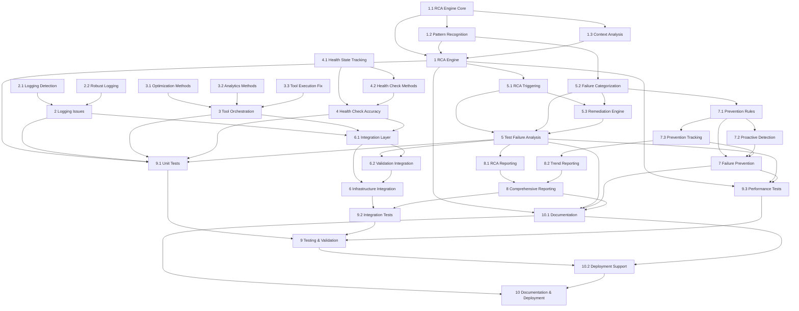

# Task Dependency Analysis and Execution DAG

## Dependency Analysis

### Independent Foundation Tasks (Can Start Immediately)
These tasks have no dependencies and can be executed in parallel:

**Tier 0 - Foundation Layer**
- `2.1` - Implement Logging Issue Detection and Repair
- `2.2` - Create Robust Test Logging System  
- `3.1` - Add Missing Optimization Methods
- `3.2` - Implement Comprehensive Analytics Methods
- `3.3` - Fix Tool Execution Behavior Validation
- `4.1` - Implement Accurate Health State Tracking
- `1.1` - Implement Enhanced RCA Engine Core

### Dependent Tasks by Tier

**Tier 1 - Depends on Tier 0**
- `1.2` - Add Failure Pattern Recognition System (depends on `1.1`)
- `1.3` - Implement Context-Aware Analysis (depends on `1.1`)
- `4.2` - Fix Component Health Check Methods (depends on `4.1`)
- `2` - Fix Test Infrastructure Logging Issues (depends on `2.1`, `2.2`)
- `3` - Implement Missing Tool Orchestration Methods (depends on `3.1`, `3.2`, `3.3`)
- `4` - Enhance Health Check Accuracy (depends on `4.1`, `4.2`)

**Tier 2 - Depends on Tier 1**
- `1` - Enhance RCA Engine with Intelligent Analysis (depends on `1.1`, `1.2`, `1.3`)
- `5.1` - Implement Automated RCA Triggering (depends on `1`)
- `5.2` - Create Failure Categorization System (depends on `1.2`)

**Tier 3 - Depends on Tier 2**
- `5.3` - Build Remediation Suggestion Engine (depends on `5.1`, `5.2`)
- `6.1` - Create Test Infrastructure Integration Layer (depends on `2`, `3`, `4`)

**Tier 4 - Depends on Tier 3**
- `5` - Create Automated Test Failure Analysis System (depends on `5.1`, `5.2`, `5.3`)
- `6.2` - Enhance Test Validation Suite Integration (depends on `5`, `6.1`)
- `7.1` - Create Failure Prevention Rule Engine (depends on `5.2`)

**Tier 5 - Depends on Tier 4**
- `6` - Integrate with Existing Test Infrastructure (depends on `6.1`, `6.2`)
- `7.2` - Implement Proactive Failure Detection (depends on `7.1`)
- `7.3` - Build Prevention Effectiveness Tracking (depends on `7.1`)
- `8.1` - Implement RCA Analysis Reporting (depends on `5`)

**Tier 6 - Depends on Tier 5**
- `7` - Implement Systematic Failure Prevention (depends on `7.1`, `7.2`, `7.3`)
- `8.2` - Create Trend Analysis and Prevention Reporting (depends on `7.3`)

**Tier 7 - Depends on Tier 6**
- `8` - Create Comprehensive Test and RCA Reporting (depends on `8.1`, `8.2`)
- `9.1` - Create Comprehensive Unit Test Suite (depends on all core components)

**Tier 8 - Depends on Tier 7**
- `9.2` - Implement End-to-End Integration Tests (depends on `6`, `8`)
- `9.3` - Add Performance and Scalability Tests (depends on all core components)

**Tier 9 - Final Integration**
- `9` - Comprehensive Testing and Validation (depends on `9.1`, `9.2`, `9.3`)
- `10.1` - Create System Documentation (depends on all components)

**Tier 10 - Deployment**
- `10.2` - Implement Production Deployment Support (depends on `9`, `10.1`)
- `10` - Documentation and Deployment Preparation (depends on `10.1`, `10.2`)

## Execution DAG Visualization



## Recursive Descent Execution Strategy

### Phase 1: Foundation Parallel Execution (Tier 0)
Execute these 7 tasks in parallel immediately:
```
PARALLEL_BATCH_1 = [
    "2.1 - Implement Logging Issue Detection and Repair",
    "2.2 - Create Robust Test Logging System", 
    "3.1 - Add Missing Optimization Methods",
    "3.2 - Implement Comprehensive Analytics Methods",
    "3.3 - Fix Tool Execution Behavior Validation",
    "4.1 - Implement Accurate Health State Tracking",
    "1.1 - Implement Enhanced RCA Engine Core"
]
```

### Phase 2: First Dependencies (Tier 1)
When Tier 0 completes, execute these in parallel:
```
PARALLEL_BATCH_2 = [
    "1.2 - Add Failure Pattern Recognition System" (after 1.1),
    "1.3 - Implement Context-Aware Analysis" (after 1.1),
    "4.2 - Fix Component Health Check Methods" (after 4.1)
]

SEQUENTIAL_BATCH_2 = [
    "2 - Fix Test Infrastructure Logging Issues" (after 2.1, 2.2),
    "3 - Implement Missing Tool Orchestration Methods" (after 3.1, 3.2, 3.3),
    "4 - Enhance Health Check Accuracy" (after 4.1, 4.2)
]
```

### Phase 3: Core System Assembly (Tier 2)
```
PARALLEL_BATCH_3 = [
    "1 - Enhance RCA Engine with Intelligent Analysis" (after 1.1, 1.2, 1.3),
    "5.1 - Implement Automated RCA Triggering" (after 1),
    "5.2 - Create Failure Categorization System" (after 1.2)
]
```

### Execution Algorithm

```python
def execute_tasks_with_dependencies():
    completed_tasks = set()
    
    def can_execute(task_id, dependencies):
        return all(dep in completed_tasks for dep in dependencies)
    
    def recursive_execute(tier_tasks):
        ready_tasks = []
        
        for task_id, dependencies in tier_tasks.items():
            if can_execute(task_id, dependencies):
                ready_tasks.append(task_id)
        
        if ready_tasks:
            # Execute ready tasks in parallel
            execute_parallel(ready_tasks)
            
            # Mark as completed
            completed_tasks.update(ready_tasks)
            
            # Remove completed tasks from remaining tiers
            remaining_tasks = {
                tid: deps for tid, deps in tier_tasks.items() 
                if tid not in completed_tasks
            }
            
            if remaining_tasks:
                # Recursively process remaining tasks
                recursive_execute(remaining_tasks)
    
    # Start with all tasks and their dependencies
    all_tasks = get_task_dependency_map()
    recursive_execute(all_tasks)
```

## Optimal Execution Order

### Critical Path Analysis
The critical path (longest dependency chain) is:
`1.1 → 1.2 → 5.2 → 7.1 → 7.3 → 8.2 → 8 → 9.2 → 9 → 10.2 → 10`

**Critical Path Length: 10 tiers**

### Parallelization Opportunities
- **Tier 0**: 7 tasks can run in parallel
- **Tier 1**: 3 tasks can run in parallel after their dependencies
- **Maximum Concurrency**: Up to 7 agents can work simultaneously in early phases

### Resource Allocation Strategy
1. **High Priority Agents**: Assign to critical path tasks (1.1, 1.2, 5.2, 7.1, 7.3)
2. **Medium Priority Agents**: Assign to parallel foundation tasks (2.1, 2.2, 3.1, 3.2)
3. **Support Agents**: Assign to testing and documentation tasks

This DAG ensures optimal task execution with maximum parallelization while respecting all dependencies.